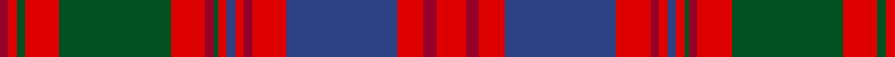

**Bands:** [RRGRGRRGRBRRRBRRR](/stripes/rrgrgrrgrbrrrbrrr/) · **Stripes:** [R R DG R DG R R DG R DB R R R DB R R R](/stripes/stripes17/) R R DG R DG R R DG R DB R R R DB R R R

This was sourced from register-of-tartans.  It is a [17 band tartan](/bands/bands17/).

Original link https://www.tartanregister.gov.uk/tartanDetails.aspx?ref=2318

## Register references

External register numbers recorded for this tartan.

- Scottish Register of Tartans: [2318](https://www.tartanregister.gov.uk/tartanDetails.aspx?ref=2318)
- Scottish Tartans World Register: 1638

## Thread count
DR/4 R4 G4 R16 G52 R16 DR4 G2 R4 B4 R4 DR4 R16 B52 R12 DR6 R/14

## Palette
Each colour and its ΔE from the base-6 reference it is a variant of.

| Colour | Shade | Base | ΔE (OKLab) |
|---|---|---|---|
| B | <code style="background-color:#2C4084;">#2C4084</code> `#2C4084` | B <code style="background-color:#2A418A;">#2A418A</code> | 0.01 |
| DR | <code style="background-color:#960028;">#960028</code> `#960028` | R <code style="background-color:#CC0000;">#CC0000</code> | 0.12 |
| G | <code style="background-color:#005020;">#005020</code> `#005020` | G <code style="background-color:#006100;">#006100</code> | 0.07 |
| R | <code style="background-color:#DC0000;">#DC0000</code> `#DC0000` | R <code style="background-color:#CC0000;">#CC0000</code> | 0.03 |

## Nearest tartans

The nearest existing variants by ΔTartan distance.

1. [MacColl Hunting](/setts/s18/r6m3r6db22r7m2w1r2db2r2w1m2r7g22r7g2r2m2~x2/) — ΔT 0.93
1. [Unidentified Coat](/setts/s14/dg6r2dg2r24t1db1r2db12r2db1t1r2dg24r2~x2/) — ΔT 0.98
1. [Ladybird](/setts/s15/r20p1r1db2r1p1r4db4g2db4g2db4g19r1p2~x2/) — ΔT 1.02
1. [MacColl, Ancient](/setts/s17/r7r3r6db26r8dg2r2db2r2g1r2r8g26r8g2r2r2~x2/) — ΔT 1.04
1. [MacIntyre (of Gatehouse)](/setts/s15/t3r24db4r8g32r4db4r8g4r4db32r8g4r4t2~x2/) — ΔT 1.05
1. [MacColl Hunting Clan Tartan Tartan Number: 1637. Earliest known date: pre 2003 This sample comes from the MacGregor-Hastie collection which forms the basis of the cloth archive of the Scottish Tartans Society. Some of the samples, including this one, were unmarked. One can assume that the sample dates between 1930 and 1950. See products available Copyright © Blair Urquhart, Comrie, 2015](/setts/s18/r6m3r6db22r7m2w1r2db2r2w1m2r7y22r7y2r2m2~x2/) — ΔT 1.06
1. [Strathdon (District?)](/setts/s15/lr3lo8r2lo8db11r2lo4r4r27db1r2db2r2db13r2~x2/) — ΔT 1.07
1. [Unnamed C18/19th - Antigonish (A)](/setts/s18/dt13r6dt2r6w1y26r2dt26y6r26y6dt26r2y26w1r6dt2r6~x2/) — ΔT 1.15
1. [MacDougall (Paton)](/setts/s20/w1dp2r1dg22r3dg1r3db9dp2r1dp2dg8r8dg8r1db1r22dp2r2w1~x2/) — ΔT 1.20
1. [MacColl, hunting](/setts/s18/r6r3r6db22r7r2w1r2db2r2w1r2r7y22r7y2r2r2~x2/) — ΔT 1.22

## Neighbour map

Every grey dot is one of 14313 variants placed by the first two principal components of the ΔTartan feature space (44% of its variance). Red is this tartan; blue dots are its nearest — click one to open its page.

<svg viewBox="0 0 640 380" role="img" style="max-width:100%;height:auto;border:1px solid #e0e0e0;border-radius:4px;display:block" xmlns="http://www.w3.org/2000/svg"><image href="/nn/cloud.v1.png" width="640" height="380"/><a href="/setts/s18/r6m3r6db22r7m2w1r2db2r2w1m2r7g22r7g2r2m2~x2/"><circle cx="232.6" cy="93.5" r="4" fill="#3465a4"><title>MacColl Hunting</title></circle></a><a href="/setts/s14/dg6r2dg2r24t1db1r2db12r2db1t1r2dg24r2~x2/"><circle cx="298.4" cy="108.8" r="4" fill="#3465a4"><title>Unidentified Coat</title></circle></a><a href="/setts/s15/r20p1r1db2r1p1r4db4g2db4g2db4g19r1p2~x2/"><circle cx="270.1" cy="114.3" r="4" fill="#3465a4"><title>Ladybird</title></circle></a><a href="/setts/s17/r7r3r6db26r8dg2r2db2r2g1r2r8g26r8g2r2r2~x2/"><circle cx="250.7" cy="94.7" r="4" fill="#3465a4"><title>MacColl, Ancient</title></circle></a><a href="/setts/s15/t3r24db4r8g32r4db4r8g4r4db32r8g4r4t2~x2/"><circle cx="252.1" cy="137.2" r="4" fill="#3465a4"><title>MacIntyre (of Gatehouse)</title></circle></a><a href="/setts/s18/r6m3r6db22r7m2w1r2db2r2w1m2r7y22r7y2r2m2~x2/"><circle cx="249.9" cy="98.9" r="4" fill="#3465a4"><title>MacColl Hunting Clan Tartan Tartan Number: 1637. Earliest known date: pre 2003 This sample comes from the MacGregor-Hastie collection which forms the basis of the cloth archive of the Scottish Tartans Society. Some of the samples, including this one, were unmarked. One can assume that the sample dates between 1930 and 1950. See products available Copyright © Blair Urquhart, Comrie, 2015</title></circle></a><a href="/setts/s15/lr3lo8r2lo8db11r2lo4r4r27db1r2db2r2db13r2~x2/"><circle cx="258.1" cy="100.8" r="4" fill="#3465a4"><title>Strathdon (District?)</title></circle></a><a href="/setts/s18/dt13r6dt2r6w1y26r2dt26y6r26y6dt26r2y26w1r6dt2r6~x2/"><circle cx="255.7" cy="127.3" r="4" fill="#3465a4"><title>Unnamed C18/19th - Antigonish (A)</title></circle></a><a href="/setts/s20/w1dp2r1dg22r3dg1r3db9dp2r1dp2dg8r8dg8r1db1r22dp2r2w1~x2/"><circle cx="251.0" cy="81.0" r="4" fill="#3465a4"><title>MacDougall (Paton)</title></circle></a><a href="/setts/s18/r6r3r6db22r7r2w1r2db2r2w1r2r7y22r7y2r2r2~x2/"><circle cx="260.0" cy="105.6" r="4" fill="#3465a4"><title>MacColl, hunting</title></circle></a><circle cx="269.1" cy="106.9" r="5" fill="#c00000"/></svg>

ID: /setts/s17/r7r3r6db26r8r2r2db2r2dg1r2r8dg26r8dg2r2r2~x2/
