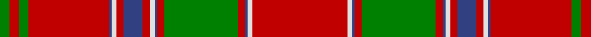

In pattern [GRGRBWRBRWBRGRBWR](/patterns/grgrbwrbrwbrgrbwr/).

This was sourced from weddslist.  It is a [17 stripes tartan](/stripes/stripes17/).

Original link http://www.weddslist.com/cgi-bin/tartans/pg.pl?source=sts

## Thread count
G/8 R8 G8 R68 B2 LN4 R6 B16 R6 LN4 B2 R6 G62 R6 B2 LN4 R/80

## Palette
Each colour and its ΔE from the base-6 reference it is a variant of.

| Colour | Shade | Base | ΔE (OKLab) |
|---|---|---|---|
| B | <code style="background-color:#304080;">#304080</code> `#304080` | B <code style="background-color:#2C4084;">#2C4084</code> | 0.01 |
| G | <code style="background-color:#008000;">#008000</code> `#008000` | G <code style="background-color:#006400;">#006400</code> | 0.09 |
| LN | <code style="background-color:#E0E0E0;">#E0E0E0</code> `#E0E0E0` | W <code style="background-color:#F4F4F0;">#F4F4F0</code> | 0.06 |
| R | <code style="background-color:#C00000;">#C00000</code> `#C00000` | R <code style="background-color:#C80000;">#C80000</code> | 0.02 |

## Nearest tartans

The nearest existing variants by ΔTartan distance.

1. [Dalziel #1](/setts/s17/r80w4b2r6g62r6b2w4r6b16r6w4b2r68g8r8g8-b2c4084-g005020-rdc0000-we0e0e0/) — ΔT 0.63
1. [Grant, or Drummond](/setts/s15/r12b4r4g48r4g4r4b16r4ba2r64b4r4b2r12-b304080-ba5480b0-g008000-rc00000/) — ΔT 0.78
1. [Drummond](/setts/s15/r12b4r4g48r4g4r4b16r4ba2r64b4r4b2r12-b1474b4-ba5c8ca8-g006818-rc80000/) — ΔT 0.84
1. [Dalzell](/setts/s17/r24w1b2r4g32r4b2w1r4b6r4w1b2r32g2r3g6-b00004c-g004c00-rc80000-wd0d0d0/) — ΔT 0.91
1. [Grant or Drummond Clan Tartan Tartan Number: 1384. Earliest known date: 1831 The usual design is sometimes called Drummond. It is recorded by Logan (1831), Smibert (1850), and Smith (1850). McIan's drawing of the Grant tartan is too roughly done to make out the pattern details. A certain difficulty arises in establishing a single Grant tartan to represent the clan, illustrated by the existance of ten Grant portraits at Cullen House in which each brother is wearing a different tartan, and where a coat or plaid is worn, these also differ. The chief of the Grants is Lord Strathspey. See products available Copyright © Blair Urquhart, Comrie, 2015](/setts/s15/r12b4r4g48r4g4r4b16r4ba4r64b4r4b2r12-b2c2c80-ba2888c4-g006818-rc80000/) — ΔT 0.91
1. [Drummond - 1819 (Clan)](/setts/s15/r12b4r4g48r4g4r4b16r4ba2r64b4r4b2r12-b440044-ba5c8ca8-g285800-rd40000/) — ΔT 0.98
1. [MacAlister (Cockburn Collection 1810-20)](/setts/s23/r64g16r8g16r16b16r24ba2r2g36r2ba2r64ba2r2g36r2ba2r24g12r2ba2r8-b2c4084-ba3c82af-g005020-rdc0000/) — ΔT 1.03
1. [MacGillivray - 1819 (Clan)](/setts/s13/r12b2ba2r114b4r4ba46r8g60r12b2r12ba4-b5c8ca8-ba14283c-g006818-rc80000/) — ΔT 1.04
1. [MacAlister](/setts/s23/r64g16r8g16r16b16r24ba2r2g36r2ba2r64ba2r2g36r2ba2r24g12r2ba2r8-b304080-ba5480b0-g008000-rc00000/) — ΔT 1.05
1. [MacAlister CC](/setts/s23/r64g16r8g16r16b16r24w2r2g36r2w2r64w2r2g36r2w2r24g12r2w2r8-b000064-g004c00-rc80000-wd0d0d0/) — ΔT 1.06

## Neighbour map

Every grey dot is one of 15726 variants placed by the first two principal components of the ΔTartan feature space (44% of its variance). Red is this tartan; blue dots are its nearest — click one to open its page.

<svg viewBox="0 0 640 380" role="img" style="max-width:100%;height:auto;border:1px solid #e0e0e0;border-radius:4px;display:block" xmlns="http://www.w3.org/2000/svg"><image href="/nn/cloud.v1.png" width="640" height="380"/><a href="/setts/s17/r80w4b2r6g62r6b2w4r6b16r6w4b2r68g8r8g8-b2c4084-g005020-rdc0000-we0e0e0/"><circle cx="418.1" cy="67.0" r="4" fill="#3465a4"><title>Dalziel #1</title></circle></a><a href="/setts/s15/r12b4r4g48r4g4r4b16r4ba2r64b4r4b2r12-b304080-ba5480b0-g008000-rc00000/"><circle cx="396.8" cy="92.2" r="4" fill="#3465a4"><title>Grant, or Drummond</title></circle></a><a href="/setts/s15/r12b4r4g48r4g4r4b16r4ba2r64b4r4b2r12-b1474b4-ba5c8ca8-g006818-rc80000/"><circle cx="398.8" cy="92.7" r="4" fill="#3465a4"><title>Drummond</title></circle></a><a href="/setts/s17/r24w1b2r4g32r4b2w1r4b6r4w1b2r32g2r3g6-b00004c-g004c00-rc80000-wd0d0d0/"><circle cx="379.4" cy="83.9" r="4" fill="#3465a4"><title>Dalzell</title></circle></a><a href="/setts/s15/r12b4r4g48r4g4r4b16r4ba4r64b4r4b2r12-b2c2c80-ba2888c4-g006818-rc80000/"><circle cx="388.9" cy="91.5" r="4" fill="#3465a4"><title>Grant or Drummond Clan Tartan Tartan Number: 1384. Earliest known date: 1831 The usual design is sometimes called Drummond. It is recorded by Logan (1831), Smibert (1850), and Smith (1850). McIan's drawing of the Grant tartan is too roughly done to make out the pattern details. A certain difficulty arises in establishing a single Grant tartan to represent the clan, illustrated by the existance of ten Grant portraits at Cullen House in which each brother is wearing a different tartan, and where a coat or plaid is worn, these also differ. The chief of the Grants is Lord Strathspey. See products available Copyright © Blair Urquhart, Comrie, 2015</title></circle></a><a href="/setts/s15/r12b4r4g48r4g4r4b16r4ba2r64b4r4b2r12-b440044-ba5c8ca8-g285800-rd40000/"><circle cx="400.6" cy="88.3" r="4" fill="#3465a4"><title>Drummond - 1819 (Clan)</title></circle></a><a href="/setts/s23/r64g16r8g16r16b16r24ba2r2g36r2ba2r64ba2r2g36r2ba2r24g12r2ba2r8-b2c4084-ba3c82af-g005020-rdc0000/"><circle cx="400.0" cy="83.6" r="4" fill="#3465a4"><title>MacAlister (Cockburn Collection 1810-20)</title></circle></a><a href="/setts/s13/r12b2ba2r114b4r4ba46r8g60r12b2r12ba4-b5c8ca8-ba14283c-g006818-rc80000/"><circle cx="410.3" cy="77.9" r="4" fill="#3465a4"><title>MacGillivray - 1819 (Clan)</title></circle></a><a href="/setts/s23/r64g16r8g16r16b16r24ba2r2g36r2ba2r64ba2r2g36r2ba2r24g12r2ba2r8-b304080-ba5480b0-g008000-rc00000/"><circle cx="406.1" cy="89.9" r="4" fill="#3465a4"><title>MacAlister</title></circle></a><a href="/setts/s23/r64g16r8g16r16b16r24w2r2g36r2w2r64w2r2g36r2w2r24g12r2w2r8-b000064-g004c00-rc80000-wd0d0d0/"><circle cx="393.8" cy="83.7" r="4" fill="#3465a4"><title>MacAlister CC</title></circle></a><circle cx="422.2" cy="72.5" r="5" fill="#c00000"/></svg>

ID: /setts/s17/r80w4b2r6g62r6b2w4r6b16r6w4b2r68g8r8g8-b304080-g008000-rc00000-we0e0e0/
