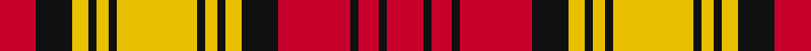

In pattern [RKRKRKYKYKYKYKYKR](/stripes/rkrkrkykykykykykr/).

This was sourced from house-of-tartan.  It is a [17 stripe tartan](/stripes/stripes17/).

Original link http://www.house-of-tartan.scotland.net/house/TartanViewjs.asp?colr=Def&tnam=2159

## Thread count
R/18 K18 Y8 K4 Y6 K4 Y40 K4 Y6 K4 Y8 K18 R36 K4 R10 K4 R/18

## Palette
Each colour and the base-6 reference it is a variant of.

| Colour | Shade | Base |
|---|---|---|
| K | <code style="background-color:#101010;">#101010</code> `oklch(17.3% 0.000 89.9)` <small>#101010</small> | K <code style="background-color:#000000;">#000000</code> |
| R | <code style="background-color:#C8002C;">#C8002C</code> `oklch(52.6% 0.212 22.0)` <small>#C8002C</small> | R <code style="background-color:#CC0000;">#CC0000</code> |
| Y | <code style="background-color:#E8C000;">#E8C000</code> `oklch(81.9% 0.168 93.7)` <small>#E8C000</small> | Y <code style="background-color:#F2BF00;">#F2BF00</code> |

## Nearest tartans

The nearest existing variants by ΔTartan distance.

1. [Aubigny, Auld Alliance](/setts/s11/y20k2y3k2y4k9r18k2r5k2r9~x2/) — ΔT 1.25
1. [Normandy (Fashion)](/setts/s12/w8k9ly9r21ly6k6w4k6ly6r49k22w4/) — ΔT 1.39
1. [MacDougall (Lochcarron)](/setts/s19/w6r2g16r3g2r3g6w2r2w2g6r7g6r2g2r16w2r2w2~x2/) — ΔT 1.43
1. [Aubigny](/setts/s9/ly20k2ly3k2ly4k9r18k2r5~x2/) — ΔT 1.43
1. [St. Andrews (Queens University)](/setts/s14/dy11db1dy11w10db1r11db1r11~x2/) — ΔT 1.47
1. [Unidentified (NZ)](/setts/s13/lo16k2lo2k2lo2k16r16k3r16k16lo16k2lo2~x2/) — ΔT 1.51
1. [MacGlashan](/setts/s14/dr10lb1dr3lb6dr1lb3dr1o5ly1o3ly6o1ly3o1~x4/) — ΔT 1.55
1. [Gaffney (2016)](/setts/s17/ly1r2k4r14g8r2g3ly1g3r2g8r13k2r2k2r1ly1~x2/) — ΔT 1.59
1. [MacNab (Clan)](/setts/s13/dg16m2dg2m2dg2m15r14m2r14m15dg16m2dg2~x2/) — ΔT 1.68
1. [Sydney (Nova Scotia)](/setts/s14/r6o1r6o3k2w1k2o6~x4/) — ΔT 1.72

## Neighbour map

Every grey dot is one of 14299 variants placed by the first two principal components of the ΔTartan feature space (44% of its variance). Red is this tartan; blue dots are its nearest — click one to open its page.

<svg viewBox="0 0 640 380" role="img" style="max-width:100%;height:auto;border:1px solid #e0e0e0;border-radius:4px;display:block" xmlns="http://www.w3.org/2000/svg"><image href="/nn/cloud.v1.png" width="640" height="380"/><a href="/setts/s11/y20k2y3k2y4k9r18k2r5k2r9~x2/"><circle cx="231.0" cy="172.6" r="4" fill="#3465a4"><title>Aubigny, Auld Alliance</title></circle></a><a href="/setts/s12/w8k9ly9r21ly6k6w4k6ly6r49k22w4/"><circle cx="221.9" cy="127.3" r="4" fill="#3465a4"><title>Normandy (Fashion)</title></circle></a><a href="/setts/s19/w6r2g16r3g2r3g6w2r2w2g6r7g6r2g2r16w2r2w2~x2/"><circle cx="229.0" cy="162.6" r="4" fill="#3465a4"><title>MacDougall (Lochcarron)</title></circle></a><a href="/setts/s9/ly20k2ly3k2ly4k9r18k2r5~x2/"><circle cx="223.1" cy="173.0" r="4" fill="#3465a4"><title>Aubigny</title></circle></a><a href="/setts/s14/dy11db1dy11w10db1r11db1r11~x2/"><circle cx="170.1" cy="155.7" r="4" fill="#3465a4"><title>St. Andrews (Queens University)</title></circle></a><a href="/setts/s13/lo16k2lo2k2lo2k16r16k3r16k16lo16k2lo2~x2/"><circle cx="196.6" cy="190.0" r="4" fill="#3465a4"><title>Unidentified (NZ)</title></circle></a><a href="/setts/s14/dr10lb1dr3lb6dr1lb3dr1o5ly1o3ly6o1ly3o1~x4/"><circle cx="127.8" cy="143.8" r="4" fill="#3465a4"><title>MacGlashan</title></circle></a><a href="/setts/s17/ly1r2k4r14g8r2g3ly1g3r2g8r13k2r2k2r1ly1~x2/"><circle cx="263.5" cy="112.8" r="4" fill="#3465a4"><title>Gaffney (2016)</title></circle></a><a href="/setts/s13/dg16m2dg2m2dg2m15r14m2r14m15dg16m2dg2~x2/"><circle cx="220.9" cy="188.2" r="4" fill="#3465a4"><title>MacNab (Clan)</title></circle></a><a href="/setts/s14/r6o1r6o3k2w1k2o6~x4/"><circle cx="158.0" cy="179.6" r="4" fill="#3465a4"><title>Sydney (Nova Scotia)</title></circle></a><circle cx="194.8" cy="145.9" r="5" fill="#c00000"/></svg>

ID: /setts/s17/r9k9ly4k2ly3k2ly20k2ly3k2ly4k9r18k2r5k2r9~x2/
