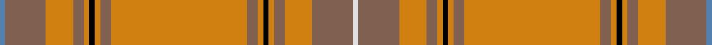

In pattern [BRYRYKYRYRYKYRYRW](/stripes/bryrykyryrykyryrw/).

This was sourced from weddslist.  It is a [17 stripe tartan](/stripes/stripes17/).

Original link http://www.weddslist.com/cgi-bin/tartans/pg.pl?source=sts

## Thread count
B/4 LT30 O20 LT8 O4 K4 O4 LT8 O100 LT8 O4 K4 O4 LT8 O20 LT30 LN/4

## Palette
Each colour and the base-6 reference it is a variant of.

| Colour | Shade | Base |
|---|---|---|
| B | <code style="background-color:#5480B0;">#5480B0</code> `oklch(58.8% 0.089 251.5)` <small>#5480B0</small> | B <code style="background-color:#2A418A;">#2A418A</code> |
| K | <code style="background-color:#000000;">#000000</code> `oklch(0.0% 0.000 0.0)` <small>#000000</small> | K <code style="background-color:#000000;">#000000</code> |
| LN | <code style="background-color:#E0E0E0;">#E0E0E0</code> `oklch(90.7% 0.000 89.9)` <small>#E0E0E0</small> | W <code style="background-color:#F7F7F7;">#F7F7F7</code> |
| LT | <code style="background-color:#806050;">#806050</code> `oklch(51.7% 0.049 47.8)` <small>#806050</small> | R <code style="background-color:#CC0000;">#CC0000</code> |
| O | <code style="background-color:#D08010;">#D08010</code> `oklch(67.0% 0.145 66.1)` <small>#D08010</small> | Y <code style="background-color:#F2BF00;">#F2BF00</code> |

## Nearest tartans

The nearest existing variants by ΔTartan distance, with this tartan at the top so the swatches line up against it.

ΔTartan

Tartan

Sett

—

<a href="/ttd/edit/#slug=t2o15lo10o4lo2k2lo2o4lo50o4lo2k2lo2o4lo10o15w2~x2">Australian, The</a> <a class="nn-out" href="/setts/s17/t2o15lo10o4lo2k2lo2o4lo50o4lo2k2lo2o4lo10o15w2~x2/" title="open its dictionary page">↗</a>

1.63

<a href="/ttd/edit/#slug=r6y2db2r30g2r2g4r2g2r1g20r1y2db2r4~x2">All Ireland Red</a> <a class="nn-out" href="/setts/s15/r6y2db2r30g2r2g4r2g2r1g20r1y2db2r4~x2/" title="open its dictionary page">↗</a>

1.63

<a href="/ttd/edit/#slug=r4lo40n12o2n12lo30k2lo4k2lo4o2lo3k3~x2">Bartlett (Personal)</a> <a class="nn-out" href="/setts/s13/r4lo40n12o2n12lo30k2lo4k2lo4o2lo3k3~x2/" title="open its dictionary page">↗</a>

1.70

<a href="/ttd/edit/#slug=r24ly1db1r3g16r3db1ly1r3db6r3ly1db1r16g2r2g2~x2">Munro</a> <a class="nn-out" href="/setts/s17/r24ly1db1r3g16r3db1ly1r3db6r3ly1db1r16g2r2g2~x2/" title="open its dictionary page">↗</a>

1.74

<a href="/ttd/edit/#slug=r46ly2db2r5g46r5db2ly2r5db10r5ly2db2r49g5w5g5~x2">Stirling, Weavers Guild</a> <a class="nn-out" href="/setts/s17/r46ly2db2r5g46r5db2ly2r5db10r5ly2db2r49g5w5g5~x2/" title="open its dictionary page">↗</a>

1.75

<a href="/ttd/edit/#slug=r24w1db2r4g32r4db2w1r4db6r4w1db2r32g2r3g6~x2">Dalziel</a> <a class="nn-out" href="/setts/s17/r24w1db2r4g32r4db2w1r4db6r4w1db2r32g2r3g6~x2/" title="open its dictionary page">↗</a>

1.78

<a href="/setts/s12/r4lo27dy9w2b2dy2b4~x3/">Unidentified #25</a>

1.79

<a href="/ttd/edit/#slug=g8ly2o4p4g3p4o42g4r3g4o4p5r3">Sarna</a> <a class="nn-out" href="/setts/s13/g8ly2o4p4g3p4o42g4r3g4o4p5r3/" title="open its dictionary page">↗</a>

1.83

<a href="/ttd/edit/#slug=r6b2r2g24r2g2r2b8r2t1r32b2r2b1r6~x2">Drummond</a> <a class="nn-out" href="/setts/s15/r6b2r2g24r2g2r2b8r2t1r32b2r2b1r6~x2/" title="open its dictionary page">↗</a>

1.84

<a href="/ttd/edit/#slug=r24w1dp2r4g32r4dp2w1r4dp6r4w1dp2r32g2r3g6~x2">Dalziel #2</a> <a class="nn-out" href="/setts/s17/r24w1dp2r4g32r4dp2w1r4dp6r4w1dp2r32g2r3g6~x2/" title="open its dictionary page">↗</a>

1.85

<a href="/ttd/edit/#slug=r4y2r24k1y8r2y1r2y4r2y1r2y16ly2y1ly4~x2">Brian Boru 2014</a> <a class="nn-out" href="/setts/s16/r4y2r24k1y8r2y1r2y4r2y1r2y16ly2y1ly4~x2/" title="open its dictionary page">↗</a>

## Neighbour map

Every grey dot is one of 14299 variants placed by the first two principal components of the ΔTartan feature space (44% of its variance). Red is this tartan; blue dots are its nearest — click one to open its page.

<svg viewBox="0 0 640 380" role="img" style="max-width:100%;height:auto;border:1px solid #e0e0e0;border-radius:4px;display:block" xmlns="http://www.w3.org/2000/svg"><image href="/nn/cloud.v1.png" width="640" height="380"/><a href="/setts/s15/r6y2db2r30g2r2g4r2g2r1g20r1y2db2r4~x2/"><circle cx="370.3" cy="78.1" r="4" fill="#3465a4"><title>All Ireland Red</title></circle></a><a href="/setts/s13/r4lo40n12o2n12lo30k2lo4k2lo4o2lo3k3~x2/"><circle cx="454.1" cy="139.1" r="4" fill="#3465a4"><title>Bartlett (Personal)</title></circle></a><a href="/setts/s17/r24ly1db1r3g16r3db1ly1r3db6r3ly1db1r16g2r2g2~x2/"><circle cx="376.1" cy="85.6" r="4" fill="#3465a4"><title>Munro</title></circle></a><a href="/setts/s17/r46ly2db2r5g46r5db2ly2r5db10r5ly2db2r49g5w5g5~x2/"><circle cx="360.6" cy="75.2" r="4" fill="#3465a4"><title>Stirling, Weavers Guild</title></circle></a><a href="/setts/s17/r24w1db2r4g32r4db2w1r4db6r4w1db2r32g2r3g6~x2/"><circle cx="357.5" cy="73.4" r="4" fill="#3465a4"><title>Dalziel</title></circle></a><a href="/setts/s12/r4lo27dy9w2b2dy2b4~x3/"><circle cx="358.3" cy="147.9" r="4" fill="#3465a4"><title>Unidentified #25</title></circle></a><a href="/setts/s13/g8ly2o4p4g3p4o42g4r3g4o4p5r3/"><circle cx="379.8" cy="121.9" r="4" fill="#3465a4"><title>Sarna</title></circle></a><a href="/setts/s15/r6b2r2g24r2g2r2b8r2t1r32b2r2b1r6~x2/"><circle cx="400.9" cy="94.4" r="4" fill="#3465a4"><title>Drummond</title></circle></a><a href="/setts/s17/r24w1dp2r4g32r4dp2w1r4dp6r4w1dp2r32g2r3g6~x2/"><circle cx="366.5" cy="74.0" r="4" fill="#3465a4"><title>Dalziel #2</title></circle></a><a href="/setts/s16/r4y2r24k1y8r2y1r2y4r2y1r2y16ly2y1ly4~x2/"><circle cx="370.3" cy="110.2" r="4" fill="#3465a4"><title>Brian Boru 2014</title></circle></a><circle cx="417.3" cy="92.9" r="5" fill="#c00000"/></svg>

ID: /setts/s17/t2o15lo10o4lo2k2lo2o4lo50o4lo2k2lo2o4lo10o15w2~x2/
