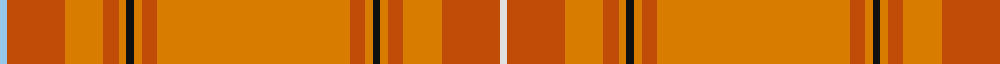

In pattern [WRYRYKYRYRYKYRYRW](/patterns/wryrykyryrykyryrw/).

This was sourced from register-of-tartans.  It is a [17 stripes tartan](/stripes/stripes17/).

Original link https://www.tartanregister.gov.uk/tartanDetails.aspx?ref=141

## Attestations

This cloth appears in 2 source records; the oldest owns this page.

- 01/01/1984 — Australia, The (register-of-tartans, [record](https://www.tartanregister.gov.uk/tartanDetails.aspx?ref=141))
- 1984 — Australia - 1984 (District) (tartans-authority, [record](http://www.tartansauthority.com/tartan-ferret/display/611/))

## Register references

External register numbers recorded for this tartan.

- Scottish Register of Tartans: [141](https://www.tartanregister.gov.uk/tartanDetails.aspx?ref=141)
- Scottish Tartans Authority (ITI): 611
- Scottish Tartans World Register: 611

## Thread count
LB/4 DO30 O20 DO8 O4 K4 O4 DO8 O100 DO8 O4 K4 O4 DO8 O20 DO30 LN/4

## Palette
Each colour and its ΔE from the base-6 reference it is a variant of.

| Colour | Shade | Base | ΔE (OKLab) |
|---|---|---|---|
| B | <code style="background-color:#5C8CA8;">#5C8CA8</code> `#5C8CA8` | B <code style="background-color:#2A418A;">#2A418A</code> | 0.23 |
| Ba | <code style="background-color:#0044A8;">#0044A8</code> `#0044A8` | B <code style="background-color:#2A418A;">#2A418A</code> | 0.05 |
| DO | <code style="background-color:#C04C08;">#C04C08</code> `#C04C08` | R <code style="background-color:#CC0000;">#CC0000</code> | 0.08 |
| K | <code style="background-color:#101010;">#101010</code> `#101010` | K <code style="background-color:#000000;">#000000</code> | 0.17 |
| LB | <code style="background-color:#98C8E8;">#98C8E8</code> `#98C8E8` | W <code style="background-color:#F7F7F7;">#F7F7F7</code> | 0.18 |
| LN | <code style="background-color:#E0E0E0;">#E0E0E0</code> `#E0E0E0` | W <code style="background-color:#F7F7F7;">#F7F7F7</code> | 0.07 |
| N | <code style="background-color:#B8B8B8;">#B8B8B8</code> `#B8B8B8` | Y <code style="background-color:#F2BF00;">#F2BF00</code> | 0.17 |
| O | <code style="background-color:#D87C00;">#D87C00</code> `#D87C00` | Y <code style="background-color:#F2BF00;">#F2BF00</code> | 0.17 |

## Nearest tartans

The nearest existing variants by ΔTartan distance.

1. [Australian District Tartan Tartan Number: 611. Earliest known date: 1984 The Australian tartan was designed by John Reid, a Melbourne architect, as the result of a national competition held by the Scottish Australian Heritage Council. He based his design on the warm colours of the 'outback' and the pattern of the tartan of Lachlan MacQuarrie, the Scotsman who became the first civil governor of the Australian colony in 1809. The tartan is design registered in Australia (No. 97439). (Source: District Tartans, P. Smith and G Teall, 1992) See products available Copyright © Blair Urquhart, Comrie, 2015](/setts/s17/w2r15y10r4y2k2y2r4y50r4y2k2y2r4y10r15wa2~k101010-rac6444-w98c8e8-wae0e0e0-ybc9450~x2/) — ΔT 1.29
1. [Australian, The](/setts/s17/b2r15y10r4y2k2y2r4y50r4y2k2y2r4y10r15w2~b5480b0-k000000-r806050-we0e0e0-yd08010~x2/) — ΔT 2.23
1. [Tyrone, County](/setts/s12/r50g6b7ga2b2w2b2g14r8ga2r9ga3~b4c3428-g8c7038-ga003820-r880000-wc0c0c0~x2/) — ΔT 2.35
1. [Smith Hunting (Name)](/setts/s10/y60w1r15w1y9r15w1g9w1r15~g5c6428-rb03000-wfcfcfc-ya08858~x2/) — ΔT 2.35
1. [Shenzhen](/setts/s20/r29y2r2y4r2y20ya1y2ya10w3ya10y2ya1y20r2y4r2y2r29k3~k101010-rb84c00-we0e0e0-ydc943c-yae8c000~x2/) — ΔT 2.36
1. [Unidentified Lindley #6](/setts/s14/r4ra3g2ra38ga30g3ga3g3ga3g3ga30ra38g2ra3~g604000-ga789484-rc80000-ra98481c~x2/) — ΔT 2.39
1. [Ross, David](/setts/s13/r15ra2g1ra2r15b2r15ra2g1ra2r15b6ga4~b5c5c5c-g789484-ga289c18-rc04c08-raa00000~x4/) — ΔT 2.45
1. [MacBrair Hunting](/setts/s8/y57k1r12w1g12r14w1r2~g508844-k101010-rc80000-wd4d4d4-ybc9038~x2/) — ΔT 2.61
1. [Down](/setts/s9/r65b9ra11r5ba2y2g5r2y13~b401000-ba5480b0-g808080-r806050-rac00000-yd09060~x2/) — ΔT 2.64
1. [MacByrd (Personal)](/setts/s8/g50k1r12w1ga12r14w1r2~g8c7038-ga5c6428-k101010-r880000-wc0c0c0~x4/) — ΔT 2.65

## Neighbour map

Every grey dot is one of 15726 variants placed by the first two principal components of the ΔTartan feature space (44% of its variance). Red is this tartan; blue dots are its nearest — click one to open its page.

<svg viewBox="0 0 640 380" role="img" style="max-width:100%;height:auto;border:1px solid #e0e0e0;border-radius:4px;display:block" xmlns="http://www.w3.org/2000/svg"><image href="/nn/cloud.v1.png" width="640" height="380"/><a href="/setts/s17/w2r15y10r4y2k2y2r4y50r4y2k2y2r4y10r15wa2~k101010-rac6444-w98c8e8-wae0e0e0-ybc9450~x2/"><circle cx="465.6" cy="110.3" r="4" fill="#3465a4"><title>Australian District Tartan Tartan Number: 611. Earliest known date: 1984 The Australian tartan was designed by John Reid, a Melbourne architect, as the result of a national competition held by the Scottish Australian Heritage Council. He based his design on the warm colours of the 'outback' and the pattern of the tartan of Lachlan MacQuarrie, the Scotsman who became the first civil governor of the Australian colony in 1809. The tartan is design registered in Australia (No. 97439). (Source: District Tartans, P. Smith and G Teall, 1992) See products available Copyright © Blair Urquhart, Comrie, 2015</title></circle></a><a href="/setts/s17/b2r15y10r4y2k2y2r4y50r4y2k2y2r4y10r15w2~b5480b0-k000000-r806050-we0e0e0-yd08010~x2/"><circle cx="417.8" cy="89.3" r="4" fill="#3465a4"><title>Australian, The</title></circle></a><a href="/setts/s12/r50g6b7ga2b2w2b2g14r8ga2r9ga3~b4c3428-g8c7038-ga003820-r880000-wc0c0c0~x2/"><circle cx="469.9" cy="124.3" r="4" fill="#3465a4"><title>Tyrone, County</title></circle></a><a href="/setts/s10/y60w1r15w1y9r15w1g9w1r15~g5c6428-rb03000-wfcfcfc-ya08858~x2/"><circle cx="462.7" cy="121.4" r="4" fill="#3465a4"><title>Smith Hunting (Name)</title></circle></a><a href="/setts/s20/r29y2r2y4r2y20ya1y2ya10w3ya10y2ya1y20r2y4r2y2r29k3~k101010-rb84c00-we0e0e0-ydc943c-yae8c000~x2/"><circle cx="325.5" cy="82.9" r="4" fill="#3465a4"><title>Shenzhen</title></circle></a><a href="/setts/s14/r4ra3g2ra38ga30g3ga3g3ga3g3ga30ra38g2ra3~g604000-ga789484-rc80000-ra98481c~x2/"><circle cx="411.3" cy="159.0" r="4" fill="#3465a4"><title>Unidentified Lindley #6</title></circle></a><a href="/setts/s13/r15ra2g1ra2r15b2r15ra2g1ra2r15b6ga4~b5c5c5c-g789484-ga289c18-rc04c08-raa00000~x4/"><circle cx="533.2" cy="181.5" r="4" fill="#3465a4"><title>Ross, David</title></circle></a><a href="/setts/s8/y57k1r12w1g12r14w1r2~g508844-k101010-rc80000-wd4d4d4-ybc9038~x2/"><circle cx="443.4" cy="100.7" r="4" fill="#3465a4"><title>MacBrair Hunting</title></circle></a><a href="/setts/s9/r65b9ra11r5ba2y2g5r2y13~b401000-ba5480b0-g808080-r806050-rac00000-yd09060~x2/"><circle cx="460.5" cy="108.8" r="4" fill="#3465a4"><title>Down</title></circle></a><a href="/setts/s8/g50k1r12w1ga12r14w1r2~g8c7038-ga5c6428-k101010-r880000-wc0c0c0~x4/"><circle cx="451.4" cy="124.7" r="4" fill="#3465a4"><title>MacByrd (Personal)</title></circle></a><circle cx="473.3" cy="105.0" r="5" fill="#c00000"/></svg>

ID: /setts/s17/w2r15y10r4y2k2y2r4y50r4y2k2y2r4y10r15wa2~k101010-rc04c08-w98c8e8-wae0e0e0-yd87c00~x2/
