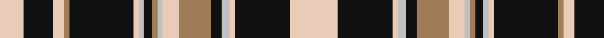

In pattern [WKWRKWWKRWWRKWWKW](/patterns/wkwrkwwkrwwrkwwkw/).

This was sourced from register-of-tartans.  It is a [17 stripes tartan](/stripes/stripes17/).

Original link https://www.tartanregister.gov.uk/tartanDetails.aspx?ref=4885

## Thread count
LR/18 K22 LR8 LT4 K48 LR4 N4 K6 LT4 N4 LR12 LT24 K8 N6 LR4 K41 LR/36

## Palette
Each colour and its ΔE from the base-6 reference it is a variant of.

| Colour | Shade | Base | ΔE (OKLab) |
|---|---|---|---|
| K | <code style="background-color:#101010;">#101010</code> `#101010` | K <code style="background-color:#000000;">#000000</code> | 0.17 |
| LR | <code style="background-color:#E8CCB8;">#E8CCB8</code> `#E8CCB8` | W <code style="background-color:#F4F4F0;">#F4F4F0</code> | 0.11 |
| LT | <code style="background-color:#A07C58;">#A07C58</code> `#A07C58` | R <code style="background-color:#C80000;">#C80000</code> | 0.19 |
| N | <code style="background-color:#C0C0C0;">#C0C0C0</code> `#C0C0C0` | W <code style="background-color:#F4F4F0;">#F4F4F0</code> | 0.16 |

ID: /setts/s17/w36k41w4wa6k8r24w12wa4r4k6wa4w4k48r4w8k22w18-k101010-ra07c58-we8ccb8-wac0c0c0/
