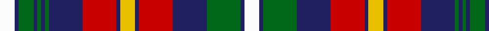

In pattern [WBGBGBGBRBYBRBGBW](/patterns/wbgbgbgbrbybrbgbw/).

This was sourced from tartans-authority.  It is a [17 stripes tartan](/stripes/stripes17/).

Original link http://www.tartansauthority.com/tartan-ferret/display/10851/

## Thread count
W/8 DB2 G8 DB2 G2 DB2 G2 DB18 R18 DB2 Y8 DB2 R18 DB18 G18 DB2 W/8

## Palette
Each colour and its ΔE from the base-6 reference it is a variant of.

| Colour | Shade | Base | ΔE (OKLab) |
|---|---|---|---|
| DB | <code style="background-color:#202060;">#202060</code> `#202060` | B <code style="background-color:#2A418A;">#2A418A</code> | 0.11 |
| G | <code style="background-color:#006818;">#006818</code> `#006818` | G <code style="background-color:#006100;">#006100</code> | 0.02 |
| R | <code style="background-color:#C80000;">#C80000</code> `#C80000` | R <code style="background-color:#CC0000;">#CC0000</code> | 0.01 |
| W | <code style="background-color:#FCFCFC;">#FCFCFC</code> `#FCFCFC` | W <code style="background-color:#F7F7F7;">#F7F7F7</code> | 0.01 |
| Y | <code style="background-color:#E8C000;">#E8C000</code> `#E8C000` | Y <code style="background-color:#F2BF00;">#F2BF00</code> | 0.02 |

## Nearest tartans

The nearest existing variants by ΔTartan distance.

1. [Alaskan Scottish](/setts/s17/w4b1g9b9r9b1y4b1r9b9g1b1g1b1g4b1w4x2~b3c82af-g052f14-rdd1212-wf7f1e8-yd3cc20/) — ΔT 0.67
1. [Unidentified #11](/setts/s15/b2k1b6k1r5y3r5k2w3k2w9k1w2k1y2x2~b080848-k101010-r960000-we0e0e0-ye8c000/) — ΔT 0.81
1. [Unidentified 32](/setts/s15/b2k1b6k1r5y3r5k2w3k2w9k1w2k1y2x2~b000050-k000000-r800000-we0e0e0-yf0c000/) — ΔT 0.87
1. [Douglas Grey Dress Clan Tartan Tartan Number: 1310. Earliest known date: pre 2003 Nothing See products available Copyright © Blair Urquhart, Comrie, 2015](/setts/s19/r6k6ra1k6ra1k2ra5k1ra5r3k2y3k2ra3k8w11k2w4ra2x2~k101010-rc80000-ra888888-we0e0e0-ye8c000/) — ΔT 0.88
1. [Douglas Ancient Dress (WCWM)](/setts/s19/r6k6ra1k6ra1k2ra5k1ra5r3k2y3k2ra3k8w11k2w4ra2x2~k101010-rdc0000-ra888888-we0e0e0-ye8c000/) — ΔT 0.89
1. [Gullane](/setts/s23/k10b2k3r2w1r3w1r4w1ra2w1ra3w1ra4w1b2w1b3w1b4w1k4w2x4~b5c5c5c-k101010-r980044-ra888888-we0e0e0/) — ΔT 0.91
1. [Oliver Dress (Dance)](/setts/s16/g1r1g1r1b7r6w7k1w7r6b7r1g1r1g1w1x4~b1c0070-g006818-k101010-r880000-wf8f8f8/) — ΔT 1.01
1. [Carnegie #2](/setts/s14/b10r2b2r4b12r2k14w13r4w2r2w4r1y3x2~b2c4084-k101010-rdc0000-we0e0e0-ye8c000/) — ΔT 1.05
1. [Collister Personal Tartan Tartan Number: 6757. Earliest known date: 2005 To commemorate the wedding of Laura Jenkins and Gary Collister in October 2005. Organised through The House of Tartan, Comrie, Perthshire and woven by D C Dalgliesh. See products available Copyright © Blair Urquhart, Comrie, 2015](/setts/s18/k26b2k2b2k2b10w10b6ba10y5ba10b6w10b10k2b2k2b2x2~b5c5c5c-ba003c64-k101010-wf8f8f8-yec8048/) — ΔT 1.06
1. [Carnegie](/setts/s14/b10r2b2r4b12r2k14w13r4w2r2w4r1y3x2~b304080-k000000-rc00000-we0e0e0-yf0c000/) — ΔT 1.07

## Neighbour map

Every grey dot is one of 15726 variants placed by the first two principal components of the ΔTartan feature space (44% of its variance). Red is this tartan; blue dots are its nearest — click one to open its page.

<svg viewBox="0 0 640 380" role="img" style="max-width:100%;height:auto;border:1px solid #e0e0e0;border-radius:4px;display:block" xmlns="http://www.w3.org/2000/svg"><image href="/nn/cloud.v1.png" width="640" height="380"/><a href="/setts/s17/w4b1g9b9r9b1y4b1r9b9g1b1g1b1g4b1w4x2~b3c82af-g052f14-rdd1212-wf7f1e8-yd3cc20/"><circle cx="105.3" cy="130.5" r="4" fill="#3465a4"><title>Alaskan Scottish</title></circle></a><a href="/setts/s15/b2k1b6k1r5y3r5k2w3k2w9k1w2k1y2x2~b080848-k101010-r960000-we0e0e0-ye8c000/"><circle cx="59.2" cy="135.9" r="4" fill="#3465a4"><title>Unidentified #11</title></circle></a><a href="/setts/s15/b2k1b6k1r5y3r5k2w3k2w9k1w2k1y2x2~b000050-k000000-r800000-we0e0e0-yf0c000/"><circle cx="54.5" cy="137.0" r="4" fill="#3465a4"><title>Unidentified 32</title></circle></a><a href="/setts/s19/r6k6ra1k6ra1k2ra5k1ra5r3k2y3k2ra3k8w11k2w4ra2x2~k101010-rc80000-ra888888-we0e0e0-ye8c000/"><circle cx="106.7" cy="132.3" r="4" fill="#3465a4"><title>Douglas Grey Dress Clan Tartan Tartan Number: 1310. Earliest known date: pre 2003 Nothing See products available Copyright © Blair Urquhart, Comrie, 2015</title></circle></a><a href="/setts/s19/r6k6ra1k6ra1k2ra5k1ra5r3k2y3k2ra3k8w11k2w4ra2x2~k101010-rdc0000-ra888888-we0e0e0-ye8c000/"><circle cx="106.4" cy="131.7" r="4" fill="#3465a4"><title>Douglas Ancient Dress (WCWM)</title></circle></a><a href="/setts/s23/k10b2k3r2w1r3w1r4w1ra2w1ra3w1ra4w1b2w1b3w1b4w1k4w2x4~b5c5c5c-k101010-r980044-ra888888-we0e0e0/"><circle cx="66.3" cy="118.5" r="4" fill="#3465a4"><title>Gullane</title></circle></a><a href="/setts/s16/g1r1g1r1b7r6w7k1w7r6b7r1g1r1g1w1x4~b1c0070-g006818-k101010-r880000-wf8f8f8/"><circle cx="85.4" cy="132.5" r="4" fill="#3465a4"><title>Oliver Dress (Dance)</title></circle></a><a href="/setts/s14/b10r2b2r4b12r2k14w13r4w2r2w4r1y3x2~b2c4084-k101010-rdc0000-we0e0e0-ye8c000/"><circle cx="103.7" cy="118.2" r="4" fill="#3465a4"><title>Carnegie #2</title></circle></a><a href="/setts/s18/k26b2k2b2k2b10w10b6ba10y5ba10b6w10b10k2b2k2b2x2~b5c5c5c-ba003c64-k101010-wf8f8f8-yec8048/"><circle cx="109.9" cy="117.5" r="4" fill="#3465a4"><title>Collister Personal Tartan Tartan Number: 6757. Earliest known date: 2005 To commemorate the wedding of Laura Jenkins and Gary Collister in October 2005. Organised through The House of Tartan, Comrie, Perthshire and woven by D C Dalgliesh. See products available Copyright © Blair Urquhart, Comrie, 2015</title></circle></a><a href="/setts/s14/b10r2b2r4b12r2k14w13r4w2r2w4r1y3x2~b304080-k000000-rc00000-we0e0e0-yf0c000/"><circle cx="97.7" cy="118.2" r="4" fill="#3465a4"><title>Carnegie</title></circle></a><circle cx="102.4" cy="131.2" r="5" fill="#c00000"/></svg>

ID: /setts/s17/w4b1g9b9r9b1y4b1r9b9g1b1g1b1g4b1w4x2~b202060-g006818-rc80000-wfcfcfc-ye8c000/
