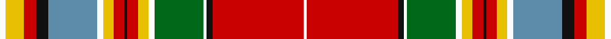

In pattern [WRKWGWYRKRYWBKRYW](/stripes/wrkwgwyrkrywbkryw/).

This was sourced from register-of-tartans.  It is a [17 stripe tartan](/stripes/stripes17/).

Original link https://www.tartanregister.gov.uk/tartanDetails.aspx?ref=624

## Also known as

This cloth is also recorded under:

- Chattan, Chief of Clan

## Attestations

This cloth appears in 2 source records; the oldest owns this page.

- 01/01/1819 — Chattan, Chief of Clan (register-of-tartans, [record](https://www.tartanregister.gov.uk/tartanDetails.aspx?ref=624))
- 1819 — Chattan (Chief) (tartans-authority, [record](http://www.tartansauthority.com/tartan-ferret/display/1852/))

## Register references

External register numbers recorded for this tartan.

- Scottish Register of Tartans: [624](https://www.tartanregister.gov.uk/tartanDetails.aspx?ref=624)
- Scottish Tartans Authority (ITI): 1852
- Scottish Tartans World Register: 1852

## Thread count
W/8 Y24 R16 K16 B64 W8 Y14 R14 K4 R14 Y14 W8 G64 W4 K8 R120 W/4

## Palette
Each colour and the base-6 reference it is a variant of.

| Colour | Shade | Base |
|---|---|---|
| B | <code style="background-color:#5C8CA8;">#5C8CA8</code> `oklch(61.7% 0.067 235.0)` <small>#5C8CA8</small> | B <code style="background-color:#2A418A;">#2A418A</code> |
| G | <code style="background-color:#006818;">#006818</code> `oklch(45.0% 0.142 145.0)` <small>#006818</small> | G <code style="background-color:#006100;">#006100</code> |
| K | <code style="background-color:#101010;">#101010</code> `oklch(17.3% 0.000 89.9)` <small>#101010</small> | K <code style="background-color:#000000;">#000000</code> |
| R | <code style="background-color:#C80000;">#C80000</code> `oklch(52.3% 0.215 29.2)` <small>#C80000</small> | R <code style="background-color:#CC0000;">#CC0000</code> |
| W | <code style="background-color:#FCFCFC;">#FCFCFC</code> `oklch(99.1% 0.000 89.9)` <small>#FCFCFC</small> | W <code style="background-color:#F7F7F7;">#F7F7F7</code> |
| Y | <code style="background-color:#E8C000;">#E8C000</code> `oklch(81.9% 0.168 93.7)` <small>#E8C000</small> | Y <code style="background-color:#F2BF00;">#F2BF00</code> |

## Nearest tartans

The nearest existing variants by ΔTartan distance.

1. [Chattan Chief Clan Tartan Tartan Number: 1851. Earliest known date: 1816 Also known as Finzean's fancy. The record of the Lord Lyon states, 'Note - this tartan is specifically for the Chief of Clan Chattan and his immediate family.' Logan descibed this sett (without the chiefs extra white line) thus: 'The Chief also wears a particular tartan of a very showy pattern.' It is illustrated by Smith in 1850. Chief of the Clan Mackintosh Sir Aeneas Mackintosh of that Ilk, acknowledged this sett as the Clan tartan in 1816. See products available Copyright © Blair Urquhart, Comrie, 2015](/setts/s17/w4ly12r8k8t32w4ly7r7k2r7ly7w4g32w2k4r60w2/) — ΔT 0.17
1. [Chattan, Chief](/setts/s17/w4ly12r8k8t32w4ly7r7k2r7ly7w4g32w2k8r60w2/) — ΔT 0.41
1. [Chattan](/setts/s17/w4ly10r8k7y28w3ly6r5k2r5ly6w3g30w2k3r50w2~x2/) — ΔT 0.42
1. [MacGlashan #3](/setts/s16/r20k3w2lo25w2ly5r4k2r4ly5w3t4k5r6w1t1~x2/) — ΔT 0.74
1. [Puccini (Fashion)](/setts/s16/r6lb1r1k15r1lb2k1lo5lb25r5k1r5k1lb5k1r5~x2/) — ΔT 0.87
1. [MacGlashan Clan Tartan Tartan Number: 656. Earliest known date: 1982 Author an historian, Dr Philip Smith, lives in the USA and provides up to date information of new designs of tartan produced in the Americas. MacGlashan is associated with Clan MacKintosh or Clan Stewart. See products available Copyright © Blair Urquhart, Comrie, 2015](/setts/s16/r25do3w2lo25w3ly5r4do2r4ly5w3db4do5r6w1db1~x2/) — ΔT 0.98
1. [MacGill](/setts/s13/r28g10k7w2ly2r1ly2w2db5k2r2ly2w3~x4/) — ΔT 1.02
1. [Somerville Dress (Name?)](/setts/s18/w2r3r6r48db4r2g16r5r3r5db20r5g3r5w54r3r5ly2~x2/) — ΔT 1.07
1. [Westwood](/setts/s18/r6t4dg16lo2k1w6k1lo30r15lo30k1w6k1lo2dg16t4r6w1~x2/) — ΔT 1.08
1. [Mehrtens (Personal)](/setts/s16/w4dt4r18o4r1o36k1o4k6r2k6r6k2r6ly4r2~x2/) — ΔT 1.09

## Neighbour map

Every grey dot is one of 14299 variants placed by the first two principal components of the ΔTartan feature space (44% of its variance). Red is this tartan; blue dots are its nearest — click one to open its page.

<svg viewBox="0 0 640 380" role="img" style="max-width:100%;height:auto;border:1px solid #e0e0e0;border-radius:4px;display:block" xmlns="http://www.w3.org/2000/svg"><image href="/nn/cloud.v1.png" width="640" height="380"/><a href="/setts/s17/w4ly12r8k8t32w4ly7r7k2r7ly7w4g32w2k4r60w2/"><circle cx="191.5" cy="43.5" r="4" fill="#3465a4"><title>Chattan Chief Clan Tartan Tartan Number: 1851. Earliest known date: 1816 Also known as Finzean's fancy. The record of the Lord Lyon states, 'Note - this tartan is specifically for the Chief of Clan Chattan and his immediate family.' Logan descibed this sett (without the chiefs extra white line) thus: 'The Chief also wears a particular tartan of a very showy pattern.' It is illustrated by Smith in 1850. Chief of the Clan Mackintosh Sir Aeneas Mackintosh of that Ilk, acknowledged this sett as the Clan tartan in 1816. See products available Copyright © Blair Urquhart, Comrie, 2015</title></circle></a><a href="/setts/s17/w4ly12r8k8t32w4ly7r7k2r7ly7w4g32w2k8r60w2/"><circle cx="171.9" cy="40.5" r="4" fill="#3465a4"><title>Chattan, Chief</title></circle></a><a href="/setts/s17/w4ly10r8k7y28w3ly6r5k2r5ly6w3g30w2k3r50w2~x2/"><circle cx="170.4" cy="47.1" r="4" fill="#3465a4"><title>Chattan</title></circle></a><a href="/setts/s16/r20k3w2lo25w2ly5r4k2r4ly5w3t4k5r6w1t1~x2/"><circle cx="175.4" cy="58.9" r="4" fill="#3465a4"><title>MacGlashan #3</title></circle></a><a href="/setts/s16/r6lb1r1k15r1lb2k1lo5lb25r5k1r5k1lb5k1r5~x2/"><circle cx="173.3" cy="41.6" r="4" fill="#3465a4"><title>Puccini (Fashion)</title></circle></a><a href="/setts/s16/r25do3w2lo25w3ly5r4do2r4ly5w3db4do5r6w1db1~x2/"><circle cx="199.9" cy="58.2" r="4" fill="#3465a4"><title>MacGlashan Clan Tartan Tartan Number: 656. Earliest known date: 1982 Author an historian, Dr Philip Smith, lives in the USA and provides up to date information of new designs of tartan produced in the Americas. MacGlashan is associated with Clan MacKintosh or Clan Stewart. See products available Copyright © Blair Urquhart, Comrie, 2015</title></circle></a><a href="/setts/s13/r28g10k7w2ly2r1ly2w2db5k2r2ly2w3~x4/"><circle cx="219.8" cy="49.6" r="4" fill="#3465a4"><title>MacGill</title></circle></a><a href="/setts/s18/w2r3r6r48db4r2g16r5r3r5db20r5g3r5w54r3r5ly2~x2/"><circle cx="177.9" cy="28.3" r="4" fill="#3465a4"><title>Somerville Dress (Name?)</title></circle></a><a href="/setts/s18/r6t4dg16lo2k1w6k1lo30r15lo30k1w6k1lo2dg16t4r6w1~x2/"><circle cx="212.8" cy="62.7" r="4" fill="#3465a4"><title>Westwood</title></circle></a><a href="/setts/s16/w4dt4r18o4r1o36k1o4k6r2k6r6k2r6ly4r2~x2/"><circle cx="234.9" cy="45.4" r="4" fill="#3465a4"><title>Mehrtens (Personal)</title></circle></a><circle cx="186.5" cy="40.7" r="5" fill="#c00000"/></svg>

ID: /setts/s17/w4ly12r8k8t32w4ly7r7k2r7ly7w4g32w2k4r60w2~x2/
