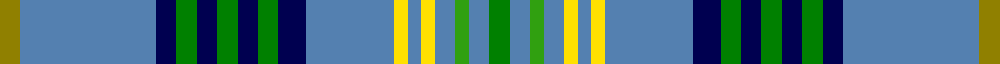

In pattern [GBBGBGBGBBYBYBGBG](/stripes/gbbgbgbgbbybybgbg/).

This was sourced from weddslist.  It is a [17 stripe tartan](/stripes/stripes17/).

Original link http://www.weddslist.com/cgi-bin/tartans/pg.pl?source=sts

## Thread count
LG/6 B40 DB6 Ga6 DB6 Ga6 DB6 Ga6 DB8 B26 Y4 B4 Y4 B6 G4 B6 Ga/6

## Palette
Each colour and the base-6 reference it is a variant of.

| Colour | Shade | Base |
|---|---|---|
| B | <code style="background-color:#5480B0;">#5480B0</code> `oklch(58.8% 0.089 251.5)` <small>#5480B0</small> | B <code style="background-color:#2A418A;">#2A418A</code> |
| DB | <code style="background-color:#000050;">#000050</code> `oklch(19.5% 0.135 264.1)` <small>#000050</small> | B <code style="background-color:#2A418A;">#2A418A</code> |
| G | <code style="background-color:#30A010;">#30A010</code> `oklch(61.9% 0.195 140.5)` <small>#30A010</small> | G <code style="background-color:#006100;">#006100</code> |
| Ga | <code style="background-color:#008000;">#008000</code> `oklch(52.0% 0.177 142.5)` <small>#008000</small> | G <code style="background-color:#006100;">#006100</code> |
| LG | <code style="background-color:#908000;">#908000</code> `oklch(59.6% 0.124 100.6)` <small>#908000</small> | G <code style="background-color:#006100;">#006100</code> |
| Y | <code style="background-color:#FFE000;">#FFE000</code> `oklch(90.5% 0.188 99.1)` <small>#FFE000</small> | Y <code style="background-color:#F2BF00;">#F2BF00</code> |

## Nearest tartans

The nearest existing variants by ΔTartan distance, with this tartan at the top so the swatches line up against it.

ΔTartan

Tartan

Sett

—

<a href="/ttd/edit/#slug=y3t20db3g3db3g3db3g3db4t13ly2t2ly2t3g2t3g3~x2">Fermanagh</a> <a class="nn-out" href="/setts/s17/y3t20db3g3db3g3db3g3db4t13ly2t2ly2t3g2t3g3~x2/" title="open its dictionary page">↗</a>

1.07

<a href="/ttd/edit/#slug=t5k2t17db3t3db22t3g22t3db3t27k2r4~x2">Leith</a> <a class="nn-out" href="/setts/s13/t5k2t17db3t3db22t3g22t3db3t27k2r4~x2/" title="open its dictionary page">↗</a>

1.11

<a href="/ttd/edit/#slug=k14t4k4t4k4t4r14t38g8t3w3t3ly8t38r14t4k4t4k4t4k14">Emergency Medical Services Memorial Tartan</a> <a class="nn-out" href="/setts/s21/k14t4k4t4k4t4r14t38g8t3w3t3ly8t38r14t4k4t4k4t4k14/" title="open its dictionary page">↗</a>

1.11

<a href="/ttd/edit/#slug=b20g3ly3b3r7g6b3k12b3k3b24w3~x2">Bhoyrub (Personal)</a> <a class="nn-out" href="/setts/s12/b20g3ly3b3r7g6b3k12b3k3b24w3~x2/" title="open its dictionary page">↗</a>

1.12

<a href="/ttd/edit/#slug=b25k3b3k3g6k3g6k3g6k3b3k3b25r3b3ly3b3r3~x2">Borders Health Board</a> <a class="nn-out" href="/setts/s18/b25k3b3k3g6k3g6k3g6k3b3k3b25r3b3ly3b3r3~x2/" title="open its dictionary page">↗</a>

1.25

<a href="/ttd/edit/#slug=b34g10b5r2k8dy2w3dy2k8r2b5g10b28k3~x2">Lambert Dress (Personal)</a> <a class="nn-out" href="/setts/s14/b34g10b5r2k8dy2w3dy2k8r2b5g10b28k3~x2/" title="open its dictionary page">↗</a>

1.35

<a href="/ttd/edit/#slug=t28o3t3k2t3o3t28g14k3o3k3ly3k4o3db6~x2">Buffalo</a> <a class="nn-out" href="/setts/s15/t28o3t3k2t3o3t28g14k3o3k3ly3k4o3db6~x2/" title="open its dictionary page">↗</a>

1.36

<a href="/ttd/edit/#slug=dt14lo3dt14lb10lo2dt7m5k2m2k2m5dt9w1k2dt2~x2">Proven</a> <a class="nn-out" href="/setts/s15/dt14lo3dt14lb10lo2dt7m5k2m2k2m5dt9w1k2dt2~x2/" title="open its dictionary page">↗</a>

1.36

<a href="/ttd/edit/#slug=g5r1db10w1r1w1t10w1t10w1ly1~x4">Texas Blue Bonnet</a> <a class="nn-out" href="/setts/s11/g5r1db10w1r1w1t10w1t10w1ly1~x4/" title="open its dictionary page">↗</a>

1.47

<a href="/ttd/edit/#slug=db4g2db24g8b2r2b2ly2b10db2w3~x2">McCartney (Night)</a> <a class="nn-out" href="/setts/s11/db4g2db24g8b2r2b2ly2b10db2w3~x2/" title="open its dictionary page">↗</a>

1.48

<a href="/ttd/edit/#slug=db20r2db12g6lb2g4b4g4lb2g16lb2g4b4g4lb2g6db12r2db20ly3~x2">United Services Planning Association</a> <a class="nn-out" href="/setts/s20/db20r2db12g6lb2g4b4g4lb2g16lb2g4b4g4lb2g6db12r2db20ly3~x2/" title="open its dictionary page">↗</a>

## Neighbour map

Every grey dot is one of 14299 variants placed by the first two principal components of the ΔTartan feature space (44% of its variance). Red is this tartan; blue dots are its nearest — click one to open its page.

<svg viewBox="0 0 640 380" role="img" style="max-width:100%;height:auto;border:1px solid #e0e0e0;border-radius:4px;display:block" xmlns="http://www.w3.org/2000/svg"><image href="/nn/cloud.v1.png" width="640" height="380"/><a href="/setts/s13/t5k2t17db3t3db22t3g22t3db3t27k2r4~x2/"><circle cx="213.6" cy="128.0" r="4" fill="#3465a4"><title>Leith</title></circle></a><a href="/setts/s21/k14t4k4t4k4t4r14t38g8t3w3t3ly8t38r14t4k4t4k4t4k14/"><circle cx="219.7" cy="92.8" r="4" fill="#3465a4"><title>Emergency Medical Services Memorial Tartan</title></circle></a><a href="/setts/s12/b20g3ly3b3r7g6b3k12b3k3b24w3~x2/"><circle cx="242.9" cy="153.1" r="4" fill="#3465a4"><title>Bhoyrub (Personal)</title></circle></a><a href="/setts/s18/b25k3b3k3g6k3g6k3g6k3b3k3b25r3b3ly3b3r3~x2/"><circle cx="270.1" cy="140.6" r="4" fill="#3465a4"><title>Borders Health Board</title></circle></a><a href="/setts/s14/b34g10b5r2k8dy2w3dy2k8r2b5g10b28k3~x2/"><circle cx="293.3" cy="118.8" r="4" fill="#3465a4"><title>Lambert Dress (Personal)</title></circle></a><a href="/setts/s15/t28o3t3k2t3o3t28g14k3o3k3ly3k4o3db6~x2/"><circle cx="287.5" cy="121.0" r="4" fill="#3465a4"><title>Buffalo</title></circle></a><a href="/setts/s15/dt14lo3dt14lb10lo2dt7m5k2m2k2m5dt9w1k2dt2~x2/"><circle cx="248.9" cy="136.5" r="4" fill="#3465a4"><title>Proven</title></circle></a><a href="/setts/s11/g5r1db10w1r1w1t10w1t10w1ly1~x4/"><circle cx="200.4" cy="138.4" r="4" fill="#3465a4"><title>Texas Blue Bonnet</title></circle></a><a href="/setts/s11/db4g2db24g8b2r2b2ly2b10db2w3~x2/"><circle cx="231.3" cy="128.8" r="4" fill="#3465a4"><title>McCartney (Night)</title></circle></a><a href="/setts/s20/db20r2db12g6lb2g4b4g4lb2g16lb2g4b4g4lb2g6db12r2db20ly3~x2/"><circle cx="192.6" cy="130.1" r="4" fill="#3465a4"><title>United Services Planning Association</title></circle></a><circle cx="222.4" cy="122.0" r="5" fill="#c00000"/></svg>

ID: /setts/s17/y3t20db3g3db3g3db3g3db4t13ly2t2ly2t3g2t3g3~x2/
