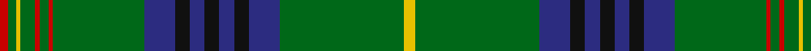

In pattern [RGYGRGRGBKBKBKBGY](/patterns/rgygrgrgbkbkbkbgy/).

This was sourced from house-of-tartan.  It is a [17 stripes tartan](/stripes/stripes17/).

Original link http://www.house-of-tartan.scotland.net/house/TartanViewjs.asp?colr=Def&tnam=1559

## Thread count
R/12 G10 Y6 G20 R6 G12 R6 G124 DB42 K20 DB20 K20 DB20 K20 DB42 G168 Y/16

## Palette
Each colour and its ΔE from the base-6 reference it is a variant of.

| Colour | Shade | Base | ΔE (OKLab) |
|---|---|---|---|
| DB | <code style="background-color:#2C2C80;">#2C2C80</code> `#2C2C80` | B <code style="background-color:#2A418A;">#2A418A</code> | 0.06 |
| G | <code style="background-color:#006818;">#006818</code> `#006818` | G <code style="background-color:#006100;">#006100</code> | 0.02 |
| K | <code style="background-color:#101010;">#101010</code> `#101010` | K <code style="background-color:#000000;">#000000</code> | 0.17 |
| R | <code style="background-color:#C80000;">#C80000</code> `#C80000` | R <code style="background-color:#CC0000;">#CC0000</code> | 0.01 |
| Y | <code style="background-color:#E8C000;">#E8C000</code> `#E8C000` | Y <code style="background-color:#F2BF00;">#F2BF00</code> | 0.02 |

## Nearest tartans

The nearest existing variants by ΔTartan distance.

1. [King Edward VII (Royal)](/setts/s17/y8g84b21k10b10k10b10k10b21g62r3g6r3g10y3g5r6~b1474b4-g006818-k101010-rc80000-ye8c000/) — ΔT 0.53
1. [Hyslop Hunting (Name)](/setts/s18/g4r2g24k2g2k6g2k6g2k2g3y1b3k2b1k2b3g2x2~b1c0070-g006818-k101010-r880000-yd09800/) — ΔT 0.65
1. [Sarafilovic](/setts/s16/b15k18g3k2g2k2g44y4g44k2g2k2g3k18b15r4x2~b2c2c80-g006818-k101010-rc80000-ye8c000/) — ΔT 0.71
1. [Kennedy Clan Tartan Tartan Number: 1123. Earliest known date: 1847 The Earls of Cassilis built Culzean Castle on the site of an ancient Kennedy stronghold. Dunure Castle near Culzean on the Ayrshire coast, was also owned by the Kennedys. The tartan was first recorded by MacIan in his book 'The Clans of the Scottish Highlands' (1847) which he co-authored with James Logan. See products available Copyright © Blair Urquhart, Comrie, 2015](/setts/s17/k2g2y1g3r1g2r1g12b4k3b3k3b3k3b4g24ra2x2~b2c2c80-g006818-k101010-ra00048-rac8002c-ye8c000/) — ΔT 0.93
1. [Gray Hunting](/setts/s20/k3w1g29r8ra2r2ra2r2ra8g7k2g7ra8r2ra2r2ra2r8g29w1x2~g006818-k101010-r888888-ra981c70-we0e0e0/) — ΔT 0.98
1. [Cochrane of Dundonald](/setts/s13/g44r4g2r2g2r4g12k12r2b10r4b4y3x2~b202060-g006818-k101010-rc80000-yd8b000/) — ΔT 1.01
1. [Holmes (Clan)](/setts/s15/y4g39b9k3b5k3b9g32r2g3r2g5y2g3r3x2~b2c2c80-g006818-k101010-rc80000-ye8c000/) — ΔT 1.10
1. [Kennedy #2](/setts/s15/y8g77b18k7b9k6b18g64r4g5r4g9y4g5r6~b2c4084-g005020-k101010-rdc0000-ye8c000/) — ΔT 1.12
1. [King Edward VII](/setts/s17/y8g84b21k10b10k10b10k10b21g62r3g6r3g10y3g5r6x2~b304080-g008000-k000000-rc00000-yf0c000/) — ΔT 1.15
1. [Kinnear, Barony of (Personal)](/setts/s20/k4r2k8g3k8g36k8g3r4w2r3y2r4g3k8g36k8g3k8r2x2~g006818-k101010-rc80000-wc0c0c0-yd09800/) — ΔT 1.15

## Neighbour map

Every grey dot is one of 15726 variants placed by the first two principal components of the ΔTartan feature space (44% of its variance). Red is this tartan; blue dots are its nearest — click one to open its page.

<svg viewBox="0 0 640 380" role="img" style="max-width:100%;height:auto;border:1px solid #e0e0e0;border-radius:4px;display:block" xmlns="http://www.w3.org/2000/svg"><image href="/nn/cloud.v1.png" width="640" height="380"/><a href="/setts/s17/y8g84b21k10b10k10b10k10b21g62r3g6r3g10y3g5r6~b1474b4-g006818-k101010-rc80000-ye8c000/"><circle cx="350.8" cy="101.2" r="4" fill="#3465a4"><title>King Edward VII (Royal)</title></circle></a><a href="/setts/s18/g4r2g24k2g2k6g2k6g2k2g3y1b3k2b1k2b3g2x2~b1c0070-g006818-k101010-r880000-yd09800/"><circle cx="341.9" cy="106.7" r="4" fill="#3465a4"><title>Hyslop Hunting (Name)</title></circle></a><a href="/setts/s16/b15k18g3k2g2k2g44y4g44k2g2k2g3k18b15r4x2~b2c2c80-g006818-k101010-rc80000-ye8c000/"><circle cx="313.4" cy="116.4" r="4" fill="#3465a4"><title>Sarafilovic</title></circle></a><a href="/setts/s17/k2g2y1g3r1g2r1g12b4k3b3k3b3k3b4g24ra2x2~b2c2c80-g006818-k101010-ra00048-rac8002c-ye8c000/"><circle cx="330.4" cy="94.2" r="4" fill="#3465a4"><title>Kennedy Clan Tartan Tartan Number: 1123. Earliest known date: 1847 The Earls of Cassilis built Culzean Castle on the site of an ancient Kennedy stronghold. Dunure Castle near Culzean on the Ayrshire coast, was also owned by the Kennedys. The tartan was first recorded by MacIan in his book 'The Clans of the Scottish Highlands' (1847) which he co-authored with James Logan. See products available Copyright © Blair Urquhart, Comrie, 2015</title></circle></a><a href="/setts/s20/k3w1g29r8ra2r2ra2r2ra8g7k2g7ra8r2ra2r2ra2r8g29w1x2~g006818-k101010-r888888-ra981c70-we0e0e0/"><circle cx="341.3" cy="90.7" r="4" fill="#3465a4"><title>Gray Hunting</title></circle></a><a href="/setts/s13/g44r4g2r2g2r4g12k12r2b10r4b4y3x2~b202060-g006818-k101010-rc80000-yd8b000/"><circle cx="329.8" cy="110.8" r="4" fill="#3465a4"><title>Cochrane of Dundonald</title></circle></a><a href="/setts/s15/y4g39b9k3b5k3b9g32r2g3r2g5y2g3r3x2~b2c2c80-g006818-k101010-rc80000-ye8c000/"><circle cx="389.3" cy="120.0" r="4" fill="#3465a4"><title>Holmes (Clan)</title></circle></a><a href="/setts/s15/y8g77b18k7b9k6b18g64r4g5r4g9y4g5r6~b2c4084-g005020-k101010-rdc0000-ye8c000/"><circle cx="399.8" cy="125.5" r="4" fill="#3465a4"><title>Kennedy #2</title></circle></a><a href="/setts/s17/y8g84b21k10b10k10b10k10b21g62r3g6r3g10y3g5r6x2~b304080-g008000-k000000-rc00000-yf0c000/"><circle cx="318.4" cy="88.4" r="4" fill="#3465a4"><title>King Edward VII</title></circle></a><a href="/setts/s20/k4r2k8g3k8g36k8g3r4w2r3y2r4g3k8g36k8g3k8r2x2~g006818-k101010-rc80000-wc0c0c0-yd09800/"><circle cx="308.3" cy="108.0" r="4" fill="#3465a4"><title>Kinnear, Barony of (Personal)</title></circle></a><circle cx="349.1" cy="100.0" r="5" fill="#c00000"/></svg>

ID: /setts/s17/y8g84b21k10b10k10b10k10b21g62r3g6r3g10y3g5r6x2~b2c2c80-g006818-k101010-rc80000-ye8c000/
