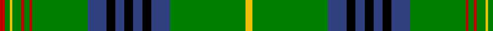

In pattern [RGYGRGRGBKBKBKBGY](/patterns/rgygrgrgbkbkbkbgy/).

This was sourced from weddslist.  It is a [17 stripes tartan](/stripes/stripes17/).

Original link http://www.weddslist.com/cgi-bin/tartans/pg.pl?source=sts

## Thread count
R/12 G10 Y6 G20 R6 G12 R6 G124 B42 K20 B20 K20 B20 K20 B42 G168 Y/16

## Palette
Each colour and its ΔE from the base-6 reference it is a variant of.

| Colour | Shade | Base | ΔE (OKLab) |
|---|---|---|---|
| B | <code style="background-color:#304080;">#304080</code> `#304080` | B <code style="background-color:#2A418A;">#2A418A</code> | 0.02 |
| G | <code style="background-color:#008000;">#008000</code> `#008000` | G <code style="background-color:#006100;">#006100</code> | 0.10 |
| K | <code style="background-color:#000000;">#000000</code> `#000000` | K <code style="background-color:#000000;">#000000</code> | 0.00 |
| R | <code style="background-color:#C00000;">#C00000</code> `#C00000` | R <code style="background-color:#CC0000;">#CC0000</code> | 0.03 |
| Y | <code style="background-color:#F0C000;">#F0C000</code> `#F0C000` | Y <code style="background-color:#F2BF00;">#F2BF00</code> | 0.00 |

## Nearest tartans

The nearest existing variants by ΔTartan distance.

1. [Kennedy](/setts/s17/k2g2y1g3r1g2r1g12b4k3b3k3b3k3b4g24ra2x2~b304080-g008000-k000000-r900030-rac00020-yf0c000/) — ΔT 0.92
1. [Reilly fae the Mearns (Personal)](/setts/s14/g2w5ga1k7w1ga2k6ga6g9r1g30y2g3w2x2~g006818-ga003820-k101010-ra00000-wfcfcfc-ydc943c/) — ΔT 1.03
1. [King Edward VII Royal Family Tartan Tartan Number: 1559. Earliest known date: pre 1992 Reputed to be a tartan specifically woven for King Edward VII. In the possession of Miss K Roberts of Torquay. See Kennedy See products available Copyright © Blair Urquhart, Comrie, 2015](/setts/s17/y8g84b21k10b10k10b10k10b21g62r3g6r3g10y3g5r6x2~b2c2c80-g006818-k101010-rc80000-ye8c000/) — ΔT 1.15
1. [King Edward VII (Royal)](/setts/s17/y8g84b21k10b10k10b10k10b21g62r3g6r3g10y3g5r6~b1474b4-g006818-k101010-rc80000-ye8c000/) — ΔT 1.20
1. [Kennedy](/setts/s15/y4g39b9k3b5k3b9g32r2g3r2g5y2g3r3x2~b304080-g008000-k000000-rc00000-yf0c000/) — ΔT 1.22
1. [Cockburn](/setts/s17/g36k1g1k1g1k1b12k1w1k1b12k1y1k1g12k2r2x2~b304080-g008000-k000000-rc00000-we0e0e0-yf0c000/) — ΔT 1.24
1. [Irish National District Tartan Tartan Number: 2245. Earliest known date: 1992 One of a series of Irish District tartans designed by Polly Wittering of the House of Edgar in association with John and Joan (Jo) Nisbet of Piper's Cove in New Jersey USA. See products available Copyright © Blair Urquhart, Comrie, 2015](/setts/s19/g36ga5y5ga9k5w5ga2g7ga1y2ga1g7ga2w5k5ga9y5ga5g17x2~g006818-ga003820-k101010-we0e0e0-ye8c000/) — ΔT 1.28
1. [Gray, hunting](/setts/s11/k3w1g29ga8r2ga2r2ga2r8g7k2x2~g008000-ga808080-k000000-r900030-we0e0e0/) — ΔT 1.35
1. [Blairlogie, or Blair Athol](/setts/s17/k20r3b10g3b5g25k1g1w3g1k1g25b5g3b10r1b2x2~b304080-g008000-k000000-rc00000-we0e0e0/) — ΔT 1.35
1. [Currie, of Balilone](/setts/s13/g24k1g2ga2gb2w1gb12w1gb2w2gb2w1gb12x2~g008000-ga908000-gb003000-k000000-we0e0e0/) — ΔT 1.36

## Neighbour map

Every grey dot is one of 15726 variants placed by the first two principal components of the ΔTartan feature space (44% of its variance). Red is this tartan; blue dots are its nearest — click one to open its page.

<svg viewBox="0 0 640 380" role="img" style="max-width:100%;height:auto;border:1px solid #e0e0e0;border-radius:4px;display:block" xmlns="http://www.w3.org/2000/svg"><image href="/nn/cloud.v1.png" width="640" height="380"/><a href="/setts/s17/k2g2y1g3r1g2r1g12b4k3b3k3b3k3b4g24ra2x2~b304080-g008000-k000000-r900030-rac00020-yf0c000/"><circle cx="289.1" cy="78.9" r="4" fill="#3465a4"><title>Kennedy</title></circle></a><a href="/setts/s14/g2w5ga1k7w1ga2k6ga6g9r1g30y2g3w2x2~g006818-ga003820-k101010-ra00000-wfcfcfc-ydc943c/"><circle cx="286.2" cy="74.3" r="4" fill="#3465a4"><title>Reilly fae the Mearns (Personal)</title></circle></a><a href="/setts/s17/y8g84b21k10b10k10b10k10b21g62r3g6r3g10y3g5r6x2~b2c2c80-g006818-k101010-rc80000-ye8c000/"><circle cx="349.1" cy="100.0" r="4" fill="#3465a4"><title>King Edward VII Royal Family Tartan Tartan Number: 1559. Earliest known date: pre 1992 Reputed to be a tartan specifically woven for King Edward VII. In the possession of Miss K Roberts of Torquay. See Kennedy See products available Copyright © Blair Urquhart, Comrie, 2015</title></circle></a><a href="/setts/s17/y8g84b21k10b10k10b10k10b21g62r3g6r3g10y3g5r6~b1474b4-g006818-k101010-rc80000-ye8c000/"><circle cx="350.8" cy="101.2" r="4" fill="#3465a4"><title>King Edward VII (Royal)</title></circle></a><a href="/setts/s15/y4g39b9k3b5k3b9g32r2g3r2g5y2g3r3x2~b304080-g008000-k000000-rc00000-yf0c000/"><circle cx="368.9" cy="112.1" r="4" fill="#3465a4"><title>Kennedy</title></circle></a><a href="/setts/s17/g36k1g1k1g1k1b12k1w1k1b12k1y1k1g12k2r2x2~b304080-g008000-k000000-rc00000-we0e0e0-yf0c000/"><circle cx="327.6" cy="47.5" r="4" fill="#3465a4"><title>Cockburn</title></circle></a><a href="/setts/s19/g36ga5y5ga9k5w5ga2g7ga1y2ga1g7ga2w5k5ga9y5ga5g17x2~g006818-ga003820-k101010-we0e0e0-ye8c000/"><circle cx="265.2" cy="85.4" r="4" fill="#3465a4"><title>Irish National District Tartan Tartan Number: 2245. Earliest known date: 1992 One of a series of Irish District tartans designed by Polly Wittering of the House of Edgar in association with John and Joan (Jo) Nisbet of Piper's Cove in New Jersey USA. See products available Copyright © Blair Urquhart, Comrie, 2015</title></circle></a><a href="/setts/s11/k3w1g29ga8r2ga2r2ga2r8g7k2x2~g008000-ga808080-k000000-r900030-we0e0e0/"><circle cx="310.3" cy="103.8" r="4" fill="#3465a4"><title>Gray, hunting</title></circle></a><a href="/setts/s17/k20r3b10g3b5g25k1g1w3g1k1g25b5g3b10r1b2x2~b304080-g008000-k000000-rc00000-we0e0e0/"><circle cx="239.7" cy="95.2" r="4" fill="#3465a4"><title>Blairlogie, or Blair Athol</title></circle></a><a href="/setts/s13/g24k1g2ga2gb2w1gb12w1gb2w2gb2w1gb12x2~g008000-ga908000-gb003000-k000000-we0e0e0/"><circle cx="282.4" cy="107.4" r="4" fill="#3465a4"><title>Currie, of Balilone</title></circle></a><circle cx="318.4" cy="88.4" r="5" fill="#c00000"/></svg>

ID: /setts/s17/y8g84b21k10b10k10b10k10b21g62r3g6r3g10y3g5r6x2~b304080-g008000-k000000-rc00000-yf0c000/
