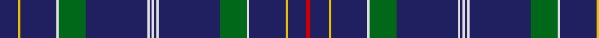

In pattern [BYBWGBWBWBWBGWBYBR](/patterns/bybwgbwbwbwbgwbybr/).

This was sourced from register-of-tartans.  It is a [18 stripes tartan](/stripes/stripes18/).

Original link https://www.tartanregister.gov.uk/tartanDetails.aspx?ref=4783

## Thread count
DB/16 Y2 DB32 LN2 G24 DB54 LN2 DB2 LN2 DB2 LN2 DB54 G24 LN2 DB32 Y2 DB16 Ra/4

## Palette
Each colour and its ΔE from the base-6 reference it is a variant of.

| Colour | Shade | Base | ΔE (OKLab) |
|---|---|---|---|
| B | <code style="background-color:#2888C4;">#2888C4</code> `#2888C4` | B <code style="background-color:#2A418A;">#2A418A</code> | 0.21 |
| DB | <code style="background-color:#202060;">#202060</code> `#202060` | B <code style="background-color:#2A418A;">#2A418A</code> | 0.11 |
| G | <code style="background-color:#006818;">#006818</code> `#006818` | G <code style="background-color:#006100;">#006100</code> | 0.02 |
| LN | <code style="background-color:#E0E0E0;">#E0E0E0</code> `#E0E0E0` | W <code style="background-color:#F7F7F7;">#F7F7F7</code> | 0.07 |
| R | <code style="background-color:#C80000;">#C80000</code> `#C80000` | R <code style="background-color:#CC0000;">#CC0000</code> | 0.01 |
| Ra | <code style="background-color:#C80000;">#C80000</code> `#C80000` | R <code style="background-color:#CC0000;">#CC0000</code> | 0.01 |
| Y | <code style="background-color:#E8C000;">#E8C000</code> `#E8C000` | Y <code style="background-color:#F2BF00;">#F2BF00</code> | 0.02 |

## Nearest tartans

The nearest existing variants by ΔTartan distance.

1. [World Youth Congress (Corporate)](/setts/s10/r4b16y2b32w2g24b54w2b2w2-b202060-g006818-rc80000-we0e0e0-ye8c000/) — ΔT 1.25
1. [Massachusetts - The Bay State (Dist)](/setts/s13/g12b6g6b22w4b8g4r8b10r3b48ba4b8-b202060-ba2888c4-g006818-rc80000-we8ccb8/) — ΔT 1.33
1. [Massachusetts - The Bay State](/setts/s13/g12b6g6b22w4b8g4r8b10r3b48ba4b8-b202060-ba3c68ac-g006818-rc80000-we8ccb8/) — ΔT 1.35
1. [Warren Wilson College](/setts/s14/g40y12b40ya6b96r12b8r12b8r12b96ya6b40y12-b1c0070-g006818-r880000-ya0a0a0-yae8c000/) — ΔT 1.49
1. [Suffolk County Police](/setts/s20/b148b12k24y6k6w6b32b16k6b8w6b8k6b16b32w6k6y6k24b12-b2c2c80-k101010-we0e0e0-ye8c000/) — ΔT 1.53
1. [Jenkins of Wales](/setts/s21/r4b37g4b4g7b5y2b4g2b3g8b3g2b4y2b5g6b4g4b37r2-b202060-g006818-rc80000-ybc8c00/) — ΔT 1.55
1. [SPA Association](/setts/s18/b20y4b4y4k16b60w4b8y4b8w4b60k16y4b4y4b20w4-b202060-k101010-we0e0e0-ye8c000/) — ΔT 1.57
1. [Seletar](/setts/s18/b12y4b14g8b6g12b4g8b78ya4b78g8b4g12b6g8b14y4-b2c2c80-g006818-ya08858-yae8c000/) — ΔT 1.66
1. [Dundonald](/setts/s16/b50r6b6r4b8r4b6r6b16b20k32r2b32r6b16y4-b2c2c80-k101010-rc80000-ye8c000/) — ΔT 1.67
1. [Oxford University Dress](/setts/s18/b88g10w4g4b4g4r4b6y6b6r4g4b4g4w4g10b88y8-b1c0070-g006818-rc8002c-wfcfcfc-yc4bc68/) — ΔT 1.72

## Neighbour map

Every grey dot is one of 15726 variants placed by the first two principal components of the ΔTartan feature space (44% of its variance). Red is this tartan; blue dots are its nearest — click one to open its page.

<svg viewBox="0 0 640 380" role="img" style="max-width:100%;height:auto;border:1px solid #e0e0e0;border-radius:4px;display:block" xmlns="http://www.w3.org/2000/svg"><image href="/nn/cloud.v1.png" width="640" height="380"/><a href="/setts/s10/r4b16y2b32w2g24b54w2b2w2-b202060-g006818-rc80000-we0e0e0-ye8c000/"><circle cx="463.2" cy="130.5" r="4" fill="#3465a4"><title>World Youth Congress (Corporate)</title></circle></a><a href="/setts/s13/g12b6g6b22w4b8g4r8b10r3b48ba4b8-b202060-ba2888c4-g006818-rc80000-we8ccb8/"><circle cx="415.0" cy="148.0" r="4" fill="#3465a4"><title>Massachusetts - The Bay State (Dist)</title></circle></a><a href="/setts/s13/g12b6g6b22w4b8g4r8b10r3b48ba4b8-b202060-ba3c68ac-g006818-rc80000-we8ccb8/"><circle cx="417.9" cy="149.3" r="4" fill="#3465a4"><title>Massachusetts - The Bay State</title></circle></a><a href="/setts/s14/g40y12b40ya6b96r12b8r12b8r12b96ya6b40y12-b1c0070-g006818-r880000-ya0a0a0-yae8c000/"><circle cx="401.3" cy="140.1" r="4" fill="#3465a4"><title>Warren Wilson College</title></circle></a><a href="/setts/s20/b148b12k24y6k6w6b32b16k6b8w6b8k6b16b32w6k6y6k24b12-b2c2c80-k101010-we0e0e0-ye8c000/"><circle cx="478.1" cy="100.1" r="4" fill="#3465a4"><title>Suffolk County Police</title></circle></a><a href="/setts/s21/r4b37g4b4g7b5y2b4g2b3g8b3g2b4y2b5g6b4g4b37r2-b202060-g006818-rc80000-ybc8c00/"><circle cx="466.9" cy="129.4" r="4" fill="#3465a4"><title>Jenkins of Wales</title></circle></a><a href="/setts/s18/b20y4b4y4k16b60w4b8y4b8w4b60k16y4b4y4b20w4-b202060-k101010-we0e0e0-ye8c000/"><circle cx="429.8" cy="130.6" r="4" fill="#3465a4"><title>SPA Association</title></circle></a><a href="/setts/s18/b12y4b14g8b6g12b4g8b78ya4b78g8b4g12b6g8b14y4-b2c2c80-g006818-ya08858-yae8c000/"><circle cx="520.4" cy="138.5" r="4" fill="#3465a4"><title>Seletar</title></circle></a><a href="/setts/s16/b50r6b6r4b8r4b6r6b16b20k32r2b32r6b16y4-b2c2c80-k101010-rc80000-ye8c000/"><circle cx="447.5" cy="147.1" r="4" fill="#3465a4"><title>Dundonald</title></circle></a><a href="/setts/s18/b88g10w4g4b4g4r4b6y6b6r4g4b4g4w4g10b88y8-b1c0070-g006818-rc8002c-wfcfcfc-yc4bc68/"><circle cx="451.6" cy="78.9" r="4" fill="#3465a4"><title>Oxford University Dress</title></circle></a><circle cx="466.7" cy="113.5" r="5" fill="#c00000"/></svg>

ID: /setts/s18/b16y2b32w2g24b54w2b2w2b2w2b54g24w2b32y2b16r4-b202060-g006818-rc80000-we0e0e0-ye8c000/
