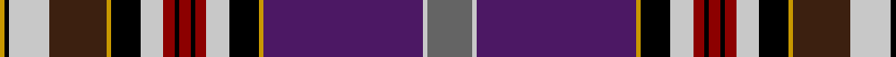

In pattern [BWBYKWRKRKRWKYBWKY](/patterns/bwbykwrkrkrwkybwky/).

This was sourced from register-of-tartans.  It is a [18 stripes tartan](/stripes/stripes18/).

Original link https://www.tartanregister.gov.uk/tartanDetails.aspx?ref=4424

## Register references

External register numbers recorded for this tartan.

- Scottish Register of Tartans: [4424](https://www.tartanregister.gov.uk/tartanDetails.aspx?ref=4424)
- Scottish Tartans Authority (ITI): 4975

## Thread count
DY/4 K4 Na36 Ka50 DY4 K26 Na20 DR10 K4 DR10 K4 DR10 Na20 K26 DY4 DP140 Na4 N/40

## Palette
Each colour and its ΔE from the base-6 reference it is a variant of.

| Colour | Shade | Base | ΔE (OKLab) |
|---|---|---|---|
| DP | <code style="background-color:#4C1864;">#4C1864</code> `#4C1864` | B <code style="background-color:#2A418A;">#2A418A</code> | 0.12 |
| DR | <code style="background-color:#8C0000;">#8C0000</code> `#8C0000` | R <code style="background-color:#CC0000;">#CC0000</code> | 0.14 |
| DY | <code style="background-color:#C89800;">#C89800</code> `#C89800` | Y <code style="background-color:#F2BF00;">#F2BF00</code> | 0.12 |
| K | <code style="background-color:#000000;">#000000</code> `#000000` | K <code style="background-color:#000000;">#000000</code> | 0.00 |
| Ka | <code style="background-color:#3C2010;">#3C2010</code> `#3C2010` | B <code style="background-color:#2A418A;">#2A418A</code> | 0.21 |
| N | <code style="background-color:#646464;">#646464</code> `#646464` | B <code style="background-color:#2A418A;">#2A418A</code> | 0.16 |
| Na | <code style="background-color:#C8C8C8;">#C8C8C8</code> `#C8C8C8` | W <code style="background-color:#F7F7F7;">#F7F7F7</code> | 0.14 |

## Nearest tartans

The nearest existing variants by ΔTartan distance.

1. [Unidentified #39](/setts/s18/g20w2b70y2k13w10r5k1r5k1r5w10k13y2ga15w22k2y2~b5a008c-g808080-ga503c14-k101010-rdc0000-we0e0e0-ye8c000~x2/) — ΔT 1.15
1. [Moon (Georgia, USA)](/setts/s18/w4k1r5ka3r8g8k1y3k1b4ka27b4k1y3k1g8r8ka3~b3474fc-g003014-k000000-ka000034-r8c0000-wc8c8c8-yc88c00~x2/) — ΔT 1.18
1. [Unidentified 33](/setts/s18/g20w2b70y2k13w10r5k1r5k1r5w10k13y2ra15w22k2y2~b800080-g808080-k000000-rc00000-ra806050-we0e0e0-yf0c000~x2/) — ΔT 1.26
1. [Lockwood Family Tartan Tartan Number: 1308. Earliest known date: pre 2003 Specimen from W.H. Johnston of Lockwood, U.S.A. See products available Copyright © Blair Urquhart, Comrie, 2015](/setts/s18/r20w2b70y2k13w10ra5k1ra5k1ra5w10k13y2g15w22k2y2~b780078-g604000-k101010-r888888-rac80000-we0e0e0-ye8c000~x2/) — ΔT 1.28
1. [Anderson 1](/setts/s22/r6b12k2ra3k2b40k6w6k6y3k3y3k12ra3ba12ra3r14k2ra3k2r14ra5~b5480b0-ba304080-k000000-r806050-rac00000-we0e0e0-yf0c000/) — ΔT 1.31
1. [Association Cornemuses du Monde](/setts/s14/r3k5w3y2b10k1g19ba19k28ba3k3ba3k3r3~b3850c8-ba505050-g808080-k101010-rff0000-wffffff-yffff00~x2/) — ΔT 1.37
1. [Dundee Carers Centre](/setts/s11/r66b2ra14b2y5rb8b12g10ga60r4b25~b000048-g285800-ga003820-r9c68a4-rafa4b00-rbc8002c-yffe600/) — ΔT 1.43
1. [Anderson 9](/setts/s21/r4b10k1r2k1b32ba4w5k4y2k2y2k8r2ba8g9k1r2k1g8r4~b5480b0-ba304080-g008000-k000000-rc00000-we0e0e0-yf0c000~x2/) — ΔT 1.43
1. [Holyrood (Chair)](/setts/s24/r34w1b10g10w1y1g2ba2w1b2ba10r6w1r6ba10b2w1ba2g2y1w1g10b10w1~b202060-ba2888c4-g003820-rc80000-wfcfcfc-yd8b000~x2/) — ΔT 1.43
1. [Anderson of Ardbrake](/setts/s19/k13r2g9b5ba3r2k4y2k2y2k3w4k3b2r22ba1k3g4ba2~b2c2c80-ba2888c4-g006818-k101010-rc80000-we0e0e0-ye8c000~x2/) — ΔT 1.49

## Neighbour map

Every grey dot is one of 15726 variants placed by the first two principal components of the ΔTartan feature space (44% of its variance). Red is this tartan; blue dots are its nearest — click one to open its page.

<svg viewBox="0 0 640 380" role="img" style="max-width:100%;height:auto;border:1px solid #e0e0e0;border-radius:4px;display:block" xmlns="http://www.w3.org/2000/svg"><image href="/nn/cloud.v1.png" width="640" height="380"/><a href="/setts/s18/g20w2b70y2k13w10r5k1r5k1r5w10k13y2ga15w22k2y2~b5a008c-g808080-ga503c14-k101010-rdc0000-we0e0e0-ye8c000~x2/"><circle cx="151.7" cy="14.0" r="4" fill="#3465a4"><title>Unidentified #39</title></circle></a><a href="/setts/s18/w4k1r5ka3r8g8k1y3k1b4ka27b4k1y3k1g8r8ka3~b3474fc-g003014-k000000-ka000034-r8c0000-wc8c8c8-yc88c00~x2/"><circle cx="132.3" cy="52.1" r="4" fill="#3465a4"><title>Moon (Georgia, USA)</title></circle></a><a href="/setts/s18/g20w2b70y2k13w10r5k1r5k1r5w10k13y2ra15w22k2y2~b800080-g808080-k000000-rc00000-ra806050-we0e0e0-yf0c000~x2/"><circle cx="149.6" cy="14.0" r="4" fill="#3465a4"><title>Unidentified 33</title></circle></a><a href="/setts/s18/r20w2b70y2k13w10ra5k1ra5k1ra5w10k13y2g15w22k2y2~b780078-g604000-k101010-r888888-rac80000-we0e0e0-ye8c000~x2/"><circle cx="156.9" cy="14.0" r="4" fill="#3465a4"><title>Lockwood Family Tartan Tartan Number: 1308. Earliest known date: pre 2003 Specimen from W.H. Johnston of Lockwood, U.S.A. See products available Copyright © Blair Urquhart, Comrie, 2015</title></circle></a><a href="/setts/s22/r6b12k2ra3k2b40k6w6k6y3k3y3k12ra3ba12ra3r14k2ra3k2r14ra5~b5480b0-ba304080-k000000-r806050-rac00000-we0e0e0-yf0c000/"><circle cx="88.5" cy="44.0" r="4" fill="#3465a4"><title>Anderson 1</title></circle></a><a href="/setts/s14/r3k5w3y2b10k1g19ba19k28ba3k3ba3k3r3~b3850c8-ba505050-g808080-k101010-rff0000-wffffff-yffff00~x2/"><circle cx="153.5" cy="63.6" r="4" fill="#3465a4"><title>Association Cornemuses du Monde</title></circle></a><a href="/setts/s11/r66b2ra14b2y5rb8b12g10ga60r4b25~b000048-g285800-ga003820-r9c68a4-rafa4b00-rbc8002c-yffe600/"><circle cx="158.1" cy="62.9" r="4" fill="#3465a4"><title>Dundee Carers Centre</title></circle></a><a href="/setts/s21/r4b10k1r2k1b32ba4w5k4y2k2y2k8r2ba8g9k1r2k1g8r4~b5480b0-ba304080-g008000-k000000-rc00000-we0e0e0-yf0c000~x2/"><circle cx="129.8" cy="23.7" r="4" fill="#3465a4"><title>Anderson 9</title></circle></a><a href="/setts/s24/r34w1b10g10w1y1g2ba2w1b2ba10r6w1r6ba10b2w1ba2g2y1w1g10b10w1~b202060-ba2888c4-g003820-rc80000-wfcfcfc-yd8b000~x2/"><circle cx="175.6" cy="25.9" r="4" fill="#3465a4"><title>Holyrood (Chair)</title></circle></a><a href="/setts/s19/k13r2g9b5ba3r2k4y2k2y2k3w4k3b2r22ba1k3g4ba2~b2c2c80-ba2888c4-g006818-k101010-rc80000-we0e0e0-ye8c000~x2/"><circle cx="107.0" cy="50.9" r="4" fill="#3465a4"><title>Anderson of Ardbrake</title></circle></a><circle cx="133.6" cy="18.1" r="5" fill="#c00000"/></svg>

ID: /setts/s18/b20w2ba70y2k13w10r5k2r5k2r5w10k13y2bb25w18k2y2~b646464-ba4c1864-bb3c2010-k000000-r8c0000-wc8c8c8-yc89800~x2/
