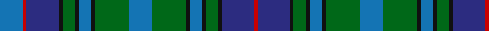

In pattern [BRBKGKBKGBGKBKGKBR](/patterns/brbkgkbkgbgkbkgkbr/).

This was sourced from register-of-tartans.  It is a [18 stripes tartan](/stripes/stripes18/).

Original link https://www.tartanregister.gov.uk/tartanDetails.aspx?ref=3841

## Thread count
B/26 R4 DBa36 K4 G14 K4 B14 K4 G38 B26 G38 K4 B14 K4 G14 K4 DBa36 R/4

## Palette
Each colour and its ΔE from the base-6 reference it is a variant of.

| Colour | Shade | Base | ΔE (OKLab) |
|---|---|---|---|
| B | <code style="background-color:#1474B4;">#1474B4</code> `#1474B4` | B <code style="background-color:#2A418A;">#2A418A</code> | 0.15 |
| DB | <code style="background-color:#202060;">#202060</code> `#202060` | B <code style="background-color:#2A418A;">#2A418A</code> | 0.11 |
| DBa | <code style="background-color:#2C2C80;">#2C2C80</code> `#2C2C80` | B <code style="background-color:#2A418A;">#2A418A</code> | 0.06 |
| DG | <code style="background-color:#003820;">#003820</code> `#003820` | G <code style="background-color:#006100;">#006100</code> | 0.15 |
| G | <code style="background-color:#006818;">#006818</code> `#006818` | G <code style="background-color:#006100;">#006100</code> | 0.02 |
| K | <code style="background-color:#101010;">#101010</code> `#101010` | K <code style="background-color:#000000;">#000000</code> | 0.17 |
| R | <code style="background-color:#C80000;">#C80000</code> `#C80000` | R <code style="background-color:#CC0000;">#CC0000</code> | 0.01 |

## Nearest tartans

The nearest existing variants by ΔTartan distance.

1. [Frangord](/setts/s17/g28b4r4b4g44ba4b32ba4bb40g10r4g10bb40ba4b32ba4g16-b2c2c80-ba2888c4-bb202060-g285800-re87878/) — ΔT 0.98
1. [Powys Welsh District Tartan Tartan Number: 5747. Earliest known date: 2002 Tartan the Welsh County of Powys in Mid Wales. Differing in warp and weft, the threads and colours create an unusual striped effect, designed and woven at the Cambrian Woollen Mill which has been in existence since c.1830. Woven for Wales Tartan Centres, Swansea. See products available Copyright © Blair Urquhart, Comrie, 2015](/setts/s12/g24b7g7b7g7ba22b7ba4y4ba4b40r14-b1474b4-ba2c2c80-g285800-rc80000-ye8c000/) — ΔT 1.16
1. [Killen (Name)](/setts/s26/g16k2w4k2b16k16g2k2g2k2g16k2g2k2g2k16b16k2r4b2r4k2b16g16k2g10-b003c64-g006c40-k101010-r800000-we0e0e0/) — ΔT 1.26
1. [Cumbernauld](/setts/s15/b34k6b6k6b6k34g34k4w4k4g34k34b34k4r6-b003c64-g006818-k101010-r880000-we0e0e0/) — ΔT 1.27
1. [Brown Ellis (Personal)](/setts/s12/k4b22k2b4k2b22k4ba28k4g28k2r4-b1474b4-ba2c2c80-g006818-k101010-rc80000/) — ΔT 1.27
1. [Wacker](/setts/s20/b12k6b6ba26g26k2g26ba26w2b6k6b6w2ba26g26k2g26ba26b6k6-b2c2c80-ba003c64-g006818-k101010-we0e0e0/) — ΔT 1.27
1. [LS Curling](/setts/s18/y4b8ba4g50ba8g4ba8k20b8g4b8g22ba4k4ba48b8ba4y4-b1c0070-ba2c2c80-g00643c-k101010-ye8c000/) — ΔT 1.28
1. [Mantle Tartan Tartan Number: 6945. Earliest known date: 2006 A combination of Sinclair Hunting and MacQueen tartans relating to the clan associations of the the two families, Swan and Sinclair. See products available Copyright © Blair Urquhart, Comrie, 2015](/setts/s14/r6g4r6g36k28w4b32g6b32w4k28g36r6g4-b2c4080-g006818-k101010-r880000-wd8d8d8/) — ΔT 1.28
1. [Unidentified (Teddy Bear)](/setts/s15/g60y4g10y4g8k30b58r4b58k30g10y4g8y4g34-b2c4084-g005020-k101010-rdc0000-ye8c000/) — ΔT 1.29
1. [78th Regiment (Highlanders) (Mil.)](/setts/s15/b30k5b5k5b5k31g31k3w7k3g31k31b31k3r7-b244870-g285800-k101010-rc80000-we0e0e0/) — ΔT 1.30

## Neighbour map

Every grey dot is one of 15726 variants placed by the first two principal components of the ΔTartan feature space (44% of its variance). Red is this tartan; blue dots are its nearest — click one to open its page.

<svg viewBox="0 0 640 380" role="img" style="max-width:100%;height:auto;border:1px solid #e0e0e0;border-radius:4px;display:block" xmlns="http://www.w3.org/2000/svg"><image href="/nn/cloud.v1.png" width="640" height="380"/><a href="/setts/s17/g28b4r4b4g44ba4b32ba4bb40g10r4g10bb40ba4b32ba4g16-b2c2c80-ba2888c4-bb202060-g285800-re87878/"><circle cx="208.6" cy="169.9" r="4" fill="#3465a4"><title>Frangord</title></circle></a><a href="/setts/s12/g24b7g7b7g7ba22b7ba4y4ba4b40r14-b1474b4-ba2c2c80-g285800-rc80000-ye8c000/"><circle cx="196.5" cy="174.7" r="4" fill="#3465a4"><title>Powys Welsh District Tartan Tartan Number: 5747. Earliest known date: 2002 Tartan the Welsh County of Powys in Mid Wales. Differing in warp and weft, the threads and colours create an unusual striped effect, designed and woven at the Cambrian Woollen Mill which has been in existence since c.1830. Woven for Wales Tartan Centres, Swansea. See products available Copyright © Blair Urquhart, Comrie, 2015</title></circle></a><a href="/setts/s26/g16k2w4k2b16k16g2k2g2k2g16k2g2k2g2k16b16k2r4b2r4k2b16g16k2g10-b003c64-g006c40-k101010-r800000-we0e0e0/"><circle cx="170.4" cy="155.1" r="4" fill="#3465a4"><title>Killen (Name)</title></circle></a><a href="/setts/s15/b34k6b6k6b6k34g34k4w4k4g34k34b34k4r6-b003c64-g006818-k101010-r880000-we0e0e0/"><circle cx="189.6" cy="185.8" r="4" fill="#3465a4"><title>Cumbernauld</title></circle></a><a href="/setts/s12/k4b22k2b4k2b22k4ba28k4g28k2r4-b1474b4-ba2c2c80-g006818-k101010-rc80000/"><circle cx="194.7" cy="155.8" r="4" fill="#3465a4"><title>Brown Ellis (Personal)</title></circle></a><a href="/setts/s20/b12k6b6ba26g26k2g26ba26w2b6k6b6w2ba26g26k2g26ba26b6k6-b2c2c80-ba003c64-g006818-k101010-we0e0e0/"><circle cx="218.1" cy="175.3" r="4" fill="#3465a4"><title>Wacker</title></circle></a><a href="/setts/s18/y4b8ba4g50ba8g4ba8k20b8g4b8g22ba4k4ba48b8ba4y4-b1c0070-ba2c2c80-g00643c-k101010-ye8c000/"><circle cx="202.2" cy="138.4" r="4" fill="#3465a4"><title>LS Curling</title></circle></a><a href="/setts/s14/r6g4r6g36k28w4b32g6b32w4k28g36r6g4-b2c4080-g006818-k101010-r880000-wd8d8d8/"><circle cx="158.6" cy="175.1" r="4" fill="#3465a4"><title>Mantle Tartan Tartan Number: 6945. Earliest known date: 2006 A combination of Sinclair Hunting and MacQueen tartans relating to the clan associations of the the two families, Swan and Sinclair. See products available Copyright © Blair Urquhart, Comrie, 2015</title></circle></a><a href="/setts/s15/g60y4g10y4g8k30b58r4b58k30g10y4g8y4g34-b2c4084-g005020-k101010-rdc0000-ye8c000/"><circle cx="224.6" cy="151.5" r="4" fill="#3465a4"><title>Unidentified (Teddy Bear)</title></circle></a><a href="/setts/s15/b30k5b5k5b5k31g31k3w7k3g31k31b31k3r7-b244870-g285800-k101010-rc80000-we0e0e0/"><circle cx="177.1" cy="171.3" r="4" fill="#3465a4"><title>78th Regiment (Highlanders) (Mil.)</title></circle></a><circle cx="164.4" cy="169.6" r="5" fill="#c00000"/></svg>

ID: /setts/s18/b26r4ba36k4g14k4b14k4g38b26g38k4b14k4g14k4ba36r4-b1474b4-ba2c2c80-g006818-k101010-rc80000/
