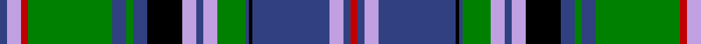

In pattern [BWRGBGBKWBWGBKBWBR](/patterns/bwrgbgbkwbwgbkbwbr/).

This was sourced from weddslist.  It is a [18 stripes tartan](/stripes/stripes18/).

Original link http://www.weddslist.com/cgi-bin/tartans/pg.pl?source=sts

## Thread count
B/4 LP8 R4 G48 B8 G4 B8 K20 LP8 B4 LP8 G16 B2 K2 B44 LP8 B4 R/4

## Palette
Each colour and its ΔE from the base-6 reference it is a variant of.

| Colour | Shade | Base | ΔE (OKLab) |
|---|---|---|---|
| B | <code style="background-color:#304080;">#304080</code> `#304080` | B <code style="background-color:#2A418A;">#2A418A</code> | 0.02 |
| G | <code style="background-color:#008000;">#008000</code> `#008000` | G <code style="background-color:#006100;">#006100</code> | 0.10 |
| K | <code style="background-color:#000000;">#000000</code> `#000000` | K <code style="background-color:#000000;">#000000</code> | 0.00 |
| LP | <code style="background-color:#C0A0E0;">#C0A0E0</code> `#C0A0E0` | W <code style="background-color:#F7F7F7;">#F7F7F7</code> | 0.24 |
| R | <code style="background-color:#C00000;">#C00000</code> `#C00000` | R <code style="background-color:#CC0000;">#CC0000</code> | 0.03 |

## Nearest tartans

The nearest existing variants by ΔTartan distance.

1. [Couper of Gogar](/setts/s18/b2w4r2g24b4g2b4k10w4b2w4g8b1k1b22w4b2r2x2~b2c2c80-g006818-k101010-rc80000-wc49cd8/) — ΔT 0.76
1. [Couper of Gogar (Clan)](/setts/s18/r2w4b2g24b4g2b4k10w4b2w4g8b1k2b22w4b2r2x2~b2c2c80-g006818-k101010-rc80000-wc49cd8/) — ΔT 0.76
1. [Scottish Islamic (Corporate)](/setts/s18/g2y2g2y2g2y2g18k1g2k5b2k1b19w2b2w2b2w2x2~b1c0070-g00643c-k101010-wfcfcfc-ybc8c00/) — ΔT 0.77
1. [Scottish Islamic](/setts/s18/g2y2g2y2g2y2g18k1g2k5b2k1b19w2b2w2b2w2x2~b031567-g064b15-k101010-wffffff-yeeb422/) — ΔT 0.80
1. [St Andrew](/setts/s14/w4b20k1g2k1g2k4g1w2g1k4g16ba8g1x2~b2c2c80-ba780078-g006818-k101010-wfcfcfc/) — ΔT 0.85
1. [Glynn of Glynstewart (Personal)](/setts/s14/b20k2g3k2b20r3k20r2k20r3g30y3g1y2x2~b33a1c9-g3d8b37-k101010-rff0000-yffe600/) — ΔT 0.95
1. [Rankin](/setts/s16/b36g10r2g10w2g10r2g10k14r2b12r3b2r2b4w2x2~b304080-g008000-k000000-rc00000-we0e0e0/) — ΔT 0.96
1. [Hope Vere Family Tartan Tartan Number: 759. Earliest known date: c.1815 Hopetoun House, South Queensferry, home of the Marquesses of Linlithgow, was built by Robert Adam. The Highland Society of London collected specimens of tartan sealed with the signature of the Clan Chief or Head of the family, from 1815 onwards. See products available Copyright © Blair Urquhart, Comrie, 2015](/setts/s16/g19k1ga3k1g3k9b20k1y1k7y1k1b21k12g2ga1x2~b2c2c80-g289c18-ga006818-k101010-ye8c000/) — ΔT 0.99
1. [Cooper](/setts/s18/r2ra3b2g32b3g1b3k14ra3b2ra3g12b1k1b30ra3b2ra2x2~b304080-g008000-k000000-rc00000-rad03030/) — ΔT 1.00
1. [Help for Heroes Corporate Tartan Tartan Number: 10561. Earliest known date: 20/01/2012 The use of the tartan is restricted in line with a legal agreement between Help for Heroes and Lochcarron of Scotland. Woven by Lochcarron of Scotland This tartan was inspired by William McGregor and George Neil of G B Tailoring, and has been produced to raise funds for Help for Heroes. The colours represent the UK Army, Navy and Airforce See products available Copyright © Blair Urquhart, Comrie, 2015](/setts/s16/r12w50b20ba2b10ba4b8ba6b6ba6b4ba8b2ba32wa12ba5~b09322e-ba01006c-rb9181d-w76f4c4-wac4c4c4/) — ΔT 1.04

## Neighbour map

Every grey dot is one of 15726 variants placed by the first two principal components of the ΔTartan feature space (44% of its variance). Red is this tartan; blue dots are its nearest — click one to open its page.

<svg viewBox="0 0 640 380" role="img" style="max-width:100%;height:auto;border:1px solid #e0e0e0;border-radius:4px;display:block" xmlns="http://www.w3.org/2000/svg"><image href="/nn/cloud.v1.png" width="640" height="380"/><a href="/setts/s18/b2w4r2g24b4g2b4k10w4b2w4g8b1k1b22w4b2r2x2~b2c2c80-g006818-k101010-rc80000-wc49cd8/"><circle cx="195.0" cy="93.0" r="4" fill="#3465a4"><title>Couper of Gogar</title></circle></a><a href="/setts/s18/r2w4b2g24b4g2b4k10w4b2w4g8b1k2b22w4b2r2x2~b2c2c80-g006818-k101010-rc80000-wc49cd8/"><circle cx="191.4" cy="93.9" r="4" fill="#3465a4"><title>Couper of Gogar (Clan)</title></circle></a><a href="/setts/s18/g2y2g2y2g2y2g18k1g2k5b2k1b19w2b2w2b2w2x2~b1c0070-g00643c-k101010-wfcfcfc-ybc8c00/"><circle cx="182.5" cy="85.6" r="4" fill="#3465a4"><title>Scottish Islamic (Corporate)</title></circle></a><a href="/setts/s18/g2y2g2y2g2y2g18k1g2k5b2k1b19w2b2w2b2w2x2~b031567-g064b15-k101010-wffffff-yeeb422/"><circle cx="178.4" cy="85.7" r="4" fill="#3465a4"><title>Scottish Islamic</title></circle></a><a href="/setts/s14/w4b20k1g2k1g2k4g1w2g1k4g16ba8g1x2~b2c2c80-ba780078-g006818-k101010-wfcfcfc/"><circle cx="165.9" cy="101.3" r="4" fill="#3465a4"><title>St Andrew</title></circle></a><a href="/setts/s14/b20k2g3k2b20r3k20r2k20r3g30y3g1y2x2~b33a1c9-g3d8b37-k101010-rff0000-yffe600/"><circle cx="164.8" cy="92.5" r="4" fill="#3465a4"><title>Glynn of Glynstewart (Personal)</title></circle></a><a href="/setts/s16/b36g10r2g10w2g10r2g10k14r2b12r3b2r2b4w2x2~b304080-g008000-k000000-rc00000-we0e0e0/"><circle cx="211.3" cy="110.8" r="4" fill="#3465a4"><title>Rankin</title></circle></a><a href="/setts/s16/g19k1ga3k1g3k9b20k1y1k7y1k1b21k12g2ga1x2~b2c2c80-g289c18-ga006818-k101010-ye8c000/"><circle cx="209.4" cy="109.6" r="4" fill="#3465a4"><title>Hope Vere Family Tartan Tartan Number: 759. Earliest known date: c.1815 Hopetoun House, South Queensferry, home of the Marquesses of Linlithgow, was built by Robert Adam. The Highland Society of London collected specimens of tartan sealed with the signature of the Clan Chief or Head of the family, from 1815 onwards. See products available Copyright © Blair Urquhart, Comrie, 2015</title></circle></a><a href="/setts/s18/r2ra3b2g32b3g1b3k14ra3b2ra3g12b1k1b30ra3b2ra2x2~b304080-g008000-k000000-rc00000-rad03030/"><circle cx="223.3" cy="67.9" r="4" fill="#3465a4"><title>Cooper</title></circle></a><a href="/setts/s16/r12w50b20ba2b10ba4b8ba6b6ba6b4ba8b2ba32wa12ba5~b09322e-ba01006c-rb9181d-w76f4c4-wac4c4c4/"><circle cx="137.4" cy="88.6" r="4" fill="#3465a4"><title>Help for Heroes Corporate Tartan Tartan Number: 10561. Earliest known date: 20/01/2012 The use of the tartan is restricted in line with a legal agreement between Help for Heroes and Lochcarron of Scotland. Woven by Lochcarron of Scotland This tartan was inspired by William McGregor and George Neil of G B Tailoring, and has been produced to raise funds for Help for Heroes. The colours represent the UK Army, Navy and Airforce See products available Copyright © Blair Urquhart, Comrie, 2015</title></circle></a><circle cx="176.3" cy="86.4" r="5" fill="#c00000"/></svg>

ID: /setts/s18/b2w4r2g24b4g2b4k10w4b2w4g8b1k1b22w4b2r2x2~b304080-g008000-k000000-rc00000-wc0a0e0/
