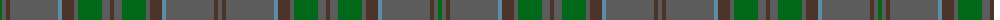

In pattern [BBBBBBGBBBGBBBBBBG](/patterns/bbbbbbgbbbgbbbbbbg/).

This was sourced from register-of-tartans.  It is a [18 stripes tartan](/stripes/stripes18/).

Original link https://www.tartanregister.gov.uk/tartanDetails.aspx?ref=4621

## Thread count
G/4 N4 T4 N48 B4 T12 N4 G24 N8 T4 N8 G24 N4 T12 B4 N48 T4 N/4

## Palette
Each colour and its ΔE from the base-6 reference it is a variant of.

| Colour | Shade | Base | ΔE (OKLab) |
|---|---|---|---|
| B | <code style="background-color:#5C8CA8;">#5C8CA8</code> `#5C8CA8` | B <code style="background-color:#2A418A;">#2A418A</code> | 0.23 |
| DG | <code style="background-color:#003820;">#003820</code> `#003820` | G <code style="background-color:#006100;">#006100</code> | 0.15 |
| G | <code style="background-color:#006818;">#006818</code> `#006818` | G <code style="background-color:#006100;">#006100</code> | 0.02 |
| N | <code style="background-color:#5C5C5C;">#5C5C5C</code> `#5C5C5C` | B <code style="background-color:#2A418A;">#2A418A</code> | 0.15 |
| T | <code style="background-color:#4C3428;">#4C3428</code> `#4C3428` | B <code style="background-color:#2A418A;">#2A418A</code> | 0.17 |

## Nearest tartans

The nearest existing variants by ΔTartan distance.

1. [Wicklow, County (District)](/setts/s10/b4ba8g24ba4b12bb4ba48b4ba4g4-b4c3428-ba5c5c5c-bb5c8ca8-g006818/) — ΔT 1.22
1. [Conlon](/setts/s9/g8b4g34ga4r8ga4g6ga22g4-b2c2c80-g005448-ga003820-r880000/) — ΔT 1.86
1. [MacAlister of Glenbarr Clan Tartan Tartan Number: 910. Earliest known date: pre 1984 This version of the MacAlister of Glenbarr tartan is the same as the MacGillivray hunting tartan. This sample was taken from a piece woven by Lochcarron Weavers around 1984. See products available Copyright © Blair Urquhart, Comrie, 2015](/setts/s14/g8ga4g4ga4g4ga6b2ga2g8ga2b2ga24b4ga6-b2c2c80-g006818-ga604000/) — ΔT 1.93
1. [Scottish Borderland](/setts/s16/g4b2g60ba20b40g2b4y2b4g2b40ba20g60b2g4w4-b405460-ba646464-g005020-wc8c8c8-yc88c00/) — ΔT 1.97
1. [Ensign of Ontario (Fashion)](/setts/s15/g42k2r8k2ga42g6ga6g6ga42g6y8g42ga6g6ga6-g006038-ga604000-k101010-rc80000-ybc8c00/) — ΔT 1.97
1. [Gray (Personal)](/setts/s18/b66g20r6g6r6g6r16b20r6b20r16g6r6g6r6g20b66r6-b5c5c5c-g006818-ra00000/) — ΔT 1.98
1. [Ontario, Ensign of](/setts/s15/g8ga36b6ga6b6ga36k4r8k4b32ga6b6ga6b32ga6-b441800-g906c00-ga003820-k101010-r880000/) — ΔT 2.04
1. [Ontario, Ensign of (District)](/setts/s15/g6b32g6b6g6b32k4r8k4g36b6g6b6g32ga6-b441800-g003820-ga906c00-k101010-r880000/) — ΔT 2.05
1. [Prince David](/setts/s15/g6ga2y4g6ga2y4gb42g36gb4g6gb4g36gb42ga2y4-g006818-ga5c6428-gb604000-yd87c00/) — ΔT 2.10
1. [Dublin, County](/setts/s12/g6b6g6b32g6b6g6ba10g36r4g16r6-b441800-ba480800-g005448-r880000/) — ΔT 2.12

## Neighbour map

Every grey dot is one of 15726 variants placed by the first two principal components of the ΔTartan feature space (44% of its variance). Red is this tartan; blue dots are its nearest — click one to open its page.

<svg viewBox="0 0 640 380" role="img" style="max-width:100%;height:auto;border:1px solid #e0e0e0;border-radius:4px;display:block" xmlns="http://www.w3.org/2000/svg"><image href="/nn/cloud.v1.png" width="640" height="380"/><a href="/setts/s10/b4ba8g24ba4b12bb4ba48b4ba4g4-b4c3428-ba5c5c5c-bb5c8ca8-g006818/"><circle cx="451.8" cy="230.6" r="4" fill="#3465a4"><title>Wicklow, County (District)</title></circle></a><a href="/setts/s9/g8b4g34ga4r8ga4g6ga22g4-b2c2c80-g005448-ga003820-r880000/"><circle cx="440.2" cy="273.1" r="4" fill="#3465a4"><title>Conlon</title></circle></a><a href="/setts/s14/g8ga4g4ga4g4ga6b2ga2g8ga2b2ga24b4ga6-b2c2c80-g006818-ga604000/"><circle cx="465.5" cy="236.2" r="4" fill="#3465a4"><title>MacAlister of Glenbarr Clan Tartan Tartan Number: 910. Earliest known date: pre 1984 This version of the MacAlister of Glenbarr tartan is the same as the MacGillivray hunting tartan. This sample was taken from a piece woven by Lochcarron Weavers around 1984. See products available Copyright © Blair Urquhart, Comrie, 2015</title></circle></a><a href="/setts/s16/g4b2g60ba20b40g2b4y2b4g2b40ba20g60b2g4w4-b405460-ba646464-g005020-wc8c8c8-yc88c00/"><circle cx="430.4" cy="165.8" r="4" fill="#3465a4"><title>Scottish Borderland</title></circle></a><a href="/setts/s15/g42k2r8k2ga42g6ga6g6ga42g6y8g42ga6g6ga6-g006038-ga604000-k101010-rc80000-ybc8c00/"><circle cx="401.6" cy="177.1" r="4" fill="#3465a4"><title>Ensign of Ontario (Fashion)</title></circle></a><a href="/setts/s18/b66g20r6g6r6g6r16b20r6b20r16g6r6g6r6g20b66r6-b5c5c5c-g006818-ra00000/"><circle cx="427.8" cy="206.5" r="4" fill="#3465a4"><title>Gray (Personal)</title></circle></a><a href="/setts/s15/g8ga36b6ga6b6ga36k4r8k4b32ga6b6ga6b32ga6-b441800-g906c00-ga003820-k101010-r880000/"><circle cx="376.0" cy="227.0" r="4" fill="#3465a4"><title>Ontario, Ensign of</title></circle></a><a href="/setts/s15/g6b32g6b6g6b32k4r8k4g36b6g6b6g32ga6-b441800-g003820-ga906c00-k101010-r880000/"><circle cx="382.6" cy="230.4" r="4" fill="#3465a4"><title>Ontario, Ensign of (District)</title></circle></a><a href="/setts/s15/g6ga2y4g6ga2y4gb42g36gb4g6gb4g36gb42ga2y4-g006818-ga5c6428-gb604000-yd87c00/"><circle cx="419.2" cy="183.6" r="4" fill="#3465a4"><title>Prince David</title></circle></a><a href="/setts/s12/g6b6g6b32g6b6g6ba10g36r4g16r6-b441800-ba480800-g005448-r880000/"><circle cx="390.3" cy="238.1" r="4" fill="#3465a4"><title>Dublin, County</title></circle></a><circle cx="450.4" cy="209.5" r="5" fill="#c00000"/></svg>

ID: /setts/s18/b4ba4b48bb4ba12b4g24b8ba4b8g24b4ba12bb4b48ba4b4g4-b5c5c5c-ba4c3428-bb5c8ca8-g006818/
