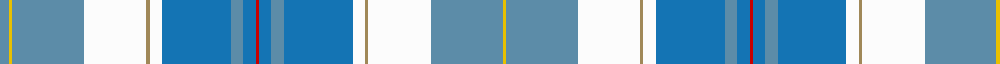

In pattern [BYBWYWBBBRBBBWYWBY](/patterns/bybwywbbbrbbbwywby/).

This was sourced from house-of-tartan.  It is a [18 stripes tartan](/stripes/stripes18/).

Original link http://www.house-of-tartan.scotland.net/house/TartanViewjs.asp?colr=Def&tnam=6238

## Thread count
Ba/6 Ya2 Ba46 W40 LT2 W8 B44 Ba8 B8 R2 B8 Ba8 B44 W8 LT2 W40 Ba46 Ya/2

## Palette
Each colour and its ΔE from the base-6 reference it is a variant of.

| Colour | Shade | Base | ΔE (OKLab) |
|---|---|---|---|
| B | <code style="background-color:#1474B4;">#1474B4</code> `#1474B4` | B <code style="background-color:#2C4084;">#2C4084</code> | 0.15 |
| Ba | <code style="background-color:#5C8CA8;">#5C8CA8</code> `#5C8CA8` | B <code style="background-color:#2C4084;">#2C4084</code> | 0.23 |
| LT | <code style="background-color:#A08858;">#A08858</code> `#A08858` | Y <code style="background-color:#E8C000;">#E8C000</code> | 0.21 |
| R | <code style="background-color:#C80000;">#C80000</code> `#C80000` | R <code style="background-color:#C80000;">#C80000</code> | 0.00 |
| W | <code style="background-color:#FCFCFC;">#FCFCFC</code> `#FCFCFC` | W <code style="background-color:#F4F4F0;">#F4F4F0</code> | 0.03 |
| Y | <code style="background-color:#E8C000;">#E8C000</code> `#E8C000` | Y <code style="background-color:#E8C000;">#E8C000</code> | 0.00 |
| Ya | <code style="background-color:#E8C000;">#E8C000</code> `#E8C000` | Y <code style="background-color:#E8C000;">#E8C000</code> | 0.00 |

## Nearest tartans

The nearest existing variants by ΔTartan distance.

1. [Anstey in New Scotland (Personal)](/setts/s15/w6b6w3b44g20ga8g2ga8g6r3g2r3g4w25y4-b1b6cc5-g006666-ga019101-r980020-wf4f4fc-ye0b000/) — ΔT 1.27
1. [Jong Nederland Born Union, Dress](/setts/s18/k4b8k8y8b48w52r4w4r8w4r4w52b48y8k8b8k4ya4-b2888c4-k101010-r880000-we0e0e0-yc4bc68-yae8c000/) — ΔT 1.40
1. [Ryder Cup, The](/setts/s16/w6b42ba16wa2ba8wa2ba6wa4ba4wa4ba2wa6ba2wa24bb10y6-b003c64-ba3c82af-bb1c0070-wffffff-wa82cffd-yffd700/) — ΔT 1.53
1. [Ethiopia](/setts/s14/w8k2b48k2r16y16g16k2b32y4b2y4b2y8-b0596fa-g309c18-k101010-rdc0000-we0e0e0-yc89600/) — ΔT 1.60
1. [Pille Family (Personal)](/setts/s13/r8g2w10g2r4g2w10wa8y40wa16ya4wa16ya8-g006818-rc80000-wfcfcfc-wa98c8e8-y48a4c0-yafccc00/) — ΔT 1.60
1. [Diana Princess of Wales Memorial](/setts/s24/w8wa4w48b24k12wa4g4wa4g16wa8k4wa4r4wa4k4wa8g16wa4g4wa4k12b24w48wa4-b5880a4-g04a0a0-k101010-rc80000-wbcd4d8-wae0e0e0/) — ΔT 1.63
1. [Diana Princess of Wales Commemorative Tartan Tartan Number: 2515. Earliest known date: 1997 Sales help Princess Diana Memorial Trust and commemorate the life of Diana Princess of Wales. The design first appeared in September of 1997 and was relaunched by George Russell, chief executive of Scotland the Brand in December 1998. See products available Copyright © Blair Urquhart, Comrie, 2015](/setts/s13/w8wa4w48b24k12wa4ba4wa4ba16wa8k4wa4r4-b48648c-ba148cac-k101010-rc80000-wb0d4ec-wae8e8e8/) — ΔT 1.66
1. [Diana Princess of Wales Mem. (Commem](/setts/s13/w8wa4w48b24k12wa4g4wa4g16wa8k4wa4r4-b5880a4-g04a0a0-k101010-rc80000-wbcd4d8-wae0e0e0/) — ΔT 1.69
1. [Inverness County (Canada)](/setts/s16/w72y8w8y4r12g12r8g8r4k8w12wa28w8wa8w4wa16-g006818-k101010-rc80000-w98c8e8-wae0e0e0-ye8c000/) — ΔT 1.70
1. [Crieff Turquoise (Dance)](/setts/s13/k4b4w4b6w76g4ba24g6b8g60b4g12w4-b2c2c80-ba9058d8-g0098a0-k101010-wfcfcfc/) — ΔT 1.71

## Neighbour map

Every grey dot is one of 15726 variants placed by the first two principal components of the ΔTartan feature space (44% of its variance). Red is this tartan; blue dots are its nearest — click one to open its page.

<svg viewBox="0 0 640 380" role="img" style="max-width:100%;height:auto;border:1px solid #e0e0e0;border-radius:4px;display:block" xmlns="http://www.w3.org/2000/svg"><image href="/nn/cloud.v1.png" width="640" height="380"/><a href="/setts/s15/w6b6w3b44g20ga8g2ga8g6r3g2r3g4w25y4-b1b6cc5-g006666-ga019101-r980020-wf4f4fc-ye0b000/"><circle cx="134.9" cy="74.2" r="4" fill="#3465a4"><title>Anstey in New Scotland (Personal)</title></circle></a><a href="/setts/s18/k4b8k8y8b48w52r4w4r8w4r4w52b48y8k8b8k4ya4-b2888c4-k101010-r880000-we0e0e0-yc4bc68-yae8c000/"><circle cx="153.0" cy="79.0" r="4" fill="#3465a4"><title>Jong Nederland Born Union, Dress</title></circle></a><a href="/setts/s16/w6b42ba16wa2ba8wa2ba6wa4ba4wa4ba2wa6ba2wa24bb10y6-b003c64-ba3c82af-bb1c0070-wffffff-wa82cffd-yffd700/"><circle cx="110.9" cy="76.8" r="4" fill="#3465a4"><title>Ryder Cup, The</title></circle></a><a href="/setts/s14/w8k2b48k2r16y16g16k2b32y4b2y4b2y8-b0596fa-g309c18-k101010-rdc0000-we0e0e0-yc89600/"><circle cx="237.7" cy="80.8" r="4" fill="#3465a4"><title>Ethiopia</title></circle></a><a href="/setts/s13/r8g2w10g2r4g2w10wa8y40wa16ya4wa16ya8-g006818-rc80000-wfcfcfc-wa98c8e8-y48a4c0-yafccc00/"><circle cx="132.4" cy="97.9" r="4" fill="#3465a4"><title>Pille Family (Personal)</title></circle></a><a href="/setts/s24/w8wa4w48b24k12wa4g4wa4g16wa8k4wa4r4wa4k4wa8g16wa4g4wa4k12b24w48wa4-b5880a4-g04a0a0-k101010-rc80000-wbcd4d8-wae0e0e0/"><circle cx="106.6" cy="75.1" r="4" fill="#3465a4"><title>Diana Princess of Wales Memorial</title></circle></a><a href="/setts/s13/w8wa4w48b24k12wa4ba4wa4ba16wa8k4wa4r4-b48648c-ba148cac-k101010-rc80000-wb0d4ec-wae8e8e8/"><circle cx="118.3" cy="97.4" r="4" fill="#3465a4"><title>Diana Princess of Wales Commemorative Tartan Tartan Number: 2515. Earliest known date: 1997 Sales help Princess Diana Memorial Trust and commemorate the life of Diana Princess of Wales. The design first appeared in September of 1997 and was relaunched by George Russell, chief executive of Scotland the Brand in December 1998. See products available Copyright © Blair Urquhart, Comrie, 2015</title></circle></a><a href="/setts/s13/w8wa4w48b24k12wa4g4wa4g16wa8k4wa4r4-b5880a4-g04a0a0-k101010-rc80000-wbcd4d8-wae0e0e0/"><circle cx="125.4" cy="100.1" r="4" fill="#3465a4"><title>Diana Princess of Wales Mem. (Commem</title></circle></a><a href="/setts/s16/w72y8w8y4r12g12r8g8r4k8w12wa28w8wa8w4wa16-g006818-k101010-rc80000-w98c8e8-wae0e0e0-ye8c000/"><circle cx="201.2" cy="74.1" r="4" fill="#3465a4"><title>Inverness County (Canada)</title></circle></a><a href="/setts/s13/k4b4w4b6w76g4ba24g6b8g60b4g12w4-b2c2c80-ba9058d8-g0098a0-k101010-wfcfcfc/"><circle cx="190.9" cy="80.7" r="4" fill="#3465a4"><title>Crieff Turquoise (Dance)</title></circle></a><circle cx="164.8" cy="80.0" r="5" fill="#c00000"/></svg>

ID: /setts/s18/b6y2b46w40ya2w8ba44b8ba8r2ba8b8ba44w8ya2w40b46y2-b5c8ca8-ba1474b4-rc80000-wfcfcfc-ye8c000-yaa08858/
