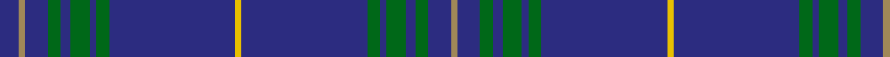

In pattern [BYBGBGBGBYBGBGBGBY](/patterns/bybgbgbgbybgbgbgby/).

This was sourced from register-of-tartans.  It is a [18 stripes tartan](/stripes/stripes18/).

Original link https://www.tartanregister.gov.uk/tartanDetails.aspx?ref=3759

## Thread count
DB/12 LT4 DB14 G8 DB6 G12 DB4 G8 DB78 Y4 DB78 G8 DB4 G12 DB6 G8 DB14 LT/4

## Palette
Each colour and its ΔE from the base-6 reference it is a variant of.

| Colour | Shade | Base | ΔE (OKLab) |
|---|---|---|---|
| DB | <code style="background-color:#2C2C80;">#2C2C80</code> `#2C2C80` | B <code style="background-color:#2A418A;">#2A418A</code> | 0.06 |
| G | <code style="background-color:#006818;">#006818</code> `#006818` | G <code style="background-color:#006100;">#006100</code> | 0.02 |
| LT | <code style="background-color:#A08858;">#A08858</code> `#A08858` | Y <code style="background-color:#F2BF00;">#F2BF00</code> | 0.21 |
| Y | <code style="background-color:#E8C000;">#E8C000</code> `#E8C000` | Y <code style="background-color:#F2BF00;">#F2BF00</code> | 0.02 |

## Nearest tartans

The nearest existing variants by ΔTartan distance.

1. [Jenkins of Wales](/setts/s21/r4b37g4b4g7b5y2b4g2b3g8b3g2b4y2b5g6b4g4b37r2~b202060-g006818-rc80000-ybc8c00/) — ΔT 1.13
1. [Seletar Shipping (Corporate)](/setts/s10/b6y2b7g4b3g6b2g4b39ya2x2~b2c2c80-g006818-ya08858-yae8c000/) — ΔT 1.24
1. [Suffolk County Police](/setts/s20/b74b6k12y3k3w3b16b8k3b4w3b4k3b8b16w3k3y3k12b6x2~b2c2c80-k101010-we0e0e0-ye8c000/) — ΔT 1.57
1. [World Youth Congress](/setts/s18/b8y1b16w1g12b27w1b1w1b1w1b27g12w1b16y1b8r2x2~b202060-g006818-rc80000-we0e0e0-ye8c000/) — ΔT 1.68
1. [Covenant College (Corporate)](/setts/s10/b2w2ba23b1ba2b4ba2b1ba23w2x2~b2888c4-ba003c64-wa8ace8/) — ΔT 1.72
1. [Rosie (Personal)](/setts/s12/b30r3k2w2k2r3b24ra2b2ra2b2ra6x2~b003c64-k101010-rc80000-ra880000-w98c8e8/) — ΔT 1.72
1. [United States Trade sett Tartan Tartan Number: 2126. Earliest known date: 1989 This design is different in warp and weft. The display gives the general appearance only. Produced to celebrate American tourism is Scotland. The colours are taken from the flags of the two nations and the Atlantic Ocean that separates them. See products available Copyright © Blair Urquhart, Comrie, 2015](/setts/s9/b7ba5y6ba5r7ba2b2ba70y2~b2c2c80-ba003c64-rc80000-yb8b8b8/) — ΔT 1.83
1. [Dundonald](/setts/s16/b25r3b3r2b4r2b3r3b8b10k16r1b16r3b8y2x2~b2c2c80-k101010-rc80000-ye8c000/) — ΔT 1.89
1. [Massachusetts - The Bay State](/setts/s13/g12b6g6b22w4b8g4r8b10r3b48ba4b8~b202060-ba3c68ac-g006818-rc80000-we8ccb8/) — ΔT 1.94
1. [Deuchars IPA (Corporate)](/setts/s12/b45ba3b3ba15b3ba3b7w1b7y1b1y1x2~b003c64-ba1474b4-we0e0e0-yf09400/) — ΔT 1.97

## Neighbour map

Every grey dot is one of 15726 variants placed by the first two principal components of the ΔTartan feature space (44% of its variance). Red is this tartan; blue dots are its nearest — click one to open its page.

<svg viewBox="0 0 640 380" role="img" style="max-width:100%;height:auto;border:1px solid #e0e0e0;border-radius:4px;display:block" xmlns="http://www.w3.org/2000/svg"><image href="/nn/cloud.v1.png" width="640" height="380"/><a href="/setts/s21/r4b37g4b4g7b5y2b4g2b3g8b3g2b4y2b5g6b4g4b37r2~b202060-g006818-rc80000-ybc8c00/"><circle cx="468.8" cy="131.8" r="4" fill="#3465a4"><title>Jenkins of Wales</title></circle></a><a href="/setts/s10/b6y2b7g4b3g6b2g4b39ya2x2~b2c2c80-g006818-ya08858-yae8c000/"><circle cx="523.0" cy="161.9" r="4" fill="#3465a4"><title>Seletar Shipping (Corporate)</title></circle></a><a href="/setts/s20/b74b6k12y3k3w3b16b8k3b4w3b4k3b8b16w3k3y3k12b6x2~b2c2c80-k101010-we0e0e0-ye8c000/"><circle cx="480.0" cy="103.9" r="4" fill="#3465a4"><title>Suffolk County Police</title></circle></a><a href="/setts/s18/b8y1b16w1g12b27w1b1w1b1w1b27g12w1b16y1b8r2x2~b202060-g006818-rc80000-we0e0e0-ye8c000/"><circle cx="468.2" cy="116.9" r="4" fill="#3465a4"><title>World Youth Congress</title></circle></a><a href="/setts/s10/b2w2ba23b1ba2b4ba2b1ba23w2x2~b2888c4-ba003c64-wa8ace8/"><circle cx="589.1" cy="184.4" r="4" fill="#3465a4"><title>Covenant College (Corporate)</title></circle></a><a href="/setts/s12/b30r3k2w2k2r3b24ra2b2ra2b2ra6x2~b003c64-k101010-rc80000-ra880000-w98c8e8/"><circle cx="466.8" cy="147.8" r="4" fill="#3465a4"><title>Rosie (Personal)</title></circle></a><a href="/setts/s9/b7ba5y6ba5r7ba2b2ba70y2~b2c2c80-ba003c64-rc80000-yb8b8b8/"><circle cx="569.9" cy="134.3" r="4" fill="#3465a4"><title>United States Trade sett Tartan Tartan Number: 2126. Earliest known date: 1989 This design is different in warp and weft. The display gives the general appearance only. Produced to celebrate American tourism is Scotland. The colours are taken from the flags of the two nations and the Atlantic Ocean that separates them. See products available Copyright © Blair Urquhart, Comrie, 2015</title></circle></a><a href="/setts/s16/b25r3b3r2b4r2b3r3b8b10k16r1b16r3b8y2x2~b2c2c80-k101010-rc80000-ye8c000/"><circle cx="448.8" cy="149.9" r="4" fill="#3465a4"><title>Dundonald</title></circle></a><a href="/setts/s13/g12b6g6b22w4b8g4r8b10r3b48ba4b8~b202060-ba3c68ac-g006818-rc80000-we8ccb8/"><circle cx="419.1" cy="151.9" r="4" fill="#3465a4"><title>Massachusetts - The Bay State</title></circle></a><a href="/setts/s12/b45ba3b3ba15b3ba3b7w1b7y1b1y1x2~b003c64-ba1474b4-we0e0e0-yf09400/"><circle cx="571.5" cy="132.6" r="4" fill="#3465a4"><title>Deuchars IPA (Corporate)</title></circle></a><circle cx="522.1" cy="141.3" r="5" fill="#c00000"/></svg>

ID: /setts/s18/b6y2b7g4b3g6b2g4b39ya2b39g4b2g6b3g4b7y2x2~b2c2c80-g006818-ya08858-yae8c000/
