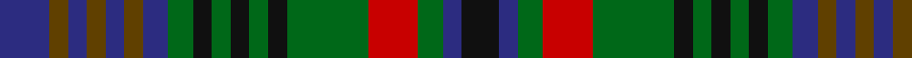

In pattern [BGBGBGBGKGKGKGRGBK](/patterns/bgbgbgbgkgkgkgrgbk/).

This was sourced from register-of-tartans.  It is a [18 stripes tartan](/stripes/stripes18/).

Original link https://www.tartanregister.gov.uk/tartanDetails.aspx?ref=4810

## Attestations

This cloth appears in 2 source records; the oldest owns this page.

- 01/01/1991 — Not Specified #2 (register-of-tartans, [record](https://www.tartanregister.gov.uk/tartanDetails.aspx?ref=4810))
- undated — Glasgow Celtic Society Corporate Tartan Tartan Number: 594. Earliest known date: c.1857 From MacGregor Hastie notes made of sample or record in Highland Society of London. A slightly different form of this is recorded in Sindex as Unidentified - No.1951. Founded in 1857 the Society promoted Gaelic culture. The first official rules of shinty were presented by the Glasgow Celtic Society in 1879. See products available Copyright © Blair Urquhart, Comrie, 2015 (house-of-tartan, [record](http://www.house-of-tartan.scotland.net/house/TartanViewjs.asp?colr=Def&tnam=594))

## Thread count
DB/16 T6 DB6 T6 DB6 T6 DB8 G8 K6 G6 K6 G6 K6 G26 R16 G8 DB6 K/12

## Palette
Each colour and its ΔE from the base-6 reference it is a variant of.

| Colour | Shade | Base | ΔE (OKLab) |
|---|---|---|---|
| DB | <code style="background-color:#2C2C80;">#2C2C80</code> `#2C2C80` | B <code style="background-color:#2A418A;">#2A418A</code> | 0.06 |
| G | <code style="background-color:#006818;">#006818</code> `#006818` | G <code style="background-color:#006100;">#006100</code> | 0.02 |
| K | <code style="background-color:#101010;">#101010</code> `#101010` | K <code style="background-color:#000000;">#000000</code> | 0.17 |
| R | <code style="background-color:#C80000;">#C80000</code> `#C80000` | R <code style="background-color:#CC0000;">#CC0000</code> | 0.01 |
| T | <code style="background-color:#604000;">#604000</code> `#604000` | G <code style="background-color:#006100;">#006100</code> | 0.14 |

## Nearest tartans

The nearest existing variants by ΔTartan distance.

1. [Glasgow Celtic Society](/setts/s18/k6b3g4r8g13k3g3k3g3k3g4b4ga3b3ga3b3ga3b3~b2c2c80-g285800-ga604000-k101010-rc80000~x2/) — ΔT 0.53
1. [MacRae #2](/setts/s15/g6k3g7r3g6k13b13k3b13k13g3w3g6k3r4~b2c4084-g005020-k101010-rdc0000-we0e0e0~x2/) — ΔT 0.85
1. [Wells, Edward G. (Personal)](/setts/s15/b8k4y3k4b14k4g4ga6g3ga10k10ga9k3r3k4~b2c2c80-g285800-ga006818-k101010-rc80000-ye8c000~x2/) — ΔT 1.13
1. [Terre D'Ecosse](/setts/s14/w3g7k3g3k3g3k13ga16y3ga16k13g16k3w3~g406054-ga003820-k101010-we0e0e0-ybc8c00~x2/) — ΔT 1.15
1. [Niagra Falls Trade Tartan Tartan Number: 1915. Earliest known date: 1967 Designed to be used in the refurbishing of Johnstons of Elgin new mill shop and based on the colours of the mill shop house style. The lighter square is represented here as green from the 'Antique' colour range, a speciality of Johnstons of Elgin. See products available Copyright © Blair Urquhart, Comrie, 2015](/setts/s12/b22g4b4g17ga17g17b4g4b22y8ga8r8~b2c2c80-g006818-ga604000-rc80000-ye8c000~x2/) — ΔT 1.19
1. [Niagara Falls](/setts/s12/b22g4b4g17ga17g17b4g4b22y8ga8r8~b14283c-g408060-ga604000-rc80000-ye8c000~x2/) — ΔT 1.22
1. [MacLachlan Hunting](/setts/s15/g4k1g1k1g1k5b5r2b2r2b5g5k1g1k1~b2c2c80-g006818-k101010-rc80000~x6/) — ΔT 1.23
1. [Ellenee](/setts/s22/k9r3k3b11k3g11k3g3k3g11k3b11k3r3k9r3k3g11k3b11k3b3~b506878-g30644c-k101010-r901c38~x2/) — ΔT 1.24
1. [Allen (1998)](/setts/s21/g2r2g12k4b11r2b11k4b2k9b2k9b2k4b11y2b11k4g12r2g2~b304c78-g006818-k101010-rc80000-ye8c000~x2/) — ΔT 1.27
1. [MacKean dress Family/Clan Tartan Tartan Number: 2339. Earliest known date: 1995 This was designed as a special design for silk squares woven by D C Dalgliesh. Assumption is that all these New Zealand MacKeans are Personal tartans rather than Clan/Family. See products available Copyright © Blair Urquhart, Comrie, 2015](/setts/s16/k2g4k1g1k2b3k1w1k1b3k2g1k1g4k2r1~b2c2c80-g006818-k101010-rc80000-we0e0e0~x6/) — ΔT 1.28

## Neighbour map

Every grey dot is one of 15726 variants placed by the first two principal components of the ΔTartan feature space (44% of its variance). Red is this tartan; blue dots are its nearest — click one to open its page.

<svg viewBox="0 0 640 380" role="img" style="max-width:100%;height:auto;border:1px solid #e0e0e0;border-radius:4px;display:block" xmlns="http://www.w3.org/2000/svg"><image href="/nn/cloud.v1.png" width="640" height="380"/><a href="/setts/s18/k6b3g4r8g13k3g3k3g3k3g4b4ga3b3ga3b3ga3b3~b2c2c80-g285800-ga604000-k101010-rc80000~x2/"><circle cx="115.0" cy="213.7" r="4" fill="#3465a4"><title>Glasgow Celtic Society</title></circle></a><a href="/setts/s15/g6k3g7r3g6k13b13k3b13k13g3w3g6k3r4~b2c4084-g005020-k101010-rdc0000-we0e0e0~x2/"><circle cx="110.1" cy="215.1" r="4" fill="#3465a4"><title>MacRae #2</title></circle></a><a href="/setts/s15/b8k4y3k4b14k4g4ga6g3ga10k10ga9k3r3k4~b2c2c80-g285800-ga006818-k101010-rc80000-ye8c000~x2/"><circle cx="67.9" cy="202.6" r="4" fill="#3465a4"><title>Wells, Edward G. (Personal)</title></circle></a><a href="/setts/s14/w3g7k3g3k3g3k13ga16y3ga16k13g16k3w3~g406054-ga003820-k101010-we0e0e0-ybc8c00~x2/"><circle cx="124.3" cy="199.3" r="4" fill="#3465a4"><title>Terre D'Ecosse</title></circle></a><a href="/setts/s12/b22g4b4g17ga17g17b4g4b22y8ga8r8~b2c2c80-g006818-ga604000-rc80000-ye8c000~x2/"><circle cx="138.1" cy="214.4" r="4" fill="#3465a4"><title>Niagra Falls Trade Tartan Tartan Number: 1915. Earliest known date: 1967 Designed to be used in the refurbishing of Johnstons of Elgin new mill shop and based on the colours of the mill shop house style. The lighter square is represented here as green from the 'Antique' colour range, a speciality of Johnstons of Elgin. See products available Copyright © Blair Urquhart, Comrie, 2015</title></circle></a><a href="/setts/s12/b22g4b4g17ga17g17b4g4b22y8ga8r8~b14283c-g408060-ga604000-rc80000-ye8c000~x2/"><circle cx="137.7" cy="213.6" r="4" fill="#3465a4"><title>Niagara Falls</title></circle></a><a href="/setts/s15/g4k1g1k1g1k5b5r2b2r2b5g5k1g1k1~b2c2c80-g006818-k101010-rc80000~x6/"><circle cx="133.5" cy="217.9" r="4" fill="#3465a4"><title>MacLachlan Hunting</title></circle></a><a href="/setts/s22/k9r3k3b11k3g11k3g3k3g11k3b11k3r3k9r3k3g11k3b11k3b3~b506878-g30644c-k101010-r901c38~x2/"><circle cx="145.8" cy="227.6" r="4" fill="#3465a4"><title>Ellenee</title></circle></a><a href="/setts/s21/g2r2g12k4b11r2b11k4b2k9b2k9b2k4b11y2b11k4g12r2g2~b304c78-g006818-k101010-rc80000-ye8c000~x2/"><circle cx="167.6" cy="186.2" r="4" fill="#3465a4"><title>Allen (1998)</title></circle></a><a href="/setts/s16/k2g4k1g1k2b3k1w1k1b3k2g1k1g4k2r1~b2c2c80-g006818-k101010-rc80000-we0e0e0~x6/"><circle cx="116.1" cy="220.7" r="4" fill="#3465a4"><title>MacKean dress Family/Clan Tartan Tartan Number: 2339. Earliest known date: 1995 This was designed as a special design for silk squares woven by D C Dalgliesh. Assumption is that all these New Zealand MacKeans are Personal tartans rather than Clan/Family. See products available Copyright © Blair Urquhart, Comrie, 2015</title></circle></a><circle cx="94.4" cy="210.6" r="5" fill="#c00000"/></svg>

ID: /setts/s18/b8g3b3g3b3g3b4ga4k3ga3k3ga3k3ga13r8ga4b3k6~b2c2c80-g604000-ga006818-k101010-rc80000~x2/
