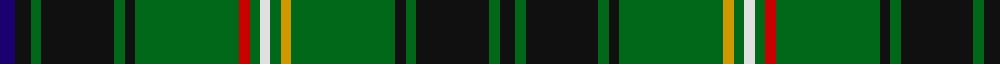

**Bands:** [BKGKGKGRGWGYGKGKGK](/stripes/bkgkgkgrgwgygkgkgk/) · **Stripes:** [DB K G K G K G R G W G LO G K G K G K](/stripes/stripes18/) DB K G K G K G R G W G LO G K G K G K

This was sourced from tartans-authority.  It is a [18 band tartan](/bands/bands18/).

Original link http://www.tartansauthority.com/tartan-ferret/display/1978/

## Thread count
DB/6 K6 G4 K28 G4 K4 G40 R4 G4 LN4 G4 DY4 G40 K4 G4 K28 G4 K/6

## Palette
Each colour and its ΔE from the base-6 reference it is a variant of.

| Colour | Shade | Base | ΔE (OKLab) |
|---|---|---|---|
| DB | <code style="background-color:#1C0070;">#1C0070</code> `#1C0070` | B <code style="background-color:#2A418A;">#2A418A</code> | 0.14 |
| DY | <code style="background-color:#D09800;">#D09800</code> `#D09800` | Y <code style="background-color:#F2BF00;">#F2BF00</code> | 0.12 |
| G | <code style="background-color:#006818;">#006818</code> `#006818` | G <code style="background-color:#006100;">#006100</code> | 0.02 |
| K | <code style="background-color:#101010;">#101010</code> `#101010` | K <code style="background-color:#000000;">#000000</code> | 0.17 |
| LN | <code style="background-color:#E0E0E0;">#E0E0E0</code> `#E0E0E0` | W <code style="background-color:#F7F7F7;">#F7F7F7</code> | 0.07 |
| R | <code style="background-color:#C80000;">#C80000</code> `#C80000` | R <code style="background-color:#CC0000;">#CC0000</code> | 0.01 |

## Nearest tartans

The nearest existing variants by ΔTartan distance.

1. [Campbell, Marquis of Lorne](/setts/s18/dp6k6g4k22g3k3g32ly3g3w3g3r3g32k3g3k22g4k6/) — ΔT 0.26
1. [Myron Family Tartan Tartan Number: 1105. Earliest known date: pre 2003 Designed for the town celebrations of 1958-59 by G. Lawson of the Musselburgh Co-operative Society. See products available Copyright © Blair Urquhart, Comrie, 2015](/setts/s17/k3g3r2g3ly2g2ly2g11db3k3db3k3db3k3db3g20r3~x2/) — ΔT 0.92
1. [Cockburn - 1830 (Clan)](/setts/s16/g10k1g1k1g1k1db4k1w1k1db1ly1k1g4k1r1~x4/) — ΔT 1.01
1. [Kerby (Personal)](/setts/s22/dp4w2dp10k10g3k3g3k2g24ly2g2r4g2ly2g24k2g3k3g3k10dp10w2~x2/) — ΔT 1.21
1. [Lorne - Marquis of (Personal)](/setts/s18/k3g2k14g2k2g20lo2g2w2g2r2g20k2g2k14g2k3t3~x2/) — ΔT 1.29
1. [Kennedy (Clan)](/setts/s17/r3g24dt4k3dt3k3dt3k3dt4g12dp2g2dp2g3lo2g2k2~x2/) — ΔT 1.30
1. [Kinnear, Barony of (Personal)](/setts/s20/k4r2k8g3k8g36k8g3r4lb2r3lo2r4g3k8g36k8g3k8r2~x2/) — ΔT 1.34
1. [Pilette of Kinnear (Personal)](/setts/s21/k4r2k10g3k10g30k8g3r4lb2r4lo2r4g3k8g30k10g3k10r2k4~x2/) — ΔT 1.35
1. [Myron](/setts/s17/k1g1r1g1lo1g1lo1g4db1k1db1k1db1k1db1g7r1~x4/) — ΔT 1.37
1. [Myron](/setts/s17/k3g3m2g3ly2g2ly2g11db3k3db3k3db3k3db3g20r3~x2/) — ΔT 1.38

## Neighbour map

Every grey dot is one of 14313 variants placed by the first two principal components of the ΔTartan feature space (44% of its variance). Red is this tartan; blue dots are its nearest — click one to open its page.

<svg viewBox="0 0 640 380" role="img" style="max-width:100%;height:auto;border:1px solid #e0e0e0;border-radius:4px;display:block" xmlns="http://www.w3.org/2000/svg"><image href="/nn/cloud.v1.png" width="640" height="380"/><a href="/setts/s18/dp6k6g4k22g3k3g32ly3g3w3g3r3g32k3g3k22g4k6/"><circle cx="257.0" cy="125.0" r="4" fill="#3465a4"><title>Campbell, Marquis of Lorne</title></circle></a><a href="/setts/s17/k3g3r2g3ly2g2ly2g11db3k3db3k3db3k3db3g20r3~x2/"><circle cx="235.8" cy="132.3" r="4" fill="#3465a4"><title>Myron Family Tartan Tartan Number: 1105. Earliest known date: pre 2003 Designed for the town celebrations of 1958-59 by G. Lawson of the Musselburgh Co-operative Society. See products available Copyright © Blair Urquhart, Comrie, 2015</title></circle></a><a href="/setts/s16/g10k1g1k1g1k1db4k1w1k1db1ly1k1g4k1r1~x4/"><circle cx="223.2" cy="120.6" r="4" fill="#3465a4"><title>Cockburn - 1830 (Clan)</title></circle></a><a href="/setts/s22/dp4w2dp10k10g3k3g3k2g24ly2g2r4g2ly2g24k2g3k3g3k10dp10w2~x2/"><circle cx="211.4" cy="108.1" r="4" fill="#3465a4"><title>Kerby (Personal)</title></circle></a><a href="/setts/s18/k3g2k14g2k2g20lo2g2w2g2r2g20k2g2k14g2k3t3~x2/"><circle cx="234.6" cy="107.3" r="4" fill="#3465a4"><title>Lorne - Marquis of (Personal)</title></circle></a><a href="/setts/s17/r3g24dt4k3dt3k3dt3k3dt4g12dp2g2dp2g3lo2g2k2~x2/"><circle cx="289.5" cy="131.0" r="4" fill="#3465a4"><title>Kennedy (Clan)</title></circle></a><a href="/setts/s20/k4r2k8g3k8g36k8g3r4lb2r3lo2r4g3k8g36k8g3k8r2~x2/"><circle cx="311.1" cy="111.0" r="4" fill="#3465a4"><title>Kinnear, Barony of (Personal)</title></circle></a><a href="/setts/s21/k4r2k10g3k10g30k8g3r4lb2r4lo2r4g3k8g30k10g3k10r2k4~x2/"><circle cx="256.0" cy="124.8" r="4" fill="#3465a4"><title>Pilette of Kinnear (Personal)</title></circle></a><a href="/setts/s17/k1g1r1g1lo1g1lo1g4db1k1db1k1db1k1db1g7r1~x4/"><circle cx="235.4" cy="163.2" r="4" fill="#3465a4"><title>Myron</title></circle></a><a href="/setts/s17/k3g3m2g3ly2g2ly2g11db3k3db3k3db3k3db3g20r3~x2/"><circle cx="204.4" cy="117.8" r="4" fill="#3465a4"><title>Myron</title></circle></a><circle cx="263.6" cy="129.1" r="5" fill="#c00000"/></svg>

ID: /setts/s18/db3k3g2k14g2k2g20r2g2w2g2lo2g20k2g2k14g2k3~x2/
