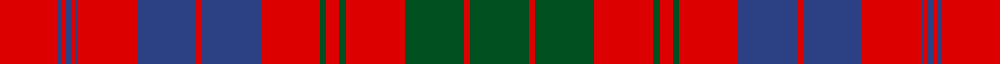

In pattern [GRGRGRGRBRBRBRBRBR](/stripes/grgrgrgrbrbrbrbrbr/).

This was sourced from register-of-tartans.  It is a [18 stripe tartan](/stripes/stripes18/).

Original link https://www.tartanregister.gov.uk/tartanDetails.aspx?ref=3556

## Also known as

This cloth is also recorded under:

- Ross #5

## Register references

External register numbers recorded for this tartan.

- Scottish Register of Tartans: [3556](https://www.tartanregister.gov.uk/tartanDetails.aspx?ref=3556)
- Scottish Tartans World Register: 882

## Thread count
R/36 B2 R2 B4 R2 B2 R36 B36 R4 B36 R36 G4 R8 G4 R36 G36 R4 G/36

## Palette
Each colour and the base-6 reference it is a variant of.

| Colour | Shade | Base |
|---|---|---|
| B | <code style="background-color:#2C4084;">#2C4084</code> `oklch(39.4% 0.117 268.3)` <small>#2C4084</small> | B <code style="background-color:#2A418A;">#2A418A</code> |
| G | <code style="background-color:#005020;">#005020</code> `oklch(37.7% 0.105 149.6)` <small>#005020</small> | G <code style="background-color:#006100;">#006100</code> |
| R | <code style="background-color:#DC0000;">#DC0000</code> `oklch(56.2% 0.230 29.2)` <small>#DC0000</small> | R <code style="background-color:#CC0000;">#CC0000</code> |

## Nearest tartans

The nearest existing variants by ΔTartan distance.

1. [MacTier of Durris](/setts/s18/r18db2r1db2r1db1r18db18r2db18r18g2r4g2r18g18r2g9~x2/) — ΔT 0.32
1. [Ross](/setts/s18/r18db1r1db2r1db1r18db18r2db18r18g2r4g2r18g18r2g9~x4/) — ΔT 0.34
1. [Ross](/setts/s20/db18r2db18r18dg2r4dg2r18dg18r2dg18r2dg18r18db1r1db2r1db1r18~x2/) — ΔT 0.55
1. [Ross 6](/setts/s18/r18db1r1db2r1db1r18db18r2db18r18g2r4g2r18g18r2g18~x2/) — ΔT 0.56
1. [Murray of Tullibardine (plaid)](/setts/s21/db4r1db1r4db12r4db1r1dg4r1db1r26db26r4dg4r26dg21r13db6r5dg1~x2/) — ΔT 0.93
1. [Murray of Tullibardine 4](/setts/s21/db4r1db1r4db12r4db1r1g4r1db1r26db26r4g4r26g21r13db6r5g1~x2/) — ΔT 0.98
1. [Ross #8](/setts/s25/r14db1r1db2r1db1r10dg10r2dg10r2dg10r10dg2r6dg2r10db10r2db10r2db10r10dg2r6~x2/) — ΔT 0.98
1. [Ross #4](/setts/s27/dg18r2dg18r18dg2r4dg2r18db18r2db18r18db1r1db2r1db1r18db1r1db2r1db1r18dg18r2dg18~x2/) — ΔT 1.00
1. [Campbell of Loudoun, Plaid](/setts/s25/db3r1db1r3db9r3db1r1db3r1db1r18db14r3db1r1db1r3g4r14g10r10db5r4db1~x2/) — ΔT 1.02
1. [MacLeod Red](/setts/s21/db4r1db1r2db11r2db1r1ly1r1db1r16db8r4g4r16g11r8db4r2ly2~x2/) — ΔT 1.02

## Neighbour map

Every grey dot is one of 14299 variants placed by the first two principal components of the ΔTartan feature space (44% of its variance). Red is this tartan; blue dots are its nearest — click one to open its page.

<svg viewBox="0 0 640 380" role="img" style="max-width:100%;height:auto;border:1px solid #e0e0e0;border-radius:4px;display:block" xmlns="http://www.w3.org/2000/svg"><image href="/nn/cloud.v1.png" width="640" height="380"/><a href="/setts/s18/r18db2r1db2r1db1r18db18r2db18r18g2r4g2r18g18r2g9~x2/"><circle cx="330.1" cy="149.7" r="4" fill="#3465a4"><title>MacTier of Durris</title></circle></a><a href="/setts/s18/r18db1r1db2r1db1r18db18r2db18r18g2r4g2r18g18r2g9~x4/"><circle cx="333.0" cy="148.8" r="4" fill="#3465a4"><title>Ross</title></circle></a><a href="/setts/s20/db18r2db18r18dg2r4dg2r18dg18r2dg18r2dg18r18db1r1db2r1db1r18~x2/"><circle cx="287.6" cy="146.2" r="4" fill="#3465a4"><title>Ross</title></circle></a><a href="/setts/s18/r18db1r1db2r1db1r18db18r2db18r18g2r4g2r18g18r2g18~x2/"><circle cx="316.1" cy="153.1" r="4" fill="#3465a4"><title>Ross 6</title></circle></a><a href="/setts/s21/db4r1db1r4db12r4db1r1dg4r1db1r26db26r4dg4r26dg21r13db6r5dg1~x2/"><circle cx="344.0" cy="112.9" r="4" fill="#3465a4"><title>Murray of Tullibardine (plaid)</title></circle></a><a href="/setts/s21/db4r1db1r4db12r4db1r1g4r1db1r26db26r4g4r26g21r13db6r5g1~x2/"><circle cx="350.8" cy="119.5" r="4" fill="#3465a4"><title>Murray of Tullibardine 4</title></circle></a><a href="/setts/s25/r14db1r1db2r1db1r10dg10r2dg10r2dg10r10dg2r6dg2r10db10r2db10r2db10r10dg2r6~x2/"><circle cx="289.7" cy="157.1" r="4" fill="#3465a4"><title>Ross #8</title></circle></a><a href="/setts/s27/dg18r2dg18r18dg2r4dg2r18db18r2db18r18db1r1db2r1db1r18db1r1db2r1db1r18dg18r2dg18~x2/"><circle cx="291.0" cy="127.5" r="4" fill="#3465a4"><title>Ross #4</title></circle></a><a href="/setts/s25/db3r1db1r3db9r3db1r1db3r1db1r18db14r3db1r1db1r3g4r14g10r10db5r4db1~x2/"><circle cx="352.2" cy="131.9" r="4" fill="#3465a4"><title>Campbell of Loudoun, Plaid</title></circle></a><a href="/setts/s21/db4r1db1r2db11r2db1r1ly1r1db1r16db8r4g4r16g11r8db4r2ly2~x2/"><circle cx="300.6" cy="120.6" r="4" fill="#3465a4"><title>MacLeod Red</title></circle></a><circle cx="311.9" cy="147.7" r="5" fill="#c00000"/></svg>

ID: /setts/s18/dg18r2dg18r18dg2r4dg2r18db18r2db18r18db1r1db2r1db1r18~x2/
