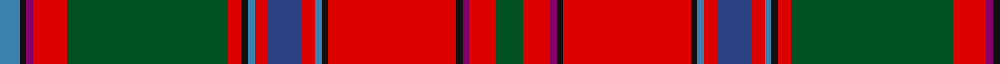

**Bands:** [BKBRGRKBRBRBKRKBRG](/stripes/bkbrgrkbrbrbkrkbrg/) · **Stripes:** [T K DP R DG R K T R DB R T K R K DP R DG](/stripes/stripes18/) T K DP R DG R K T R DB R T K R K DP R DG

This was sourced from register-of-tartans.  It is a [18 band tartan](/bands/bands18/).

Original link https://www.tartanregister.gov.uk/tartanDetails.aspx?ref=1028

## Register references

External register numbers recorded for this tartan.

- Scottish Register of Tartans: [1028](https://www.tartanregister.gov.uk/tartanDetails.aspx?ref=1028)
- Scottish Tartans World Register: 237

## Thread count
B/6 K2 P2 R10 G48 R4 K2 B2 R4 Ba10 R4 B2 K2 R38 K2 P2 R8 G/8

## Palette
Each colour and its ΔE from the base-6 reference it is a variant of.

| Colour | Shade | Base | ΔE (OKLab) |
|---|---|---|---|
| B | <code style="background-color:#3C82AF;">#3C82AF</code> `#3C82AF` | B <code style="background-color:#2A418A;">#2A418A</code> | 0.19 |
| Ba | <code style="background-color:#2C4084;">#2C4084</code> `#2C4084` | B <code style="background-color:#2A418A;">#2A418A</code> | 0.01 |
| G | <code style="background-color:#005020;">#005020</code> `#005020` | G <code style="background-color:#006100;">#006100</code> | 0.07 |
| K | <code style="background-color:#101010;">#101010</code> `#101010` | K <code style="background-color:#000000;">#000000</code> | 0.17 |
| P | <code style="background-color:#840068;">#840068</code> `#840068` | B <code style="background-color:#2A418A;">#2A418A</code> | 0.19 |
| R | <code style="background-color:#DC0000;">#DC0000</code> `#DC0000` | R <code style="background-color:#CC0000;">#CC0000</code> | 0.03 |

## Nearest tartans

The nearest existing variants by ΔTartan distance.

1. [Dundas, (Red)](/setts/s18/g4r4dp1k1r19k1t1r2db5r2t1k1r2g24r5dp1k1t3~x2/) — ΔT 0.69
1. [Sommerville](/setts/s18/ly2r5r3g54r5g3r5db20r5r3r5g16r2db4r48r6r3w2~x2/) — ΔT 0.72
1. [North West Mounted Police](/setts/s16/r44do3w2g14w2y4r4do2r4y4w2dt12do6r6y7w2~x2/) — ΔT 0.73
1. [MacDougall (Paton)](/setts/s20/w1dp2r1dg22r3dg1r3db9dp2r1dp2dg8r8dg8r1db1r22dp2r2w1~x2/) — ΔT 1.02
1. [MacDougall of MacDougall](/setts/s24/t2dp10r3r4dg72r7dg4r10db24dp6r5r4r5dp7dg24r24dg24r3db3r74dp7r5r6t2~x2/) — ΔT 1.02
1. [Sommerville](/setts/s18/ly2r5r3g54r5g3r5db21r5r3r5g17r2db4r48r5r3w2/) — ΔT 1.04
1. [Birral/Burrell](/setts/s17/t4dp8w2g32w2r8r4dp2r4r8w2dp16r65w2dp8t4w2~x2/) — ΔT 1.05
1. [Birral (Clan)](/setts/s17/r65w2dp8t4w2t4dp8w2g32w2r8r4dp2r4r8w2dp16~x2/) — ΔT 1.05
1. [MacDougall](/setts/s20/lb1r3r1dg23r3dg1r3db6r4r1r4dg6r6dg6r2db1r24r1r1lb1/) — ΔT 1.07
1. [Stewart of Ardshiel - 1816 (Clan)](/setts/s18/dg14r6r2k3r65k2t2r6k34r6t2k2r4dg66r12r2k2t4/) — ΔT 1.14

## Neighbour map

Every grey dot is one of 14313 variants placed by the first two principal components of the ΔTartan feature space (44% of its variance). Red is this tartan; blue dots are its nearest — click one to open its page.

<svg viewBox="0 0 640 380" role="img" style="max-width:100%;height:auto;border:1px solid #e0e0e0;border-radius:4px;display:block" xmlns="http://www.w3.org/2000/svg"><image href="/nn/cloud.v1.png" width="640" height="380"/><a href="/setts/s18/g4r4dp1k1r19k1t1r2db5r2t1k1r2g24r5dp1k1t3~x2/"><circle cx="247.0" cy="55.7" r="4" fill="#3465a4"><title>Dundas, (Red)</title></circle></a><a href="/setts/s18/ly2r5r3g54r5g3r5db20r5r3r5g16r2db4r48r6r3w2~x2/"><circle cx="232.1" cy="54.9" r="4" fill="#3465a4"><title>Sommerville</title></circle></a><a href="/setts/s16/r44do3w2g14w2y4r4do2r4y4w2dt12do6r6y7w2~x2/"><circle cx="259.1" cy="71.0" r="4" fill="#3465a4"><title>North West Mounted Police</title></circle></a><a href="/setts/s20/w1dp2r1dg22r3dg1r3db9dp2r1dp2dg8r8dg8r1db1r22dp2r2w1~x2/"><circle cx="251.0" cy="81.0" r="4" fill="#3465a4"><title>MacDougall (Paton)</title></circle></a><a href="/setts/s24/t2dp10r3r4dg72r7dg4r10db24dp6r5r4r5dp7dg24r24dg24r3db3r74dp7r5r6t2~x2/"><circle cx="250.1" cy="36.3" r="4" fill="#3465a4"><title>MacDougall of MacDougall</title></circle></a><a href="/setts/s18/ly2r5r3g54r5g3r5db21r5r3r5g17r2db4r48r5r3w2/"><circle cx="240.2" cy="59.4" r="4" fill="#3465a4"><title>Sommerville</title></circle></a><a href="/setts/s17/t4dp8w2g32w2r8r4dp2r4r8w2dp16r65w2dp8t4w2~x2/"><circle cx="270.1" cy="36.3" r="4" fill="#3465a4"><title>Birral/Burrell</title></circle></a><a href="/setts/s17/r65w2dp8t4w2t4dp8w2g32w2r8r4dp2r4r8w2dp16~x2/"><circle cx="270.1" cy="36.3" r="4" fill="#3465a4"><title>Birral (Clan)</title></circle></a><a href="/setts/s20/lb1r3r1dg23r3dg1r3db6r4r1r4dg6r6dg6r2db1r24r1r1lb1/"><circle cx="255.6" cy="69.4" r="4" fill="#3465a4"><title>MacDougall</title></circle></a><a href="/setts/s18/dg14r6r2k3r65k2t2r6k34r6t2k2r4dg66r12r2k2t4/"><circle cx="276.1" cy="55.8" r="4" fill="#3465a4"><title>Stewart of Ardshiel - 1816 (Clan)</title></circle></a><circle cx="258.0" cy="58.0" r="5" fill="#c00000"/></svg>

ID: /setts/s18/dg4r4dp1k1r19k1t1r2db5r2t1k1r2dg24r5dp1k1t3~x2/
