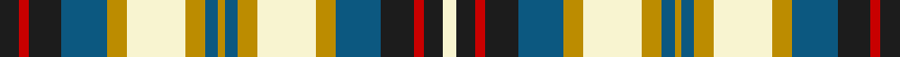

This page is one **sett** — a single exact thread-count. It belongs to the [tartan](/tartans/k6r3k10b14dy6ly18dy6b4dy2b4dy6ly18dy6b14k10r3k6ly4/)
(the same proportion at any scale), whose colour order is pattern [BRBBYWYBYBYWYBBRBW](/stripes/brbbywybybywybbrbw/).

Sourced from register-of-tartans.  It is a [18 stripe tartan](/stripes/stripes18/).

Original link https://www.tartanregister.gov.uk/tartanDetails.aspx?ref=1519

## Register references

External register numbers recorded for this tartan.

- Scottish Register of Tartans: [1519](https://www.tartanregister.gov.uk/tartanDetails.aspx?ref=1519)
- Scottish Tartans Authority (ITI): 1808
- Scottish Tartans World Register: 1808

## Thread count
K/12 R6 K20 B28 DY12 LY36 DY12 B8 DY4 B8 DY12 LY36 DY12 B28 K20 R6 K12 LY/8

## Palette
Each colour and the base-6 reference it is a variant of.

| Colour | Shade | Base |
|---|---|---|
| B | <code style="background-color:#0C5880;">#0C5880</code> `oklch(43.9% 0.094 239.1)` <small>#0C5880</small> | B <code style="background-color:#2A418A;">#2A418A</code> |
| DG | <code style="background-color:#003820;">#003820</code> `oklch(30.0% 0.070 158.3)` <small>#003820</small> | G <code style="background-color:#006100;">#006100</code> |
| DR | <code style="background-color:#880000;">#880000</code> `oklch(39.4% 0.162 29.2)` <small>#880000</small> | R <code style="background-color:#CC0000;">#CC0000</code> |
| DY | <code style="background-color:#BC8C00;">#BC8C00</code> `oklch(66.8% 0.137 84.1)` <small>#BC8C00</small> | Y <code style="background-color:#F2BF00;">#F2BF00</code> |
| G | <code style="background-color:#006818;">#006818</code> `oklch(45.0% 0.142 145.0)` <small>#006818</small> | G <code style="background-color:#006100;">#006100</code> |
| K | <code style="background-color:#1C1C1C;">#1C1C1C</code> `oklch(22.6% 0.000 89.9)` <small>#1C1C1C</small> | B <code style="background-color:#2A418A;">#2A418A</code> |
| LY | <code style="background-color:#F8F4D0;">#F8F4D0</code> `oklch(96.1% 0.047 102.0)` <small>#F8F4D0</small> | W <code style="background-color:#F7F7F7;">#F7F7F7</code> |
| R | <code style="background-color:#C80000;">#C80000</code> `oklch(52.3% 0.215 29.2)` <small>#C80000</small> | R <code style="background-color:#CC0000;">#CC0000</code> |
| Y | <code style="background-color:#E8C000;">#E8C000</code> `oklch(81.9% 0.168 93.7)` <small>#E8C000</small> | Y <code style="background-color:#F2BF00;">#F2BF00</code> |

## Nearest tartans

The nearest existing variants by ΔTartan distance, with this tartan at the top so the swatches line up against it.

ΔTartan

Tartan

Sett

—

<a href="/ttd/edit/#slug=dt6r3dt10n14lo6w18lo6n4lo2n4lo6w18lo6n14dt10r3dt6w4~x2">Gray, Hamilton John</a> <a class="nn-out" href="/setts/s18/dt6r3dt10n14lo6w18lo6n4lo2n4lo6w18lo6n14dt10r3dt6w4~x2/" title="open its dictionary page">↗</a>

1.06

<a href="/ttd/edit/#slug=w2db1w12db2w2k8db8k2db2k2db8k8ly8k2ly8k8w2db2w12db1w2~x2">Gordon Dress (Clan)</a> <a class="nn-out" href="/setts/s21/w2db1w12db2w2k8db8k2db2k2db8k8ly8k2ly8k8w2db2w12db1w2~x2/" title="open its dictionary page">↗</a>

1.10

<a href="/ttd/edit/#slug=w9r2w2r6w14r2k14g14r6g2r2g8ly3~x2">Valley of the Green #2</a> <a class="nn-out" href="/setts/s13/w9r2w2r6w14r2k14g14r6g2r2g8ly3~x2/" title="open its dictionary page">↗</a>

1.12

<a href="/ttd/edit/#slug=w5db2w17db5w5db9g12r3g12k9db11r3~x2">Murray, dress White</a> <a class="nn-out" href="/setts/s12/w5db2w17db5w5db9g12r3g12k9db11r3~x2/" title="open its dictionary page">↗</a>

1.13

<a href="/ttd/edit/#slug=db2k1db6k1r5ly3r5k2w3k2w9k1w2k1ly2~x2">Unidentified #11</a> <a class="nn-out" href="/setts/s15/db2k1db6k1r5ly3r5k2w3k2w9k1w2k1ly2~x2/" title="open its dictionary page">↗</a>

1.16

<a href="/ttd/edit/#slug=w5db2w1g8w1db2m2w1m2db2w1lo8w1db2w5~x2">Wombles Corporate Tartan Tartan Number: 1783. Earliest known date: pre 2003 Wombles International, of Jacob's Well Mews, London, patented this design which is a variant of the Jacobite tartan. Wombles are television puppet characters. See products available Copyright © Blair Urquhart, Comrie, 2015</a> <a class="nn-out" href="/setts/s15/w5db2w1g8w1db2m2w1m2db2w1lo8w1db2w5~x2/" title="open its dictionary page">↗</a>

1.17

<a href="/ttd/edit/#slug=w18r3w3r10w26r3k26g28r10g3r3g8lo6">Carnegie Dress #2 (Fashion)</a> <a class="nn-out" href="/setts/s13/w18r3w3r10w26r3k26g28r10g3r3g8lo6/" title="open its dictionary page">↗</a>

1.17

<a href="/ttd/edit/#slug=w4t1dg9t9r9t1ly4t1r9t9dg1t1dg1t1dg4t1w4~x2">Alaskan Scottish</a> <a class="nn-out" href="/setts/s17/w4t1dg9t9r9t1ly4t1r9t9dg1t1dg1t1dg4t1w4~x2/" title="open its dictionary page">↗</a>

1.19

<a href="/ttd/edit/#slug=k6dg10w10k2w23db10w2k6ly2k8dg10r12dg4r8w4">Stuart/Stewart variant</a> <a class="nn-out" href="/setts/s15/k6dg10w10k2w23db10w2k6ly2k8dg10r12dg4r8w4/" title="open its dictionary page">↗</a>

1.19

<a href="/setts/s24/db12r2db2r2db2g10w12dy3w12g10db11r2db2~x2/">Idaho</a>

1.20

<a href="/ttd/edit/#slug=k6g10w10k2w23db10w2k6ly2k8g10r12g4r8w4">Stewart, Variant</a> <a class="nn-out" href="/setts/s15/k6g10w10k2w23db10w2k6ly2k8g10r12g4r8w4/" title="open its dictionary page">↗</a>

## Neighbour map

Every grey dot is one of 14299 variants placed by the first two principal components of the ΔTartan feature space (44% of its variance). Red is this tartan; blue dots are its nearest — click one to open its page.

<svg viewBox="0 0 640 380" role="img" style="max-width:100%;height:auto;border:1px solid #e0e0e0;border-radius:4px;display:block" xmlns="http://www.w3.org/2000/svg"><image href="/nn/cloud.v1.png" width="640" height="380"/><a href="/setts/s21/w2db1w12db2w2k8db8k2db2k2db8k8ly8k2ly8k8w2db2w12db1w2~x2/"><circle cx="69.3" cy="110.2" r="4" fill="#3465a4"><title>Gordon Dress (Clan)</title></circle></a><a href="/setts/s13/w9r2w2r6w14r2k14g14r6g2r2g8ly3~x2/"><circle cx="63.5" cy="154.3" r="4" fill="#3465a4"><title>Valley of the Green #2</title></circle></a><a href="/setts/s12/w5db2w17db5w5db9g12r3g12k9db11r3~x2/"><circle cx="48.1" cy="173.5" r="4" fill="#3465a4"><title>Murray, dress White</title></circle></a><a href="/setts/s15/db2k1db6k1r5ly3r5k2w3k2w9k1w2k1ly2~x2/"><circle cx="61.8" cy="134.3" r="4" fill="#3465a4"><title>Unidentified #11</title></circle></a><a href="/setts/s15/w5db2w1g8w1db2m2w1m2db2w1lo8w1db2w5~x2/"><circle cx="90.9" cy="135.8" r="4" fill="#3465a4"><title>Wombles Corporate Tartan Tartan Number: 1783. Earliest known date: pre 2003 Wombles International, of Jacob's Well Mews, London, patented this design which is a variant of the Jacobite tartan. Wombles are television puppet characters. See products available Copyright © Blair Urquhart, Comrie, 2015</title></circle></a><a href="/setts/s13/w18r3w3r10w26r3k26g28r10g3r3g8lo6/"><circle cx="87.6" cy="137.9" r="4" fill="#3465a4"><title>Carnegie Dress #2 (Fashion)</title></circle></a><a href="/setts/s17/w4t1dg9t9r9t1ly4t1r9t9dg1t1dg1t1dg4t1w4~x2/"><circle cx="107.7" cy="130.8" r="4" fill="#3465a4"><title>Alaskan Scottish</title></circle></a><a href="/setts/s15/k6dg10w10k2w23db10w2k6ly2k8dg10r12dg4r8w4/"><circle cx="56.8" cy="120.7" r="4" fill="#3465a4"><title>Stuart/Stewart variant</title></circle></a><a href="/setts/s24/db12r2db2r2db2g10w12dy3w12g10db11r2db2~x2/"><circle cx="60.7" cy="142.7" r="4" fill="#3465a4"><title>Idaho</title></circle></a><a href="/setts/s15/k6g10w10k2w23db10w2k6ly2k8g10r12g4r8w4/"><circle cx="49.1" cy="119.4" r="4" fill="#3465a4"><title>Stewart, Variant</title></circle></a><circle cx="45.1" cy="142.4" r="5" fill="#c00000"/></svg>

ID: /setts/s18/dt6r3dt10n14lo6w18lo6n4lo2n4lo6w18lo6n14dt10r3dt6w4~x2/
