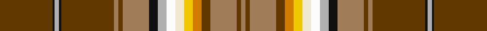

In pattern [GKYKGRGRKYWWYYGRGR](/stripes/gkykgrgrkywwyygrgr/).

This was sourced from register-of-tartans.  It is a [18 stripe tartan](/stripes/stripes18/).

Original link https://www.tartanregister.gov.uk/tartanDetails.aspx?ref=235

## Register references

External register numbers recorded for this tartan.

- Scottish Register of Tartans: [235](https://www.tartanregister.gov.uk/tartanDetails.aspx?ref=235)
- Scottish Tartans Authority (ITI): 6799

## Thread count
Ta/48 K2 N4 K2 Ta48 LT4 Ta4 LT24 K8 N8 Wa8 W8 Y8 O8 Ta8 LT24 Ta4 LT/4

## Palette
Each colour and the base-6 reference it is a variant of.

| Colour | Shade | Base |
|---|---|---|
| K | <code style="background-color:#101010;">#101010</code> `oklch(17.3% 0.000 89.9)` <small>#101010</small> | K <code style="background-color:#000000;">#000000</code> |
| LT | <code style="background-color:#A07C58;">#A07C58</code> `oklch(61.2% 0.067 66.0)` <small>#A07C58</small> | R <code style="background-color:#CC0000;">#CC0000</code> |
| N | <code style="background-color:#B0B0B0;">#B0B0B0</code> `oklch(75.7% 0.000 89.9)` <small>#B0B0B0</small> | Y <code style="background-color:#F2BF00;">#F2BF00</code> |
| O | <code style="background-color:#D07C00;">#D07C00</code> `oklch(66.2% 0.149 64.7)` <small>#D07C00</small> | Y <code style="background-color:#F2BF00;">#F2BF00</code> |
| T | <code style="background-color:#744000;">#744000</code> `oklch(42.6% 0.098 61.8)` <small>#744000</small> | G <code style="background-color:#006100;">#006100</code> |
| Ta | <code style="background-color:#603800;">#603800</code> `oklch(38.1% 0.084 66.7)` <small>#603800</small> | G <code style="background-color:#006100;">#006100</code> |
| W | <code style="background-color:#F0E8D0;">#F0E8D0</code> `oklch(93.1% 0.033 91.7)` <small>#F0E8D0</small> | W <code style="background-color:#F7F7F7;">#F7F7F7</code> |
| Wa | <code style="background-color:#FCFCFC;">#FCFCFC</code> `oklch(99.1% 0.000 89.9)` <small>#FCFCFC</small> | W <code style="background-color:#F7F7F7;">#F7F7F7</code> |
| Y | <code style="background-color:#F0C800;">#F0C800</code> `oklch(84.3% 0.173 94.3)` <small>#F0C800</small> | Y <code style="background-color:#F2BF00;">#F2BF00</code> |

## Nearest tartans

The nearest existing variants by ΔTartan distance.

1. [Bear (Corporate)](/setts/s18/dy24o2dy2o12k4lr4w4w4ly4lo4dy4o12dy2o2dy24k1lr2k1~x2/) — ΔT 0.00
1. [Macan of Lurgyvallan](/setts/s24/r16g1r1g1r1g4k1lb1k1ly1k1t6db4t6k1ly1k1lb1k1g4r12g1r1k1~x4/) — ΔT 1.65
1. [Sellers/Sillars](/setts/s22/dy63k4lb9ly2db4ly2db4dy11r8lb2r4w5~x2/) — ΔT 1.68
1. [Fitzgerald dress](/setts/s25/w2k1r3t3r3r3r12r3r3db3r3db19ly3g19r3db3r3r3r12r3r3t3r3k1w2~x2/) — ΔT 1.68
1. [Campbell, New Louden](/setts/s18/r25w2lo5t2db2lo5w2g12w2m2lo2r5k2r5lo2m2w2lo9~x2/) — ΔT 1.71
1. [Essex County (Ontario)](/setts/s10/ly30k1r4k1g3dg5dg4t6r2lb2~x2/) — ΔT 1.73
1. [MacLean of Duart](/setts/s12/y9t5k8ly2k4w4k4dg31r50t4r4k3~x2/) — ΔT 1.74
1. [Macan, of Lurgyvallan](/setts/s24/r16g1r1g1r1g4k1w1k1ly1k1t6db4t6k1ly1k1w1k1g4r12g1r1k1~x2/) — ΔT 1.74
1. [Campbell, New Louden](/setts/s18/r25w2o5b2db2o5w2g12w2dp2o2r5k2r5o2dp2w2o9~x2/) — ΔT 1.75
1. [Sri Lanka](/setts/s13/lo18r3g30b4k2w2k2b4r37ly1r3ly1r3~x2/) — ΔT 1.76

## Neighbour map

Every grey dot is one of 14299 variants placed by the first two principal components of the ΔTartan feature space (44% of its variance). Red is this tartan; blue dots are its nearest — click one to open its page.

<svg viewBox="0 0 640 380" role="img" style="max-width:100%;height:auto;border:1px solid #e0e0e0;border-radius:4px;display:block" xmlns="http://www.w3.org/2000/svg"><image href="/nn/cloud.v1.png" width="640" height="380"/><a href="/setts/s18/dy24o2dy2o12k4lr4w4w4ly4lo4dy4o12dy2o2dy24k1lr2k1~x2/"><circle cx="212.1" cy="42.7" r="4" fill="#3465a4"><title>Bear (Corporate)</title></circle></a><a href="/setts/s24/r16g1r1g1r1g4k1lb1k1ly1k1t6db4t6k1ly1k1lb1k1g4r12g1r1k1~x4/"><circle cx="186.1" cy="43.6" r="4" fill="#3465a4"><title>Macan of Lurgyvallan</title></circle></a><a href="/setts/s22/dy63k4lb9ly2db4ly2db4dy11r8lb2r4w5~x2/"><circle cx="249.2" cy="14.0" r="4" fill="#3465a4"><title>Sellers/Sillars</title></circle></a><a href="/setts/s25/w2k1r3t3r3r3r12r3r3db3r3db19ly3g19r3db3r3r3r12r3r3t3r3k1w2~x2/"><circle cx="141.4" cy="39.7" r="4" fill="#3465a4"><title>Fitzgerald dress</title></circle></a><a href="/setts/s18/r25w2lo5t2db2lo5w2g12w2m2lo2r5k2r5lo2m2w2lo9~x2/"><circle cx="135.3" cy="53.7" r="4" fill="#3465a4"><title>Campbell, New Louden</title></circle></a><a href="/setts/s10/ly30k1r4k1g3dg5dg4t6r2lb2~x2/"><circle cx="236.2" cy="37.8" r="4" fill="#3465a4"><title>Essex County (Ontario)</title></circle></a><a href="/setts/s12/y9t5k8ly2k4w4k4dg31r50t4r4k3~x2/"><circle cx="200.7" cy="53.5" r="4" fill="#3465a4"><title>MacLean of Duart</title></circle></a><a href="/setts/s24/r16g1r1g1r1g4k1w1k1ly1k1t6db4t6k1ly1k1w1k1g4r12g1r1k1~x2/"><circle cx="169.6" cy="36.8" r="4" fill="#3465a4"><title>Macan, of Lurgyvallan</title></circle></a><a href="/setts/s18/r25w2o5b2db2o5w2g12w2dp2o2r5k2r5o2dp2w2o9~x2/"><circle cx="142.8" cy="58.3" r="4" fill="#3465a4"><title>Campbell, New Louden</title></circle></a><a href="/setts/s13/lo18r3g30b4k2w2k2b4r37ly1r3ly1r3~x2/"><circle cx="238.0" cy="41.3" r="4" fill="#3465a4"><title>Sri Lanka</title></circle></a><circle cx="212.1" cy="42.7" r="5" fill="#c00000"/></svg>

ID: /setts/s18/dy24k1lr2k1dy24o2dy2o12k4lr4w4w4ly4lo4dy4o12dy2o2~x2/
