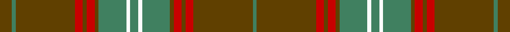

This page is one **sett** — a single exact thread-count. It belongs to the [tartan](/tartans/dy3g1dy15r2dy1r2dy1g7w1g2/)
(the same proportion at any scale), whose colour order is pattern [GGGRGRGGWGWGGRGRGG](/stripes/gggrgrggwgwggrgrgg/).

Sourced from register-of-tartans.  It is a [18 stripe tartan](/stripes/stripes18/).

Original link https://www.tartanregister.gov.uk/tartanDetails.aspx?ref=3771

## Register references

External register numbers recorded for this tartan.

- Scottish Register of Tartans: [3771](https://www.tartanregister.gov.uk/tartanDetails.aspx?ref=3771)
- Scottish Tartans Authority (ITI): 938
- Scottish Tartans World Register: 938

## Thread count
T/12 Ga4 T60 R8 T4 R8 T4 Ga28 W4 Ga8 W4 Ga28 T4 R8 T4 R8 T60 Ga/4

## Palette

Palette: <strong>Tartan Register</strong>
<table><thead><tr><th>Colour</th><th>Threads</th><th>Shade</th><th>Base</th><th>OKLCh</th></tr></thead><tbody><tr><td>T/</td><td style="text-align:right;font-variant-numeric:tabular-nums">12</td><td><code style="background-color:#604000;">#604000</code> <small style="color:#888">#604000</small></td><td>G <code style="background-color:#006100;">#006100</code></td><td><small style="color:#888">oklch(39.8% 0.083 76.8)</small></td></tr><tr><td>Ga</td><td style="text-align:right;font-variant-numeric:tabular-nums">4</td><td><code style="background-color:#408060;">#408060</code> <small style="color:#888">#408060</small></td><td>G <code style="background-color:#006100;">#006100</code></td><td><small style="color:#888">oklch(54.8% 0.084 160.1)</small></td></tr><tr><td>T</td><td style="text-align:right;font-variant-numeric:tabular-nums">60</td><td><code style="background-color:#604000;">#604000</code> <small style="color:#888">#604000</small></td><td>G <code style="background-color:#006100;">#006100</code></td><td><small style="color:#888">oklch(39.8% 0.083 76.8)</small></td></tr><tr><td>R</td><td style="text-align:right;font-variant-numeric:tabular-nums">8</td><td><code style="background-color:#C80000;">#C80000</code> <small style="color:#888">#C80000</small></td><td>R <code style="background-color:#CC0000;">#CC0000</code></td><td><small style="color:#888">oklch(52.3% 0.215 29.2)</small></td></tr><tr><td>T</td><td style="text-align:right;font-variant-numeric:tabular-nums">4</td><td><code style="background-color:#604000;">#604000</code> <small style="color:#888">#604000</small></td><td>G <code style="background-color:#006100;">#006100</code></td><td><small style="color:#888">oklch(39.8% 0.083 76.8)</small></td></tr><tr><td>R</td><td style="text-align:right;font-variant-numeric:tabular-nums">8</td><td><code style="background-color:#C80000;">#C80000</code> <small style="color:#888">#C80000</small></td><td>R <code style="background-color:#CC0000;">#CC0000</code></td><td><small style="color:#888">oklch(52.3% 0.215 29.2)</small></td></tr><tr><td>T</td><td style="text-align:right;font-variant-numeric:tabular-nums">4</td><td><code style="background-color:#604000;">#604000</code> <small style="color:#888">#604000</small></td><td>G <code style="background-color:#006100;">#006100</code></td><td><small style="color:#888">oklch(39.8% 0.083 76.8)</small></td></tr><tr><td>Ga</td><td style="text-align:right;font-variant-numeric:tabular-nums">28</td><td><code style="background-color:#408060;">#408060</code> <small style="color:#888">#408060</small></td><td>G <code style="background-color:#006100;">#006100</code></td><td><small style="color:#888">oklch(54.8% 0.084 160.1)</small></td></tr><tr><td>W</td><td style="text-align:right;font-variant-numeric:tabular-nums">4</td><td><code style="background-color:#FCFCFC;">#FCFCFC</code> <small style="color:#888">#FCFCFC</small></td><td>W <code style="background-color:#F7F7F7;">#F7F7F7</code></td><td><small style="color:#888">oklch(99.1% 0.000 89.9)</small></td></tr><tr><td>Ga</td><td style="text-align:right;font-variant-numeric:tabular-nums">8</td><td><code style="background-color:#408060;">#408060</code> <small style="color:#888">#408060</small></td><td>G <code style="background-color:#006100;">#006100</code></td><td><small style="color:#888">oklch(54.8% 0.084 160.1)</small></td></tr><tr><td>W</td><td style="text-align:right;font-variant-numeric:tabular-nums">4</td><td><code style="background-color:#FCFCFC;">#FCFCFC</code> <small style="color:#888">#FCFCFC</small></td><td>W <code style="background-color:#F7F7F7;">#F7F7F7</code></td><td><small style="color:#888">oklch(99.1% 0.000 89.9)</small></td></tr><tr><td>Ga</td><td style="text-align:right;font-variant-numeric:tabular-nums">28</td><td><code style="background-color:#408060;">#408060</code> <small style="color:#888">#408060</small></td><td>G <code style="background-color:#006100;">#006100</code></td><td><small style="color:#888">oklch(54.8% 0.084 160.1)</small></td></tr><tr><td>T</td><td style="text-align:right;font-variant-numeric:tabular-nums">4</td><td><code style="background-color:#604000;">#604000</code> <small style="color:#888">#604000</small></td><td>G <code style="background-color:#006100;">#006100</code></td><td><small style="color:#888">oklch(39.8% 0.083 76.8)</small></td></tr><tr><td>R</td><td style="text-align:right;font-variant-numeric:tabular-nums">8</td><td><code style="background-color:#C80000;">#C80000</code> <small style="color:#888">#C80000</small></td><td>R <code style="background-color:#CC0000;">#CC0000</code></td><td><small style="color:#888">oklch(52.3% 0.215 29.2)</small></td></tr><tr><td>T</td><td style="text-align:right;font-variant-numeric:tabular-nums">4</td><td><code style="background-color:#604000;">#604000</code> <small style="color:#888">#604000</small></td><td>G <code style="background-color:#006100;">#006100</code></td><td><small style="color:#888">oklch(39.8% 0.083 76.8)</small></td></tr><tr><td>R</td><td style="text-align:right;font-variant-numeric:tabular-nums">8</td><td><code style="background-color:#C80000;">#C80000</code> <small style="color:#888">#C80000</small></td><td>R <code style="background-color:#CC0000;">#CC0000</code></td><td><small style="color:#888">oklch(52.3% 0.215 29.2)</small></td></tr><tr><td>T</td><td style="text-align:right;font-variant-numeric:tabular-nums">60</td><td><code style="background-color:#604000;">#604000</code> <small style="color:#888">#604000</small></td><td>G <code style="background-color:#006100;">#006100</code></td><td><small style="color:#888">oklch(39.8% 0.083 76.8)</small></td></tr><tr><td>Ga/</td><td style="text-align:right;font-variant-numeric:tabular-nums">4</td><td><code style="background-color:#408060;">#408060</code> <small style="color:#888">#408060</small></td><td>G <code style="background-color:#006100;">#006100</code></td><td><small style="color:#888">oklch(54.8% 0.084 160.1)</small></td></tr></tbody></table>

## Nearest tartans

The nearest existing variants by ΔTartan distance, with this tartan at the top so the swatches line up against it.

ΔTartan

Tartan

Sett

—

<a href="/ttd/edit/#slug=dy3g1dy15r2dy1r2dy1g7w1g2~x4">Seton Hunting</a> <a class="nn-out" href="/setts/s18/dy3g1dy15r2dy1r2dy1g7w1g2~x4/" title="open its dictionary page">↗</a>

1.20

<a href="/ttd/edit/#slug=dy3g1dy15r2dy1r2dy1g7w1g2~x4">Seton Htg (Clan)</a> <a class="nn-out" href="/setts/s10/dy3g1dy15r2dy1r2dy1g7w1g2~x4/" title="open its dictionary page">↗</a>

1.47

<a href="/ttd/edit/#slug=r12g1dg3g20t1g1t3g1t1g20dg3g1r12lo3~x4">Manitoba Province</a> <a class="nn-out" href="/setts/s14/r12g1dg3g20t1g1t3g1t1g20dg3g1r12lo3~x4/" title="open its dictionary page">↗</a>

1.50

<a href="/setts/s22/g10k1g10r1g1k1g1k1r10k1lo1k1~x4/">Ulster (Red)</a>

1.52

<a href="/ttd/edit/#slug=g8ly2dy4dp4g3dp4dy42g4r3g4dy4dp5r3">Sarna (District)</a> <a class="nn-out" href="/setts/s13/g8ly2dy4dp4g3dp4dy42g4r3g4dy4dp5r3/" title="open its dictionary page">↗</a>

1.53

<a href="/setts/s12/r4lo27dy9w2b2dy2b4~x3/">Unidentified #25</a>

1.56

<a href="/ttd/edit/#slug=g8ly2o4p4g3p4o42g4r3g4o4p5r3">Sarna</a> <a class="nn-out" href="/setts/s13/g8ly2o4p4g3p4o42g4r3g4o4p5r3/" title="open its dictionary page">↗</a>

1.61

<a href="/ttd/edit/#slug=o8db3o3g20o3g3o3db6o3b3o20db3o3db2o6~x2">Glenfarclas Distillery</a> <a class="nn-out" href="/setts/s15/o8db3o3g20o3g3o3db6o3b3o20db3o3db2o6~x2/" title="open its dictionary page">↗</a>

1.62

<a href="/ttd/edit/#slug=y16dp6y6dt46y5dt8y5dp10y6lo8y48dp6y6dp6y16">Aberlour Bicentenary</a> <a class="nn-out" href="/setts/s15/y16dp6y6dt46y5dt8y5dp10y6lo8y48dp6y6dp6y16/" title="open its dictionary page">↗</a>

1.63

<a href="/ttd/edit/#slug=dg3r1r2dg2r16lb1db4r3dg13r1db1r1r3~x2">MacDonald of Glencoe</a> <a class="nn-out" href="/setts/s13/dg3r1r2dg2r16lb1db4r3dg13r1db1r1r3~x2/" title="open its dictionary page">↗</a>

1.64

<a href="/ttd/edit/#slug=g10k1g10r1g1k1g1k1r10k1lo1k1~x4">Ulster Red (District)</a> <a class="nn-out" href="/setts/s12/g10k1g10r1g1k1g1k1r10k1lo1k1~x4/" title="open its dictionary page">↗</a>

## Neighbour map

Every grey dot is one of 14299 variants placed by the first two principal components of the ΔTartan feature space (44% of its variance). Red is this tartan; blue dots are its nearest — click one to open its page.

<svg viewBox="0 0 640 380" role="img" style="max-width:100%;height:auto;border:1px solid #e0e0e0;border-radius:4px;display:block" xmlns="http://www.w3.org/2000/svg"><image href="/nn/cloud.v1.png" width="640" height="380"/><a href="/setts/s10/dy3g1dy15r2dy1r2dy1g7w1g2~x4/"><circle cx="391.9" cy="175.8" r="4" fill="#3465a4"><title>Seton Htg (Clan)</title></circle></a><a href="/setts/s14/r12g1dg3g20t1g1t3g1t1g20dg3g1r12lo3~x4/"><circle cx="350.3" cy="144.8" r="4" fill="#3465a4"><title>Manitoba Province</title></circle></a><a href="/setts/s22/g10k1g10r1g1k1g1k1r10k1lo1k1~x4/"><circle cx="304.2" cy="146.6" r="4" fill="#3465a4"><title>Ulster (Red)</title></circle></a><a href="/setts/s13/g8ly2dy4dp4g3dp4dy42g4r3g4dy4dp5r3/"><circle cx="388.2" cy="129.8" r="4" fill="#3465a4"><title>Sarna (District)</title></circle></a><a href="/setts/s12/r4lo27dy9w2b2dy2b4~x3/"><circle cx="358.3" cy="147.9" r="4" fill="#3465a4"><title>Unidentified #25</title></circle></a><a href="/setts/s13/g8ly2o4p4g3p4o42g4r3g4o4p5r3/"><circle cx="379.8" cy="121.9" r="4" fill="#3465a4"><title>Sarna</title></circle></a><a href="/setts/s15/o8db3o3g20o3g3o3db6o3b3o20db3o3db2o6~x2/"><circle cx="333.7" cy="186.8" r="4" fill="#3465a4"><title>Glenfarclas Distillery</title></circle></a><a href="/setts/s15/y16dp6y6dt46y5dt8y5dp10y6lo8y48dp6y6dp6y16/"><circle cx="350.9" cy="197.3" r="4" fill="#3465a4"><title>Aberlour Bicentenary</title></circle></a><a href="/setts/s13/dg3r1r2dg2r16lb1db4r3dg13r1db1r1r3~x2/"><circle cx="320.8" cy="138.4" r="4" fill="#3465a4"><title>MacDonald of Glencoe</title></circle></a><a href="/setts/s12/g10k1g10r1g1k1g1k1r10k1lo1k1~x4/"><circle cx="344.8" cy="177.8" r="4" fill="#3465a4"><title>Ulster Red (District)</title></circle></a><circle cx="375.8" cy="148.1" r="5" fill="#c00000"/></svg>

ID: /setts/s18/dy3g1dy15r2dy1r2dy1g7w1g2~x4/
