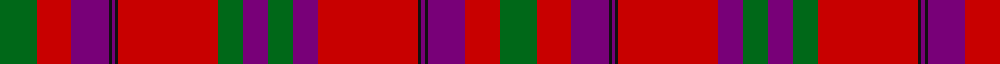

**Bands:** [GRBKBKRGBGBRKBKBRG](/stripes/grbkbkrgbgbrkbkbrg/) · **Stripes:** [G R DP K DP K R G DP G DP R K DP K DP R G](/stripes/stripes18/) G R DP K DP K R G DP G DP R K DP K DP R G

This was sourced from register-of-tartans.  It is a [18 band tartan](/bands/bands18/).

Original link https://www.tartanregister.gov.uk/tartanDetails.aspx?ref=1176

## Also known as

This cloth is also recorded under:

- Fiddes #3

## Attestations

This cloth appears in 3 source records; the oldest owns this page.

- 01/01/1790 — Fiddes #3 (register-of-tartans, [record](https://www.tartanregister.gov.uk/tartanDetails.aspx?ref=1176))
- 1790s — Fiddes - 1790 (Clan) (tartans-authority, [record](http://www.tartansauthority.com/tartan-ferret/display/836/))
- undated — Fiddes Family Tartan Tartan Number: 836. Earliest known date: 1800 Unusual sett from Wilsons of Bannockburn See products available Copyright © Blair Urquhart, Comrie, 2015 (house-of-tartan, [record](http://www.house-of-tartan.scotland.net/house/TartanViewjs.asp?colr=Def&tnam=836))

## Register references

External register numbers recorded for this tartan.

- Scottish Register of Tartans: [1176](https://www.tartanregister.gov.uk/tartanDetails.aspx?ref=1176)
- Scottish Tartans Authority (ITI): 836
- Scottish Tartans World Register: 836

## Thread count
G/24 R22 P24 K2 P2 K2 R64 G16 P16 G16 P16 R64 K2 P2 K2 P24 R22 G/24

## Palette
Each colour and its ΔE from the base-6 reference it is a variant of.

| Colour | Shade | Base | ΔE (OKLab) |
|---|---|---|---|
| G | <code style="background-color:#006818;">#006818</code> `#006818` | G <code style="background-color:#006100;">#006100</code> | 0.02 |
| K | <code style="background-color:#101010;">#101010</code> `#101010` | K <code style="background-color:#000000;">#000000</code> | 0.17 |
| P | <code style="background-color:#780078;">#780078</code> `#780078` | B <code style="background-color:#2A418A;">#2A418A</code> | 0.17 |
| R | <code style="background-color:#C80000;">#C80000</code> `#C80000` | R <code style="background-color:#CC0000;">#CC0000</code> | 0.01 |

## Nearest tartans

The nearest existing variants by ΔTartan distance.

1. [Fiddes](/setts/s18/g12r11p12k1p1k1r32g8p8g8p8r32k1p1k1p12r11g12~x2/) — ΔT 0.44
1. [MacCoul Clan Tartan Tartan Number: 1635. Earliest known date: 1850 This plate is taken from the manuscript of William and Andrew Smith's 'Authenticated Tartans of the Clans and Families of Scotland'. The Smith's sources included the findings of George Hunter, an Army clothier, who toured the Highlands in search of old tartans prior to 1822. See products available Copyright © Blair Urquhart, Comrie, 2015](/setts/s18/r12m2r2g2r4g2r4db12m6r2m6g12r12g12r2db1r36m4~x2/) — ΔT 0.88
1. [MacCoul](/setts/s18/r12r2r2dg2r4dg2r4dp12r6r2r6dg12r12dg12r2dp1r36r4~x2/) — ΔT 0.95
1. [MacCoul](/setts/s18/r12r2r2g2r4g2r4db12r6r2r6g12r12g12r2db1r36r4~x2/) — ΔT 1.03
1. [Murray of Tullibardine - 1820 (Clan)](/setts/s21/db7r2db2r5db24r6db2r2k8r2db2r50db50r10g10r50g50r30db22r24k3/) — ΔT 1.07
1. [MacDougal 4](/setts/s11/p4g8db6p8r6g2r2g2r24g1r3~x2/) — ΔT 1.15
1. [MacDougall](/setts/s22/r6g12r2db1r36r4r36db1r2g12r12g12r6r2r6db12r4g2r4g36r2r2~x4/) — ΔT 1.24
1. [MacDougall](/setts/s11/dp4dg8db6dp8r6dg2r2dg2r24dg1r3~x2/) — ΔT 1.29
1. [Murray of Tullibardine (plaid)](/setts/s21/db4r1db1r4db12r4db1r1dg4r1db1r26db26r4dg4r26dg21r13db6r5dg1~x2/) — ΔT 1.30
1. [Murray of Tullibardine #2](/setts/s21/db2r1db1r2db4r2db1r1k2r1db1r24db12r2dg2r8dg12r4db2r2k1~x2/) — ΔT 1.34

## Neighbour map

Every grey dot is one of 14299 variants placed by the first two principal components of the ΔTartan feature space (44% of its variance). Red is this tartan; blue dots are its nearest — click one to open its page.

<svg viewBox="0 0 640 380" role="img" style="max-width:100%;height:auto;border:1px solid #e0e0e0;border-radius:4px;display:block" xmlns="http://www.w3.org/2000/svg"><image href="/nn/cloud.v1.png" width="640" height="380"/><a href="/setts/s18/g12r11p12k1p1k1r32g8p8g8p8r32k1p1k1p12r11g12~x2/"><circle cx="317.2" cy="106.0" r="4" fill="#3465a4"><title>Fiddes</title></circle></a><a href="/setts/s18/r12m2r2g2r4g2r4db12m6r2m6g12r12g12r2db1r36m4~x2/"><circle cx="380.9" cy="103.8" r="4" fill="#3465a4"><title>MacCoul Clan Tartan Tartan Number: 1635. Earliest known date: 1850 This plate is taken from the manuscript of William and Andrew Smith's 'Authenticated Tartans of the Clans and Families of Scotland'. The Smith's sources included the findings of George Hunter, an Army clothier, who toured the Highlands in search of old tartans prior to 1822. See products available Copyright © Blair Urquhart, Comrie, 2015</title></circle></a><a href="/setts/s18/r12r2r2dg2r4dg2r4dp12r6r2r6dg12r12dg12r2dp1r36r4~x2/"><circle cx="380.0" cy="101.4" r="4" fill="#3465a4"><title>MacCoul</title></circle></a><a href="/setts/s18/r12r2r2g2r4g2r4db12r6r2r6g12r12g12r2db1r36r4~x2/"><circle cx="380.6" cy="105.4" r="4" fill="#3465a4"><title>MacCoul</title></circle></a><a href="/setts/s21/db7r2db2r5db24r6db2r2k8r2db2r50db50r10g10r50g50r30db22r24k3/"><circle cx="310.3" cy="106.2" r="4" fill="#3465a4"><title>Murray of Tullibardine - 1820 (Clan)</title></circle></a><a href="/setts/s11/p4g8db6p8r6g2r2g2r24g1r3~x2/"><circle cx="342.9" cy="137.3" r="4" fill="#3465a4"><title>MacDougal 4</title></circle></a><a href="/setts/s22/r6g12r2db1r36r4r36db1r2g12r12g12r6r2r6db12r4g2r4g36r2r2~x4/"><circle cx="350.3" cy="91.1" r="4" fill="#3465a4"><title>MacDougall</title></circle></a><a href="/setts/s11/dp4dg8db6dp8r6dg2r2dg2r24dg1r3~x2/"><circle cx="328.5" cy="128.7" r="4" fill="#3465a4"><title>MacDougall</title></circle></a><a href="/setts/s21/db4r1db1r4db12r4db1r1dg4r1db1r26db26r4dg4r26dg21r13db6r5dg1~x2/"><circle cx="344.0" cy="112.9" r="4" fill="#3465a4"><title>Murray of Tullibardine (plaid)</title></circle></a><a href="/setts/s21/db2r1db1r2db4r2db1r1k2r1db1r24db12r2dg2r8dg12r4db2r2k1~x2/"><circle cx="343.0" cy="85.4" r="4" fill="#3465a4"><title>Murray of Tullibardine #2</title></circle></a><circle cx="329.9" cy="111.8" r="5" fill="#c00000"/></svg>

ID: /setts/s18/g12r11dp12k1dp1k1r32dp8g8dp8g8r32k1dp1k1dp12r11g12~x2/
