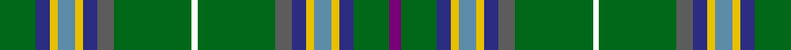

In pattern [BGBYBYBBGWGBBYBYBG](/stripes/bgbybybbgwgbbybybg/).

This was sourced from register-of-tartans.  It is a [18 stripe tartan](/stripes/stripes18/).

Original link https://www.tartanregister.gov.uk/tartanDetails.aspx?ref=1710

## Register references

External register numbers recorded for this tartan.

- Scottish Register of Tartans: [1710](https://www.tartanregister.gov.uk/tartanDetails.aspx?ref=1710)
- Scottish Tartans Authority (ITI): 5187

## Thread count
G/26 DB10 Y6 B12 Y6 DB10 N12 G56 W4 G56 N12 DB10 Y6 B12 Y6 DB10 G26 P/8

## Palette
Each colour and the base-6 reference it is a variant of.

| Colour | Shade | Base |
|---|---|---|
| B | <code style="background-color:#5C8CA8;">#5C8CA8</code> `oklch(61.7% 0.067 235.0)` <small>#5C8CA8</small> | B <code style="background-color:#2A418A;">#2A418A</code> |
| DB | <code style="background-color:#2C2C80;">#2C2C80</code> `oklch(35.0% 0.138 276.6)` <small>#2C2C80</small> | B <code style="background-color:#2A418A;">#2A418A</code> |
| G | <code style="background-color:#006818;">#006818</code> `oklch(45.0% 0.142 145.0)` <small>#006818</small> | G <code style="background-color:#006100;">#006100</code> |
| N | <code style="background-color:#5C5C5C;">#5C5C5C</code> `oklch(47.5% 0.000 89.9)` <small>#5C5C5C</small> | B <code style="background-color:#2A418A;">#2A418A</code> |
| P | <code style="background-color:#780078;">#780078</code> `oklch(40.2% 0.185 328.4)` <small>#780078</small> | B <code style="background-color:#2A418A;">#2A418A</code> |
| W | <code style="background-color:#FCFCFC;">#FCFCFC</code> `oklch(99.1% 0.000 89.9)` <small>#FCFCFC</small> | W <code style="background-color:#F7F7F7;">#F7F7F7</code> |
| Wa | <code style="background-color:#FCFCFC;">#FCFCFC</code> `oklch(99.1% 0.000 89.9)` <small>#FCFCFC</small> | W <code style="background-color:#F7F7F7;">#F7F7F7</code> |
| Y | <code style="background-color:#E8C000;">#E8C000</code> `oklch(81.9% 0.168 93.7)` <small>#E8C000</small> | Y <code style="background-color:#F2BF00;">#F2BF00</code> |

## Nearest tartans

The nearest existing variants by ΔTartan distance.

1. [Rooney (Personal)](/setts/s18/y36g12y4g72k4g13k36r4k4ly4k36g13k4g72y4g12y36w4/) — ΔT 1.25
1. [Highland, Green (Corporate)](/setts/s10/dp4g13db5ly3t6ly3db5n6g28w2~x2/) — ΔT 1.27
1. [Lyons Tartan Tartan Number: 6515. Earliest known date: 2002 Designed by Linda Clifford of Bethel, Maine for Christina Lyons in honour of her parents Golden Wedding Anniversary in February 2003. The tartan combines two shades of green for the Irish side of the family and red and white for the Croatian side (her mother). Woven by Strathmore Woollen Co., of Forfar, Scotland. See products available Copyright © Blair Urquhart, Comrie, 2015](/setts/s18/t9db3g11k7g3k3g32r3w3r7~x2/) — ΔT 1.35
1. [Myron Family Tartan Tartan Number: 1105. Earliest known date: pre 2003 Designed for the town celebrations of 1958-59 by G. Lawson of the Musselburgh Co-operative Society. See products available Copyright © Blair Urquhart, Comrie, 2015](/setts/s17/k3g3r2g3ly2g2ly2g11db3k3db3k3db3k3db3g20r3~x2/) — ΔT 1.35
1. [Kennedy (Clan)](/setts/s17/r3g24dt4k3dt3k3dt3k3dt4g12dp2g2dp2g3lo2g2k2~x2/) — ΔT 1.44
1. [Field Gun Association](/setts/s13/r2dg12g3dg2g2dg2g16t4dg12w1g8dg14ly2~x2/) — ΔT 1.47
1. [Duncan of Sketraw](/setts/s17/r2k6g2k2g14k1ly2k1b5r1b5k1w2k1g14k1b2~x2/) — ΔT 1.50
1. [Walsh](/setts/s12/w1g12dg1k2b2k1dg16r1dg16g1k1ly1~x2/) — ΔT 1.60
1. [MacClure Htg (Name)](/setts/s12/k2w1g2dy6g2dt4g2k2g15r2g2k1~x4/) — ΔT 1.61
1. [Stewart (King George VI)](/setts/s14/r2g11g2b2k3lo1k1lr1k1g4r2k1r2lr1~x4/) — ΔT 1.62

## Neighbour map

Every grey dot is one of 14299 variants placed by the first two principal components of the ΔTartan feature space (44% of its variance). Red is this tartan; blue dots are its nearest — click one to open its page.

<svg viewBox="0 0 640 380" role="img" style="max-width:100%;height:auto;border:1px solid #e0e0e0;border-radius:4px;display:block" xmlns="http://www.w3.org/2000/svg"><image href="/nn/cloud.v1.png" width="640" height="380"/><a href="/setts/s18/y36g12y4g72k4g13k36r4k4ly4k36g13k4g72y4g12y36w4/"><circle cx="248.5" cy="99.6" r="4" fill="#3465a4"><title>Rooney (Personal)</title></circle></a><a href="/setts/s10/dp4g13db5ly3t6ly3db5n6g28w2~x2/"><circle cx="233.0" cy="128.8" r="4" fill="#3465a4"><title>Highland, Green (Corporate)</title></circle></a><a href="/setts/s18/t9db3g11k7g3k3g32r3w3r7~x2/"><circle cx="170.3" cy="102.8" r="4" fill="#3465a4"><title>Lyons Tartan Tartan Number: 6515. Earliest known date: 2002 Designed by Linda Clifford of Bethel, Maine for Christina Lyons in honour of her parents Golden Wedding Anniversary in February 2003. The tartan combines two shades of green for the Irish side of the family and red and white for the Croatian side (her mother). Woven by Strathmore Woollen Co., of Forfar, Scotland. See products available Copyright © Blair Urquhart, Comrie, 2015</title></circle></a><a href="/setts/s17/k3g3r2g3ly2g2ly2g11db3k3db3k3db3k3db3g20r3~x2/"><circle cx="235.7" cy="132.4" r="4" fill="#3465a4"><title>Myron Family Tartan Tartan Number: 1105. Earliest known date: pre 2003 Designed for the town celebrations of 1958-59 by G. Lawson of the Musselburgh Co-operative Society. See products available Copyright © Blair Urquhart, Comrie, 2015</title></circle></a><a href="/setts/s17/r3g24dt4k3dt3k3dt3k3dt4g12dp2g2dp2g3lo2g2k2~x2/"><circle cx="289.3" cy="131.1" r="4" fill="#3465a4"><title>Kennedy (Clan)</title></circle></a><a href="/setts/s13/r2dg12g3dg2g2dg2g16t4dg12w1g8dg14ly2~x2/"><circle cx="278.3" cy="156.2" r="4" fill="#3465a4"><title>Field Gun Association</title></circle></a><a href="/setts/s17/r2k6g2k2g14k1ly2k1b5r1b5k1w2k1g14k1b2~x2/"><circle cx="210.3" cy="109.9" r="4" fill="#3465a4"><title>Duncan of Sketraw</title></circle></a><a href="/setts/s12/w1g12dg1k2b2k1dg16r1dg16g1k1ly1~x2/"><circle cx="324.3" cy="117.9" r="4" fill="#3465a4"><title>Walsh</title></circle></a><a href="/setts/s12/k2w1g2dy6g2dt4g2k2g15r2g2k1~x4/"><circle cx="297.9" cy="145.7" r="4" fill="#3465a4"><title>MacClure Htg (Name)</title></circle></a><a href="/setts/s14/r2g11g2b2k3lo1k1lr1k1g4r2k1r2lr1~x4/"><circle cx="216.8" cy="132.2" r="4" fill="#3465a4"><title>Stewart (King George VI)</title></circle></a><circle cx="243.2" cy="112.8" r="5" fill="#c00000"/></svg>

ID: /setts/s18/g13db5ly3t6ly3db5n6g28w2g28n6db5ly3t6ly3db5g13dp4~x2/
