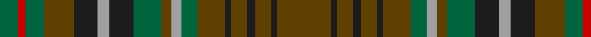

In pattern [GBGBGBGGYGGBYBGGRG](/patterns/gbgbgbggyggbybggrg/).

This was sourced from register-of-tartans.  It is a [18 stripes tartan](/stripes/stripes18/).

Original link https://www.tartanregister.gov.uk/tartanDetails.aspx?ref=4158

## Attestations

This cloth appears in 2 source records; the oldest owns this page.

- 01/11/2005 — Turcan Connell (register-of-tartans, [record](https://www.tartanregister.gov.uk/tartanDetails.aspx?ref=4158))
- 2005 November — Turcan Connell (Corporate) (tartans-authority, [record](http://www.tartansauthority.com/tartan-ferret/display/6815/))

## Thread count
G/18 R8 G18 T30 K24 N12 K24 G28 T10 N10 G16 T28 K6 T16 K8 T16 K6 T/54

## Palette
Each colour and its ΔE from the base-6 reference it is a variant of.

| Colour | Shade | Base | ΔE (OKLab) |
|---|---|---|---|
| G | <code style="background-color:#00643C;">#00643C</code> `#00643C` | G <code style="background-color:#006100;">#006100</code> | 0.05 |
| K | <code style="background-color:#1C1C1C;">#1C1C1C</code> `#1C1C1C` | B <code style="background-color:#2A418A;">#2A418A</code> | 0.21 |
| N | <code style="background-color:#A0A0A0;">#A0A0A0</code> `#A0A0A0` | Y <code style="background-color:#F2BF00;">#F2BF00</code> | 0.21 |
| R | <code style="background-color:#C80000;">#C80000</code> `#C80000` | R <code style="background-color:#CC0000;">#CC0000</code> | 0.01 |
| T | <code style="background-color:#604000;">#604000</code> `#604000` | G <code style="background-color:#006100;">#006100</code> | 0.14 |

## Nearest tartans

The nearest existing variants by ΔTartan distance.

1. [Lowland Donnelly (Personal)](/setts/s17/g5b2g12k4g3r3g3r13y3r13g3r3g3k3g12b2g5~b003c64-g003820-k101010-r780000-ye8c000~x2/) — ΔT 1.32
1. [Ben Murad (Personal)](/setts/s18/g18r3g3r15ga13r14g3r3g18ga5g2k5g3r2g3b5g2y5~b2c2c80-g003820-ga604000-k320000-r880000-y48a4c0~x2/) — ΔT 1.42
1. [Maple Leaf (District)](/setts/s12/r15g3r3g19ga6gb6ra6g19r3g3r15gb13~g006438-ga581c00-gb806c44-r880000-ra906828~x2/) — ΔT 1.46
1. [Limerick Irish County Tartan Tartan Number: 2272. Earliest known date: 1996 One of a series of Irish District tartans designed by Polly Wittering of the House of Edgar, with colours reminiscent of the Country with soft warm colours dominating. See products available Copyright © Blair Urquhart, Comrie, 2015](/setts/s21/g9b2ga3b2ga5b2ga3y3ga6y3ga3b2ga5b2ga3b2g16r3b2r3g7~b004874-g3c6838-ga28200c-r8c0020-yd09000~x2/) — ΔT 1.47
1. [Fraser Hunting Clan Tartan Tartan Number: 1659. Earliest known date: 1906 (1855) In the Hunting Fraser, brown replaces the red of the Clan sett. The late Charles Ian Fraser of Reeling said, in his publication, "Clan Fraser", that this sett was designed by the Sobieski Stuart brothers at the request of Lord Lovat for use by the Inverness and Nairn militia. A letter to Lord Lovat from the War Office, c.1855, authorised the use of the Fraser tartan for the corps. The tartan is worn by the Boghall & Bathgate pipe bands. (Strathallan 1994) See products available Copyright © Blair Urquhart, Comrie, 2015](/setts/s11/r3g18ga10g2b10g2b10g2ga10g18w3~b2c2c80-g604000-ga006818-rc80000-we0e0e0~x2/) — ΔT 1.48
1. [Unidentified Fragment Artifact Tartan Tartan Number: 2018. Earliest known date: 1978 Sent from Canada. See file. See products available Copyright © Blair Urquhart, Comrie, 2015](/setts/s15/g8ga20b15g6ga4g8b4g6ga20g8b6g4ba2g4b6~b2c2c80-ba2888c4-g604000-ga006818/) — ΔT 1.48
1. [Lander (2013)](/setts/s15/y18b3y3b3y3b16g16r2ya2r2g16b16y17b3y3~b4c3428-g5c6428-r960000-ya08858-yad8b000~x2/) — ΔT 1.54
1. [Fraser, hunting](/setts/s16/w2r14g7r1b7r1b7r1g7r14ra2r14g7r1b7r1~b304080-g008000-r806050-rac00000-we0e0e0~x4/) — ΔT 1.57
1. [Fraser Hunting (unmarked sample)](/setts/s16/w2g14ga7g1b7g1b7g1ga7g14r2g14ga7g1b7g1~b2c4084-g503c14-ga005020-rdc0000-we0e0e0~x4/) — ΔT 1.58
1. [Amazing Union (Personal)](/setts/s9/r2g15ga12g2b12g2ga12g15ra2~b101034-g682400-ga005c34-ra47800-raa80020~x4/) — ΔT 1.61

## Neighbour map

Every grey dot is one of 15726 variants placed by the first two principal components of the ΔTartan feature space (44% of its variance). Red is this tartan; blue dots are its nearest — click one to open its page.

<svg viewBox="0 0 640 380" role="img" style="max-width:100%;height:auto;border:1px solid #e0e0e0;border-radius:4px;display:block" xmlns="http://www.w3.org/2000/svg"><image href="/nn/cloud.v1.png" width="640" height="380"/><a href="/setts/s17/g5b2g12k4g3r3g3r13y3r13g3r3g3k3g12b2g5~b003c64-g003820-k101010-r780000-ye8c000~x2/"><circle cx="266.3" cy="202.6" r="4" fill="#3465a4"><title>Lowland Donnelly (Personal)</title></circle></a><a href="/setts/s18/g18r3g3r15ga13r14g3r3g18ga5g2k5g3r2g3b5g2y5~b2c2c80-g003820-ga604000-k320000-r880000-y48a4c0~x2/"><circle cx="227.4" cy="163.8" r="4" fill="#3465a4"><title>Ben Murad (Personal)</title></circle></a><a href="/setts/s12/r15g3r3g19ga6gb6ra6g19r3g3r15gb13~g006438-ga581c00-gb806c44-r880000-ra906828~x2/"><circle cx="227.6" cy="226.4" r="4" fill="#3465a4"><title>Maple Leaf (District)</title></circle></a><a href="/setts/s21/g9b2ga3b2ga5b2ga3y3ga6y3ga3b2ga5b2ga3b2g16r3b2r3g7~b004874-g3c6838-ga28200c-r8c0020-yd09000~x2/"><circle cx="177.7" cy="171.7" r="4" fill="#3465a4"><title>Limerick Irish County Tartan Tartan Number: 2272. Earliest known date: 1996 One of a series of Irish District tartans designed by Polly Wittering of the House of Edgar, with colours reminiscent of the Country with soft warm colours dominating. See products available Copyright © Blair Urquhart, Comrie, 2015</title></circle></a><a href="/setts/s11/r3g18ga10g2b10g2b10g2ga10g18w3~b2c2c80-g604000-ga006818-rc80000-we0e0e0~x2/"><circle cx="244.4" cy="201.5" r="4" fill="#3465a4"><title>Fraser Hunting Clan Tartan Tartan Number: 1659. Earliest known date: 1906 (1855) In the Hunting Fraser, brown replaces the red of the Clan sett. The late Charles Ian Fraser of Reeling said, in his publication, &quot;Clan Fraser&quot;, that this sett was designed by the Sobieski Stuart brothers at the request of Lord Lovat for use by the Inverness and Nairn militia. A letter to Lord Lovat from the War Office, c.1855, authorised the use of the Fraser tartan for the corps. The tartan is worn by the Boghall &amp; Bathgate pipe bands. (Strathallan 1994) See products available Copyright © Blair Urquhart, Comrie, 2015</title></circle></a><a href="/setts/s15/g8ga20b15g6ga4g8b4g6ga20g8b6g4ba2g4b6~b2c2c80-ba2888c4-g604000-ga006818/"><circle cx="245.1" cy="220.6" r="4" fill="#3465a4"><title>Unidentified Fragment Artifact Tartan Tartan Number: 2018. Earliest known date: 1978 Sent from Canada. See file. See products available Copyright © Blair Urquhart, Comrie, 2015</title></circle></a><a href="/setts/s15/y18b3y3b3y3b16g16r2ya2r2g16b16y17b3y3~b4c3428-g5c6428-r960000-ya08858-yad8b000~x2/"><circle cx="221.0" cy="179.7" r="4" fill="#3465a4"><title>Lander (2013)</title></circle></a><a href="/setts/s16/w2r14g7r1b7r1b7r1g7r14ra2r14g7r1b7r1~b304080-g008000-r806050-rac00000-we0e0e0~x4/"><circle cx="293.0" cy="167.2" r="4" fill="#3465a4"><title>Fraser, hunting</title></circle></a><a href="/setts/s16/w2g14ga7g1b7g1b7g1ga7g14r2g14ga7g1b7g1~b2c4084-g503c14-ga005020-rdc0000-we0e0e0~x4/"><circle cx="323.3" cy="186.1" r="4" fill="#3465a4"><title>Fraser Hunting (unmarked sample)</title></circle></a><a href="/setts/s9/r2g15ga12g2b12g2ga12g15ra2~b101034-g682400-ga005c34-ra47800-raa80020~x4/"><circle cx="269.7" cy="232.9" r="4" fill="#3465a4"><title>Amazing Union (Personal)</title></circle></a><circle cx="239.3" cy="201.4" r="5" fill="#c00000"/></svg>

ID: /setts/s18/g27b3g8b4g8b3g14ga8y5g5ga14b12y6b12g15ga9r4ga9~b1c1c1c-g604000-ga00643c-rc80000-ya0a0a0~x2/
