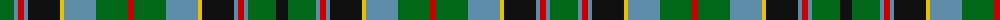

In pattern [GBRBKYBGRGBYKBRBGK](/patterns/gbrbkybgrgbykbrbgk/).

This was sourced from register-of-tartans.  It is a [18 stripes tartan](/stripes/stripes18/).

Original link https://www.tartanregister.gov.uk/tartanDetails.aspx?ref=3182

## Thread count
G/28 B4 R6 B4 K32 Y4 B32 G32 R6 G32 B32 Y4 K32 B4 R6 B4 G28 K/12

## Palette
Each colour and its ΔE from the base-6 reference it is a variant of.

| Colour | Shade | Base | ΔE (OKLab) |
|---|---|---|---|
| B | <code style="background-color:#5C8CA8;">#5C8CA8</code> `#5C8CA8` | B <code style="background-color:#2C4084;">#2C4084</code> | 0.23 |
| G | <code style="background-color:#006818;">#006818</code> `#006818` | G <code style="background-color:#006400;">#006400</code> | 0.02 |
| K | <code style="background-color:#101010;">#101010</code> `#101010` | K <code style="background-color:#000000;">#000000</code> | 0.17 |
| R | <code style="background-color:#C80000;">#C80000</code> `#C80000` | R <code style="background-color:#C80000;">#C80000</code> | 0.00 |
| Y | <code style="background-color:#E8C000;">#E8C000</code> `#E8C000` | Y <code style="background-color:#E8C000;">#E8C000</code> | 0.00 |

## Nearest tartans

The nearest existing variants by ΔTartan distance.

1. [Ogilvie of Inverarity (Wilson) / Ochterlonie](/setts/s16/b40y6k14g22k4g6k4g6r8g6k4g6k4g22k14y6-b2c2c80-g006818-k101010-rc80000-yd8b000/) — ΔT 0.84
1. [Fyvie](/setts/s20/y10g4y4g30k18b4k4b4k4b18g10b18k4b4k4b4k18g30k4w8-b2c4084-g005020-k101010-we0e0e0-ye8c000/) — ΔT 0.95
1. [Scotland's National Dress](/setts/s14/b28w4b4r4b6k24g28k4g8k4g28b28w28r4-b003c64-g006818-k101010-r880000-wc0c0c0/) — ΔT 1.02
1. [Campbell of Argyll (no guards)](/setts/s24/b2k2b16k16g16y4g16k16b2k2b2k2b16k2b2k2b2k16g16w4g16k16b16k2-b1474b4-g006818-k101010-wfcfcfc-ye8c000/) — ΔT 1.05
1. [Lobban (Personal)](/setts/s18/b4r4b4r4b24k18g24r4g4y10g4r4g24k18b24r4b4r4-b2888c4-g006818-k101010-rc80000-ye8c000/) — ΔT 1.06
1. [MacLeod of Skye (Johnston)](/setts/s14/b36k4b4k4b4k28g32k4y8k4g32k28b32r8-b1474b4-g006818-k101010-rc80000-ye8c000/) — ΔT 1.08
1. [MacAlpine (1906)](/setts/s14/b16g4b4g24k4g24b4g4b16w4k16g4k16y4-b202060-g006818-k101010-we0e0e0-ye8c000/) — ΔT 1.08
1. [O'Conner Irish Family Tartan Tartan Number: 2217. Earliest known date: 1985 Designed by Jerry O'Connor of Keltic Klassics, Hillsdale, New Jersey who names it "Royal na Connaught" .Woven by House of Edgar who said they would call it O'Connor. Ref made to Lawrence & Gerald O'Connor - possibly customers of Macnaughtons of Pitlochry (part of same group as House of Edgar) See products available Copyright © Blair Urquhart, Comrie, 2015](/setts/s16/g5k24g12k16g26w4g24w4g26k16b4k4b4k4ba28g3-b003c64-ba2c2c80-g006818-k101010-we0e0e0/) — ΔT 1.09
1. [Arbuthnott (Clan)](/setts/s17/b30k4b4k4b4k28g24w4g8b8g8w4g24k28b30k4b4-b5c8ca8-g006818-k101010-we0e0e0/) — ΔT 1.11
1. [Mantle Tartan Tartan Number: 6945. Earliest known date: 2006 A combination of Sinclair Hunting and MacQueen tartans relating to the clan associations of the the two families, Swan and Sinclair. See products available Copyright © Blair Urquhart, Comrie, 2015](/setts/s14/r6g4r6g36k28w4b32g6b32w4k28g36r6g4-b2c4080-g006818-k101010-r880000-wd8d8d8/) — ΔT 1.11

## Neighbour map

Every grey dot is one of 15726 variants placed by the first two principal components of the ΔTartan feature space (44% of its variance). Red is this tartan; blue dots are its nearest — click one to open its page.

<svg viewBox="0 0 640 380" role="img" style="max-width:100%;height:auto;border:1px solid #e0e0e0;border-radius:4px;display:block" xmlns="http://www.w3.org/2000/svg"><image href="/nn/cloud.v1.png" width="640" height="380"/><a href="/setts/s16/b40y6k14g22k4g6k4g6r8g6k4g6k4g22k14y6-b2c2c80-g006818-k101010-rc80000-yd8b000/"><circle cx="161.1" cy="153.6" r="4" fill="#3465a4"><title>Ogilvie of Inverarity (Wilson) / Ochterlonie</title></circle></a><a href="/setts/s20/y10g4y4g30k18b4k4b4k4b18g10b18k4b4k4b4k18g30k4w8-b2c4084-g005020-k101010-we0e0e0-ye8c000/"><circle cx="125.5" cy="157.9" r="4" fill="#3465a4"><title>Fyvie</title></circle></a><a href="/setts/s14/b28w4b4r4b6k24g28k4g8k4g28b28w28r4-b003c64-g006818-k101010-r880000-wc0c0c0/"><circle cx="103.4" cy="176.9" r="4" fill="#3465a4"><title>Scotland's National Dress</title></circle></a><a href="/setts/s24/b2k2b16k16g16y4g16k16b2k2b2k2b16k2b2k2b2k16g16w4g16k16b16k2-b1474b4-g006818-k101010-wfcfcfc-ye8c000/"><circle cx="129.4" cy="151.8" r="4" fill="#3465a4"><title>Campbell of Argyll (no guards)</title></circle></a><a href="/setts/s18/b4r4b4r4b24k18g24r4g4y10g4r4g24k18b24r4b4r4-b2888c4-g006818-k101010-rc80000-ye8c000/"><circle cx="86.4" cy="160.4" r="4" fill="#3465a4"><title>Lobban (Personal)</title></circle></a><a href="/setts/s14/b36k4b4k4b4k28g32k4y8k4g32k28b32r8-b1474b4-g006818-k101010-rc80000-ye8c000/"><circle cx="130.4" cy="167.9" r="4" fill="#3465a4"><title>MacLeod of Skye (Johnston)</title></circle></a><a href="/setts/s14/b16g4b4g24k4g24b4g4b16w4k16g4k16y4-b202060-g006818-k101010-we0e0e0-ye8c000/"><circle cx="155.1" cy="195.0" r="4" fill="#3465a4"><title>MacAlpine (1906)</title></circle></a><a href="/setts/s16/g5k24g12k16g26w4g24w4g26k16b4k4b4k4ba28g3-b003c64-ba2c2c80-g006818-k101010-we0e0e0/"><circle cx="198.3" cy="175.7" r="4" fill="#3465a4"><title>O'Conner Irish Family Tartan Tartan Number: 2217. Earliest known date: 1985 Designed by Jerry O'Connor of Keltic Klassics, Hillsdale, New Jersey who names it &quot;Royal na Connaught&quot; .Woven by House of Edgar who said they would call it O'Connor. Ref made to Lawrence &amp; Gerald O'Connor - possibly customers of Macnaughtons of Pitlochry (part of same group as House of Edgar) See products available Copyright © Blair Urquhart, Comrie, 2015</title></circle></a><a href="/setts/s17/b30k4b4k4b4k28g24w4g8b8g8w4g24k28b30k4b4-b5c8ca8-g006818-k101010-we0e0e0/"><circle cx="149.7" cy="175.7" r="4" fill="#3465a4"><title>Arbuthnott (Clan)</title></circle></a><a href="/setts/s14/r6g4r6g36k28w4b32g6b32w4k28g36r6g4-b2c4080-g006818-k101010-r880000-wd8d8d8/"><circle cx="158.6" cy="175.1" r="4" fill="#3465a4"><title>Mantle Tartan Tartan Number: 6945. Earliest known date: 2006 A combination of Sinclair Hunting and MacQueen tartans relating to the clan associations of the the two families, Swan and Sinclair. See products available Copyright © Blair Urquhart, Comrie, 2015</title></circle></a><circle cx="141.5" cy="163.9" r="5" fill="#c00000"/></svg>

ID: /setts/s18/g28b4r6b4k32y4b32g32r6g32b32y4k32b4r6b4g28k12-b5c8ca8-g006818-k101010-rc80000-ye8c000/
