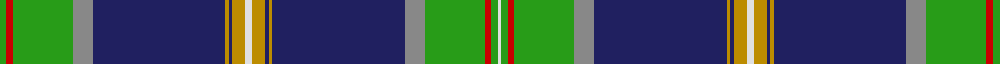

In pattern [GRGRBYBYWYBYBRGRGW](/stripes/grgrbybywybybrgrgw/).

This was sourced from register-of-tartans.  It is a [18 stripe tartan](/stripes/stripes18/).

Original link https://www.tartanregister.gov.uk/tartanDetails.aspx?ref=3244

## Register references

External register numbers recorded for this tartan.

- Scottish Register of Tartans: [3244](https://www.tartanregister.gov.uk/tartanDetails.aspx?ref=3244)
- Scottish Tartans Authority (ITI): 6491

## Thread count
Ga/4 R4 Ga36 Nb12 DB80 DY2 DB2 DY8 LN4 DY8 DB2 DY2 DB80 Nb12 Ga36 R4 Ga4 LN/2

## Palette
Each colour and the base-6 reference it is a variant of.

| Colour | Shade | Base |
|---|---|---|
| DB | <code style="background-color:#202060;">#202060</code> `oklch(28.9% 0.111 276.9)` <small>#202060</small> | B <code style="background-color:#2A418A;">#2A418A</code> |
| DBa | <code style="background-color:#2C2C80;">#2C2C80</code> `oklch(35.0% 0.138 276.6)` <small>#2C2C80</small> | B <code style="background-color:#2A418A;">#2A418A</code> |
| DY | <code style="background-color:#BC8C00;">#BC8C00</code> `oklch(66.8% 0.137 84.1)` <small>#BC8C00</small> | Y <code style="background-color:#F2BF00;">#F2BF00</code> |
| G | <code style="background-color:#006818;">#006818</code> `oklch(45.0% 0.142 145.0)` <small>#006818</small> | G <code style="background-color:#006100;">#006100</code> |
| Ga | <code style="background-color:#289C18;">#289C18</code> `oklch(60.6% 0.191 141.6)` <small>#289C18</small> | G <code style="background-color:#006100;">#006100</code> |
| K | <code style="background-color:#101010;">#101010</code> `oklch(17.3% 0.000 89.9)` <small>#101010</small> | K <code style="background-color:#000000;">#000000</code> |
| LN | <code style="background-color:#E0E0E0;">#E0E0E0</code> `oklch(90.7% 0.000 89.9)` <small>#E0E0E0</small> | W <code style="background-color:#F7F7F7;">#F7F7F7</code> |
| N | <code style="background-color:#C0C0C0;">#C0C0C0</code> `oklch(80.8% 0.000 89.9)` <small>#C0C0C0</small> | W <code style="background-color:#F7F7F7;">#F7F7F7</code> |
| Na | <code style="background-color:#5C5C5C;">#5C5C5C</code> `oklch(47.5% 0.000 89.9)` <small>#5C5C5C</small> | B <code style="background-color:#2A418A;">#2A418A</code> |
| Nb | <code style="background-color:#888888;">#888888</code> `oklch(62.7% 0.000 89.9)` <small>#888888</small> | R <code style="background-color:#CC0000;">#CC0000</code> |
| R | <code style="background-color:#C80000;">#C80000</code> `oklch(52.3% 0.215 29.2)` <small>#C80000</small> | R <code style="background-color:#CC0000;">#CC0000</code> |

## Nearest tartans

The nearest existing variants by ΔTartan distance.

1. [Joss](/setts/s13/r3g1db2g4db30k2db4k2db30g27ly3k3w3~x2/) — ΔT 1.09
1. [City of Abbotsford (District)](/setts/s13/dg50k3w4k1lo5r4k1w2k2b15k5dg4w2~x2/) — ΔT 1.11
1. [Cooper](/setts/s14/db116k4g22r7db3r7k26db7g3db7g66db4r7r4/) — ΔT 1.20
1. [O'Mahony, The (Commemorative)](/setts/s10/w2lo4db1lo1db40o6g18r2g2w1~x2/) — ΔT 1.22
1. [Prestoungrange/Dolphinstoun/Wills](/setts/s14/g3b2g3r4g15k2g2k2g3db35k2db2k1db2~x2/) — ΔT 1.22
1. [Stuart/Stewart Royal variant](/setts/s12/t57db4k8ly4k4t4k4dg8r6k4r4t2/) — ΔT 1.23
1. [Royal Stewart, (Variant)](/setts/s12/t57db4k8ly4k4t4k4g8r6k4r4t2/) — ΔT 1.24
1. [Johnston, Diana Dress (Personal)](/setts/s12/r10db4r3db6w3db4w3db40dg73k4db2ly6/) — ΔT 1.26
1. [Anderson Old (Makinlay)](/setts/s20/r8dg16k1r4k1dg16t14r2k14ly2k4ly2k1w8t52k1r4k1t16r8~x2/) — ΔT 1.30
1. [Coigach](/setts/s15/r3lb3k3lb3r3db8k1ly2k1db8k2g30k1g10k2~x2/) — ΔT 1.32

## Neighbour map

Every grey dot is one of 14299 variants placed by the first two principal components of the ΔTartan feature space (44% of its variance). Red is this tartan; blue dots are its nearest — click one to open its page.

<svg viewBox="0 0 640 380" role="img" style="max-width:100%;height:auto;border:1px solid #e0e0e0;border-radius:4px;display:block" xmlns="http://www.w3.org/2000/svg"><image href="/nn/cloud.v1.png" width="640" height="380"/><a href="/setts/s13/r3g1db2g4db30k2db4k2db30g27ly3k3w3~x2/"><circle cx="321.0" cy="87.4" r="4" fill="#3465a4"><title>Joss</title></circle></a><a href="/setts/s13/dg50k3w4k1lo5r4k1w2k2b15k5dg4w2~x2/"><circle cx="321.4" cy="46.8" r="4" fill="#3465a4"><title>City of Abbotsford (District)</title></circle></a><a href="/setts/s14/db116k4g22r7db3r7k26db7g3db7g66db4r7r4/"><circle cx="304.9" cy="75.2" r="4" fill="#3465a4"><title>Cooper</title></circle></a><a href="/setts/s10/w2lo4db1lo1db40o6g18r2g2w1~x2/"><circle cx="301.9" cy="64.4" r="4" fill="#3465a4"><title>O'Mahony, The (Commemorative)</title></circle></a><a href="/setts/s14/g3b2g3r4g15k2g2k2g3db35k2db2k1db2~x2/"><circle cx="318.5" cy="80.8" r="4" fill="#3465a4"><title>Prestoungrange/Dolphinstoun/Wills</title></circle></a><a href="/setts/s12/t57db4k8ly4k4t4k4dg8r6k4r4t2/"><circle cx="322.4" cy="70.0" r="4" fill="#3465a4"><title>Stuart/Stewart Royal variant</title></circle></a><a href="/setts/s12/t57db4k8ly4k4t4k4g8r6k4r4t2/"><circle cx="301.7" cy="59.0" r="4" fill="#3465a4"><title>Royal Stewart, (Variant)</title></circle></a><a href="/setts/s12/r10db4r3db6w3db4w3db40dg73k4db2ly6/"><circle cx="283.4" cy="64.8" r="4" fill="#3465a4"><title>Johnston, Diana Dress (Personal)</title></circle></a><a href="/setts/s20/r8dg16k1r4k1dg16t14r2k14ly2k4ly2k1w8t52k1r4k1t16r8~x2/"><circle cx="246.7" cy="35.4" r="4" fill="#3465a4"><title>Anderson Old (Makinlay)</title></circle></a><a href="/setts/s15/r3lb3k3lb3r3db8k1ly2k1db8k2g30k1g10k2~x2/"><circle cx="258.5" cy="74.3" r="4" fill="#3465a4"><title>Coigach</title></circle></a><circle cx="298.4" cy="45.9" r="5" fill="#c00000"/></svg>

ID: /setts/s18/g2r2g18o6db40lo1db1lo4w2lo4db1lo1db40o6g18r2g2w1~x2/
