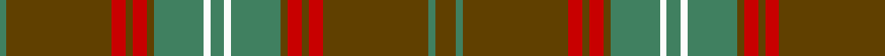

In pattern [GGGRGRGGWGWGGRGRGG](/patterns/gggrgrggwgwggrgrgg/).

This was sourced from register-of-tartans.  It is a [18 stripes tartan](/stripes/stripes18/).

Original link https://www.tartanregister.gov.uk/tartanDetails.aspx?ref=3771

## Thread count
Ga/4 T60 R8 T4 R8 T4 Ga28 W4 Ga8 W4 Ga28 T4 R8 T4 R8 T60 Ga4 T/12

## Palette
Each colour and its ΔE from the base-6 reference it is a variant of.

| Colour | Shade | Base | ΔE (OKLab) |
|---|---|---|---|
| DG | <code style="background-color:#003820;">#003820</code> `#003820` | G <code style="background-color:#006100;">#006100</code> | 0.15 |
| DR | <code style="background-color:#441800;">#441800</code> `#441800` | B <code style="background-color:#2A418A;">#2A418A</code> | 0.23 |
| G | <code style="background-color:#006818;">#006818</code> `#006818` | G <code style="background-color:#006100;">#006100</code> | 0.02 |
| Ga | <code style="background-color:#408060;">#408060</code> `#408060` | G <code style="background-color:#006100;">#006100</code> | 0.14 |
| R | <code style="background-color:#C80000;">#C80000</code> `#C80000` | R <code style="background-color:#CC0000;">#CC0000</code> | 0.01 |
| T | <code style="background-color:#604000;">#604000</code> `#604000` | G <code style="background-color:#006100;">#006100</code> | 0.14 |
| W | <code style="background-color:#FCFCFC;">#FCFCFC</code> `#FCFCFC` | W <code style="background-color:#F7F7F7;">#F7F7F7</code> | 0.01 |

## Nearest tartans

The nearest existing variants by ΔTartan distance.

1. [Seton Htg (Clan)](/setts/s10/g3ga1g15r2g1r2g1ga7w1ga2~g604000-ga408060-rc80000-wfcfcfc~x4/) — ΔT 1.20
1. [Manitoba Province (District)](/setts/s14/r12g1ga3g20b1g1b3g1b1g20ga3g1r12y3~b5c8ca8-g006818-ga003820-r901c38-ybc8c00~x4/) — ΔT 1.46
1. [Manitoba Province](/setts/s14/r12g1ga3g20b1g1b3g1b1g20ga3g1r12y3~b5c8ca8-g006818-ga285800-r901c38-ybc8c00~x4/) — ΔT 1.46
1. [Ulster (Red)](/setts/s22/k1y1k1r10k1g1k1g1r1g10k1g10k1g10r1g1k1g1k1r10k1y1~g006818-k101010-r880000-yd09800~x4/) — ΔT 1.50
1. [Sarna (District)](/setts/s13/g8y2ga4b4g3b4ga42g4r3g4ga4b5r3~b780078-g006818-ga604000-rc80000-ye8c000/) — ΔT 1.51
1. [Unidentified #25](/setts/s12/b4g2b2w2g9y27r4y27g9w2b2g2~b1474b4-g604000-rc80000-we0e0e0-ya08858~x3/) — ΔT 1.53
1. [Sarna](/setts/s13/g8y2r4b4g3b4r42g4ra3g4r4b5ra3~b800080-g008000-r806050-rac00000-yf0c000/) — ΔT 1.56
1. [Glenfarclas Distillery](/setts/s15/r8b3r3g20r3g3r3b6r3ba3r20b3r3b2r6~b003478-ba788ccc-g146400-r640000~x2/) — ΔT 1.61
1. [Aberlour Bicentenary](/setts/s15/g16b6g6ba46g5ba8g5b10g6y8g48b6g6b6g16~b580b5b-ba25375f-g5c6428-yc88c00/) — ΔT 1.62
1. [MacDonald of Glencoe](/setts/s13/g3r1ra2g2ra16w1b4ra3g13ra1b1r1ra3~b2c2c80-g285800-re87878-ra880000-w98c8e8~x2/) — ΔT 1.63

## Neighbour map

Every grey dot is one of 15726 variants placed by the first two principal components of the ΔTartan feature space (44% of its variance). Red is this tartan; blue dots are its nearest — click one to open its page.

<svg viewBox="0 0 640 380" role="img" style="max-width:100%;height:auto;border:1px solid #e0e0e0;border-radius:4px;display:block" xmlns="http://www.w3.org/2000/svg"><image href="/nn/cloud.v1.png" width="640" height="380"/><a href="/setts/s10/g3ga1g15r2g1r2g1ga7w1ga2~g604000-ga408060-rc80000-wfcfcfc~x4/"><circle cx="391.3" cy="171.0" r="4" fill="#3465a4"><title>Seton Htg (Clan)</title></circle></a><a href="/setts/s14/r12g1ga3g20b1g1b3g1b1g20ga3g1r12y3~b5c8ca8-g006818-ga003820-r901c38-ybc8c00~x4/"><circle cx="340.1" cy="133.1" r="4" fill="#3465a4"><title>Manitoba Province (District)</title></circle></a><a href="/setts/s14/r12g1ga3g20b1g1b3g1b1g20ga3g1r12y3~b5c8ca8-g006818-ga285800-r901c38-ybc8c00~x4/"><circle cx="348.9" cy="136.9" r="4" fill="#3465a4"><title>Manitoba Province</title></circle></a><a href="/setts/s22/k1y1k1r10k1g1k1g1r1g10k1g10k1g10r1g1k1g1k1r10k1y1~g006818-k101010-r880000-yd09800~x4/"><circle cx="302.4" cy="142.3" r="4" fill="#3465a4"><title>Ulster (Red)</title></circle></a><a href="/setts/s13/g8y2ga4b4g3b4ga42g4r3g4ga4b5r3~b780078-g006818-ga604000-rc80000-ye8c000/"><circle cx="387.6" cy="122.0" r="4" fill="#3465a4"><title>Sarna (District)</title></circle></a><a href="/setts/s12/b4g2b2w2g9y27r4y27g9w2b2g2~b1474b4-g604000-rc80000-we0e0e0-ya08858~x3/"><circle cx="357.9" cy="143.5" r="4" fill="#3465a4"><title>Unidentified #25</title></circle></a><a href="/setts/s13/g8y2r4b4g3b4r42g4ra3g4r4b5ra3~b800080-g008000-r806050-rac00000-yf0c000/"><circle cx="379.1" cy="115.0" r="4" fill="#3465a4"><title>Sarna</title></circle></a><a href="/setts/s15/r8b3r3g20r3g3r3b6r3ba3r20b3r3b2r6~b003478-ba788ccc-g146400-r640000~x2/"><circle cx="332.5" cy="182.1" r="4" fill="#3465a4"><title>Glenfarclas Distillery</title></circle></a><a href="/setts/s15/g16b6g6ba46g5ba8g5b10g6y8g48b6g6b6g16~b580b5b-ba25375f-g5c6428-yc88c00/"><circle cx="349.6" cy="188.8" r="4" fill="#3465a4"><title>Aberlour Bicentenary</title></circle></a><a href="/setts/s13/g3r1ra2g2ra16w1b4ra3g13ra1b1r1ra3~b2c2c80-g285800-re87878-ra880000-w98c8e8~x2/"><circle cx="319.9" cy="133.8" r="4" fill="#3465a4"><title>MacDonald of Glencoe</title></circle></a><circle cx="375.1" cy="142.7" r="5" fill="#c00000"/></svg>

ID: /setts/s18/g3ga1g15r2g1r2g1ga7w1ga2w1ga7g1r2g1r2g15ga1~g604000-ga408060-rc80000-wfcfcfc~x4/
