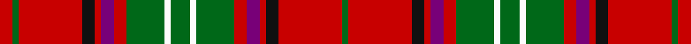

This page is one **sett** — a single exact thread-count. It belongs to the [tartan](/tartans/g3w1g6r2dp2r1k2r10g1r2/)
(the same proportion at any scale), whose colour order is pattern [GRKRBRGWGWGRBRKRGR](/stripes/grkrbrgwgwgrbrkrgr/).

Sourced from register-of-tartans.  It is a [18 stripe tartan](/stripes/stripes18/).

Original link https://www.tartanregister.gov.uk/tartanDetails.aspx?ref=3770

## Register references

External register numbers recorded for this tartan.

- Scottish Register of Tartans: [3770](https://www.tartanregister.gov.uk/tartanDetails.aspx?ref=3770)
- Scottish Tartans Authority (ITI): 932
- Scottish Tartans World Register: 932

## Thread count
R/16 G8 R80 K16 R8 P16 R16 G48 Wa8 G24 Wa8 G48 R16 P16 R8 K16 R80 G/8

## Palette

Palette: <strong>Tartan Register</strong>
<table><thead><tr><th>Colour</th><th>Threads</th><th>Shade</th><th>Base</th><th>OKLCh</th></tr></thead><tbody><tr><td>R/</td><td style="text-align:right;font-variant-numeric:tabular-nums">16</td><td><code style="background-color:#C80000;">#C80000</code> <small style="color:#888">#C80000</small></td><td>R <code style="background-color:#CC0000;">#CC0000</code></td><td><small style="color:#888">oklch(52.3% 0.215 29.2)</small></td></tr><tr><td>G</td><td style="text-align:right;font-variant-numeric:tabular-nums">8</td><td><code style="background-color:#006818;">#006818</code> <small style="color:#888">#006818</small></td><td>G <code style="background-color:#006100;">#006100</code></td><td><small style="color:#888">oklch(45.0% 0.142 145.0)</small></td></tr><tr><td>R</td><td style="text-align:right;font-variant-numeric:tabular-nums">80</td><td><code style="background-color:#C80000;">#C80000</code> <small style="color:#888">#C80000</small></td><td>R <code style="background-color:#CC0000;">#CC0000</code></td><td><small style="color:#888">oklch(52.3% 0.215 29.2)</small></td></tr><tr><td>K</td><td style="text-align:right;font-variant-numeric:tabular-nums">16</td><td><code style="background-color:#101010;">#101010</code> <small style="color:#888">#101010</small></td><td>K <code style="background-color:#000000;">#000000</code></td><td><small style="color:#888">oklch(17.3% 0.000 89.9)</small></td></tr><tr><td>R</td><td style="text-align:right;font-variant-numeric:tabular-nums">8</td><td><code style="background-color:#C80000;">#C80000</code> <small style="color:#888">#C80000</small></td><td>R <code style="background-color:#CC0000;">#CC0000</code></td><td><small style="color:#888">oklch(52.3% 0.215 29.2)</small></td></tr><tr><td>P</td><td style="text-align:right;font-variant-numeric:tabular-nums">16</td><td><code style="background-color:#780078;">#780078</code> <small style="color:#888">#780078</small></td><td>B <code style="background-color:#2A418A;">#2A418A</code></td><td><small style="color:#888">oklch(40.2% 0.185 328.4)</small></td></tr><tr><td>R</td><td style="text-align:right;font-variant-numeric:tabular-nums">16</td><td><code style="background-color:#C80000;">#C80000</code> <small style="color:#888">#C80000</small></td><td>R <code style="background-color:#CC0000;">#CC0000</code></td><td><small style="color:#888">oklch(52.3% 0.215 29.2)</small></td></tr><tr><td>G</td><td style="text-align:right;font-variant-numeric:tabular-nums">48</td><td><code style="background-color:#006818;">#006818</code> <small style="color:#888">#006818</small></td><td>G <code style="background-color:#006100;">#006100</code></td><td><small style="color:#888">oklch(45.0% 0.142 145.0)</small></td></tr><tr><td>Wa</td><td style="text-align:right;font-variant-numeric:tabular-nums">8</td><td><code style="background-color:#FCFCFC;">#FCFCFC</code> <small style="color:#888">#FCFCFC</small></td><td>W <code style="background-color:#F7F7F7;">#F7F7F7</code></td><td><small style="color:#888">oklch(99.1% 0.000 89.9)</small></td></tr><tr><td>G</td><td style="text-align:right;font-variant-numeric:tabular-nums">24</td><td><code style="background-color:#006818;">#006818</code> <small style="color:#888">#006818</small></td><td>G <code style="background-color:#006100;">#006100</code></td><td><small style="color:#888">oklch(45.0% 0.142 145.0)</small></td></tr><tr><td>Wa</td><td style="text-align:right;font-variant-numeric:tabular-nums">8</td><td><code style="background-color:#FCFCFC;">#FCFCFC</code> <small style="color:#888">#FCFCFC</small></td><td>W <code style="background-color:#F7F7F7;">#F7F7F7</code></td><td><small style="color:#888">oklch(99.1% 0.000 89.9)</small></td></tr><tr><td>G</td><td style="text-align:right;font-variant-numeric:tabular-nums">48</td><td><code style="background-color:#006818;">#006818</code> <small style="color:#888">#006818</small></td><td>G <code style="background-color:#006100;">#006100</code></td><td><small style="color:#888">oklch(45.0% 0.142 145.0)</small></td></tr><tr><td>R</td><td style="text-align:right;font-variant-numeric:tabular-nums">16</td><td><code style="background-color:#C80000;">#C80000</code> <small style="color:#888">#C80000</small></td><td>R <code style="background-color:#CC0000;">#CC0000</code></td><td><small style="color:#888">oklch(52.3% 0.215 29.2)</small></td></tr><tr><td>P</td><td style="text-align:right;font-variant-numeric:tabular-nums">16</td><td><code style="background-color:#780078;">#780078</code> <small style="color:#888">#780078</small></td><td>B <code style="background-color:#2A418A;">#2A418A</code></td><td><small style="color:#888">oklch(40.2% 0.185 328.4)</small></td></tr><tr><td>R</td><td style="text-align:right;font-variant-numeric:tabular-nums">8</td><td><code style="background-color:#C80000;">#C80000</code> <small style="color:#888">#C80000</small></td><td>R <code style="background-color:#CC0000;">#CC0000</code></td><td><small style="color:#888">oklch(52.3% 0.215 29.2)</small></td></tr><tr><td>K</td><td style="text-align:right;font-variant-numeric:tabular-nums">16</td><td><code style="background-color:#101010;">#101010</code> <small style="color:#888">#101010</small></td><td>K <code style="background-color:#000000;">#000000</code></td><td><small style="color:#888">oklch(17.3% 0.000 89.9)</small></td></tr><tr><td>R</td><td style="text-align:right;font-variant-numeric:tabular-nums">80</td><td><code style="background-color:#C80000;">#C80000</code> <small style="color:#888">#C80000</small></td><td>R <code style="background-color:#CC0000;">#CC0000</code></td><td><small style="color:#888">oklch(52.3% 0.215 29.2)</small></td></tr><tr><td>G/</td><td style="text-align:right;font-variant-numeric:tabular-nums">8</td><td><code style="background-color:#006818;">#006818</code> <small style="color:#888">#006818</small></td><td>G <code style="background-color:#006100;">#006100</code></td><td><small style="color:#888">oklch(45.0% 0.142 145.0)</small></td></tr></tbody></table>

## Nearest tartans

The nearest existing variants by ΔTartan distance, with this tartan at the top so the swatches line up against it.

ΔTartan

Tartan

Sett

—

<a href="/ttd/edit/#slug=g3w1g6r2dp2r1k2r10g1r2~x8">Seton</a> <a class="nn-out" href="/setts/s18/g3w1g6r2dp2r1k2r10g1r2~x8/" title="open its dictionary page">↗</a>

0.64

<a href="/ttd/edit/#slug=k1r4dg8r2dg1r2db4r2w1r1w1r2dg4r3dg4r1k1r8w1~x2">MacDougall #6</a> <a class="nn-out" href="/setts/s19/k1r4dg8r2dg1r2db4r2w1r1w1r2dg4r3dg4r1k1r8w1~x2/" title="open its dictionary page">↗</a>

0.77

<a href="/ttd/edit/#slug=ri1r2dg1k1r5dg11r1k2dg1r11dg4ri1r2w1~x2">MacKinnon #9</a> <a class="nn-out" href="/setts/s14/ri1r2dg1k1r5dg11r1k2dg1r11dg4ri1r2w1~x2/" title="open its dictionary page">↗</a>

0.92

<a href="/ttd/edit/#slug=k1r4g8r2g1r2db4r2w1r1w1r2g4r3g4r1k1r8w1~x2">MacDougal 5</a> <a class="nn-out" href="/setts/s19/k1r4g8r2g1r2db4r2w1r1w1r2g4r3g4r1k1r8w1~x2/" title="open its dictionary page">↗</a>

0.94

<a href="/ttd/edit/#slug=w3r5dg3dp3r14dg36r3dp8dg3r36dg14ri3r5w3~x2">MacKinnon #11</a> <a class="nn-out" href="/setts/s14/w3r5dg3dp3r14dg36r3dp8dg3r36dg14ri3r5w3~x2/" title="open its dictionary page">↗</a>

0.95

<a href="/ttd/edit/#slug=ri2r4dg2db2r6dg14r2db2dg2r12dg7ri2r5w1~x2">MacDonald of Staffa #5</a> <a class="nn-out" href="/setts/s14/ri2r4dg2db2r6dg14r2db2dg2r12dg7ri2r5w1~x2/" title="open its dictionary page">↗</a>

0.97

<a href="/ttd/edit/#slug=r6dg4ly2dg17r2dg2r2dg8r26dg6r4k2r4w6~x2">Hay</a> <a class="nn-out" href="/setts/s14/r6dg4ly2dg17r2dg2r2dg8r26dg6r4k2r4w6~x2/" title="open its dictionary page">↗</a>

0.98

<a href="/ttd/edit/#slug=dp2r3dg2db2r6dg16r2db4dg2r16dg8dp2r4w2~x2">MacKinnon #8</a> <a class="nn-out" href="/setts/s14/dp2r3dg2db2r6dg16r2db4dg2r16dg8dp2r4w2~x2/" title="open its dictionary page">↗</a>

1.00

<a href="/ttd/edit/#slug=dp3r4dg3db3r7dg17r3db5dg4r21dg7dp3r6w3~x2">MacKinnon #3</a> <a class="nn-out" href="/setts/s14/dp3r4dg3db3r7dg17r3db5dg4r21dg7dp3r6w3~x2/" title="open its dictionary page">↗</a>

1.03

<a href="/ttd/edit/#slug=t2r3dg2db2r6dg16r2db4dg2r16dg8t2r4w2~x2">MacKinnon #2</a> <a class="nn-out" href="/setts/s14/t2r3dg2db2r6dg16r2db4dg2r16dg8t2r4w2~x2/" title="open its dictionary page">↗</a>

1.03

<a href="/ttd/edit/#slug=k3r4db2r20db20r2g2r6g10r6w2r3k2~x2">Cameron of Locheil</a> <a class="nn-out" href="/setts/s13/k3r4db2r20db20r2g2r6g10r6w2r3k2~x2/" title="open its dictionary page">↗</a>

## Neighbour map

Every grey dot is one of 14359 variants placed by the first two principal components of the ΔTartan feature space (44% of its variance). Red is this tartan; blue dots are its nearest — click one to open its page.

<svg viewBox="0 0 640 380" role="img" style="max-width:100%;height:auto;border:1px solid #e0e0e0;border-radius:4px;display:block" xmlns="http://www.w3.org/2000/svg"><image href="/nn/cloud.v1.png" width="640" height="380"/><a href="/setts/s19/k1r4dg8r2dg1r2db4r2w1r1w1r2dg4r3dg4r1k1r8w1~x2/"><circle cx="209.2" cy="142.1" r="4" fill="#3465a4"><title>MacDougall #6</title></circle></a><a href="/setts/s14/ri1r2dg1k1r5dg11r1k2dg1r11dg4ri1r2w1~x2/"><circle cx="261.4" cy="127.7" r="4" fill="#3465a4"><title>MacKinnon #9</title></circle></a><a href="/setts/s19/k1r4g8r2g1r2db4r2w1r1w1r2g4r3g4r1k1r8w1~x2/"><circle cx="203.5" cy="142.9" r="4" fill="#3465a4"><title>MacDougal 5</title></circle></a><a href="/setts/s14/w3r5dg3dp3r14dg36r3dp8dg3r36dg14ri3r5w3~x2/"><circle cx="252.7" cy="119.5" r="4" fill="#3465a4"><title>MacKinnon #11</title></circle></a><a href="/setts/s14/ri2r4dg2db2r6dg14r2db2dg2r12dg7ri2r5w1~x2/"><circle cx="255.2" cy="140.6" r="4" fill="#3465a4"><title>MacDonald of Staffa #5</title></circle></a><a href="/setts/s14/r6dg4ly2dg17r2dg2r2dg8r26dg6r4k2r4w6~x2/"><circle cx="271.8" cy="127.6" r="4" fill="#3465a4"><title>Hay</title></circle></a><a href="/setts/s14/dp2r3dg2db2r6dg16r2db4dg2r16dg8dp2r4w2~x2/"><circle cx="214.8" cy="150.3" r="4" fill="#3465a4"><title>MacKinnon #8</title></circle></a><a href="/setts/s14/dp3r4dg3db3r7dg17r3db5dg4r21dg7dp3r6w3~x2/"><circle cx="206.1" cy="159.6" r="4" fill="#3465a4"><title>MacKinnon #3</title></circle></a><a href="/setts/s14/t2r3dg2db2r6dg16r2db4dg2r16dg8t2r4w2~x2/"><circle cx="214.9" cy="151.3" r="4" fill="#3465a4"><title>MacKinnon #2</title></circle></a><a href="/setts/s13/k3r4db2r20db20r2g2r6g10r6w2r3k2~x2/"><circle cx="238.8" cy="138.0" r="4" fill="#3465a4"><title>Cameron of Locheil</title></circle></a><circle cx="242.7" cy="128.5" r="5" fill="#c00000"/></svg>

ID: /setts/s18/g3w1g6r2dp2r1k2r10g1r2~x8/
