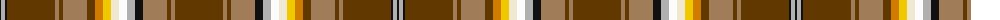

In pattern [GRGRKYWWYYGRGRGKYK](/patterns/grgrkywwyygrgrgkyk/).

This was sourced from tartans-authority.  It is a [18 stripes tartan](/stripes/stripes18/).

Original link http://www.tartansauthority.com/tartan-ferret/display/6799/

## Attestations

This cloth appears in 2 source records; the oldest owns this page.

- July 2005 — Bear (Corporate) (tartans-authority, [record](http://www.tartansauthority.com/tartan-ferret/display/6799/))
- undated — Bear Corporate Tartan Tartan Number: 6799. Earliest known date: July 2005 The Bear tartan has been created to further promote identity and awareness of the International Bear Community. The composition of the colours used for the multiple stripe is based on the Bear Brotherhood flag See products available Copyright © Blair Urquhart, Comrie, 2015 (house-of-tartan, [record](http://www.house-of-tartan.scotland.net/house/TartanViewjs.asp?colr=Def&tnam=6799))

## Thread count
K/2 N4 K2 T48 LT4 T4 LT24 T8 O8 Y8 W8 Wa8 N8 K8 LT24 T4 LT4 T/48

## Palette
Each colour and its ΔE from the base-6 reference it is a variant of.

| Colour | Shade | Base | ΔE (OKLab) |
|---|---|---|---|
| K | <code style="background-color:#101010;">#101010</code> `#101010` | K <code style="background-color:#000000;">#000000</code> | 0.17 |
| LT | <code style="background-color:#A07C58;">#A07C58</code> `#A07C58` | R <code style="background-color:#C80000;">#C80000</code> | 0.19 |
| N | <code style="background-color:#B0B0B0;">#B0B0B0</code> `#B0B0B0` | Y <code style="background-color:#E8C000;">#E8C000</code> | 0.18 |
| O | <code style="background-color:#D07C00;">#D07C00</code> `#D07C00` | Y <code style="background-color:#E8C000;">#E8C000</code> | 0.18 |
| T | <code style="background-color:#603800;">#603800</code> `#603800` | G <code style="background-color:#006400;">#006400</code> | 0.16 |
| W | <code style="background-color:#F0E8D0;">#F0E8D0</code> `#F0E8D0` | W <code style="background-color:#F4F4F0;">#F4F4F0</code> | 0.04 |
| Wa | <code style="background-color:#FCFCFC;">#FCFCFC</code> `#FCFCFC` | W <code style="background-color:#F4F4F0;">#F4F4F0</code> | 0.03 |
| Y | <code style="background-color:#F0C800;">#F0C800</code> `#F0C800` | Y <code style="background-color:#E8C000;">#E8C000</code> | 0.02 |

## Nearest tartans

The nearest existing variants by ΔTartan distance.

1. [Bear](/setts/s18/g48k2y4k2g48r4g4r24k8y8w8wa8ya8yb8g8r24g4r4-g603800-k101010-ra07c58-wfcfcfc-waf0e8d0-yb0b0b0-yaf0c800-ybd07c00/) — ΔT 0.00
1. [Macan of Lurgyvallan](/setts/s24/r64g4r4g4r4g16k4w4k4y4k4b24ba16b24k4y4k4w4k4g16r48g4r4k4-b5c8ca8-ba2c2c80-g006818-k101010-rc80000-wc0c0c0-ye8c000/) — ΔT 1.64
1. [Macan of Lurgyvallan Portrait Tartan Tartan Number: 1155. Earliest known date: 1831 The portrait of 'Captain Macan of Lurgyvallan painted and presented to him by his sincere friend William MacKenzie, 24th Oct. 1831' was recently sold at auction in London. The watercolour measured 10 by 7 inches. The chief (three eagles feathers) is wearing full Highland Dress. The tartan is a sort of MacLean of Duart, in the red Stewart group, but showing the MacLean inversion. No such person or clan or tartan or chief ever existed. See products available Copyright © Blair Urquhart, Comrie, 2015](/setts/s24/r32g2r2g2r2g8k2w2k2y2k2b12ba8b12k2y2k2w2k2g8r24g2r2k2-b5c8ca8-ba2c2c80-g006818-k101010-rc80000-we0e0e0-ye8c000/) — ΔT 1.65
1. [Sellers/Sillars](/setts/s22/g126k8w18y4b8y4b8g22r16w4r8wa10r8w4r16g22b8y4b8y4w18k8-b1c0070-g604000-k101010-rc80000-wa8ace8-waf8f8f8-ye8c000/) — ΔT 1.67
1. [Fitzgerald dress](/setts/s25/w4k2r6b6r6ra6r24ra6r6ba6r6ba38y6g38r6ba6r6ra6r24ra6r6b6r6k2w4-b5480b0-ba304080-g008000-k000000-rc00000-ra900030-we0e0e0-yf0c000/) — ΔT 1.68
1. [Campbell, New Louden](/setts/s18/r50w4y10b4ba4y10w4g24w4ra4y4r10k4r10y4ra4w4y18-b2888c4-ba202060-g006818-k101010-rc80000-ra9c68a4-wfcfcfc-ya08858/) — ΔT 1.71
1. [Essex County (Ontario)](/setts/s10/y60k2r8k2g6ga10gb8b12r4w4-b788cb4-g007c00-ga005800-gb003000-k000000-r8c0000-wc8c8c8-yc89800/) — ΔT 1.73
1. [Macan, of Lurgyvallan](/setts/s24/r32g2r2g2r2g8k2w2k2y2k2b12ba8b12k2y2k2w2k2g8r24g2r2k2-b5480b0-ba304080-g008000-k000000-rc00000-we0e0e0-yf0c000/) — ΔT 1.73
1. [MacLean of Duart](/setts/s12/g18b10k16y4k8w8k8ga62r100b8r8k6-b3c82af-g808080-ga005020-k101010-rdc0000-we0e0e0-ye8c000/) — ΔT 1.73
1. [Campbell, New Louden](/setts/s18/r50w4ra10b4ba4ra10w4g24w4bb4ra4r10k4r10ra4bb4w4ra18-b8080d0-ba000050-bb800070-g008000-k000000-rc00000-ra906030-we0e0e0/) — ΔT 1.75

## Neighbour map

Every grey dot is one of 15726 variants placed by the first two principal components of the ΔTartan feature space (44% of its variance). Red is this tartan; blue dots are its nearest — click one to open its page.

<svg viewBox="0 0 640 380" role="img" style="max-width:100%;height:auto;border:1px solid #e0e0e0;border-radius:4px;display:block" xmlns="http://www.w3.org/2000/svg"><image href="/nn/cloud.v1.png" width="640" height="380"/><a href="/setts/s18/g48k2y4k2g48r4g4r24k8y8w8wa8ya8yb8g8r24g4r4-g603800-k101010-ra07c58-wfcfcfc-waf0e8d0-yb0b0b0-yaf0c800-ybd07c00/"><circle cx="207.2" cy="41.0" r="4" fill="#3465a4"><title>Bear</title></circle></a><a href="/setts/s24/r64g4r4g4r4g16k4w4k4y4k4b24ba16b24k4y4k4w4k4g16r48g4r4k4-b5c8ca8-ba2c2c80-g006818-k101010-rc80000-wc0c0c0-ye8c000/"><circle cx="181.1" cy="42.3" r="4" fill="#3465a4"><title>Macan of Lurgyvallan</title></circle></a><a href="/setts/s24/r32g2r2g2r2g8k2w2k2y2k2b12ba8b12k2y2k2w2k2g8r24g2r2k2-b5c8ca8-ba2c2c80-g006818-k101010-rc80000-we0e0e0-ye8c000/"><circle cx="178.3" cy="40.9" r="4" fill="#3465a4"><title>Macan of Lurgyvallan Portrait Tartan Tartan Number: 1155. Earliest known date: 1831 The portrait of 'Captain Macan of Lurgyvallan painted and presented to him by his sincere friend William MacKenzie, 24th Oct. 1831' was recently sold at auction in London. The watercolour measured 10 by 7 inches. The chief (three eagles feathers) is wearing full Highland Dress. The tartan is a sort of MacLean of Duart, in the red Stewart group, but showing the MacLean inversion. No such person or clan or tartan or chief ever existed. See products available Copyright © Blair Urquhart, Comrie, 2015</title></circle></a><a href="/setts/s22/g126k8w18y4b8y4b8g22r16w4r8wa10r8w4r16g22b8y4b8y4w18k8-b1c0070-g604000-k101010-rc80000-wa8ace8-waf8f8f8-ye8c000/"><circle cx="243.3" cy="14.0" r="4" fill="#3465a4"><title>Sellers/Sillars</title></circle></a><a href="/setts/s25/w4k2r6b6r6ra6r24ra6r6ba6r6ba38y6g38r6ba6r6ra6r24ra6r6b6r6k2w4-b5480b0-ba304080-g008000-k000000-rc00000-ra900030-we0e0e0-yf0c000/"><circle cx="135.8" cy="37.6" r="4" fill="#3465a4"><title>Fitzgerald dress</title></circle></a><a href="/setts/s18/r50w4y10b4ba4y10w4g24w4ra4y4r10k4r10y4ra4w4y18-b2888c4-ba202060-g006818-k101010-rc80000-ra9c68a4-wfcfcfc-ya08858/"><circle cx="130.8" cy="52.9" r="4" fill="#3465a4"><title>Campbell, New Louden</title></circle></a><a href="/setts/s10/y60k2r8k2g6ga10gb8b12r4w4-b788cb4-g007c00-ga005800-gb003000-k000000-r8c0000-wc8c8c8-yc89800/"><circle cx="231.4" cy="36.8" r="4" fill="#3465a4"><title>Essex County (Ontario)</title></circle></a><a href="/setts/s24/r32g2r2g2r2g8k2w2k2y2k2b12ba8b12k2y2k2w2k2g8r24g2r2k2-b5480b0-ba304080-g008000-k000000-rc00000-we0e0e0-yf0c000/"><circle cx="164.5" cy="36.6" r="4" fill="#3465a4"><title>Macan, of Lurgyvallan</title></circle></a><a href="/setts/s12/g18b10k16y4k8w8k8ga62r100b8r8k6-b3c82af-g808080-ga005020-k101010-rdc0000-we0e0e0-ye8c000/"><circle cx="196.0" cy="52.9" r="4" fill="#3465a4"><title>MacLean of Duart</title></circle></a><a href="/setts/s18/r50w4ra10b4ba4ra10w4g24w4bb4ra4r10k4r10ra4bb4w4ra18-b8080d0-ba000050-bb800070-g008000-k000000-rc00000-ra906030-we0e0e0/"><circle cx="138.3" cy="56.9" r="4" fill="#3465a4"><title>Campbell, New Louden</title></circle></a><circle cx="207.2" cy="41.0" r="5" fill="#c00000"/></svg>

ID: /setts/s18/g48r4g4r24k8y8w8wa8ya8yb8g8r24g4r4g48k2y4k2-g603800-k101010-ra07c58-wfcfcfc-waf0e8d0-yb0b0b0-yaf0c800-ybd07c00/
