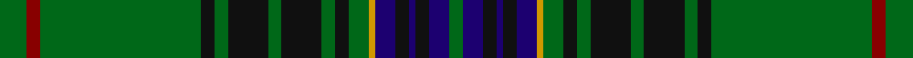

**Bands:** [GRGKGKGKGKGYBKBKBG](/stripes/grgkgkgkgkgybkbkbg/) · **Stripes:** [G R G K G K G K G K G LO DB K DB K DB G](/stripes/stripes18/) G R G K G K G K G K G LO DB K DB K DB G

This was sourced from tartans-authority.  It is a [18 band tartan](/bands/bands18/).

Original link http://www.tartansauthority.com/tartan-ferret/display/3847/

## Thread count
G/8 DR4 G48 K4 G4 K12 G4 K12 G4 K4 G6 DY2 DB6 K4 DB2 K4 DB6 G/4

## Palette
Each colour and its ΔE from the base-6 reference it is a variant of.

| Colour | Shade | Base | ΔE (OKLab) |
|---|---|---|---|
| DB | <code style="background-color:#1C0070;">#1C0070</code> `#1C0070` | B <code style="background-color:#2A418A;">#2A418A</code> | 0.14 |
| DR | <code style="background-color:#880000;">#880000</code> `#880000` | R <code style="background-color:#CC0000;">#CC0000</code> | 0.15 |
| DY | <code style="background-color:#D09800;">#D09800</code> `#D09800` | Y <code style="background-color:#F2BF00;">#F2BF00</code> | 0.12 |
| G | <code style="background-color:#006818;">#006818</code> `#006818` | G <code style="background-color:#006100;">#006100</code> | 0.02 |
| K | <code style="background-color:#101010;">#101010</code> `#101010` | K <code style="background-color:#000000;">#000000</code> | 0.17 |

## Nearest tartans

The nearest existing variants by ΔTartan distance.

1. [Sarafilovic](/setts/s16/db15k18g3k2g2k2g44ly4g44k2g2k2g3k18db15r4~x2/) — ΔT 0.55
1. [Kennedy](/setts/s17/db2dg2ly1dg3r1dg2r1dg13db4k3db3k3db3k3db4dg23r2~x2/) — ΔT 0.83
1. [Kinnear, Barony of (Personal)](/setts/s20/k4r2k8g3k8g36k8g3r4lb2r3lo2r4g3k8g36k8g3k8r2~x2/) — ΔT 0.90
1. [Kennedy Clan Tartan Tartan Number: 1123. Earliest known date: 1847 The Earls of Cassilis built Culzean Castle on the site of an ancient Kennedy stronghold. Dunure Castle near Culzean on the Ayrshire coast, was also owned by the Kennedys. The tartan was first recorded by MacIan in his book 'The Clans of the Scottish Highlands' (1847) which he co-authored with James Logan. See products available Copyright © Blair Urquhart, Comrie, 2015](/setts/s17/k2g2ly1g3m1g2m1g12db4k3db3k3db3k3db4g24r2~x2/) — ΔT 0.98
1. [Grand Lodge of Scotland](/setts/s16/g18k6g1k1db1k6db1k2db1k6db1k1g1k6g21ly1~x2/) — ΔT 0.99
1. [King Edward VII (Royal)](/setts/s17/ly8g84b21k10b10k10b10k10b21g62r3g6r3g10ly3g5r6/) — ΔT 1.00
1. [Cochrane of Dundonald](/setts/s13/g44r4g2r2g2r4g12k12r2db10r4db4ly3~x2/) — ΔT 1.15
1. [Kennedy #2](/setts/s15/ly8dg77db18k7db9k6db18dg64r4dg5r4dg9ly4dg5r6/) — ΔT 1.19
1. [Kennedy](/setts/s17/k2dg2ly1dg3dr1dg2dr1dg12db4k3db3k3db3k3db4dg24r2~x2/) — ΔT 1.23
1. [Blairgowrie](/setts/s17/k20y3db10g3db5g25k1g1w3g1k1g25db5g3db10y1db2~x4/) — ΔT 1.27

## Neighbour map

Every grey dot is one of 14299 variants placed by the first two principal components of the ΔTartan feature space (44% of its variance). Red is this tartan; blue dots are its nearest — click one to open its page.

<svg viewBox="0 0 640 380" role="img" style="max-width:100%;height:auto;border:1px solid #e0e0e0;border-radius:4px;display:block" xmlns="http://www.w3.org/2000/svg"><image href="/nn/cloud.v1.png" width="640" height="380"/><a href="/setts/s16/db15k18g3k2g2k2g44ly4g44k2g2k2g3k18db15r4~x2/"><circle cx="316.4" cy="121.1" r="4" fill="#3465a4"><title>Sarafilovic</title></circle></a><a href="/setts/s17/db2dg2ly1dg3r1dg2r1dg13db4k3db3k3db3k3db4dg23r2~x2/"><circle cx="335.4" cy="114.6" r="4" fill="#3465a4"><title>Kennedy</title></circle></a><a href="/setts/s20/k4r2k8g3k8g36k8g3r4lb2r3lo2r4g3k8g36k8g3k8r2~x2/"><circle cx="310.9" cy="111.0" r="4" fill="#3465a4"><title>Kinnear, Barony of (Personal)</title></circle></a><a href="/setts/s17/k2g2ly1g3m1g2m1g12db4k3db3k3db3k3db4g24r2~x2/"><circle cx="333.1" cy="99.6" r="4" fill="#3465a4"><title>Kennedy Clan Tartan Tartan Number: 1123. Earliest known date: 1847 The Earls of Cassilis built Culzean Castle on the site of an ancient Kennedy stronghold. Dunure Castle near Culzean on the Ayrshire coast, was also owned by the Kennedys. The tartan was first recorded by MacIan in his book 'The Clans of the Scottish Highlands' (1847) which he co-authored with James Logan. See products available Copyright © Blair Urquhart, Comrie, 2015</title></circle></a><a href="/setts/s16/g18k6g1k1db1k6db1k2db1k6db1k1g1k6g21ly1~x2/"><circle cx="369.5" cy="139.9" r="4" fill="#3465a4"><title>Grand Lodge of Scotland</title></circle></a><a href="/setts/s17/ly8g84b21k10b10k10b10k10b21g62r3g6r3g10ly3g5r6/"><circle cx="353.5" cy="105.9" r="4" fill="#3465a4"><title>King Edward VII (Royal)</title></circle></a><a href="/setts/s13/g44r4g2r2g2r4g12k12r2db10r4db4ly3~x2/"><circle cx="332.1" cy="113.6" r="4" fill="#3465a4"><title>Cochrane of Dundonald</title></circle></a><a href="/setts/s15/ly8dg77db18k7db9k6db18dg64r4dg5r4dg9ly4dg5r6/"><circle cx="402.0" cy="129.9" r="4" fill="#3465a4"><title>Kennedy #2</title></circle></a><a href="/setts/s17/k2dg2ly1dg3dr1dg2dr1dg12db4k3db3k3db3k3db4dg24r2~x2/"><circle cx="337.3" cy="105.5" r="4" fill="#3465a4"><title>Kennedy</title></circle></a><a href="/setts/s17/k20y3db10g3db5g25k1g1w3g1k1g25db5g3db10y1db2~x4/"><circle cx="276.0" cy="113.2" r="4" fill="#3465a4"><title>Blairgowrie</title></circle></a><circle cx="344.8" cy="111.6" r="5" fill="#c00000"/></svg>

ID: /setts/s18/g4r2g24k2g2k6g2k6g2k2g3lo1db3k2db1k2db3g2~x2/
