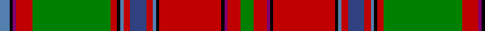

In pattern [BKBRGRKBRBRBKRKBRG](/patterns/bkbrgrkbrbrbkrkbrg/).

This was sourced from weddslist.  It is a [18 stripes tartan](/stripes/stripes18/).

Original link http://www.weddslist.com/cgi-bin/tartans/pg.pl?source=sts

## Thread count
Ba/6 K2 P2 R10 G48 R4 K2 Ba2 R4 B10 R4 Ba2 K2 R38 K2 P2 R8 G/8

## Palette
Each colour and its ΔE from the base-6 reference it is a variant of.

| Colour | Shade | Base | ΔE (OKLab) |
|---|---|---|---|
| B | <code style="background-color:#304080;">#304080</code> `#304080` | B <code style="background-color:#2A418A;">#2A418A</code> | 0.02 |
| Ba | <code style="background-color:#5480B0;">#5480B0</code> `#5480B0` | B <code style="background-color:#2A418A;">#2A418A</code> | 0.19 |
| G | <code style="background-color:#008000;">#008000</code> `#008000` | G <code style="background-color:#006100;">#006100</code> | 0.10 |
| K | <code style="background-color:#000000;">#000000</code> `#000000` | K <code style="background-color:#000000;">#000000</code> | 0.00 |
| P | <code style="background-color:#800070;">#800070</code> `#800070` | B <code style="background-color:#2A418A;">#2A418A</code> | 0.18 |
| R | <code style="background-color:#C00000;">#C00000</code> `#C00000` | R <code style="background-color:#CC0000;">#CC0000</code> | 0.03 |

## Nearest tartans

The nearest existing variants by ΔTartan distance.

1. [Sommerville](/setts/s18/w2r3ra6r48b4r2g16ra5r3ra5b20r5g3r5g54r3ra5y2~b2c2c80-g006818-rc80000-rae87878-we0e0e0-ye8c000~x2/) — ΔT 0.68
1. [Dundas (Red)](/setts/s18/g4r4b1k1r19k1ba1r2bb5r2ba1k1r2g24r5b1k1ba3~b840068-ba3c82af-bb2c4084-g005020-k101010-rdc0000~x2/) — ΔT 0.69
1. [Sommerville Family Tartan Tartan Number: 1861. Earliest known date: 1930 The specimen in the Society's collection was obtained about 1930 from the firm J Johnston of Edinburgh. It was descibed at the time as a modern family tartan. The cloth archive also contains a sample from the Lochcarron weavers. See products available Copyright © Blair Urquhart, Comrie, 2015](/setts/s18/w2r3ra5r48b4r2g17ra5r3ra5b21r5g3r5g54r3ra5y2~b2c2c80-g006818-rc80000-rad05054-we0e0e0-ye8c000/) — ΔT 0.80
1. [Sommerville](/setts/s18/w2r3ra5r48b4r2g17ra5r3ra5b21r5g3r5g54r3ra5y2~b304080-g008000-rc00000-rad03030-we0e0e0-yf0c000/) — ΔT 0.85
1. [O'Keefe](/setts/s22/k8r2k3y2k2w3k2ya12g22r2g2k1g2r2g22ya12k2w3k2y2k3r2~g8c7038-k101010-rc80000-we0e0e0-ye8c000-yaa08858~x2/) — ΔT 1.04
1. [North West Mounted Police](/setts/s16/r44b3w2g14w2ga4r4b2r4ga4w2ba12b6r6ga7w2~b441800-ba003c64-g006818-ga8c7038-r880000-wffffff~x2/) — ΔT 1.05
1. [MacDougall 7](/setts/s20/w1b2r1g22r3g1r3ba9b2r1b2g8r8g8r1ba1r22b2r2w1~b800080-ba304080-g008000-rc00000-we0e0e0~x2/) — ΔT 1.07
1. [Stewart of Ardshiel](/setts/s18/g14r6ra2k3r65k2b2r6k34r6b2k2r4g66r12ra2k2b4~b5480b0-g008000-k000030-rc00000-rad03030/) — ΔT 1.10
1. [MacDougall Clan Tartan Tartan Number: 1776. Earliest known date: 1977 Matched to a sample by B Urquhart in 2004, from Lochcarron reiver cloth. The purple colour was lightened considerably to a pale mauve, giving an almost equal prominence to the white. See products available Copyright © Blair Urquhart, Comrie, 2015](/setts/s20/w2r2wa2r22b2r2g8r8g8wa2r2wa2b9r3g1r3g22r2wa2w2~b2c2c80-g006818-rc80000-we0e0e0-wac49cd8~x2/) — ΔT 1.19
1. [MacDougall](/setts/s20/w1r3ra1g23ra3g1ra3b6r4ra1r4g6ra6g6ra2b1ra24r1ra1w1~b00004c-g004c00-rff4040-rac80000-wd0d0d0/) — ΔT 1.20

## Neighbour map

Every grey dot is one of 15726 variants placed by the first two principal components of the ΔTartan feature space (44% of its variance). Red is this tartan; blue dots are its nearest — click one to open its page.

<svg viewBox="0 0 640 380" role="img" style="max-width:100%;height:auto;border:1px solid #e0e0e0;border-radius:4px;display:block" xmlns="http://www.w3.org/2000/svg"><image href="/nn/cloud.v1.png" width="640" height="380"/><a href="/setts/s18/w2r3ra6r48b4r2g16ra5r3ra5b20r5g3r5g54r3ra5y2~b2c2c80-g006818-rc80000-rae87878-we0e0e0-ye8c000~x2/"><circle cx="230.3" cy="52.0" r="4" fill="#3465a4"><title>Sommerville</title></circle></a><a href="/setts/s18/g4r4b1k1r19k1ba1r2bb5r2ba1k1r2g24r5b1k1ba3~b840068-ba3c82af-bb2c4084-g005020-k101010-rdc0000~x2/"><circle cx="256.4" cy="56.0" r="4" fill="#3465a4"><title>Dundas (Red)</title></circle></a><a href="/setts/s18/w2r3ra5r48b4r2g17ra5r3ra5b21r5g3r5g54r3ra5y2~b2c2c80-g006818-rc80000-rad05054-we0e0e0-ye8c000/"><circle cx="238.7" cy="55.4" r="4" fill="#3465a4"><title>Sommerville Family Tartan Tartan Number: 1861. Earliest known date: 1930 The specimen in the Society's collection was obtained about 1930 from the firm J Johnston of Edinburgh. It was descibed at the time as a modern family tartan. The cloth archive also contains a sample from the Lochcarron weavers. See products available Copyright © Blair Urquhart, Comrie, 2015</title></circle></a><a href="/setts/s18/w2r3ra5r48b4r2g17ra5r3ra5b21r5g3r5g54r3ra5y2~b304080-g008000-rc00000-rad03030-we0e0e0-yf0c000/"><circle cx="238.5" cy="55.5" r="4" fill="#3465a4"><title>Sommerville</title></circle></a><a href="/setts/s22/k8r2k3y2k2w3k2ya12g22r2g2k1g2r2g22ya12k2w3k2y2k3r2~g8c7038-k101010-rc80000-we0e0e0-ye8c000-yaa08858~x2/"><circle cx="198.4" cy="59.9" r="4" fill="#3465a4"><title>O'Keefe</title></circle></a><a href="/setts/s16/r44b3w2g14w2ga4r4b2r4ga4w2ba12b6r6ga7w2~b441800-ba003c64-g006818-ga8c7038-r880000-wffffff~x2/"><circle cx="257.7" cy="68.7" r="4" fill="#3465a4"><title>North West Mounted Police</title></circle></a><a href="/setts/s20/w1b2r1g22r3g1r3ba9b2r1b2g8r8g8r1ba1r22b2r2w1~b800080-ba304080-g008000-rc00000-we0e0e0~x2/"><circle cx="251.0" cy="81.4" r="4" fill="#3465a4"><title>MacDougall 7</title></circle></a><a href="/setts/s18/g14r6ra2k3r65k2b2r6k34r6b2k2r4g66r12ra2k2b4~b5480b0-g008000-k000030-rc00000-rad03030/"><circle cx="263.9" cy="52.7" r="4" fill="#3465a4"><title>Stewart of Ardshiel</title></circle></a><a href="/setts/s20/w2r2wa2r22b2r2g8r8g8wa2r2wa2b9r3g1r3g22r2wa2w2~b2c2c80-g006818-rc80000-we0e0e0-wac49cd8~x2/"><circle cx="234.6" cy="82.5" r="4" fill="#3465a4"><title>MacDougall Clan Tartan Tartan Number: 1776. Earliest known date: 1977 Matched to a sample by B Urquhart in 2004, from Lochcarron reiver cloth. The purple colour was lightened considerably to a pale mauve, giving an almost equal prominence to the white. See products available Copyright © Blair Urquhart, Comrie, 2015</title></circle></a><a href="/setts/s20/w1r3ra1g23ra3g1ra3b6r4ra1r4g6ra6g6ra2b1ra24r1ra1w1~b00004c-g004c00-rff4040-rac80000-wd0d0d0/"><circle cx="254.3" cy="69.0" r="4" fill="#3465a4"><title>MacDougall</title></circle></a><circle cx="245.1" cy="54.1" r="5" fill="#c00000"/></svg>

ID: /setts/s18/g4r4b1k1r19k1ba1r2bb5r2ba1k1r2g24r5b1k1ba3~b800070-ba5480b0-bb304080-g008000-k000000-rc00000~x2/
