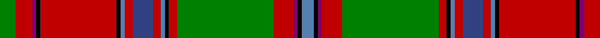

This page is one **sett** — a single exact thread-count. It belongs to the [tartan](/tartans/g4r4p1k1r19k1ba1r2b5r2ba1k1r2g24r5p1k1ba3/)
(the same proportion at any scale), whose colour order is pattern [BKBRGRKBRBRBKRKBRG](/stripes/bkbrgrkbrbrbkrkbrg/).

Sourced from weddslist.  It is a [18 stripe tartan](/stripes/stripes18/).

Original link http://www.weddslist.com/cgi-bin/tartans/pg.pl?source=sts

## Thread count
G/8 R8 P2 K2 R38 K2 Ba2 R4 B10 R4 Ba2 K2 R4 G48 R10 P2 K2 Ba/6

## Palette
Each colour and the base-6 reference it is a variant of.

| Colour | Shade | Base |
|---|---|---|
| B | <code style="background-color:#304080;">#304080</code> `oklch(39.4% 0.109 270.2)` <small>#304080</small> | B <code style="background-color:#2A418A;">#2A418A</code> |
| Ba | <code style="background-color:#5480B0;">#5480B0</code> `oklch(58.8% 0.089 251.5)` <small>#5480B0</small> | B <code style="background-color:#2A418A;">#2A418A</code> |
| G | <code style="background-color:#008000;">#008000</code> `oklch(52.0% 0.177 142.5)` <small>#008000</small> | G <code style="background-color:#006100;">#006100</code> |
| K | <code style="background-color:#000000;">#000000</code> `oklch(0.0% 0.000 0.0)` <small>#000000</small> | K <code style="background-color:#000000;">#000000</code> |
| P | <code style="background-color:#800070;">#800070</code> `oklch(41.1% 0.183 335.2)` <small>#800070</small> | B <code style="background-color:#2A418A;">#2A418A</code> |
| R | <code style="background-color:#C00000;">#C00000</code> `oklch(50.7% 0.208 29.2)` <small>#C00000</small> | R <code style="background-color:#CC0000;">#CC0000</code> |

## Nearest tartans

The nearest existing variants by ΔTartan distance, with this tartan at the top so the swatches line up against it.

ΔTartan

Tartan

Sett

—

<a href="/ttd/edit/#slug=g4r4dp1k1r19k1t1r2db5r2t1k1r2g24r5dp1k1t3~x2">Dundas, (Red)</a> <a class="nn-out" href="/setts/s18/g4r4dp1k1r19k1t1r2db5r2t1k1r2g24r5dp1k1t3~x2/" title="open its dictionary page">↗</a>

0.68

<a href="/ttd/edit/#slug=w2r3r6r48db4r2g16r5r3r5db20r5g3r5g54r3r5ly2~x2">Sommerville</a> <a class="nn-out" href="/setts/s18/w2r3r6r48db4r2g16r5r3r5db20r5g3r5g54r3r5ly2~x2/" title="open its dictionary page">↗</a>

0.69

<a href="/ttd/edit/#slug=dg4r4dp1k1r19k1t1r2db5r2t1k1r2dg24r5dp1k1t3~x2">Dundas (Red)</a> <a class="nn-out" href="/setts/s18/dg4r4dp1k1r19k1t1r2db5r2t1k1r2dg24r5dp1k1t3~x2/" title="open its dictionary page">↗</a>

0.84

<a href="/ttd/edit/#slug=w2r3r5r48db4r2g17r5r3r5db21r5g3r5g54r3r5ly2">Sommerville</a> <a class="nn-out" href="/setts/s18/w2r3r5r48db4r2g17r5r3r5db21r5g3r5g54r3r5ly2/" title="open its dictionary page">↗</a>

1.04

<a href="/setts/s22/k8r2k3ly2k2w3k2lo12y22r2y2k1~x2/">O'Keefe</a>

1.05

<a href="/ttd/edit/#slug=r44do3w2g14w2y4r4do2r4y4w2dt12do6r6y7w2~x2">North West Mounted Police</a> <a class="nn-out" href="/setts/s16/r44do3w2g14w2y4r4do2r4y4w2dt12do6r6y7w2~x2/" title="open its dictionary page">↗</a>

1.07

<a href="/ttd/edit/#slug=w1r2p2r22db1r1g8r8g8p2r1p2db9r3g1r3g22r1p2w1~x2">MacDougall 7</a> <a class="nn-out" href="/setts/s20/w1r2p2r22db1r1g8r8g8p2r1p2db9r3g1r3g22r1p2w1~x2/" title="open its dictionary page">↗</a>

1.11

<a href="/ttd/edit/#slug=g14r6r2k3r65k2t2r6k34r6t2k2r4g66r12r2k2t4">Stewart of Ardshiel</a> <a class="nn-out" href="/setts/s18/g14r6r2k3r65k2t2r6k34r6t2k2r4g66r12r2k2t4/" title="open its dictionary page">↗</a>

1.20

<a href="/ttd/edit/#slug=w2r2lp2r22db2r2g8r8g8lp2r2lp2db9r3g1r3g22r2lp2w2~x2">MacDougall Clan Tartan Tartan Number: 1776. Earliest known date: 1977 Matched to a sample by B Urquhart in 2004, from Lochcarron reiver cloth. The purple colour was lightened considerably to a pale mauve, giving an almost equal prominence to the white. See products available Copyright © Blair Urquhart, Comrie, 2015</a> <a class="nn-out" href="/setts/s20/w2r2lp2r22db2r2g8r8g8lp2r2lp2db9r3g1r3g22r2lp2w2~x2/" title="open its dictionary page">↗</a>

1.21

<a href="/ttd/edit/#slug=r6t4dg16lo2k1w6k1lo30r15lo30k1w6k1lo2dg16t4r6w1~x2">Westwood</a> <a class="nn-out" href="/setts/s18/r6t4dg16lo2k1w6k1lo30r15lo30k1w6k1lo2dg16t4r6w1~x2/" title="open its dictionary page">↗</a>

1.21

<a href="/ttd/edit/#slug=lb1r3r1dg23r3dg1r3db6r4r1r4dg6r6dg6r2db1r24r1r1lb1~x2">MacDougall</a> <a class="nn-out" href="/setts/s20/lb1r3r1dg23r3dg1r3db6r4r1r4dg6r6dg6r2db1r24r1r1lb1~x2/" title="open its dictionary page">↗</a>

## Neighbour map

Every grey dot is one of 14299 variants placed by the first two principal components of the ΔTartan feature space (44% of its variance). Red is this tartan; blue dots are its nearest — click one to open its page.

<svg viewBox="0 0 640 380" role="img" style="max-width:100%;height:auto;border:1px solid #e0e0e0;border-radius:4px;display:block" xmlns="http://www.w3.org/2000/svg"><image href="/nn/cloud.v1.png" width="640" height="380"/><a href="/setts/s18/w2r3r6r48db4r2g16r5r3r5db20r5g3r5g54r3r5ly2~x2/"><circle cx="231.8" cy="55.1" r="4" fill="#3465a4"><title>Sommerville</title></circle></a><a href="/setts/s18/dg4r4dp1k1r19k1t1r2db5r2t1k1r2dg24r5dp1k1t3~x2/"><circle cx="257.6" cy="58.1" r="4" fill="#3465a4"><title>Dundas (Red)</title></circle></a><a href="/setts/s18/w2r3r5r48db4r2g17r5r3r5db21r5g3r5g54r3r5ly2/"><circle cx="239.8" cy="59.6" r="4" fill="#3465a4"><title>Sommerville</title></circle></a><a href="/setts/s22/k8r2k3ly2k2w3k2lo12y22r2y2k1~x2/"><circle cx="200.0" cy="63.1" r="4" fill="#3465a4"><title>O'Keefe</title></circle></a><a href="/setts/s16/r44do3w2g14w2y4r4do2r4y4w2dt12do6r6y7w2~x2/"><circle cx="258.8" cy="71.1" r="4" fill="#3465a4"><title>North West Mounted Police</title></circle></a><a href="/setts/s20/w1r2p2r22db1r1g8r8g8p2r1p2db9r3g1r3g22r1p2w1~x2/"><circle cx="252.4" cy="83.7" r="4" fill="#3465a4"><title>MacDougall 7</title></circle></a><a href="/setts/s18/g14r6r2k3r65k2t2r6k34r6t2k2r4g66r12r2k2t4/"><circle cx="265.8" cy="52.9" r="4" fill="#3465a4"><title>Stewart of Ardshiel</title></circle></a><a href="/setts/s20/w2r2lp2r22db2r2g8r8g8lp2r2lp2db9r3g1r3g22r2lp2w2~x2/"><circle cx="236.0" cy="83.8" r="4" fill="#3465a4"><title>MacDougall Clan Tartan Tartan Number: 1776. Earliest known date: 1977 Matched to a sample by B Urquhart in 2004, from Lochcarron reiver cloth. The purple colour was lightened considerably to a pale mauve, giving an almost equal prominence to the white. See products available Copyright © Blair Urquhart, Comrie, 2015</title></circle></a><a href="/setts/s18/r6t4dg16lo2k1w6k1lo30r15lo30k1w6k1lo2dg16t4r6w1~x2/"><circle cx="212.8" cy="62.7" r="4" fill="#3465a4"><title>Westwood</title></circle></a><a href="/setts/s20/lb1r3r1dg23r3dg1r3db6r4r1r4dg6r6dg6r2db1r24r1r1lb1~x2/"><circle cx="255.2" cy="69.5" r="4" fill="#3465a4"><title>MacDougall</title></circle></a><circle cx="246.6" cy="55.8" r="5" fill="#c00000"/></svg>

ID: /setts/s18/g4r4dp1k1r19k1t1r2db5r2t1k1r2g24r5dp1k1t3~x2/
