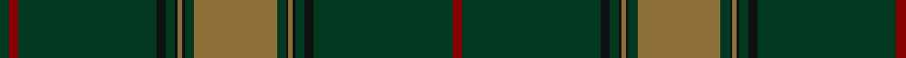

In pattern [GRGKGKGKGGGKGKGKGR](/patterns/grgkgkgkgggkgkgkgr/).

This was sourced from register-of-tartans.  It is a [18 stripes tartan](/stripes/stripes18/).

Original link https://www.tartanregister.gov.uk/tartanDetails.aspx?ref=3268

## Thread count
DG/4 DR4 DG60 K4 DG4 K1 LT2 K1 DG4 LT36 DG4 K1 LT2 K1 DG4 K4 DG60 DR/4

## Palette
Each colour and its ΔE from the base-6 reference it is a variant of.

| Colour | Shade | Base | ΔE (OKLab) |
|---|---|---|---|
| DG | <code style="background-color:#003820;">#003820</code> `#003820` | G <code style="background-color:#006100;">#006100</code> | 0.15 |
| DR | <code style="background-color:#880000;">#880000</code> `#880000` | R <code style="background-color:#CC0000;">#CC0000</code> | 0.15 |
| K | <code style="background-color:#101010;">#101010</code> `#101010` | K <code style="background-color:#000000;">#000000</code> | 0.17 |
| LT | <code style="background-color:#8C7038;">#8C7038</code> `#8C7038` | G <code style="background-color:#006100;">#006100</code> | 0.18 |

## Nearest tartans

The nearest existing variants by ΔTartan distance.

1. [Anderson Green](/setts/s15/g32b1y1g1k1r1k1r1k1b3g2k1r4k1y1~b4c3428-g003820-k101010-ra07c58-ydc943c~x4/) — ΔT 1.54
1. [Maxem Eyewear](/setts/s16/k8b78k8g8k4g4k4b13ga1b4k4w4k4b52k4ga1~b363732-g5f5c57-ga797013-k101010-wffffff~x4/) — ΔT 1.60
1. [Murphy and his Gang (Phoenix Arizona) (Personal)](/setts/s20/g29b1g2b2g2b3g2b5r1k1r1b5g2b3g2b2g2b1g14y3~b576982-g124b24-k120a01-r861031-yef8f06~x2/) — ΔT 1.63
1. [Wexford Irish County Tartan Tartan Number: 2251. Earliest known date: 1995 One of a series of Irish District tartans designed by Polly Wittering of the House of Edgar, with colours reminiscent of the Country with soft warm colours dominating. See products available Copyright © Blair Urquhart, Comrie, 2015](/setts/s14/g11ga6g6w1ga2w1g6ga6g36k1y3k1g5ga5~g3c6838-ga043828-k000000-we8e8e8-yd09000~x2/) — ΔT 1.64
1. [Orvis Sports Company (Corporate)](/setts/s10/g36ga4k1g2k1ga4k4ga60r4ga4~g8c7038-ga003820-k101010-r880000/) — ΔT 1.70
1. [Ridgeback (Corporate)](/setts/s12/g74r6g3r24k1g9r12b2g2b2g2b2~b2c2c80-g006818-k101010-r98481c~x2/) — ΔT 1.77
1. [New House Highland (Corporate)](/setts/s18/y3k1r22k1r1k10g1r1g11k1r4k1g8k1r4k1g48k1~g285800-k101010-r780028-ybc8c00~x2/) — ΔT 1.79
1. [Semper](/setts/s8/g16ga1gb4ga41gb1ga6gc2ga2~g408060-ga003820-gb789484-gc289c18~x2/) — ΔT 1.93
1. [Dark Lochnagar](/setts/s10/b6r1b40ba1b12r12ba6r2ra2r4~b343434-ba5c5c5c-r888888-rac80000~x2/) — ΔT 1.96
1. [Verdon](/setts/s10/b36k3g3ga1g3k3b4g6k1ga2~b1c1c1c-g285800-ga289c18-k101010~x4/) — ΔT 1.97

## Neighbour map

Every grey dot is one of 15726 variants placed by the first two principal components of the ΔTartan feature space (44% of its variance). Red is this tartan; blue dots are its nearest — click one to open its page.

<svg viewBox="0 0 640 380" role="img" style="max-width:100%;height:auto;border:1px solid #e0e0e0;border-radius:4px;display:block" xmlns="http://www.w3.org/2000/svg"><image href="/nn/cloud.v1.png" width="640" height="380"/><a href="/setts/s15/g32b1y1g1k1r1k1r1k1b3g2k1r4k1y1~b4c3428-g003820-k101010-ra07c58-ydc943c~x4/"><circle cx="480.9" cy="85.0" r="4" fill="#3465a4"><title>Anderson Green</title></circle></a><a href="/setts/s16/k8b78k8g8k4g4k4b13ga1b4k4w4k4b52k4ga1~b363732-g5f5c57-ga797013-k101010-wffffff~x4/"><circle cx="561.0" cy="99.9" r="4" fill="#3465a4"><title>Maxem Eyewear</title></circle></a><a href="/setts/s20/g29b1g2b2g2b3g2b5r1k1r1b5g2b3g2b2g2b1g14y3~b576982-g124b24-k120a01-r861031-yef8f06~x2/"><circle cx="483.7" cy="110.9" r="4" fill="#3465a4"><title>Murphy and his Gang (Phoenix Arizona) (Personal)</title></circle></a><a href="/setts/s14/g11ga6g6w1ga2w1g6ga6g36k1y3k1g5ga5~g3c6838-ga043828-k000000-we8e8e8-yd09000~x2/"><circle cx="493.8" cy="118.4" r="4" fill="#3465a4"><title>Wexford Irish County Tartan Tartan Number: 2251. Earliest known date: 1995 One of a series of Irish District tartans designed by Polly Wittering of the House of Edgar, with colours reminiscent of the Country with soft warm colours dominating. See products available Copyright © Blair Urquhart, Comrie, 2015</title></circle></a><a href="/setts/s10/g36ga4k1g2k1ga4k4ga60r4ga4~g8c7038-ga003820-k101010-r880000/"><circle cx="469.5" cy="119.4" r="4" fill="#3465a4"><title>Orvis Sports Company (Corporate)</title></circle></a><a href="/setts/s12/g74r6g3r24k1g9r12b2g2b2g2b2~b2c2c80-g006818-k101010-r98481c~x2/"><circle cx="539.8" cy="120.6" r="4" fill="#3465a4"><title>Ridgeback (Corporate)</title></circle></a><a href="/setts/s18/y3k1r22k1r1k10g1r1g11k1r4k1g8k1r4k1g48k1~g285800-k101010-r780028-ybc8c00~x2/"><circle cx="436.5" cy="86.3" r="4" fill="#3465a4"><title>New House Highland (Corporate)</title></circle></a><a href="/setts/s8/g16ga1gb4ga41gb1ga6gc2ga2~g408060-ga003820-gb789484-gc289c18~x2/"><circle cx="510.8" cy="152.7" r="4" fill="#3465a4"><title>Semper</title></circle></a><a href="/setts/s10/b6r1b40ba1b12r12ba6r2ra2r4~b343434-ba5c5c5c-r888888-rac80000~x2/"><circle cx="502.7" cy="142.3" r="4" fill="#3465a4"><title>Dark Lochnagar</title></circle></a><a href="/setts/s10/b36k3g3ga1g3k3b4g6k1ga2~b1c1c1c-g285800-ga289c18-k101010~x4/"><circle cx="510.7" cy="149.5" r="4" fill="#3465a4"><title>Verdon</title></circle></a><circle cx="537.4" cy="101.2" r="5" fill="#c00000"/></svg>

ID: /setts/s18/g4r4g60k4g4k1ga2k1g4ga36g4k1ga2k1g4k4g60r4~g003820-ga8c7038-k101010-r880000/
