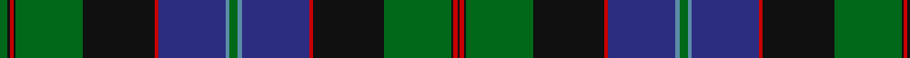

In pattern [GKRKGKRBBGBBRKGKRK](/patterns/gkrkgkrbbgbbrkgkrk/).

This was sourced from register-of-tartans.  It is a [18 stripes tartan](/stripes/stripes18/).

Original link https://www.tartanregister.gov.uk/tartanDetails.aspx?ref=2159

## Thread count
G/8 K2 R4 K2 G66 K70 R4 DB66 B4 G8 B4 DB66 R4 K70 G66 K2 R4 K/2

## Palette
Each colour and its ΔE from the base-6 reference it is a variant of.

| Colour | Shade | Base | ΔE (OKLab) |
|---|---|---|---|
| B | <code style="background-color:#5C8CA8;">#5C8CA8</code> `#5C8CA8` | B <code style="background-color:#2A418A;">#2A418A</code> | 0.23 |
| DB | <code style="background-color:#2C2C80;">#2C2C80</code> `#2C2C80` | B <code style="background-color:#2A418A;">#2A418A</code> | 0.06 |
| DBa | <code style="background-color:#202060;">#202060</code> `#202060` | B <code style="background-color:#2A418A;">#2A418A</code> | 0.11 |
| DG | <code style="background-color:#003820;">#003820</code> `#003820` | G <code style="background-color:#006100;">#006100</code> | 0.15 |
| G | <code style="background-color:#006818;">#006818</code> `#006818` | G <code style="background-color:#006100;">#006100</code> | 0.02 |
| K | <code style="background-color:#101010;">#101010</code> `#101010` | K <code style="background-color:#000000;">#000000</code> | 0.17 |
| LG | <code style="background-color:#789484;">#789484</code> `#789484` | G <code style="background-color:#006100;">#006100</code> | 0.24 |
| R | <code style="background-color:#C80000;">#C80000</code> `#C80000` | R <code style="background-color:#CC0000;">#CC0000</code> | 0.01 |

## Nearest tartans

The nearest existing variants by ΔTartan distance.

1. [Sinclair-Brown (Personal)](/setts/s14/b128k22r4k8r4k8g64y8g64k8r4k8r4k22-b2c2c80-g006818-k101010-rc80000-ybc8c00/) — ΔT 0.74
1. [Ogilvie of Inverarity (V.S.)](/setts/s14/b56y2b4k52g48k2g4r6g4k2g48k52b4y2-b2c2c80-g006818-k101010-rc80000-ye8c000/) — ΔT 0.86
1. [Blairlogie or Blair Athol](/setts/s17/k112r4b32g8b16g76k8g4w8g4k4g76b16g8b32r8b12-b202060-g006818-k101010-rc80000-we0e0e0/) — ΔT 0.92
1. [Cooper/Couper](/setts/s18/r4ra6b4g64b6g2b6k28ra6b4ra6g24b2k2b60ra8b4ra4-b2c4084-g005020-k101010-rdc0000-rafa6496/) — ΔT 0.96
1. [Jardine Dress](/setts/s22/r26k2r6k2r6k20y2b44y2k6g64k3g64k6y2b44y2k20r6k2r6k2-b2c2c80-g005030-k101010-rc80000-yb8b8b8/) — ΔT 0.97
1. [Glynn of Glynnstewart (Personal)](/setts/s14/b40k4g6k4b40r6k40r4k40r6g60y6g2y4-b2c2c80-g006818-k101010-rc80000-ye8c000/) — ΔT 0.98
1. [MacDonald of Clanranald #4](/setts/s14/b40r4b6r12b64r4k64w4g60r12g8r4g8w2-b2c4084-g005020-k101010-rdc0000-we0e0e0/) — ΔT 1.03
1. [Rankin, John (Personal)](/setts/s16/b4k2g30w4g30k2b4k2r4k40b4k4b4k4b50k2-b5f749c-g285800-k101010-rc82828-we0e0e0/) — ΔT 1.06
1. [Robertson Hunting](/setts/s15/b48k4b4k4b4k24g32k2r4k2g32k24b24k2w6-b2c2c80-g006818-k101010-rc80000-wfcfcfc/) — ΔT 1.09
1. [Baron of Greencastle Htg (Personal)](/setts/s13/b8y4g48y4k24b6k4b4k4b28r2b2r6-b2c2c80-g006818-k101010-r880000-ye8c000/) — ΔT 1.11

## Neighbour map

Every grey dot is one of 15726 variants placed by the first two principal components of the ΔTartan feature space (44% of its variance). Red is this tartan; blue dots are its nearest — click one to open its page.

<svg viewBox="0 0 640 380" role="img" style="max-width:100%;height:auto;border:1px solid #e0e0e0;border-radius:4px;display:block" xmlns="http://www.w3.org/2000/svg"><image href="/nn/cloud.v1.png" width="640" height="380"/><a href="/setts/s14/b128k22r4k8r4k8g64y8g64k8r4k8r4k22-b2c2c80-g006818-k101010-rc80000-ybc8c00/"><circle cx="251.7" cy="98.1" r="4" fill="#3465a4"><title>Sinclair-Brown (Personal)</title></circle></a><a href="/setts/s14/b56y2b4k52g48k2g4r6g4k2g48k52b4y2-b2c2c80-g006818-k101010-rc80000-ye8c000/"><circle cx="245.4" cy="118.1" r="4" fill="#3465a4"><title>Ogilvie of Inverarity (V.S.)</title></circle></a><a href="/setts/s17/k112r4b32g8b16g76k8g4w8g4k4g76b16g8b32r8b12-b202060-g006818-k101010-rc80000-we0e0e0/"><circle cx="252.9" cy="102.6" r="4" fill="#3465a4"><title>Blairlogie or Blair Athol</title></circle></a><a href="/setts/s18/r4ra6b4g64b6g2b6k28ra6b4ra6g24b2k2b60ra8b4ra4-b2c4084-g005020-k101010-rdc0000-rafa6496/"><circle cx="246.2" cy="80.1" r="4" fill="#3465a4"><title>Cooper/Couper</title></circle></a><a href="/setts/s22/r26k2r6k2r6k20y2b44y2k6g64k3g64k6y2b44y2k20r6k2r6k2-b2c2c80-g005030-k101010-rc80000-yb8b8b8/"><circle cx="237.2" cy="79.6" r="4" fill="#3465a4"><title>Jardine Dress</title></circle></a><a href="/setts/s14/b40k4g6k4b40r6k40r4k40r6g60y6g2y4-b2c2c80-g006818-k101010-rc80000-ye8c000/"><circle cx="200.3" cy="111.2" r="4" fill="#3465a4"><title>Glynn of Glynnstewart (Personal)</title></circle></a><a href="/setts/s14/b40r4b6r12b64r4k64w4g60r12g8r4g8w2-b2c4084-g005020-k101010-rdc0000-we0e0e0/"><circle cx="229.4" cy="104.2" r="4" fill="#3465a4"><title>MacDonald of Clanranald #4</title></circle></a><a href="/setts/s16/b4k2g30w4g30k2b4k2r4k40b4k4b4k4b50k2-b5f749c-g285800-k101010-rc82828-we0e0e0/"><circle cx="219.1" cy="96.2" r="4" fill="#3465a4"><title>Rankin, John (Personal)</title></circle></a><a href="/setts/s15/b48k4b4k4b4k24g32k2r4k2g32k24b24k2w6-b2c2c80-g006818-k101010-rc80000-wfcfcfc/"><circle cx="210.6" cy="122.9" r="4" fill="#3465a4"><title>Robertson Hunting</title></circle></a><a href="/setts/s13/b8y4g48y4k24b6k4b4k4b28r2b2r6-b2c2c80-g006818-k101010-r880000-ye8c000/"><circle cx="200.4" cy="112.2" r="4" fill="#3465a4"><title>Baron of Greencastle Htg (Personal)</title></circle></a><circle cx="231.4" cy="96.2" r="5" fill="#c00000"/></svg>

ID: /setts/s18/g8k2r4k2g66k70r4b66ba4g8ba4b66r4k70g66k2r4k2-b2c2c80-ba5c8ca8-g006818-k101010-rc80000/
