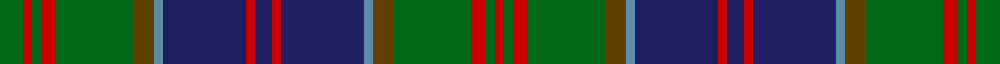

In pattern [GRGRGGBBRBRBBGGRGR](/stripes/grgrggbbrbrbbggrgr/).

This was sourced from register-of-tartans.  It is a [18 stripe tartan](/stripes/stripes18/).

Original link https://www.tartanregister.gov.uk/tartanDetails.aspx?ref=3936

## Also known as

This cloth is also recorded under:

- Stewart of Appin Hunting

## Register references

External register numbers recorded for this tartan.

- Scottish Register of Tartans: [3936](https://www.tartanregister.gov.uk/tartanDetails.aspx?ref=3936)
- Scottish Tartans Authority (ITI): 430
- Scottish Tartans World Register: 430

## Thread count
G/16 R6 G6 R10 G52 T14 B6 DB56 R6 DB12 R6 DB56 B6 T14 G52 R10 G6 R/6

## Palette
Each colour and its ΔE from the base-6 reference it is a variant of.

| Colour | Shade | Base | ΔE (OKLab) |
|---|---|---|---|
| B | <code style="background-color:#5C8CA8;">#5C8CA8</code> `#5C8CA8` | B <code style="background-color:#2A418A;">#2A418A</code> | 0.23 |
| DB | <code style="background-color:#202060;">#202060</code> `#202060` | B <code style="background-color:#2A418A;">#2A418A</code> | 0.11 |
| DR | <code style="background-color:#441800;">#441800</code> `#441800` | B <code style="background-color:#2A418A;">#2A418A</code> | 0.23 |
| G | <code style="background-color:#006818;">#006818</code> `#006818` | G <code style="background-color:#006100;">#006100</code> | 0.02 |
| R | <code style="background-color:#C80000;">#C80000</code> `#C80000` | R <code style="background-color:#CC0000;">#CC0000</code> | 0.01 |
| T | <code style="background-color:#604000;">#604000</code> `#604000` | G <code style="background-color:#006100;">#006100</code> | 0.14 |

## Nearest tartans

The nearest existing variants by ΔTartan distance.

1. [Cooper/Couper (James Cant)](/setts/s18/r2m3db2g18db3g2db3k10m3g2m3g8db2k2db14m3db2r2~x2/) — ΔT 0.83
1. [78th Regiment (Highlanders) (Mil.)](/setts/s15/dt30k5dt5k5dt5k31dg31k3w7k3dg31k31dt31k3r7/) — ΔT 0.94
1. [Cochrane (1984)](/setts/s15/dg16r2dg2r1dg3r1dg2r2dg12k12r1db16r2db8ly2~x2/) — ΔT 0.97
1. [Mantle Tartan Tartan Number: 6945. Earliest known date: 2006 A combination of Sinclair Hunting and MacQueen tartans relating to the clan associations of the the two families, Swan and Sinclair. See products available Copyright © Blair Urquhart, Comrie, 2015](/setts/s14/r3g2r3g18k14w2db16g3~x2/) — ΔT 1.01
1. [Bell's Whisky (SA)](/setts/s12/dg10lb2dg18k3dg3k3dg3k18n24k3n3lo3~x2/) — ΔT 1.02
1. [Baillie (William Wilson)](/setts/s15/db28k4db4k4db4k28g27k3ly5k3g27k28db27k3r5~x2/) — ΔT 1.05
1. [Jones Hunting](/setts/s18/g24dp4g3dp8k3t8dp2t2dp4t2dp2t8k3dp8g3dp4g24g2~x2/) — ΔT 1.06
1. [Ogilvie of Inverarity (Wilson) / Ochterlonie](/setts/s16/db20ly3k7g11k2g3k2g3r4~x2/) — ΔT 1.06
1. [Unidentified (Teddy Bear)](/setts/s15/dg30ly2dg5ly2dg4k15db29r2db29k15dg5ly2dg4ly2dg17~x2/) — ΔT 1.08
1. [Scottish Power Corporate Tartan Tartan Number: 2435. Earliest known date: pre 1996 Designed by Lochcarron for Scottish Power using the main corporate colours and taking care to produce a sett that could be seen as pipe band kilts at a distance. Scottish Power say (9.12.02) that Kinloch Anderson deal with this tartan and that permission to order/wear it is required from Scottish Power, Corporate Communications, 0141 566 4856. . See products available Copyright © Blair Urquhart, Comrie, 2015](/setts/s14/dg8r3dg8k10dp5g32dg5g32dp5k10dg8r3dg8dp3~x2/) — ΔT 1.12

## Neighbour map

Every grey dot is one of 14299 variants placed by the first two principal components of the ΔTartan feature space (44% of its variance). Red is this tartan; blue dots are its nearest — click one to open its page.

<svg viewBox="0 0 640 380" role="img" style="max-width:100%;height:auto;border:1px solid #e0e0e0;border-radius:4px;display:block" xmlns="http://www.w3.org/2000/svg"><image href="/nn/cloud.v1.png" width="640" height="380"/><a href="/setts/s18/r2m3db2g18db3g2db3k10m3g2m3g8db2k2db14m3db2r2~x2/"><circle cx="157.9" cy="149.7" r="4" fill="#3465a4"><title>Cooper/Couper (James Cant)</title></circle></a><a href="/setts/s15/dt30k5dt5k5dt5k31dg31k3w7k3dg31k31dt31k3r7/"><circle cx="182.5" cy="176.8" r="4" fill="#3465a4"><title>78th Regiment (Highlanders) (Mil.)</title></circle></a><a href="/setts/s15/dg16r2dg2r1dg3r1dg2r2dg12k12r1db16r2db8ly2~x2/"><circle cx="233.1" cy="144.9" r="4" fill="#3465a4"><title>Cochrane (1984)</title></circle></a><a href="/setts/s14/r3g2r3g18k14w2db16g3~x2/"><circle cx="163.8" cy="179.7" r="4" fill="#3465a4"><title>Mantle Tartan Tartan Number: 6945. Earliest known date: 2006 A combination of Sinclair Hunting and MacQueen tartans relating to the clan associations of the the two families, Swan and Sinclair. See products available Copyright © Blair Urquhart, Comrie, 2015</title></circle></a><a href="/setts/s12/dg10lb2dg18k3dg3k3dg3k18n24k3n3lo3~x2/"><circle cx="210.0" cy="168.1" r="4" fill="#3465a4"><title>Bell's Whisky (SA)</title></circle></a><a href="/setts/s15/db28k4db4k4db4k28g27k3ly5k3g27k28db27k3r5~x2/"><circle cx="181.3" cy="175.5" r="4" fill="#3465a4"><title>Baillie (William Wilson)</title></circle></a><a href="/setts/s18/g24dp4g3dp8k3t8dp2t2dp4t2dp2t8k3dp8g3dp4g24g2~x2/"><circle cx="238.8" cy="137.9" r="4" fill="#3465a4"><title>Jones Hunting</title></circle></a><a href="/setts/s16/db20ly3k7g11k2g3k2g3r4~x2/"><circle cx="166.3" cy="157.1" r="4" fill="#3465a4"><title>Ogilvie of Inverarity (Wilson) / Ochterlonie</title></circle></a><a href="/setts/s15/dg30ly2dg5ly2dg4k15db29r2db29k15dg5ly2dg4ly2dg17~x2/"><circle cx="230.5" cy="157.6" r="4" fill="#3465a4"><title>Unidentified (Teddy Bear)</title></circle></a><a href="/setts/s14/dg8r3dg8k10dp5g32dg5g32dp5k10dg8r3dg8dp3~x2/"><circle cx="239.7" cy="176.0" r="4" fill="#3465a4"><title>Scottish Power Corporate Tartan Tartan Number: 2435. Earliest known date: pre 1996 Designed by Lochcarron for Scottish Power using the main corporate colours and taking care to produce a sett that could be seen as pipe band kilts at a distance. Scottish Power say (9.12.02) that Kinloch Anderson deal with this tartan and that permission to order/wear it is required from Scottish Power, Corporate Communications, 0141 566 4856. . See products available Copyright © Blair Urquhart, Comrie, 2015</title></circle></a><circle cx="202.4" cy="155.3" r="5" fill="#c00000"/></svg>

ID: /setts/s18/g8r3g3r5g26dy7t3db28r3db6~x2/
