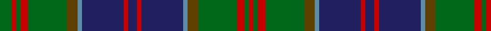

In pattern [GRGRGGBBRBRBBGGRGR](/patterns/grgrggbbrbrbbggrgr/).

This was sourced from register-of-tartans.  It is a [18 stripes tartan](/stripes/stripes18/).

Original link https://www.tartanregister.gov.uk/tartanDetails.aspx?ref=3936

## Register references

External register numbers recorded for this tartan.

- Scottish Register of Tartans: [3936](https://www.tartanregister.gov.uk/tartanDetails.aspx?ref=3936)
- Scottish Tartans Authority (ITI): 430
- Scottish Tartans World Register: 430

## Thread count
G/16 R6 G6 R10 G52 T14 B6 DB56 R6 DB12 R6 DB56 B6 T14 G52 R10 G6 R/6

## Palette
Each colour and its ΔE from the base-6 reference it is a variant of.

| Colour | Shade | Base | ΔE (OKLab) |
|---|---|---|---|
| B | <code style="background-color:#5C8CA8;">#5C8CA8</code> `#5C8CA8` | B <code style="background-color:#2A418A;">#2A418A</code> | 0.23 |
| DB | <code style="background-color:#202060;">#202060</code> `#202060` | B <code style="background-color:#2A418A;">#2A418A</code> | 0.11 |
| DR | <code style="background-color:#441800;">#441800</code> `#441800` | B <code style="background-color:#2A418A;">#2A418A</code> | 0.23 |
| G | <code style="background-color:#006818;">#006818</code> `#006818` | G <code style="background-color:#006100;">#006100</code> | 0.02 |
| R | <code style="background-color:#C80000;">#C80000</code> `#C80000` | R <code style="background-color:#CC0000;">#CC0000</code> | 0.01 |
| T | <code style="background-color:#604000;">#604000</code> `#604000` | G <code style="background-color:#006100;">#006100</code> | 0.14 |

## Nearest tartans

The nearest existing variants by ΔTartan distance.

1. [Cooper/Couper (James Cant)](/setts/s18/r2ra3b2g18b3g2b3k10ra3g2ra3g8b2k2b14ra3b2r2~b202060-g006818-k101010-rc80000-rab468ac~x2/) — ΔT 0.84
1. [78th Regiment (Highlanders) (Mil.)](/setts/s15/b30k5b5k5b5k31g31k3w7k3g31k31b31k3r7~b244870-g285800-k101010-rc80000-we0e0e0/) — ΔT 0.93
1. [Cochrane (1984)](/setts/s15/g16r2g2r1g3r1g2r2g12k12r1b16r2b8y2~b2c4084-g005020-k101010-rdc0000-ye8c000~x2/) — ΔT 0.97
1. [Ochiltree Family Tartan Tartan Number: 321. Earliest known date: 1988 O'Sullivan McCragh was designed by Chris Aitken for Geoffrey (Tailor) Highland Crafts Ltd. in June 1994. See products available Copyright © Blair Urquhart, Comrie, 2015](/setts/s19/b12k1g2k1g2k1b12r2k12y1k12r2g12k1b2k1b2k1g12~b2c2c80-g006818-k101010-rc80000-ye8c000~x2/) — ΔT 0.98
1. [Mantle Tartan Tartan Number: 6945. Earliest known date: 2006 A combination of Sinclair Hunting and MacQueen tartans relating to the clan associations of the the two families, Swan and Sinclair. See products available Copyright © Blair Urquhart, Comrie, 2015](/setts/s14/r3g2r3g18k14w2b16g3b16w2k14g18r3g2~b2c4080-g006818-k101010-r880000-wd8d8d8~x2/) — ΔT 1.01
1. [Bell's Whisky (SA)](/setts/s12/g10w2g18k3g3k3g3k18b24k3b3y3~b784878-g005030-k101010-wd0d0d0-ybc8c00~x2/) — ΔT 1.02
1. [Baillie (William Wilson)](/setts/s15/b28k4b4k4b4k28g27k3y5k3g27k28b27k3r5~b2c2c80-g006818-k101010-rc80000-yd8b000~x2/) — ΔT 1.05
1. [Ogilvie of Inverarity (Wilson) / Ochterlonie](/setts/s16/b20y3k7g11k2g3k2g3r4g3k2g3k2g11k7y3~b2c2c80-g006818-k101010-rc80000-yd8b000~x2/) — ΔT 1.06
1. [Jones Hunting](/setts/s18/g24b4g3b8k3ba8b2ba2b4ba2b2ba8k3b8g3b4g24ga2~b780078-ba2888c4-g006818-ga289c18-k101010~x2/) — ΔT 1.06
1. [Baillie Clan Tartan Tartan Number: 278. Earliest known date: 1800 The pattern books of the old firm of weavers, Wilson's of Bannockburn, provide a definitive source for the Baillie tartan. Wilson's were in business with a monopoly to supply tartan to the regiments. Wilson supplied the MacLeods, the MacKenzies and the Campbells with variations of the basic 'Black Watch' regimental sett. The Fencibles regiments were formed as a 'home guard' at the time of the Napoleonic Wars. Baillies Fencibles were disbanded in 1802 and it has been suggested that it was the white stripe of the MacKenzie turned yellow with age, that became the Baillie tartan some years later. Scoured but unbleached wool turns yellow in the course of a few years, but this theory is discounted by an entry in Wilson's manuscript notebooks of 1800, that 'this was the sett in which the Baillie Fencibles were clothed'. See products available Copyright © Blair Urquhart, Comrie, 2015](/setts/s15/b28k4b4k4b4k28g26k3y5k3g26k28b26k3r5~b2c2c80-g006818-k101010-rc80000-ye8c000/) — ΔT 1.08

## Neighbour map

Every grey dot is one of 15726 variants placed by the first two principal components of the ΔTartan feature space (44% of its variance). Red is this tartan; blue dots are its nearest — click one to open its page.

<svg viewBox="0 0 640 380" role="img" style="max-width:100%;height:auto;border:1px solid #e0e0e0;border-radius:4px;display:block" xmlns="http://www.w3.org/2000/svg"><image href="/nn/cloud.v1.png" width="640" height="380"/><a href="/setts/s18/r2ra3b2g18b3g2b3k10ra3g2ra3g8b2k2b14ra3b2r2~b202060-g006818-k101010-rc80000-rab468ac~x2/"><circle cx="154.6" cy="144.1" r="4" fill="#3465a4"><title>Cooper/Couper (James Cant)</title></circle></a><a href="/setts/s15/b30k5b5k5b5k31g31k3w7k3g31k31b31k3r7~b244870-g285800-k101010-rc80000-we0e0e0/"><circle cx="179.3" cy="169.5" r="4" fill="#3465a4"><title>78th Regiment (Highlanders) (Mil.)</title></circle></a><a href="/setts/s15/g16r2g2r1g3r1g2r2g12k12r1b16r2b8y2~b2c4084-g005020-k101010-rdc0000-ye8c000~x2/"><circle cx="230.3" cy="138.6" r="4" fill="#3465a4"><title>Cochrane (1984)</title></circle></a><a href="/setts/s19/b12k1g2k1g2k1b12r2k12y1k12r2g12k1b2k1b2k1g12~b2c2c80-g006818-k101010-rc80000-ye8c000~x2/"><circle cx="181.0" cy="138.1" r="4" fill="#3465a4"><title>Ochiltree Family Tartan Tartan Number: 321. Earliest known date: 1988 O'Sullivan McCragh was designed by Chris Aitken for Geoffrey (Tailor) Highland Crafts Ltd. in June 1994. See products available Copyright © Blair Urquhart, Comrie, 2015</title></circle></a><a href="/setts/s14/r3g2r3g18k14w2b16g3b16w2k14g18r3g2~b2c4080-g006818-k101010-r880000-wd8d8d8~x2/"><circle cx="160.5" cy="173.6" r="4" fill="#3465a4"><title>Mantle Tartan Tartan Number: 6945. Earliest known date: 2006 A combination of Sinclair Hunting and MacQueen tartans relating to the clan associations of the the two families, Swan and Sinclair. See products available Copyright © Blair Urquhart, Comrie, 2015</title></circle></a><a href="/setts/s12/g10w2g18k3g3k3g3k18b24k3b3y3~b784878-g005030-k101010-wd0d0d0-ybc8c00~x2/"><circle cx="207.2" cy="161.7" r="4" fill="#3465a4"><title>Bell's Whisky (SA)</title></circle></a><a href="/setts/s15/b28k4b4k4b4k28g27k3y5k3g27k28b27k3r5~b2c2c80-g006818-k101010-rc80000-yd8b000~x2/"><circle cx="177.8" cy="169.2" r="4" fill="#3465a4"><title>Baillie (William Wilson)</title></circle></a><a href="/setts/s16/b20y3k7g11k2g3k2g3r4g3k2g3k2g11k7y3~b2c2c80-g006818-k101010-rc80000-yd8b000~x2/"><circle cx="163.0" cy="152.6" r="4" fill="#3465a4"><title>Ogilvie of Inverarity (Wilson) / Ochterlonie</title></circle></a><a href="/setts/s18/g24b4g3b8k3ba8b2ba2b4ba2b2ba8k3b8g3b4g24ga2~b780078-ba2888c4-g006818-ga289c18-k101010~x2/"><circle cx="236.0" cy="133.3" r="4" fill="#3465a4"><title>Jones Hunting</title></circle></a><a href="/setts/s15/b28k4b4k4b4k28g26k3y5k3g26k28b26k3r5~b2c2c80-g006818-k101010-rc80000-ye8c000/"><circle cx="177.1" cy="168.6" r="4" fill="#3465a4"><title>Baillie Clan Tartan Tartan Number: 278. Earliest known date: 1800 The pattern books of the old firm of weavers, Wilson's of Bannockburn, provide a definitive source for the Baillie tartan. Wilson's were in business with a monopoly to supply tartan to the regiments. Wilson supplied the MacLeods, the MacKenzies and the Campbells with variations of the basic 'Black Watch' regimental sett. The Fencibles regiments were formed as a 'home guard' at the time of the Napoleonic Wars. Baillies Fencibles were disbanded in 1802 and it has been suggested that it was the white stripe of the MacKenzie turned yellow with age, that became the Baillie tartan some years later. Scoured but unbleached wool turns yellow in the course of a few years, but this theory is discounted by an entry in Wilson's manuscript notebooks of 1800, that 'this was the sett in which the Baillie Fencibles were clothed'. See products available Copyright © Blair Urquhart, Comrie, 2015</title></circle></a><circle cx="199.6" cy="148.7" r="5" fill="#c00000"/></svg>

ID: /setts/s18/g8r3g3r5g26ga7b3ba28r3ba6r3ba28b3ga7g26r5g3r3~b5c8ca8-ba202060-g006818-ga604000-rc80000~x2/
