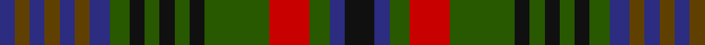

In pattern [BGBGBGBGKGKGKGRGBK](/patterns/bgbgbgbgkgkgkgrgbk/).

This was sourced from register-of-tartans.  It is a [18 stripes tartan](/stripes/stripes18/).

Original link https://www.tartanregister.gov.uk/tartanDetails.aspx?ref=1355

## Attestations

This cloth appears in 3 source records; the oldest owns this page.

- 01/01/1815 — Glasgow Celtic Society (register-of-tartans, [record](https://www.tartanregister.gov.uk/tartanDetails.aspx?ref=1355))
- 1815 — Glasgow Celtic Society (Corporate) (tartans-authority, [record](http://www.tartansauthority.com/tartan-ferret/display/594/))
- 01/01/1968 — Forbes of Druminnor (register-of-tartans, [record](https://www.tartanregister.gov.uk/tartanDetails.aspx?ref=1224))

## Thread count
DB/6 T6 DB6 T6 DB6 T6 DB8 G8 K6 G6 K6 G6 K6 G26 R16 G8 DB6 K/12

## Palette
Each colour and its ΔE from the base-6 reference it is a variant of.

| Colour | Shade | Base | ΔE (OKLab) |
|---|---|---|---|
| DB | <code style="background-color:#2C2C80;">#2C2C80</code> `#2C2C80` | B <code style="background-color:#2C4084;">#2C4084</code> | 0.05 |
| G | <code style="background-color:#285800;">#285800</code> `#285800` | G <code style="background-color:#006400;">#006400</code> | 0.04 |
| K | <code style="background-color:#101010;">#101010</code> `#101010` | K <code style="background-color:#000000;">#000000</code> | 0.17 |
| R | <code style="background-color:#C80000;">#C80000</code> `#C80000` | R <code style="background-color:#C80000;">#C80000</code> | 0.00 |
| T | <code style="background-color:#604000;">#604000</code> `#604000` | G <code style="background-color:#006400;">#006400</code> | 0.14 |

## Nearest tartans

The nearest existing variants by ΔTartan distance.

1. [Not Specified #2](/setts/s18/b16g6b6g6b6g6b8ga8k6ga6k6ga6k6ga26r16ga8b6k12-b2c2c80-g604000-ga006818-k101010-rc80000/) — ΔT 0.52
1. [MacRae #2](/setts/s15/g12k6g14r6g12k26b26k6b26k26g6w6g12k6r8-b2c4084-g005020-k101010-rdc0000-we0e0e0/) — ΔT 1.15
1. [Ellenee](/setts/s22/k18r6k6b22k6g22k6g6k6g22k6b22k6r6k18r6k6g22k6b22k6b6-b506878-g30644c-k101010-r901c38/) — ΔT 1.22
1. [Niagara Falls](/setts/s12/b44g8b8g34ga34g34b8g8b44y16ga16r16-b14283c-g408060-ga604000-rc80000-ye8c000/) — ΔT 1.33
1. [Maple Leaf](/setts/s12/g48r8g8r32ga32r32g8r8g48ra16ga16gb32-g003000-ga008000-gb607030-r900030-ra806050/) — ΔT 1.34
1. [Allen (1998)](/setts/s21/g4r4g24k8b22r4b22k8b4k18b4k18b4k8b22y4b22k8g24r4g4-b304c78-g006818-k101010-rc80000-ye8c000/) — ΔT 1.35
1. [Terre D'Ecosse](/setts/s14/w6g14k6g6k6g6k26ga32y6ga32k26g32k6w6-g406054-ga003820-k101010-we0e0e0-ybc8c00/) — ΔT 1.35
1. [Crosby (Personal)](/setts/s13/w6g36ga12b12ga12ba36ga6ba36ga12b12ga12g36y6-b903490-ba4c0c28-g003014-ga004c00-wc8c8c8-yc88c00/) — ΔT 1.36
1. [Niagra Falls Trade Tartan Tartan Number: 1915. Earliest known date: 1967 Designed to be used in the refurbishing of Johnstons of Elgin new mill shop and based on the colours of the mill shop house style. The lighter square is represented here as green from the 'Antique' colour range, a speciality of Johnstons of Elgin. See products available Copyright © Blair Urquhart, Comrie, 2015](/setts/s12/b44g8b8g34ga34g34b8g8b44y16ga16r16-b2c2c80-g006818-ga604000-rc80000-ye8c000/) — ΔT 1.37
1. [Limerick Irish County Tartan Tartan Number: 2272. Earliest known date: 1996 One of a series of Irish District tartans designed by Polly Wittering of the House of Edgar, with colours reminiscent of the Country with soft warm colours dominating. See products available Copyright © Blair Urquhart, Comrie, 2015](/setts/s21/g18b4ba6b4ba10b4ba6y6ba12y6ba6b4ba10b4ba6b4g32r6b4r6g14-b004874-ba28200c-g3c6838-r8c0020-yd09000/) — ΔT 1.41

## Neighbour map

Every grey dot is one of 15726 variants placed by the first two principal components of the ΔTartan feature space (44% of its variance). Red is this tartan; blue dots are its nearest — click one to open its page.

<svg viewBox="0 0 640 380" role="img" style="max-width:100%;height:auto;border:1px solid #e0e0e0;border-radius:4px;display:block" xmlns="http://www.w3.org/2000/svg"><image href="/nn/cloud.v1.png" width="640" height="380"/><a href="/setts/s18/b16g6b6g6b6g6b8ga8k6ga6k6ga6k6ga26r16ga8b6k12-b2c2c80-g604000-ga006818-k101010-rc80000/"><circle cx="93.1" cy="213.4" r="4" fill="#3465a4"><title>Not Specified #2</title></circle></a><a href="/setts/s15/g12k6g14r6g12k26b26k6b26k26g6w6g12k6r8-b2c4084-g005020-k101010-rdc0000-we0e0e0/"><circle cx="109.2" cy="216.9" r="4" fill="#3465a4"><title>MacRae #2</title></circle></a><a href="/setts/s22/k18r6k6b22k6g22k6g6k6g22k6b22k6r6k18r6k6g22k6b22k6b6-b506878-g30644c-k101010-r901c38/"><circle cx="144.6" cy="230.1" r="4" fill="#3465a4"><title>Ellenee</title></circle></a><a href="/setts/s12/b44g8b8g34ga34g34b8g8b44y16ga16r16-b14283c-g408060-ga604000-rc80000-ye8c000/"><circle cx="137.0" cy="215.3" r="4" fill="#3465a4"><title>Niagara Falls</title></circle></a><a href="/setts/s12/g48r8g8r32ga32r32g8r8g48ra16ga16gb32-g003000-ga008000-gb607030-r900030-ra806050/"><circle cx="155.8" cy="220.1" r="4" fill="#3465a4"><title>Maple Leaf</title></circle></a><a href="/setts/s21/g4r4g24k8b22r4b22k8b4k18b4k18b4k8b22y4b22k8g24r4g4-b304c78-g006818-k101010-rc80000-ye8c000/"><circle cx="165.9" cy="188.1" r="4" fill="#3465a4"><title>Allen (1998)</title></circle></a><a href="/setts/s14/w6g14k6g6k6g6k26ga32y6ga32k26g32k6w6-g406054-ga003820-k101010-we0e0e0-ybc8c00/"><circle cx="122.9" cy="201.2" r="4" fill="#3465a4"><title>Terre D'Ecosse</title></circle></a><a href="/setts/s13/w6g36ga12b12ga12ba36ga6ba36ga12b12ga12g36y6-b903490-ba4c0c28-g003014-ga004c00-wc8c8c8-yc88c00/"><circle cx="119.2" cy="199.5" r="4" fill="#3465a4"><title>Crosby (Personal)</title></circle></a><a href="/setts/s12/b44g8b8g34ga34g34b8g8b44y16ga16r16-b2c2c80-g006818-ga604000-rc80000-ye8c000/"><circle cx="137.3" cy="216.2" r="4" fill="#3465a4"><title>Niagra Falls Trade Tartan Tartan Number: 1915. Earliest known date: 1967 Designed to be used in the refurbishing of Johnstons of Elgin new mill shop and based on the colours of the mill shop house style. The lighter square is represented here as green from the 'Antique' colour range, a speciality of Johnstons of Elgin. See products available Copyright © Blair Urquhart, Comrie, 2015</title></circle></a><a href="/setts/s21/g18b4ba6b4ba10b4ba6y6ba12y6ba6b4ba10b4ba6b4g32r6b4r6g14-b004874-ba28200c-g3c6838-r8c0020-yd09000/"><circle cx="175.2" cy="174.7" r="4" fill="#3465a4"><title>Limerick Irish County Tartan Tartan Number: 2272. Earliest known date: 1996 One of a series of Irish District tartans designed by Polly Wittering of the House of Edgar, with colours reminiscent of the Country with soft warm colours dominating. See products available Copyright © Blair Urquhart, Comrie, 2015</title></circle></a><circle cx="113.5" cy="216.8" r="5" fill="#c00000"/></svg>

ID: /setts/s18/k12b6g8r16g26k6g6k6g6k6g8b8ga6b6ga6b6ga6b6-b2c2c80-g285800-ga604000-k101010-rc80000/
