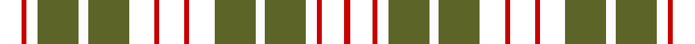

In pattern [KRKGWGKRKRKGWGKRKR](/stripes/krkgwgkrkrkgwgkrkr/).

This was sourced from register-of-tartans.  It is a [18 stripe tartan](/stripes/stripes18/).

Original link https://www.tartanregister.gov.uk/tartanDetails.aspx?ref=1872

## Register references

External register numbers recorded for this tartan.

- Scottish Register of Tartans: [1872](https://www.tartanregister.gov.uk/tartanDetails.aspx?ref=1872)
- Scottish Tartans Authority (ITI): 6073

## Thread count
YY/14 R3 YY7 G26 W6 G26 YY16 R3 YY16 R3 YY16 G26 W6 G26 YY7 R3 YY14 R/4

## Palette
Each colour and the base-6 reference it is a variant of.

| Colour | Shade | Base |
|---|---|---|
| G | <code style="background-color:#5C6428;">#5C6428</code> `oklch(48.3% 0.084 116.0)` <small>#5C6428</small> | G <code style="background-color:#006100;">#006100</code> |
| R | <code style="background-color:#C80000;">#C80000</code> `oklch(52.3% 0.215 29.2)` <small>#C80000</small> | R <code style="background-color:#CC0000;">#CC0000</code> |
| W | <code style="background-color:#FCFCFC;">#FCFCFC</code> `oklch(99.1% 0.000 89.9)` <small>#FCFCFC</small> | W <code style="background-color:#F7F7F7;">#F7F7F7</code> |

## Nearest tartans

The nearest existing variants by ΔTartan distance, with this tartan at the top so the swatches line up against it.

ΔTartan

Tartan

Sett

—

<a href="/ttd/edit/#slug=k14r3k7y26w6y26k16r3k16r3k16y26w6y26k7r3k14r4">J &amp; B Whisky (Original)</a> <a class="nn-out" href="/setts/s18/k14r3k7y26w6y26k16r3k16r3k16y26w6y26k7r3k14r4/" title="open its dictionary page">↗</a>

1.29

<a href="/ttd/edit/#slug=r6g6r1k8r1k1db1r1k8r1g6r6db1k6r1g8r1k1r1g8r1k6db1~x2">Comyn / Cumming, Buchan</a> <a class="nn-out" href="/setts/s23/r6g6r1k8r1k1db1r1k8r1g6r6db1k6r1g8r1k1r1g8r1k6db1~x2/" title="open its dictionary page">↗</a>

1.31

<a href="/ttd/edit/#slug=r3o26k12o3k16o4k16o3k12o26ly3~x2">Wcwm 1713</a> <a class="nn-out" href="/setts/s11/r3o26k12o3k16o4k16o3k12o26ly3~x2/" title="open its dictionary page">↗</a>

1.39

<a href="/ttd/edit/#slug=k6r1k1r4k7r1k7g6r5g1r1g5~x2">MacDonald 6</a> <a class="nn-out" href="/setts/s12/k6r1k1r4k7r1k7g6r5g1r1g5~x2/" title="open its dictionary page">↗</a>

1.40

<a href="/setts/s18/k8dg8k1dg8lr1k8o8k1o8k8~x4/">Sackett</a>

1.41

<a href="/ttd/edit/#slug=dg7k2dg7ly1k2ly1k10ly3r10ly3k10ly1dg11k2dg3k2~x2">Blackburn Appalachian Hunting</a> <a class="nn-out" href="/setts/s16/dg7k2dg7ly1k2ly1k10ly3r10ly3k10ly1dg11k2dg3k2~x2/" title="open its dictionary page">↗</a>

1.46

<a href="/ttd/edit/#slug=dp16w2k16g16k2g16k16g16k2g16k16w2dp16k1~x2">Norwich No.033</a> <a class="nn-out" href="/setts/s14/dp16w2k16g16k2g16k16g16k2g16k16w2dp16k1~x2/" title="open its dictionary page">↗</a>

1.46

<a href="/ttd/edit/#slug=r3k2db10k10g12k8g12k10g2k10db2k2db2">Unnamed 5</a> <a class="nn-out" href="/setts/s13/r3k2db10k10g12k8g12k10g2k10db2k2db2/" title="open its dictionary page">↗</a>

1.48

<a href="/ttd/edit/#slug=k8p1k1w1k2p8k8g8k1ly1k2g8~x2">Unnamed 10</a> <a class="nn-out" href="/setts/s12/k8p1k1w1k2p8k8g8k1ly1k2g8~x2/" title="open its dictionary page">↗</a>

1.48

<a href="/ttd/edit/#slug=dy6k1lr1k1lr1k1lr1k1lr1k1lr2k2lr2k2lr2k2lr2~x2">Carnegie Check</a> <a class="nn-out" href="/setts/s17/dy6k1lr1k1lr1k1lr1k1lr1k1lr2k2lr2k2lr2k2lr2~x2/" title="open its dictionary page">↗</a>

1.49

<a href="/ttd/edit/#slug=g5k24g12k16g26w4g24w4g26k16k4k4k4k4k28g3">O'Connor, Old</a> <a class="nn-out" href="/setts/s16/g5k24g12k16g26w4g24w4g26k16k4k4k4k4k28g3/" title="open its dictionary page">↗</a>

## Neighbour map

Every grey dot is one of 14299 variants placed by the first two principal components of the ΔTartan feature space (44% of its variance). Red is this tartan; blue dots are its nearest — click one to open its page.

<svg viewBox="0 0 640 380" role="img" style="max-width:100%;height:auto;border:1px solid #e0e0e0;border-radius:4px;display:block" xmlns="http://www.w3.org/2000/svg"><image href="/nn/cloud.v1.png" width="640" height="380"/><a href="/setts/s23/r6g6r1k8r1k1db1r1k8r1g6r6db1k6r1g8r1k1r1g8r1k6db1~x2/"><circle cx="143.2" cy="151.5" r="4" fill="#3465a4"><title>Comyn / Cumming, Buchan</title></circle></a><a href="/setts/s11/r3o26k12o3k16o4k16o3k12o26ly3~x2/"><circle cx="252.1" cy="191.1" r="4" fill="#3465a4"><title>Wcwm 1713</title></circle></a><a href="/setts/s12/k6r1k1r4k7r1k7g6r5g1r1g5~x2/"><circle cx="200.1" cy="217.1" r="4" fill="#3465a4"><title>MacDonald 6</title></circle></a><a href="/setts/s18/k8dg8k1dg8lr1k8o8k1o8k8~x4/"><circle cx="129.9" cy="196.5" r="4" fill="#3465a4"><title>Sackett</title></circle></a><a href="/setts/s16/dg7k2dg7ly1k2ly1k10ly3r10ly3k10ly1dg11k2dg3k2~x2/"><circle cx="165.9" cy="162.5" r="4" fill="#3465a4"><title>Blackburn Appalachian Hunting</title></circle></a><a href="/setts/s14/dp16w2k16g16k2g16k16g16k2g16k16w2dp16k1~x2/"><circle cx="184.2" cy="175.4" r="4" fill="#3465a4"><title>Norwich No.033</title></circle></a><a href="/setts/s13/r3k2db10k10g12k8g12k10g2k10db2k2db2/"><circle cx="184.6" cy="217.9" r="4" fill="#3465a4"><title>Unnamed 5</title></circle></a><a href="/setts/s12/k8p1k1w1k2p8k8g8k1ly1k2g8~x2/"><circle cx="166.9" cy="169.4" r="4" fill="#3465a4"><title>Unnamed 10</title></circle></a><a href="/setts/s17/dy6k1lr1k1lr1k1lr1k1lr1k1lr2k2lr2k2lr2k2lr2~x2/"><circle cx="159.0" cy="195.4" r="4" fill="#3465a4"><title>Carnegie Check</title></circle></a><a href="/setts/s16/g5k24g12k16g26w4g24w4g26k16k4k4k4k4k28g3/"><circle cx="184.4" cy="179.3" r="4" fill="#3465a4"><title>O'Connor, Old</title></circle></a><circle cx="195.0" cy="173.1" r="5" fill="#c00000"/></svg>

ID: /setts/s18/k14r3k7y26w6y26k16r3k16r3k16y26w6y26k7r3k14r4/
