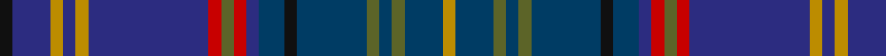

In pattern [KBYBYBRGRBBKBGBGBY](/stripes/kbybybrgrbbkbgbgby/).

This was sourced from tartans-authority.  It is a [18 stripe tartan](/stripes/stripes18/).

Original link http://www.tartansauthority.com/tartan-ferret/display/10021/

## Thread count
K/4 DB12 DY4 DB4 DY4 DB38 R4 G4 R4 DB4 DBa8 K4 DBa22 G4 DBa4 G4 DBa12 DY/4

## Palette
Each colour and its ΔE from the base-6 reference it is a variant of.

| Colour | Shade | Base | ΔE (OKLab) |
|---|---|---|---|
| DB | <code style="background-color:#2C2C80;">#2C2C80</code> `#2C2C80` | B <code style="background-color:#2A418A;">#2A418A</code> | 0.06 |
| DBa | <code style="background-color:#003C64;">#003C64</code> `#003C64` | B <code style="background-color:#2A418A;">#2A418A</code> | 0.08 |
| DY | <code style="background-color:#BC8C00;">#BC8C00</code> `#BC8C00` | Y <code style="background-color:#F2BF00;">#F2BF00</code> | 0.16 |
| G | <code style="background-color:#5C6428;">#5C6428</code> `#5C6428` | G <code style="background-color:#006100;">#006100</code> | 0.10 |
| K | <code style="background-color:#101010;">#101010</code> `#101010` | K <code style="background-color:#000000;">#000000</code> | 0.17 |
| R | <code style="background-color:#C80000;">#C80000</code> `#C80000` | R <code style="background-color:#CC0000;">#CC0000</code> | 0.01 |

## Nearest tartans

The nearest existing variants by ΔTartan distance.

1. [Glaz (Fashion)](/setts/s18/n2dt9db1dt4db2dt2db4n1db15g1db3g3db2g4db1g7ly1r2~x2/) — ΔT 1.16
1. [World Corporate Golf Challenge](/setts/s16/db2lr2db22k6db3k4db3k4db3k6db12n4db2n6db7w2~x2/) — ΔT 1.19
1. [Suzugamine](/setts/s16/dy5g19dp5dy5k5dy5db36ly3db36dy5k5dy5dp5g19dy5db4~x2/) — ΔT 1.23
1. [Frangord](/setts/s17/dg14db2r2db2dg22t2db16t2db20dg5r2dg5db20t2db16t2dg8~x2/) — ΔT 1.30
1. [St Margaret's School for Girls, Aberdeen](/setts/s16/r6db3r3db54g6db3g6db4t24db4t4db50db6db4db12lo4/) — ΔT 1.32
1. [Davies of Wales](/setts/s24/k3db30k2db4k2db30k3g30k3db30k2t2k2db30k3g30k3db30k2db4k2db30k3g3/) — ΔT 1.38
1. [Davies (Welsh Name)](/setts/s13/g2k3db30k2db4k2db30k3g30k3db30k2t2/) — ΔT 1.38
1. [World Corporate Golf Challenge (Corp](/setts/s16/db2lb2db22k6db3k4db3k4db3k6db12b4db2b6db7lb2~x2/) — ΔT 1.38
1. [State Seal of North Dakota (Fashion)](/setts/s11/g37dp5g5dp12b10db5b5db40dy4db4lo4~x2/) — ΔT 1.38
1. [Empire Golf Check](/setts/s18/r2dp4dt2dg25dt4dg2dt4k11dp4w2dp4dg11dt2k2dt24dp4dt2r2~x2/) — ΔT 1.40

## Neighbour map

Every grey dot is one of 14299 variants placed by the first two principal components of the ΔTartan feature space (44% of its variance). Red is this tartan; blue dots are its nearest — click one to open its page.

<svg viewBox="0 0 640 380" role="img" style="max-width:100%;height:auto;border:1px solid #e0e0e0;border-radius:4px;display:block" xmlns="http://www.w3.org/2000/svg"><image href="/nn/cloud.v1.png" width="640" height="380"/><a href="/setts/s18/n2dt9db1dt4db2dt2db4n1db15g1db3g3db2g4db1g7ly1r2~x2/"><circle cx="251.8" cy="152.5" r="4" fill="#3465a4"><title>Glaz (Fashion)</title></circle></a><a href="/setts/s16/db2lr2db22k6db3k4db3k4db3k6db12n4db2n6db7w2~x2/"><circle cx="187.5" cy="170.3" r="4" fill="#3465a4"><title>World Corporate Golf Challenge</title></circle></a><a href="/setts/s16/dy5g19dp5dy5k5dy5db36ly3db36dy5k5dy5dp5g19dy5db4~x2/"><circle cx="218.0" cy="140.2" r="4" fill="#3465a4"><title>Suzugamine</title></circle></a><a href="/setts/s17/dg14db2r2db2dg22t2db16t2db20dg5r2dg5db20t2db16t2dg8~x2/"><circle cx="214.7" cy="177.9" r="4" fill="#3465a4"><title>Frangord</title></circle></a><a href="/setts/s16/r6db3r3db54g6db3g6db4t24db4t4db50db6db4db12lo4/"><circle cx="253.5" cy="112.5" r="4" fill="#3465a4"><title>St Margaret's School for Girls, Aberdeen</title></circle></a><a href="/setts/s24/k3db30k2db4k2db30k3g30k3db30k2t2k2db30k3g30k3db30k2db4k2db30k3g3/"><circle cx="254.3" cy="133.3" r="4" fill="#3465a4"><title>Davies of Wales</title></circle></a><a href="/setts/s13/g2k3db30k2db4k2db30k3g30k3db30k2t2/"><circle cx="263.4" cy="153.0" r="4" fill="#3465a4"><title>Davies (Welsh Name)</title></circle></a><a href="/setts/s16/db2lb2db22k6db3k4db3k4db3k6db12b4db2b6db7lb2~x2/"><circle cx="179.7" cy="162.6" r="4" fill="#3465a4"><title>World Corporate Golf Challenge (Corp</title></circle></a><a href="/setts/s11/g37dp5g5dp12b10db5b5db40dy4db4lo4~x2/"><circle cx="194.7" cy="162.0" r="4" fill="#3465a4"><title>State Seal of North Dakota (Fashion)</title></circle></a><a href="/setts/s18/r2dp4dt2dg25dt4dg2dt4k11dp4w2dp4dg11dt2k2dt24dp4dt2r2~x2/"><circle cx="186.8" cy="128.6" r="4" fill="#3465a4"><title>Empire Golf Check</title></circle></a><circle cx="209.6" cy="149.2" r="5" fill="#c00000"/></svg>

ID: /setts/s18/k2db6lo2db2lo2db19r2y2r2db2dt4k2dt11y2dt2y2dt6lo2~x2/
