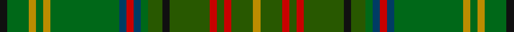

**Bands:** [KGYGYGBRBGGKGRGRGY](/stripes/kgygygbrbggkgrgrgy/) · **Stripes:** [K G LO G LO G DT R DT G DG K DG R DG R DG LO](/stripes/stripes18/) K G LO G LO G DT R DT G DG K DG R DG R DG LO

This was sourced from tartans-authority.  It is a [18 band tartan](/bands/bands18/).

Original link http://www.tartansauthority.com/tartan-ferret/display/10017/

## Also known as

This cloth is also recorded under:

- Harmon Hunting Personal

## Attestations

This cloth appears in 2 source records; the oldest owns this page.

- Mar. 2009 — Harmon Hunting (Personal) (tartans-authority, [record](http://www.tartansauthority.com/tartan-ferret/display/10017/))
- undated — Harmon Hunting Personal Tartan Tartan Number: 10017. Earliest known date: Mar. 2009 Harmons have a long and proud tradition as hunters and outdoorsmen. The hunting tartan pays homage to that tradition, providing a camouflage effect while maintaining a clear relation to the distinctive pattern of the Harmon Modern tartan. It is designed specifically for outdoor use in any activity in which blending with the natural surroundings is desired See products available Copyright © Blair Urquhart, Comrie, 2015 (house-of-tartan, [record](http://www.house-of-tartan.scotland.net/house/TartanViewjs.asp?colr=Def&tnam=10017))

## Thread count
K/4 G12 DY4 G4 DY4 G38 DB4 R4 DB4 G4 Ga8 K4 Ga22 R4 Ga4 R4 Ga12 DY/4

## Palette
Each colour and its ΔE from the base-6 reference it is a variant of.

| Colour | Shade | Base | ΔE (OKLab) |
|---|---|---|---|
| DB | <code style="background-color:#003C64;">#003C64</code> `#003C64` | B <code style="background-color:#2A418A;">#2A418A</code> | 0.08 |
| DY | <code style="background-color:#BC8C00;">#BC8C00</code> `#BC8C00` | Y <code style="background-color:#F2BF00;">#F2BF00</code> | 0.16 |
| G | <code style="background-color:#006818;">#006818</code> `#006818` | G <code style="background-color:#006100;">#006100</code> | 0.02 |
| Ga | <code style="background-color:#285800;">#285800</code> `#285800` | G <code style="background-color:#006100;">#006100</code> | 0.03 |
| K | <code style="background-color:#101010;">#101010</code> `#101010` | K <code style="background-color:#000000;">#000000</code> | 0.17 |
| R | <code style="background-color:#C80000;">#C80000</code> `#C80000` | R <code style="background-color:#CC0000;">#CC0000</code> | 0.01 |

## Nearest tartans

The nearest existing variants by ΔTartan distance.

1. [Stewart Camel (Lochcarron)](/setts/s14/y3dy3dg2dy6y7dg2y3dg2lo3dg5y3b3y20dy2~x2/) — ΔT 1.49
1. [McHeadley Society](/setts/s13/r2dg18g2dg2g2dg2g12db3k13dg10k2g12ly2~x2/) — ΔT 1.65
1. [Gordonstoun #2](/setts/s22/ly5y19r2t11lb2r11y11r2g20r2g2lb2~x2/) — ΔT 1.71
1. [Handley (Personal)](/setts/s12/dg12w2k5g24k4dg9k2g13k4dg13k2ly3~x2/) — ΔT 1.76
1. [Wells, Greg #2 (Personal)](/setts/s13/k12g1k2g1k12g2g12k1g12g2g12g3g12~x2/) — ΔT 1.76
1. [Strathmore (District)](/setts/s16/g3r15g2r2g2r2g18dy2g2dy2g2dy27k2dy2k6lo2~x2/) — ΔT 1.77
1. [Harmon Hunting](/setts/s18/k2g6ly2g2ly2g19dt2r2dt2g2dg4k2dg11r2dg2r2dg6ly2~x2/) — ΔT 1.78
1. [Hash House Harriers Hunting (Corp)](/setts/s13/g7dy1lb1dy1lo1dy7n7dy1n7dy7g7dy1r1~x4/) — ΔT 1.79
1. [Glens of Corbie (Corporate)](/setts/s9/k3g30y20o6y3o3y3dt20r2~x2/) — ΔT 1.84
1. [Harkness Hunting #2](/setts/s18/g10n2w2n16g6ly2g4r2g3n6~x4/) — ΔT 1.86

## Neighbour map

Every grey dot is one of 14299 variants placed by the first two principal components of the ΔTartan feature space (44% of its variance). Red is this tartan; blue dots are its nearest — click one to open its page.

<svg viewBox="0 0 640 380" role="img" style="max-width:100%;height:auto;border:1px solid #e0e0e0;border-radius:4px;display:block" xmlns="http://www.w3.org/2000/svg"><image href="/nn/cloud.v1.png" width="640" height="380"/><a href="/setts/s14/y3dy3dg2dy6y7dg2y3dg2lo3dg5y3b3y20dy2~x2/"><circle cx="250.7" cy="168.3" r="4" fill="#3465a4"><title>Stewart Camel (Lochcarron)</title></circle></a><a href="/setts/s13/r2dg18g2dg2g2dg2g12db3k13dg10k2g12ly2~x2/"><circle cx="203.7" cy="187.7" r="4" fill="#3465a4"><title>McHeadley Society</title></circle></a><a href="/setts/s22/ly5y19r2t11lb2r11y11r2g20r2g2lb2~x2/"><circle cx="175.7" cy="152.9" r="4" fill="#3465a4"><title>Gordonstoun #2</title></circle></a><a href="/setts/s12/dg12w2k5g24k4dg9k2g13k4dg13k2ly3~x2/"><circle cx="230.6" cy="197.6" r="4" fill="#3465a4"><title>Handley (Personal)</title></circle></a><a href="/setts/s13/k12g1k2g1k12g2g12k1g12g2g12g3g12~x2/"><circle cx="222.0" cy="209.3" r="4" fill="#3465a4"><title>Wells, Greg #2 (Personal)</title></circle></a><a href="/setts/s16/g3r15g2r2g2r2g18dy2g2dy2g2dy27k2dy2k6lo2~x2/"><circle cx="233.1" cy="129.4" r="4" fill="#3465a4"><title>Strathmore (District)</title></circle></a><a href="/setts/s18/k2g6ly2g2ly2g19dt2r2dt2g2dg4k2dg11r2dg2r2dg6ly2~x2/"><circle cx="181.6" cy="138.6" r="4" fill="#3465a4"><title>Harmon Hunting</title></circle></a><a href="/setts/s13/g7dy1lb1dy1lo1dy7n7dy1n7dy7g7dy1r1~x4/"><circle cx="217.8" cy="214.0" r="4" fill="#3465a4"><title>Hash House Harriers Hunting (Corp)</title></circle></a><a href="/setts/s9/k3g30y20o6y3o3y3dt20r2~x2/"><circle cx="214.4" cy="178.5" r="4" fill="#3465a4"><title>Glens of Corbie (Corporate)</title></circle></a><a href="/setts/s18/g10n2w2n16g6ly2g4r2g3n6~x4/"><circle cx="265.5" cy="194.0" r="4" fill="#3465a4"><title>Harkness Hunting #2</title></circle></a><circle cx="223.0" cy="160.5" r="5" fill="#c00000"/></svg>

ID: /setts/s18/k2g6lo2g2lo2g19dt2r2dt2g2dg4k2dg11r2dg2r2dg6lo2~x2/
