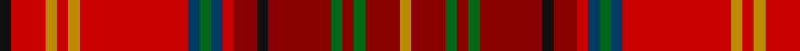

In pattern [KRYRYRBGBRRKRGRGRY](/stripes/kryryrbgbrrkrgrgry/).

This was sourced from tartans-authority.  It is a [18 stripe tartan](/stripes/stripes18/).

Original link http://www.tartansauthority.com/tartan-ferret/display/7792/

## Thread count
K/4 R12 DY4 R4 DY4 R38 DB4 G4 DB4 R4 DR8 K4 DR22 G4 DR4 G4 DR12 DY/4

## Palette
Each colour and the base-6 reference it is a variant of.

| Colour | Shade | Base |
|---|---|---|
| DB | <code style="background-color:#003C64;">#003C64</code> `oklch(34.5% 0.089 246.0)` <small>#003C64</small> | B <code style="background-color:#2A418A;">#2A418A</code> |
| DR | <code style="background-color:#880000;">#880000</code> `oklch(39.4% 0.162 29.2)` <small>#880000</small> | R <code style="background-color:#CC0000;">#CC0000</code> |
| DY | <code style="background-color:#BC8C00;">#BC8C00</code> `oklch(66.8% 0.137 84.1)` <small>#BC8C00</small> | Y <code style="background-color:#F2BF00;">#F2BF00</code> |
| G | <code style="background-color:#006818;">#006818</code> `oklch(45.0% 0.142 145.0)` <small>#006818</small> | G <code style="background-color:#006100;">#006100</code> |
| K | <code style="background-color:#101010;">#101010</code> `oklch(17.3% 0.000 89.9)` <small>#101010</small> | K <code style="background-color:#000000;">#000000</code> |
| R | <code style="background-color:#C80000;">#C80000</code> `oklch(52.3% 0.215 29.2)` <small>#C80000</small> | R <code style="background-color:#CC0000;">#CC0000</code> |

## Nearest tartans

The nearest existing variants by ΔTartan distance, with this tartan at the top so the swatches line up against it.

ΔTartan

Tartan

Sett

—

<a href="/ttd/edit/#slug=k2r6lo2r2lo2r19dt2g2dt2r2r4k2r11g2r2g2r6lo2~x2">Harmon (Name)</a> <a class="nn-out" href="/setts/s18/k2r6lo2r2lo2r19dt2g2dt2r2r4k2r11g2r2g2r6lo2~x2/" title="open its dictionary page">↗</a>

0.81

<a href="/ttd/edit/#slug=k2r6ly2r2ly2r19db2g2db2r2r4k2r11g2r2g2r6ly2~x2">Harmon (Personal)</a> <a class="nn-out" href="/setts/s18/k2r6ly2r2ly2r19db2g2db2r2r4k2r11g2r2g2r6ly2~x2/" title="open its dictionary page">↗</a>

1.06

<a href="/ttd/edit/#slug=r7r5r5r31k9r4r3r5r3r4dg30r4r3r5r5~x2">MacDougall (Kinloch Anderson)</a> <a class="nn-out" href="/setts/s15/r7r5r5r31k9r4r3r5r3r4dg30r4r3r5r5~x2/" title="open its dictionary page">↗</a>

1.44

<a href="/ttd/edit/#slug=g3db3g3db3g3m22ly2db2r22t5r8ly2t2~x2">Pitcairn Trust Company</a> <a class="nn-out" href="/setts/s13/g3db3g3db3g3m22ly2db2r22t5r8ly2t2~x2/" title="open its dictionary page">↗</a>

1.51

<a href="/ttd/edit/#slug=lr6y2lr2y5r20o2r2o25r2o2r4ly10r2~x2">Strathtay (District?)</a> <a class="nn-out" href="/setts/s13/lr6y2lr2y5r20o2r2o25r2o2r4ly10r2~x2/" title="open its dictionary page">↗</a>

1.52

<a href="/ttd/edit/#slug=dg24r7dg7r7dg7r22r7r4b4r4r40b14">Powys (District)</a> <a class="nn-out" href="/setts/s12/dg24r7dg7r7dg7r22r7r4b4r4r40b14/" title="open its dictionary page">↗</a>

1.57

<a href="/ttd/edit/#slug=lo74do6lo6do8r6do6r71dg6r6db6r71do6r6do8lo6do6lo74ly8">Macallan The</a> <a class="nn-out" href="/setts/s18/lo74do6lo6do8r6do6r71dg6r6db6r71do6r6do8lo6do6lo74ly8/" title="open its dictionary page">↗</a>

1.64

<a href="/ttd/edit/#slug=r7r5r5r31k9r4r3r5r3r4g30r4r3r5r5~x2">MacDougall 3</a> <a class="nn-out" href="/setts/s15/r7r5r5r31k9r4r3r5r3r4g30r4r3r5r5~x2/" title="open its dictionary page">↗</a>

1.64

<a href="/ttd/edit/#slug=r15dp3dy2do2dy3r3lo3dy3g3r4g2~x2">Unidentified Chair Covering</a> <a class="nn-out" href="/setts/s11/r15dp3dy2do2dy3r3lo3dy3g3r4g2~x2/" title="open its dictionary page">↗</a>

1.66

<a href="/ttd/edit/#slug=r6r4r2r3dg34r3r2r4r2r3dp8t2r40r4r2r6~x2">MacDougall #9</a> <a class="nn-out" href="/setts/s16/r6r4r2r3dg34r3r2r4r2r3dp8t2r40r4r2r6~x2/" title="open its dictionary page">↗</a>

1.66

<a href="/ttd/edit/#slug=y12ly3y6r19k1r8k2n4k2y19k1r19k1r9~x2">Golden Broom #2</a> <a class="nn-out" href="/setts/s14/y12ly3y6r19k1r8k2n4k2y19k1r19k1r9~x2/" title="open its dictionary page">↗</a>

## Neighbour map

Every grey dot is one of 14299 variants placed by the first two principal components of the ΔTartan feature space (44% of its variance). Red is this tartan; blue dots are its nearest — click one to open its page.

<svg viewBox="0 0 640 380" role="img" style="max-width:100%;height:auto;border:1px solid #e0e0e0;border-radius:4px;display:block" xmlns="http://www.w3.org/2000/svg"><image href="/nn/cloud.v1.png" width="640" height="380"/><a href="/setts/s18/k2r6ly2r2ly2r19db2g2db2r2r4k2r11g2r2g2r6ly2~x2/"><circle cx="195.5" cy="108.7" r="4" fill="#3465a4"><title>Harmon (Personal)</title></circle></a><a href="/setts/s15/r7r5r5r31k9r4r3r5r3r4dg30r4r3r5r5~x2/"><circle cx="231.8" cy="134.0" r="4" fill="#3465a4"><title>MacDougall (Kinloch Anderson)</title></circle></a><a href="/setts/s13/g3db3g3db3g3m22ly2db2r22t5r8ly2t2~x2/"><circle cx="186.3" cy="116.9" r="4" fill="#3465a4"><title>Pitcairn Trust Company</title></circle></a><a href="/setts/s13/lr6y2lr2y5r20o2r2o25r2o2r4ly10r2~x2/"><circle cx="186.0" cy="111.6" r="4" fill="#3465a4"><title>Strathtay (District?)</title></circle></a><a href="/setts/s12/dg24r7dg7r7dg7r22r7r4b4r4r40b14/"><circle cx="235.0" cy="171.3" r="4" fill="#3465a4"><title>Powys (District)</title></circle></a><a href="/setts/s18/lo74do6lo6do8r6do6r71dg6r6db6r71do6r6do8lo6do6lo74ly8/"><circle cx="272.8" cy="93.0" r="4" fill="#3465a4"><title>Macallan The</title></circle></a><a href="/setts/s15/r7r5r5r31k9r4r3r5r3r4g30r4r3r5r5~x2/"><circle cx="209.1" cy="126.1" r="4" fill="#3465a4"><title>MacDougall 3</title></circle></a><a href="/setts/s11/r15dp3dy2do2dy3r3lo3dy3g3r4g2~x2/"><circle cx="258.8" cy="171.0" r="4" fill="#3465a4"><title>Unidentified Chair Covering</title></circle></a><a href="/setts/s16/r6r4r2r3dg34r3r2r4r2r3dp8t2r40r4r2r6~x2/"><circle cx="286.2" cy="73.3" r="4" fill="#3465a4"><title>MacDougall #9</title></circle></a><a href="/setts/s14/y12ly3y6r19k1r8k2n4k2y19k1r19k1r9~x2/"><circle cx="227.0" cy="133.2" r="4" fill="#3465a4"><title>Golden Broom #2</title></circle></a><circle cx="218.2" cy="121.6" r="5" fill="#c00000"/></svg>

ID: /setts/s18/k2r6lo2r2lo2r19dt2g2dt2r2r4k2r11g2r2g2r6lo2~x2/
