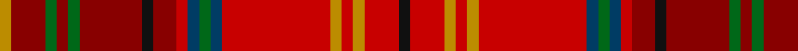

In pattern [KRYRYRBGBRRKRGRGRY](/patterns/kryryrbgbrrkrgrgry/).

This was sourced from tartans-authority.  It is a [18 stripes tartan](/stripes/stripes18/).

Original link http://www.tartansauthority.com/tartan-ferret/display/7792/

## Thread count
DY/4 DR12 G4 DR4 G4 DR22 K4 DR8 R4 DB4 G4 DB4 R38 DY4 R4 DY4 R12 K/4

## Palette
Each colour and its ΔE from the base-6 reference it is a variant of.

| Colour | Shade | Base | ΔE (OKLab) |
|---|---|---|---|
| DB | <code style="background-color:#003C64;">#003C64</code> `#003C64` | B <code style="background-color:#2A418A;">#2A418A</code> | 0.08 |
| DR | <code style="background-color:#880000;">#880000</code> `#880000` | R <code style="background-color:#CC0000;">#CC0000</code> | 0.15 |
| DY | <code style="background-color:#BC8C00;">#BC8C00</code> `#BC8C00` | Y <code style="background-color:#F2BF00;">#F2BF00</code> | 0.16 |
| G | <code style="background-color:#006818;">#006818</code> `#006818` | G <code style="background-color:#006100;">#006100</code> | 0.02 |
| K | <code style="background-color:#101010;">#101010</code> `#101010` | K <code style="background-color:#000000;">#000000</code> | 0.17 |
| R | <code style="background-color:#C80000;">#C80000</code> `#C80000` | R <code style="background-color:#CC0000;">#CC0000</code> | 0.01 |

## Nearest tartans

The nearest existing variants by ΔTartan distance.

1. [Harmon (Personal)](/setts/s18/k2r6y2r2y2r19b2g2b2r2ra4k2ra11g2ra2g2ra6y2x2~b2c2c80-g006818-k10101a-rc80000-ra880000-ye8c000/) — ΔT 0.81
1. [MacDougall (Kinloch Anderson)](/setts/s15/r7ra5rb5r31k9rb4ra3r5ra3rb4g30r4ra3rb5r5x2~g005020-k101010-rdc0000-rac82828-rb960000/) — ΔT 1.06
1. [Pitcairn Trust Company](/setts/s13/g3b3g3b3g3r22y2b2ra22ba5ra8y2ba2x2~b304080-ba5480b0-g30a010-r802040-rac00000-yf0c000/) — ΔT 1.44
1. [Strathtay (District?)](/setts/s13/y6g2y2g5r20ra2r2ra25rb2ra2rb4ya10r2x2~g406054-r901c38-rae86000-rb880000-ya0a0a0-yac4bc68/) — ΔT 1.50
1. [Powys (District)](/setts/s12/g24r7g7r7g7r22r7r4b4r4r40b14~b1474b4-g285800-rc80000/) — ΔT 1.51
1. [Macallan The](/setts/s18/y74b6y6b8r6b6r71g6r6ba6r71b6r6b8y6b6y74ya8~b441800-ba202060-g003820-rcc4438-yec8048-yae8c000/) — ΔT 1.57
1. [MacDougall 3](/setts/s15/r7ra5rb5r31k9rb4ra3r5ra3rb4g30r4ra3rb5r5x2~g008000-k000000-rc00000-rad03030-rb800000/) — ΔT 1.64
1. [Unidentified Chair Covering](/setts/s11/r15b3g2ba2g3r3y3g3ga3r4ga2x2~b840068-ba443428-g5b360b-ga309c18-r960028-yc89600/) — ΔT 1.64
1. [Golden Broom #2](/setts/s14/g12y3g6r19k1ra8k2b4k2g19k1r19k1ra9x2~b07648c-g585c20-k101010-r960000-rac82828-ye8c000/) — ΔT 1.66
1. [MacDougall #9](/setts/s16/r6ra4rb2r3g34ra3rb2r4rb2ra3b8ba2r40ra4rb2r6x2~b5a008c-ba3c82af-g005020-rdc0000-ra960000-rbc82828/) — ΔT 1.66

## Neighbour map

Every grey dot is one of 15726 variants placed by the first two principal components of the ΔTartan feature space (44% of its variance). Red is this tartan; blue dots are its nearest — click one to open its page.

<svg viewBox="0 0 640 380" role="img" style="max-width:100%;height:auto;border:1px solid #e0e0e0;border-radius:4px;display:block" xmlns="http://www.w3.org/2000/svg"><image href="/nn/cloud.v1.png" width="640" height="380"/><a href="/setts/s18/k2r6y2r2y2r19b2g2b2r2ra4k2ra11g2ra2g2ra6y2x2~b2c2c80-g006818-k10101a-rc80000-ra880000-ye8c000/"><circle cx="195.4" cy="105.8" r="4" fill="#3465a4"><title>Harmon (Personal)</title></circle></a><a href="/setts/s15/r7ra5rb5r31k9rb4ra3r5ra3rb4g30r4ra3rb5r5x2~g005020-k101010-rdc0000-rac82828-rb960000/"><circle cx="231.9" cy="130.8" r="4" fill="#3465a4"><title>MacDougall (Kinloch Anderson)</title></circle></a><a href="/setts/s13/g3b3g3b3g3r22y2b2ra22ba5ra8y2ba2x2~b304080-ba5480b0-g30a010-r802040-rac00000-yf0c000/"><circle cx="185.5" cy="112.7" r="4" fill="#3465a4"><title>Pitcairn Trust Company</title></circle></a><a href="/setts/s13/y6g2y2g5r20ra2r2ra25rb2ra2rb4ya10r2x2~g406054-r901c38-rae86000-rb880000-ya0a0a0-yac4bc68/"><circle cx="185.9" cy="106.6" r="4" fill="#3465a4"><title>Strathtay (District?)</title></circle></a><a href="/setts/s12/g24r7g7r7g7r22r7r4b4r4r40b14~b1474b4-g285800-rc80000/"><circle cx="235.1" cy="165.8" r="4" fill="#3465a4"><title>Powys (District)</title></circle></a><a href="/setts/s18/y74b6y6b8r6b6r71g6r6ba6r71b6r6b8y6b6y74ya8~b441800-ba202060-g003820-rcc4438-yec8048-yae8c000/"><circle cx="273.6" cy="89.0" r="4" fill="#3465a4"><title>Macallan The</title></circle></a><a href="/setts/s15/r7ra5rb5r31k9rb4ra3r5ra3rb4g30r4ra3rb5r5x2~g008000-k000000-rc00000-rad03030-rb800000/"><circle cx="208.6" cy="124.7" r="4" fill="#3465a4"><title>MacDougall 3</title></circle></a><a href="/setts/s11/r15b3g2ba2g3r3y3g3ga3r4ga2x2~b840068-ba443428-g5b360b-ga309c18-r960028-yc89600/"><circle cx="258.9" cy="165.5" r="4" fill="#3465a4"><title>Unidentified Chair Covering</title></circle></a><a href="/setts/s14/g12y3g6r19k1ra8k2b4k2g19k1r19k1ra9x2~b07648c-g585c20-k101010-r960000-rac82828-ye8c000/"><circle cx="226.7" cy="125.0" r="4" fill="#3465a4"><title>Golden Broom #2</title></circle></a><a href="/setts/s16/r6ra4rb2r3g34ra3rb2r4rb2ra3b8ba2r40ra4rb2r6x2~b5a008c-ba3c82af-g005020-rdc0000-ra960000-rbc82828/"><circle cx="286.3" cy="70.1" r="4" fill="#3465a4"><title>MacDougall #9</title></circle></a><circle cx="218.4" cy="116.0" r="5" fill="#c00000"/></svg>

ID: /setts/s18/k2r6y2r2y2r19b2g2b2r2ra4k2ra11g2ra2g2ra6y2x2~b003c64-g006818-k101010-rc80000-ra880000-ybc8c00/
