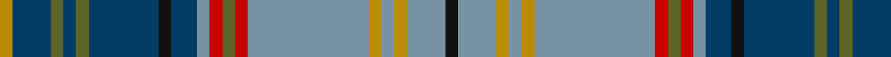

**Bands:** [KBYBYBRGRBBKBGBGBY](/stripes/kbybybrgrbbkbgbgby/) · **Stripes:** [K T LO T LO T R Y R T DT K DT Y DT Y DT LO](/stripes/stripes18/) K T LO T LO T R Y R T DT K DT Y DT Y DT LO

This was sourced from house-of-tartan.  It is a [18 band tartan](/bands/bands18/).

Original link http://www.house-of-tartan.scotland.net/house/TartanViewjs.asp?colr=Def&tnam=10021

## Thread count
DY/4 DB12 G4 DB4 G4 DB22 K4 DB8 B4 R4 G4 R4 B38 DY4 B4 DY4 B12 K/4

## Palette
Each colour and its ΔE from the base-6 reference it is a variant of.

| Colour | Shade | Base | ΔE (OKLab) |
|---|---|---|---|
| B | <code style="background-color:#7894A4;">#7894A4</code> `#7894A4` | B <code style="background-color:#2A418A;">#2A418A</code> | 0.27 |
| DB | <code style="background-color:#003C64;">#003C64</code> `#003C64` | B <code style="background-color:#2A418A;">#2A418A</code> | 0.08 |
| DY | <code style="background-color:#BC8C00;">#BC8C00</code> `#BC8C00` | Y <code style="background-color:#F2BF00;">#F2BF00</code> | 0.16 |
| G | <code style="background-color:#5C6428;">#5C6428</code> `#5C6428` | G <code style="background-color:#006100;">#006100</code> | 0.10 |
| K | <code style="background-color:#101010;">#101010</code> `#101010` | K <code style="background-color:#000000;">#000000</code> | 0.17 |
| R | <code style="background-color:#C80000;">#C80000</code> `#C80000` | R <code style="background-color:#CC0000;">#CC0000</code> | 0.01 |

## Nearest tartans

The nearest existing variants by ΔTartan distance.

1. [MacNicol Htg (Clan)](/setts/s17/b20k2g2k2g2k2b20r5k19r5g19k2ly2k2w2k2g20~x2/) — ΔT 0.88
1. [Mungall Family Tartan Tartan Number: 4070. Earliest known date: 2001 This tartan was first produced in ancient colours. It is a personal tartan to commemorate the signing of the Ragman's Roll by William de Mungall See products available Copyright © Blair Urquhart, Comrie, 2015](/setts/s15/t30y8r2k8ly2k8r2y8db11r2t10r3t2r2db3~x2/) — ΔT 0.98
1. [Daniel Melrose Family Tartan Tartan Number: 7548. Earliest known date: 2008 Daniel Melrose says, "This Tartan is in memory of our ancestors who lived in the Newbigging and Dunsyre area for over 200 years." The tartan was designed to be woven in Ancient colours. (Corrects the 2 yellow stripes error. It should only be one yellow.) See products available Copyright © Blair Urquhart, Comrie, 2015](/setts/s18/ly1k1o15b2o1b2o1b2o1b15k2g2b1g2b1g10k2w1~x2/) — ΔT 1.07
1. [Harmon of Plenderleith (Personal)](/setts/s18/k2t6ly2t2ly2t19r2g2r2t2db4k2db11g2db2g2db6ly2~x2/) — ΔT 1.13
1. [Buffalo (Fashion)](/setts/s12/db6o3k4ly3k3o3k3g14t28o3t3k2~x2/) — ΔT 1.18
1. [Mungall](/setts/s15/lg27g7r2k7ly2k7r2g7db10r2lg9r3lg2r2db3~x2/) — ΔT 1.19
1. [Stinson](/setts/s20/g6r3b27g20ly3k20t2r6t2b20k7b20t2r6t2k20ly3g20b27r3~x2/) — ΔT 1.25
1. [Paisley](/setts/s12/g7r2g3r5g17ly2k15ly2t22g3w2t7~x2/) — ΔT 1.26
1. [Wood Clan/Family Tartan Tartan Number: 6630. Earliest known date: March 2005 A tartan for all of the name. Initiated by Leslie N Wood of Dartmouth, Devon and designed by Keith Lumsden. Incorporates the colours of the Duke of Fife and Angus district tartans - areas with which the Woods are said to be historically connected. A Clan Wood Society is in the process of being formed (March 2005) and it is expected that they will adopt this tartan. Woven sample See products available Copyright © Blair Urquhart, Comrie, 2015](/setts/s23/k3lr2k6g3k3g21db18r2db2r2db2r3db2r2db2r2db18g21k3g3k6ly2k3~x2/) — ΔT 1.26
1. [Empire Golf Check (Fashion)](/setts/s18/r2dp4dt2g25dt4g2dt4k11dp4w2dp4g11dt2k2dt24dp4dt2r2~x2/) — ΔT 1.27

## Neighbour map

Every grey dot is one of 14313 variants placed by the first two principal components of the ΔTartan feature space (44% of its variance). Red is this tartan; blue dots are its nearest — click one to open its page.

<svg viewBox="0 0 640 380" role="img" style="max-width:100%;height:auto;border:1px solid #e0e0e0;border-radius:4px;display:block" xmlns="http://www.w3.org/2000/svg"><image href="/nn/cloud.v1.png" width="640" height="380"/><a href="/setts/s17/b20k2g2k2g2k2b20r5k19r5g19k2ly2k2w2k2g20~x2/"><circle cx="134.0" cy="123.2" r="4" fill="#3465a4"><title>MacNicol Htg (Clan)</title></circle></a><a href="/setts/s15/t30y8r2k8ly2k8r2y8db11r2t10r3t2r2db3~x2/"><circle cx="174.7" cy="109.9" r="4" fill="#3465a4"><title>Mungall Family Tartan Tartan Number: 4070. Earliest known date: 2001 This tartan was first produced in ancient colours. It is a personal tartan to commemorate the signing of the Ragman's Roll by William de Mungall See products available Copyright © Blair Urquhart, Comrie, 2015</title></circle></a><a href="/setts/s18/ly1k1o15b2o1b2o1b2o1b15k2g2b1g2b1g10k2w1~x2/"><circle cx="192.7" cy="95.4" r="4" fill="#3465a4"><title>Daniel Melrose Family Tartan Tartan Number: 7548. Earliest known date: 2008 Daniel Melrose says, &quot;This Tartan is in memory of our ancestors who lived in the Newbigging and Dunsyre area for over 200 years.&quot; The tartan was designed to be woven in Ancient colours. (Corrects the 2 yellow stripes error. It should only be one yellow.) See products available Copyright © Blair Urquhart, Comrie, 2015</title></circle></a><a href="/setts/s18/k2t6ly2t2ly2t19r2g2r2t2db4k2db11g2db2g2db6ly2~x2/"><circle cx="156.4" cy="119.5" r="4" fill="#3465a4"><title>Harmon of Plenderleith (Personal)</title></circle></a><a href="/setts/s12/db6o3k4ly3k3o3k3g14t28o3t3k2~x2/"><circle cx="184.1" cy="121.3" r="4" fill="#3465a4"><title>Buffalo (Fashion)</title></circle></a><a href="/setts/s15/lg27g7r2k7ly2k7r2g7db10r2lg9r3lg2r2db3~x2/"><circle cx="147.4" cy="108.4" r="4" fill="#3465a4"><title>Mungall</title></circle></a><a href="/setts/s20/g6r3b27g20ly3k20t2r6t2b20k7b20t2r6t2k20ly3g20b27r3~x2/"><circle cx="158.5" cy="123.2" r="4" fill="#3465a4"><title>Stinson</title></circle></a><a href="/setts/s12/g7r2g3r5g17ly2k15ly2t22g3w2t7~x2/"><circle cx="145.1" cy="146.3" r="4" fill="#3465a4"><title>Paisley</title></circle></a><a href="/setts/s23/k3lr2k6g3k3g21db18r2db2r2db2r3db2r2db2r2db18g21k3g3k6ly2k3~x2/"><circle cx="162.8" cy="111.3" r="4" fill="#3465a4"><title>Wood Clan/Family Tartan Tartan Number: 6630. Earliest known date: March 2005 A tartan for all of the name. Initiated by Leslie N Wood of Dartmouth, Devon and designed by Keith Lumsden. Incorporates the colours of the Duke of Fife and Angus district tartans - areas with which the Woods are said to be historically connected. A Clan Wood Society is in the process of being formed (March 2005) and it is expected that they will adopt this tartan. Woven sample See products available Copyright © Blair Urquhart, Comrie, 2015</title></circle></a><a href="/setts/s18/r2dp4dt2g25dt4g2dt4k11dp4w2dp4g11dt2k2dt24dp4dt2r2~x2/"><circle cx="175.4" cy="121.8" r="4" fill="#3465a4"><title>Empire Golf Check (Fashion)</title></circle></a><circle cx="171.2" cy="122.4" r="5" fill="#c00000"/></svg>

ID: /setts/s18/k2t6lo2t2lo2t19r2y2r2t2dt4k2dt11y2dt2y2dt6lo2~x2/
