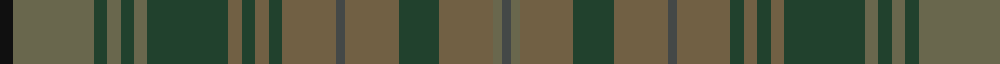

In pattern [BGGGGBGGGGGGGGGGGK](/patterns/bggggbgggggggggggk/).

This was sourced from register-of-tartans.  It is a [18 stripes tartan](/stripes/stripes18/).

Original link https://www.tartanregister.gov.uk/tartanDetails.aspx?ref=5761

## Thread count
K/6 N36 DN6 N6 DN6 N6 DN36 Na6 DN6 Na6 DN6 Na24 Nb4 Na24 DN18 Na24 N4 Nb/4

## Palette
Each colour and its ΔE from the base-6 reference it is a variant of.

| Colour | Shade | Base | ΔE (OKLab) |
|---|---|---|---|
| DN | <code style="background-color:#21412D;">#21412D</code> `#21412D` | G <code style="background-color:#006100;">#006100</code> | 0.13 |
| K | <code style="background-color:#101010;">#101010</code> `#101010` | K <code style="background-color:#000000;">#000000</code> | 0.17 |
| N | <code style="background-color:#69674D;">#69674D</code> `#69674D` | G <code style="background-color:#006100;">#006100</code> | 0.14 |
| Na | <code style="background-color:#716044;">#716044</code> `#716044` | G <code style="background-color:#006100;">#006100</code> | 0.15 |
| Nb | <code style="background-color:#444847;">#444847</code> `#444847` | B <code style="background-color:#2A418A;">#2A418A</code> | 0.12 |

## Nearest tartans

The nearest existing variants by ΔTartan distance.

1. [Van Ingelgem Htg (Personal)](/setts/s18/k3g18ga3g3ga3g3ga18gb3ga3gb3ga3gb12b2gb12ga9gb12g2b2x2~b2c2c80-g385024-ga503400-gb645434-k101010/) — ΔT 1.61
1. [Roddy's Highland Spirit (Fashion)](/setts/s10/g30b3g3b3g3b10ga10gb20r2ga5x2~b80588c-g5c6428-ga3c6434-gb608064-rb07cc8/) — ΔT 1.73
1. [Kinloch Anderson Heather](/setts/s12/b4ba4b2ba14g6ga3g6gb2ga4gb2ga15bb3x2~b49305a-ba2b213c-bb6c6a6b-g132f20-ga3f533a-gb255d5c/) — ΔT 1.84
1. [Bruma](/setts/s13/r2b1k1b10r1b10k13ba4k1ba11g9ba2y1x2~b4c3428-ba505050-g503c14-k1c1714-r880000-yb0b0b0/) — ΔT 1.91
1. [Harmony 14](/setts/s11/g3ga16r11ga2gb11ga2gb11ga2r11ga16w3x2~g008000-ga808080-gb908000-r806050-we0e0e0/) — ΔT 1.93
1. [de Meuron (Family)](/setts/s12/g9ga13gb26gc6b5gc40b5gc6gb26ga13g9gb3x2~b440044-g5c6428-ga006818-gb003820-gc604000/) — ΔT 1.97
1. [Unidentified Fragment #2](/setts/s15/g8ga20b15g6ga4g8b4g6ga20g8b6g4ba2g4b6~b2c4084-ba0596fa-g503c14-ga005020/) — ΔT 2.01
1. [Ontario, Ensign of (District)](/setts/s15/g3b16g3b3g3b16k2r4k2g18b3g3b3g16ga3x2~b441800-g003820-ga906c00-k101010-r880000/) — ΔT 2.01
1. [Ontario, Ensign of](/setts/s15/g4ga18b3ga3b3ga18k2r4k2b16ga3b3ga3b16ga3x2~b441800-g906c00-ga003820-k101010-r880000/) — ΔT 2.09
1. [Devarr](/setts/s14/b22g26r4g26b22ga3b3ga3b3ga31b3ga3b3ga3x2~b441800-g5c6428-ga604000-r880000/) — ΔT 2.14

## Neighbour map

Every grey dot is one of 15726 variants placed by the first two principal components of the ΔTartan feature space (44% of its variance). Red is this tartan; blue dots are its nearest — click one to open its page.

<svg viewBox="0 0 640 380" role="img" style="max-width:100%;height:auto;border:1px solid #e0e0e0;border-radius:4px;display:block" xmlns="http://www.w3.org/2000/svg"><image href="/nn/cloud.v1.png" width="640" height="380"/><a href="/setts/s18/k3g18ga3g3ga3g3ga18gb3ga3gb3ga3gb12b2gb12ga9gb12g2b2x2~b2c2c80-g385024-ga503400-gb645434-k101010/"><circle cx="354.6" cy="234.5" r="4" fill="#3465a4"><title>Van Ingelgem Htg (Personal)</title></circle></a><a href="/setts/s10/g30b3g3b3g3b10ga10gb20r2ga5x2~b80588c-g5c6428-ga3c6434-gb608064-rb07cc8/"><circle cx="360.4" cy="215.0" r="4" fill="#3465a4"><title>Roddy's Highland Spirit (Fashion)</title></circle></a><a href="/setts/s12/b4ba4b2ba14g6ga3g6gb2ga4gb2ga15bb3x2~b49305a-ba2b213c-bb6c6a6b-g132f20-ga3f533a-gb255d5c/"><circle cx="247.2" cy="227.8" r="4" fill="#3465a4"><title>Kinloch Anderson Heather</title></circle></a><a href="/setts/s13/r2b1k1b10r1b10k13ba4k1ba11g9ba2y1x2~b4c3428-ba505050-g503c14-k1c1714-r880000-yb0b0b0/"><circle cx="262.2" cy="189.4" r="4" fill="#3465a4"><title>Bruma</title></circle></a><a href="/setts/s11/g3ga16r11ga2gb11ga2gb11ga2r11ga16w3x2~g008000-ga808080-gb908000-r806050-we0e0e0/"><circle cx="310.1" cy="243.9" r="4" fill="#3465a4"><title>Harmony 14</title></circle></a><a href="/setts/s12/g9ga13gb26gc6b5gc40b5gc6gb26ga13g9gb3x2~b440044-g5c6428-ga006818-gb003820-gc604000/"><circle cx="274.9" cy="212.5" r="4" fill="#3465a4"><title>de Meuron (Family)</title></circle></a><a href="/setts/s15/g8ga20b15g6ga4g8b4g6ga20g8b6g4ba2g4b6~b2c4084-ba0596fa-g503c14-ga005020/"><circle cx="297.3" cy="245.2" r="4" fill="#3465a4"><title>Unidentified Fragment #2</title></circle></a><a href="/setts/s15/g3b16g3b3g3b16k2r4k2g18b3g3b3g16ga3x2~b441800-g003820-ga906c00-k101010-r880000/"><circle cx="386.5" cy="225.3" r="4" fill="#3465a4"><title>Ontario, Ensign of (District)</title></circle></a><a href="/setts/s15/g4ga18b3ga3b3ga18k2r4k2b16ga3b3ga3b16ga3x2~b441800-g906c00-ga003820-k101010-r880000/"><circle cx="379.8" cy="222.1" r="4" fill="#3465a4"><title>Ontario, Ensign of</title></circle></a><a href="/setts/s14/b22g26r4g26b22ga3b3ga3b3ga31b3ga3b3ga3x2~b441800-g5c6428-ga604000-r880000/"><circle cx="329.6" cy="214.9" r="4" fill="#3465a4"><title>Devarr</title></circle></a><circle cx="311.2" cy="216.9" r="5" fill="#c00000"/></svg>

ID: /setts/s18/k3g18ga3g3ga3g3ga18gb3ga3gb3ga3gb12b2gb12ga9gb12g2b2x2~b444847-g69674d-ga21412d-gb716044-k101010/
