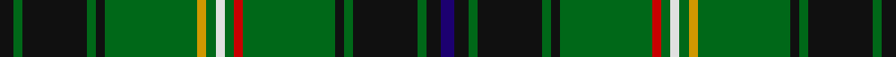

In pattern [BKGKGKGRGWGYGKGKGK](/stripes/bkgkgkgrgwgygkgkgk/).

This was sourced from tartans-authority.  It is a [18 stripe tartan](/stripes/stripes18/).

Original link http://www.tartansauthority.com/tartan-ferret/display/1978/

## Thread count
K/6 G4 K28 G4 K4 G40 DY4 G4 LN4 G4 R4 G40 K4 G4 K28 G4 K6 DB/6

## Palette
Each colour and the base-6 reference it is a variant of.

| Colour | Shade | Base |
|---|---|---|
| DB | <code style="background-color:#1C0070;">#1C0070</code> `oklch(26.3% 0.162 277.1)` <small>#1C0070</small> | B <code style="background-color:#2A418A;">#2A418A</code> |
| DY | <code style="background-color:#D09800;">#D09800</code> `oklch(71.4% 0.147 82.1)` <small>#D09800</small> | Y <code style="background-color:#F2BF00;">#F2BF00</code> |
| G | <code style="background-color:#006818;">#006818</code> `oklch(45.0% 0.142 145.0)` <small>#006818</small> | G <code style="background-color:#006100;">#006100</code> |
| K | <code style="background-color:#101010;">#101010</code> `oklch(17.3% 0.000 89.9)` <small>#101010</small> | K <code style="background-color:#000000;">#000000</code> |
| LN | <code style="background-color:#E0E0E0;">#E0E0E0</code> `oklch(90.7% 0.000 89.9)` <small>#E0E0E0</small> | W <code style="background-color:#F7F7F7;">#F7F7F7</code> |
| R | <code style="background-color:#C80000;">#C80000</code> `oklch(52.3% 0.215 29.2)` <small>#C80000</small> | R <code style="background-color:#CC0000;">#CC0000</code> |

## Nearest tartans

The nearest existing variants by ΔTartan distance, with this tartan at the top so the swatches line up against it.

ΔTartan

Tartan

Sett

—

<a href="/ttd/edit/#slug=k3g2k14g2k2g20lo2g2w2g2r2g20k2g2k14g2k3db3~x2">Lorne Asymmetric (Artefact)</a> <a class="nn-out" href="/setts/s18/k3g2k14g2k2g20lo2g2w2g2r2g20k2g2k14g2k3db3~x2/" title="open its dictionary page">↗</a>

0.26

<a href="/ttd/edit/#slug=k6g4k22g3k3g32r3g3w3g3ly3g32k3g3k22g4k6dp6">Campbell, Marquis of Lorne</a> <a class="nn-out" href="/setts/s18/k6g4k22g3k3g32r3g3w3g3ly3g32k3g3k22g4k6dp6/" title="open its dictionary page">↗</a>

0.92

<a href="/ttd/edit/#slug=k3g3r2g3ly2g2ly2g11db3k3db3k3db3k3db3g20r3~x2">Myron Family Tartan Tartan Number: 1105. Earliest known date: pre 2003 Designed for the town celebrations of 1958-59 by G. Lawson of the Musselburgh Co-operative Society. See products available Copyright © Blair Urquhart, Comrie, 2015</a> <a class="nn-out" href="/setts/s17/k3g3r2g3ly2g2ly2g11db3k3db3k3db3k3db3g20r3~x2/" title="open its dictionary page">↗</a>

1.01

<a href="/ttd/edit/#slug=g10k1g1k1g1k1db4k1w1k1db1ly1k1g4k1r1~x4">Cockburn - 1830 (Clan)</a> <a class="nn-out" href="/setts/s16/g10k1g1k1g1k1db4k1w1k1db1ly1k1g4k1r1~x4/" title="open its dictionary page">↗</a>

1.21

<a href="/setts/s22/dp4w2dp10k10g3k3g3k2g24ly2g2r4~x2/">Kerby (Personal)</a>

1.29

<a href="/ttd/edit/#slug=k3g2k14g2k2g20lo2g2w2g2r2g20k2g2k14g2k3t3~x2">Lorne - Marquis of (Personal)</a> <a class="nn-out" href="/setts/s18/k3g2k14g2k2g20lo2g2w2g2r2g20k2g2k14g2k3t3~x2/" title="open its dictionary page">↗</a>

1.30

<a href="/ttd/edit/#slug=r3g24dt4k3dt3k3dt3k3dt4g12dp2g2dp2g3lo2g2k2~x2">Kennedy (Clan)</a> <a class="nn-out" href="/setts/s17/r3g24dt4k3dt3k3dt3k3dt4g12dp2g2dp2g3lo2g2k2~x2/" title="open its dictionary page">↗</a>

1.34

<a href="/ttd/edit/#slug=k4r2k8g3k8g36k8g3r4lb2r3lo2r4g3k8g36k8g3k8r2~x2">Kinnear, Barony of (Personal)</a> <a class="nn-out" href="/setts/s20/k4r2k8g3k8g36k8g3r4lb2r3lo2r4g3k8g36k8g3k8r2~x2/" title="open its dictionary page">↗</a>

1.35

<a href="/ttd/edit/#slug=k4r2k10g3k10g30k8g3r4lo2r4lb2r4g3k8g30k10g3k10r2k4~x2">Pilette of Kinnear (Personal)</a> <a class="nn-out" href="/setts/s21/k4r2k10g3k10g30k8g3r4lo2r4lb2r4g3k8g30k10g3k10r2k4~x2/" title="open its dictionary page">↗</a>

1.37

<a href="/ttd/edit/#slug=k1g1r1g1lo1g1lo1g4db1k1db1k1db1k1db1g7r1~x4">Myron</a> <a class="nn-out" href="/setts/s17/k1g1r1g1lo1g1lo1g4db1k1db1k1db1k1db1g7r1~x4/" title="open its dictionary page">↗</a>

1.38

<a href="/ttd/edit/#slug=k3g3m2g3ly2g2ly2g11db3k3db3k3db3k3db3g20r3~x2">Myron</a> <a class="nn-out" href="/setts/s17/k3g3m2g3ly2g2ly2g11db3k3db3k3db3k3db3g20r3~x2/" title="open its dictionary page">↗</a>

## Neighbour map

Every grey dot is one of 14299 variants placed by the first two principal components of the ΔTartan feature space (44% of its variance). Red is this tartan; blue dots are its nearest — click one to open its page.

<svg viewBox="0 0 640 380" role="img" style="max-width:100%;height:auto;border:1px solid #e0e0e0;border-radius:4px;display:block" xmlns="http://www.w3.org/2000/svg"><image href="/nn/cloud.v1.png" width="640" height="380"/><a href="/setts/s18/k6g4k22g3k3g32r3g3w3g3ly3g32k3g3k22g4k6dp6/"><circle cx="256.9" cy="125.0" r="4" fill="#3465a4"><title>Campbell, Marquis of Lorne</title></circle></a><a href="/setts/s17/k3g3r2g3ly2g2ly2g11db3k3db3k3db3k3db3g20r3~x2/"><circle cx="235.7" cy="132.4" r="4" fill="#3465a4"><title>Myron Family Tartan Tartan Number: 1105. Earliest known date: pre 2003 Designed for the town celebrations of 1958-59 by G. Lawson of the Musselburgh Co-operative Society. See products available Copyright © Blair Urquhart, Comrie, 2015</title></circle></a><a href="/setts/s16/g10k1g1k1g1k1db4k1w1k1db1ly1k1g4k1r1~x4/"><circle cx="223.1" cy="120.6" r="4" fill="#3465a4"><title>Cockburn - 1830 (Clan)</title></circle></a><a href="/setts/s22/dp4w2dp10k10g3k3g3k2g24ly2g2r4~x2/"><circle cx="211.3" cy="108.2" r="4" fill="#3465a4"><title>Kerby (Personal)</title></circle></a><a href="/setts/s18/k3g2k14g2k2g20lo2g2w2g2r2g20k2g2k14g2k3t3~x2/"><circle cx="234.4" cy="107.2" r="4" fill="#3465a4"><title>Lorne - Marquis of (Personal)</title></circle></a><a href="/setts/s17/r3g24dt4k3dt3k3dt3k3dt4g12dp2g2dp2g3lo2g2k2~x2/"><circle cx="289.3" cy="131.1" r="4" fill="#3465a4"><title>Kennedy (Clan)</title></circle></a><a href="/setts/s20/k4r2k8g3k8g36k8g3r4lb2r3lo2r4g3k8g36k8g3k8r2~x2/"><circle cx="310.9" cy="111.0" r="4" fill="#3465a4"><title>Kinnear, Barony of (Personal)</title></circle></a><a href="/setts/s21/k4r2k10g3k10g30k8g3r4lo2r4lb2r4g3k8g30k10g3k10r2k4~x2/"><circle cx="255.9" cy="124.8" r="4" fill="#3465a4"><title>Pilette of Kinnear (Personal)</title></circle></a><a href="/setts/s17/k1g1r1g1lo1g1lo1g4db1k1db1k1db1k1db1g7r1~x4/"><circle cx="235.4" cy="163.2" r="4" fill="#3465a4"><title>Myron</title></circle></a><a href="/setts/s17/k3g3m2g3ly2g2ly2g11db3k3db3k3db3k3db3g20r3~x2/"><circle cx="204.3" cy="117.8" r="4" fill="#3465a4"><title>Myron</title></circle></a><circle cx="263.5" cy="129.1" r="5" fill="#c00000"/></svg>

ID: /setts/s18/k3g2k14g2k2g20lo2g2w2g2r2g20k2g2k14g2k3db3~x2/
