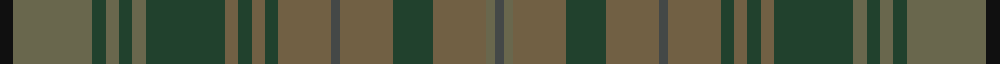

This page is one **sett** — a single exact thread-count. It belongs to the [tartan](/tartans/k3yi18dg3yi3dg3yi3dg18y3dg3y3dg3y12n2y12dg9y12yi2n2/)
(the same proportion at any scale), whose colour order is pattern [BGGGGBGGGGGGGGGGGK](/stripes/bggggbgggggggggggk/).

Sourced from register-of-tartans.  It is a [18 stripe tartan](/stripes/stripes18/).

Original link https://www.tartanregister.gov.uk/tartanDetails.aspx?ref=5761

## Register references

External register numbers recorded for this tartan.

- Scottish Register of Tartans: [5761](https://www.tartanregister.gov.uk/tartanDetails.aspx?ref=5761)
- Scottish Tartans Authority (ITI): 7798
- Scottish Tartans World Register: 3264

## Thread count
K/6 N36 DN6 N6 DN6 N6 DN36 Na6 DN6 Na6 DN6 Na24 Nb4 Na24 DN18 Na24 N4 Nb/4

## Palette

Palette: <strong>Logan (The Scottish Gael, 1831)</strong> <small style="color:#888">(1 of 5 colours)</small>
<table><thead><tr><th>Colour</th><th>Threads</th><th>Shade</th><th>Base</th><th>OKLCh</th></tr></thead><tbody><tr><td>K/</td><td style="text-align:right;font-variant-numeric:tabular-nums">6</td><td><code style="background-color:#101010;">#101010</code> <small style="color:#888">#101010</small></td><td>K <code style="background-color:#000000;">#000000</code></td><td><small style="color:#888">oklch(17.3% 0.000 89.9)</small></td></tr><tr><td>N</td><td style="text-align:right;font-variant-numeric:tabular-nums">36</td><td><code style="background-color:#69674D;">#69674D</code> <small style="color:#888">#69674D</small></td><td>G <code style="background-color:#006100;">#006100</code></td><td><small style="color:#888">oklch(50.8% 0.039 104.0)</small></td></tr><tr><td>DN</td><td style="text-align:right;font-variant-numeric:tabular-nums">6</td><td><code style="background-color:#21412D;">#21412D</code> <small style="color:#888">#21412D</small></td><td>G <code style="background-color:#006100;">#006100</code></td><td><small style="color:#888">oklch(34.4% 0.052 155.1)</small></td></tr><tr><td>N</td><td style="text-align:right;font-variant-numeric:tabular-nums">6</td><td><code style="background-color:#69674D;">#69674D</code> <small style="color:#888">#69674D</small></td><td>G <code style="background-color:#006100;">#006100</code></td><td><small style="color:#888">oklch(50.8% 0.039 104.0)</small></td></tr><tr><td>DN</td><td style="text-align:right;font-variant-numeric:tabular-nums">6</td><td><code style="background-color:#21412D;">#21412D</code> <small style="color:#888">#21412D</small></td><td>G <code style="background-color:#006100;">#006100</code></td><td><small style="color:#888">oklch(34.4% 0.052 155.1)</small></td></tr><tr><td>N</td><td style="text-align:right;font-variant-numeric:tabular-nums">6</td><td><code style="background-color:#69674D;">#69674D</code> <small style="color:#888">#69674D</small></td><td>G <code style="background-color:#006100;">#006100</code></td><td><small style="color:#888">oklch(50.8% 0.039 104.0)</small></td></tr><tr><td>DN</td><td style="text-align:right;font-variant-numeric:tabular-nums">36</td><td><code style="background-color:#21412D;">#21412D</code> <small style="color:#888">#21412D</small></td><td>G <code style="background-color:#006100;">#006100</code></td><td><small style="color:#888">oklch(34.4% 0.052 155.1)</small></td></tr><tr><td>Na</td><td style="text-align:right;font-variant-numeric:tabular-nums">6</td><td><code style="background-color:#716044;">#716044</code> <small style="color:#888">#716044</small></td><td>G <code style="background-color:#006100;">#006100</code></td><td><small style="color:#888">oklch(49.8% 0.047 79.8)</small></td></tr><tr><td>DN</td><td style="text-align:right;font-variant-numeric:tabular-nums">6</td><td><code style="background-color:#21412D;">#21412D</code> <small style="color:#888">#21412D</small></td><td>G <code style="background-color:#006100;">#006100</code></td><td><small style="color:#888">oklch(34.4% 0.052 155.1)</small></td></tr><tr><td>Na</td><td style="text-align:right;font-variant-numeric:tabular-nums">6</td><td><code style="background-color:#716044;">#716044</code> <small style="color:#888">#716044</small></td><td>G <code style="background-color:#006100;">#006100</code></td><td><small style="color:#888">oklch(49.8% 0.047 79.8)</small></td></tr><tr><td>DN</td><td style="text-align:right;font-variant-numeric:tabular-nums">6</td><td><code style="background-color:#21412D;">#21412D</code> <small style="color:#888">#21412D</small></td><td>G <code style="background-color:#006100;">#006100</code></td><td><small style="color:#888">oklch(34.4% 0.052 155.1)</small></td></tr><tr><td>Na</td><td style="text-align:right;font-variant-numeric:tabular-nums">24</td><td><code style="background-color:#716044;">#716044</code> <small style="color:#888">#716044</small></td><td>G <code style="background-color:#006100;">#006100</code></td><td><small style="color:#888">oklch(49.8% 0.047 79.8)</small></td></tr><tr><td>Nb</td><td style="text-align:right;font-variant-numeric:tabular-nums">4</td><td><code style="background-color:#444847;">#444847</code> <small style="color:#888">#444847</small></td><td>B <code style="background-color:#2A418A;">#2A418A</code></td><td><small style="color:#888">oklch(39.8% 0.006 179.5)</small></td></tr><tr><td>Na</td><td style="text-align:right;font-variant-numeric:tabular-nums">24</td><td><code style="background-color:#716044;">#716044</code> <small style="color:#888">#716044</small></td><td>G <code style="background-color:#006100;">#006100</code></td><td><small style="color:#888">oklch(49.8% 0.047 79.8)</small></td></tr><tr><td>DN</td><td style="text-align:right;font-variant-numeric:tabular-nums">18</td><td><code style="background-color:#21412D;">#21412D</code> <small style="color:#888">#21412D</small></td><td>G <code style="background-color:#006100;">#006100</code></td><td><small style="color:#888">oklch(34.4% 0.052 155.1)</small></td></tr><tr><td>Na</td><td style="text-align:right;font-variant-numeric:tabular-nums">24</td><td><code style="background-color:#716044;">#716044</code> <small style="color:#888">#716044</small></td><td>G <code style="background-color:#006100;">#006100</code></td><td><small style="color:#888">oklch(49.8% 0.047 79.8)</small></td></tr><tr><td>N</td><td style="text-align:right;font-variant-numeric:tabular-nums">4</td><td><code style="background-color:#69674D;">#69674D</code> <small style="color:#888">#69674D</small></td><td>G <code style="background-color:#006100;">#006100</code></td><td><small style="color:#888">oklch(50.8% 0.039 104.0)</small></td></tr><tr><td>Nb/</td><td style="text-align:right;font-variant-numeric:tabular-nums">4</td><td><code style="background-color:#444847;">#444847</code> <small style="color:#888">#444847</small></td><td>B <code style="background-color:#2A418A;">#2A418A</code></td><td><small style="color:#888">oklch(39.8% 0.006 179.5)</small></td></tr></tbody></table>

## Nearest tartans

The nearest existing variants by ΔTartan distance, with this tartan at the top so the swatches line up against it.

ΔTartan

Tartan

Sett

—

<a href="/ttd/edit/#slug=k3yi18dg3yi3dg3yi3dg18y3dg3y3dg3y12n2y12dg9y12yi2n2~x2">Van Ingelgem Hunting (Personal)</a> <a class="nn-out" href="/setts/s18/k3yi18dg3yi3dg3yi3dg18y3dg3y3dg3y12n2y12dg9y12yi2n2~x2/" title="open its dictionary page">↗</a>

1.59

<a href="/ttd/edit/#slug=k3dg18dy3dg3dy3dg3dy18y3dy3y3dy3y12db2y12dy9y12dg2db2~x2">Van Ingelgem Htg (Personal)</a> <a class="nn-out" href="/setts/s18/k3dg18dy3dg3dy3dg3dy18y3dy3y3dy3y12db2y12dy9y12dg2db2~x2/" title="open its dictionary page">↗</a>

1.73

<a href="/ttd/edit/#slug=y30n3y3n3y3n10g10yi20m2g5~x2">Roddy's Highland Spirit (Fashion)</a> <a class="nn-out" href="/setts/s10/y30n3y3n3y3n10g10yi20m2g5~x2/" title="open its dictionary page">↗</a>

1.83

<a href="/setts/s12/dp4dt4dp2dt14dg6dgi3dg6dgii2dgi4dgii2dgi15n3~x2/">Kinloch Anderson Heather</a>

1.91

<a href="/ttd/edit/#slug=r2do1k1do10r1do10k13n4k1n11dy9n2lr1~x2">Bruma</a> <a class="nn-out" href="/setts/s13/r2do1k1do10r1do10k13n4k1n11dy9n2lr1~x2/" title="open its dictionary page">↗</a>

1.93

<a href="/ttd/edit/#slug=g3yi16o11yi2y11yi2y11yi2o11yi16w3~x2">Harmony 14</a> <a class="nn-out" href="/setts/s11/g3yi16o11yi2y11yi2y11yi2o11yi16w3~x2/" title="open its dictionary page">↗</a>

1.96

<a href="/ttd/edit/#slug=y9g13dg26dy6dp5dy40dp5dy6dg26g13y9dg3~x2">de Meuron (Family)</a> <a class="nn-out" href="/setts/s12/y9g13dg26dy6dp5dy40dp5dy6dg26g13y9dg3~x2/" title="open its dictionary page">↗</a>

1.99

<a href="/ttd/edit/#slug=dy8dg20db15dy6dg4dy8db4dy6dg20dy8db6dy4b2dy4db6">Unidentified Fragment #2</a> <a class="nn-out" href="/setts/s15/dy8dg20db15dy6dg4dy8db4dy6dg20dy8db6dy4b2dy4db6/" title="open its dictionary page">↗</a>

2.00

<a href="/ttd/edit/#slug=dg3do16dg3do3dg3do16k2r4k2dg18do3dg3do3dg16y3~x2">Ontario, Ensign of (District)</a> <a class="nn-out" href="/setts/s15/dg3do16dg3do3dg3do16k2r4k2dg18do3dg3do3dg16y3~x2/" title="open its dictionary page">↗</a>

2.08

<a href="/ttd/edit/#slug=y4dg18do3dg3do3dg18k2r4k2do16dg3do3dg3do16dg3~x2">Ontario, Ensign of</a> <a class="nn-out" href="/setts/s15/y4dg18do3dg3do3dg18k2r4k2do16dg3do3dg3do16dg3~x2/" title="open its dictionary page">↗</a>

2.12

<a href="/ttd/edit/#slug=do22y26r4y26do22dy3do3dy3do3dy31do3dy3do3dy3~x2">Devarr</a> <a class="nn-out" href="/setts/s14/do22y26r4y26do22dy3do3dy3do3dy31do3dy3do3dy3~x2/" title="open its dictionary page">↗</a>

## Neighbour map

Every grey dot is one of 14359 variants placed by the first two principal components of the ΔTartan feature space (44% of its variance). Red is this tartan; blue dots are its nearest — click one to open its page.

<svg viewBox="0 0 640 380" role="img" style="max-width:100%;height:auto;border:1px solid #e0e0e0;border-radius:4px;display:block" xmlns="http://www.w3.org/2000/svg"><image href="/nn/cloud.v1.png" width="640" height="380"/><a href="/setts/s18/k3dg18dy3dg3dy3dg3dy18y3dy3y3dy3y12db2y12dy9y12dg2db2~x2/"><circle cx="355.2" cy="262.7" r="4" fill="#3465a4"><title>Van Ingelgem Htg (Personal)</title></circle></a><a href="/setts/s10/y30n3y3n3y3n10g10yi20m2g5~x2/"><circle cx="361.1" cy="239.2" r="4" fill="#3465a4"><title>Roddy's Highland Spirit (Fashion)</title></circle></a><a href="/setts/s12/dp4dt4dp2dt14dg6dgi3dg6dgii2dgi4dgii2dgi15n3~x2/"><circle cx="249.4" cy="251.8" r="4" fill="#3465a4"><title>Kinloch Anderson Heather</title></circle></a><a href="/setts/s13/r2do1k1do10r1do10k13n4k1n11dy9n2lr1~x2/"><circle cx="263.6" cy="211.6" r="4" fill="#3465a4"><title>Bruma</title></circle></a><a href="/setts/s11/g3yi16o11yi2y11yi2y11yi2o11yi16w3~x2/"><circle cx="310.1" cy="263.9" r="4" fill="#3465a4"><title>Harmony 14</title></circle></a><a href="/setts/s12/y9g13dg26dy6dp5dy40dp5dy6dg26g13y9dg3~x2/"><circle cx="276.8" cy="232.5" r="4" fill="#3465a4"><title>de Meuron (Family)</title></circle></a><a href="/setts/s15/dy8dg20db15dy6dg4dy8db4dy6dg20dy8db6dy4b2dy4db6/"><circle cx="299.4" cy="264.8" r="4" fill="#3465a4"><title>Unidentified Fragment #2</title></circle></a><a href="/setts/s15/dg3do16dg3do3dg3do16k2r4k2dg18do3dg3do3dg16y3~x2/"><circle cx="387.5" cy="245.5" r="4" fill="#3465a4"><title>Ontario, Ensign of (District)</title></circle></a><a href="/setts/s15/y4dg18do3dg3do3dg18k2r4k2do16dg3do3dg3do16dg3~x2/"><circle cx="380.8" cy="241.6" r="4" fill="#3465a4"><title>Ontario, Ensign of</title></circle></a><a href="/setts/s14/do22y26r4y26do22dy3do3dy3do3dy31do3dy3do3dy3~x2/"><circle cx="330.3" cy="232.5" r="4" fill="#3465a4"><title>Devarr</title></circle></a><circle cx="312.4" cy="240.6" r="5" fill="#c00000"/></svg>

ID: /setts/s18/k3yi18dg3yi3dg3yi3dg18y3dg3y3dg3y12n2y12dg9y12yi2n2~x2/
